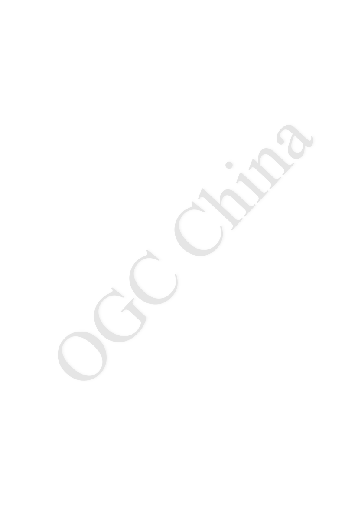
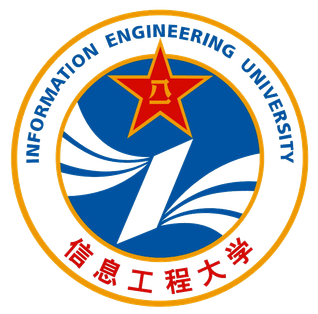
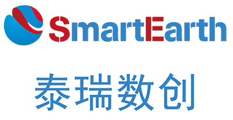
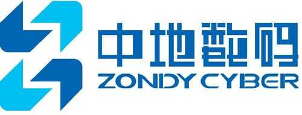

:Title: OGC城市地理标记语言（CityGML）编码标准
:titletext: {Title}
:doctype: book
:encoding: utf-8
:lang: en
:toc: left
:toc-title: 目录
:toc-placement!: //此句话，若注释则，pdf目录位置不合适，htsml无导航目录；若不注释则，pdf目录合适，html有导航目录
:toclevels: 3
:stem: latexmath
:page-background-image: 
:numbered:
:sectanchors:
:chapter-label:
:figure-caption: 图
:source-highlighter: coderay
:xrefstyle: short

= OGC城市地理标记语言（CityGML）编码标准
:title: OGC城市地理标记语言（CityGML）编码标准
OGC China <external.ogc.org/twiki_public/ChinaForum>
:revdate: 2021年11月4日
:title-separator: ::
:sectanchors: 
:url-repo: https://my-git-repo.com

<<<
[cols = ">",frame = "none",grid = "none"]
|===
|{set:cellbgcolor:#FFFFFF}
|[big]*国际开放地理信息协会*
|提交日期:   <2008-05-19>
|批准日期:   <2012-03-09>
|出版日期:   <2012-04-04>
|本OGC(R)文件的外部标识符: http://www.opengis.net/spec/citygml/2.0
|本OGC(R)文件的内部参考号:    12-019
|类别: OGC(R)编码标准
|编辑:   Gerhard Gröger, Thomas H. Kolbe, Claus Nagel, Karl-Heinz Häfele
|===

[cols = "^", frame = "none"]
|===
|[big]*{titletext}*
|===

[cols = "^", frame = "none", grid = "none"]
|===
|*版权声明*
|版权 (C) <2012> 国际开放地理信息协会
|若要获得额外的使用权，请访问 http://www.opengeospatial.org/legal/
|===

[cols = "^", frame = "none"]
|===
|*警告*
|===

本文件是由OGC成员批准的国际标准。本文件以免版税、无歧视的方式提供。本文件的获得者被邀请提交所知的任何相关专利权的声明及评论，并提供证明文件。

[width = "50%", grid = "none"]
|===
|文件类型:   	OGC(R)编码标准
|文件子类型:   编码
|文件阶段:   	批准公开发布
|文件语言:   	中文
|===

<<<
[big]*OGC China（OGC中国联盟）简介*

[middle]*OGC，英文全称Open Geospatial Consortium，中文可以称国际开放地理信息协会*，1994年成立，是一个国际化的自愿协商的组织联盟，旨在通过一系列的敏捷协作研发和开放标准制定，解决地理空间与位置信息可发现、可访问、可互操作、可重用中面临的挑战，提升地理空间信息与位置服务的能力，全球各国地理信息相关人员、组织都可以申请加入。

2017年，经与OGC亚太区负责人沟通，OGC中国联盟成立。经过两三年的发展，从最初联盟发起时的6家单位发展到现在的20多家会员，包括国内代表性的高校，国内主要的地理信息厂商等，旨在促进中国对地理空间软件和数据开放标准的使用和理解，并影响这些标准的定义，同时为空间数据产品和服务的开发人员和用户提供一个协作的平台，共同制定一套符合中国要求的标准。我们希望通过OGC中国联盟，交流经验，无论是高校还是企业，都能在OGC技术工作中发现问题，参与更多的工作组工作，一起在国际标准制定中发挥更大作用。

*OGC中国联盟的工作计划：*

- 根据中国国家政策，培养对地理空间互操作性最佳实践的认识和实施

- 开发一套中国领导的OGC标准，适应中国的问题、用例和组织特性

- 定期协调中国GIS学会年会互操作会议的组织工作

- 推动更多的中国组织机构包括企业、政府机构、高校加入OGC中国联盟，提升中国国际话语权、影响力

- 支持OGC的全球推广和亚太地区项目，以进一步推进OGC的全球使命

//*OGC China成员：*

//
//
//
//image:images/pku.svg["PKU", align="left", width="10%", pdfwidth=10%]
//
//
//
//
//
//
//
//
//
//
//
//
//
//
//image:images/NUIST.png["NUIST", align="left", width="10%", pdfwidth=10%]
//
//image:images/zju.png["zju", align="left", width="10%", pdfwidth=10%]
//image:images/huawei.png["huawei", align="left", width="9%", pdfwidth=9%]

*联系方式：*

[width = "78%", grid = "none",cols="25,9a"]
|===
| 
电话：027-6878169  +
Email：pyue@whu.edu.cn +   
邮编：400379  +
地址：湖北省武汉市珞喻路129号武汉大学遥感信息工程学院  +
官方公众号：国际开放地理信息OGC联盟 +
网址: https://external.ogc.org/twiki_public/ChinaForum
| 
|===

<<<
[big]*译者序*

[middle]#当前，全国各地均在积极规划和推进三维城市的建设，从数字城市到智慧城市，再到数字孪生城市，随着信息技术和信息采集技术日新月异，三维城市的内涵和理念也在不断的延伸和丰富。数据是三维城市建设的基石，然而，现阶段三维城市建设中采用的三维模型多以摄影测量技术采集而得的地物表面模型为主，较注重三维可视化效果，而缺乏语义和拓扑关系的表达，难以用于查询、分析或空间数据挖掘，并且采用数据格式缺乏一致性，导致互操作性困难，抑制了三维城市模型的进一步应用与发展。#

OGC CityGML标准的提出为虚拟三维城市模型的可重用提供了一个有效的方案。CityGML是一种基于XML的虚拟三维城市模型的存储和交换格式，以模块化的方式定义了三维城市模型中最常见的对象，并兼顾了城市中三维对象的几何、拓扑、语义、外观等方面的属性。CityGML所有对象和主题类均支持多级别细节层次模型，适用于三维城市的多尺度表达，既可表示没有拓扑和语义的单一简单模型，也可以表示具有完整拓扑和细粒度语义的复杂多尺度模型。除定义的建筑物，桥梁、植被、水体、城市家具等三维城市最重要的对象外，CityGML也可通过定义应用领域扩展（ADEs）将其扩展到特定的领域，例如城市气体污染扩散模拟、光辐射潜力分析、城市环境噪声扩散模拟、视线和阴影分析等。CityGML已经在全世界范围内被广泛传播，如德国、法国，美过、英国、荷兰、丹麦、苏黎世、利沃登、日本、伊斯坦布尔等国家或城市，均使用CityGML进行三维城市模型的表达和交换，支撑其三维地理信息标准和三维空间数据基础设施的建设。许多商业和学术工具也通过接口的方式来支持CityGML的使用，例如，SAFE软件公司的转换工具FME、Bentley Systems的BentleyMap、Autodesk的LandXplorer、KIT Karlsruhe的FZKViewer、以及CPA Geo Information的SupportGIS等工具均支持CityGML的读写。因此，通过CityGML标准，可以轻松实现虚拟三维城市模型在不同地理信息系统和用户之间的信息无损交换。

在全国各地都在稳步推进智慧城市或数字孪生城市的今天，CityGML这种通用虚拟三维城市模型存储和和交换格式标准的重要性愈加凸现。鉴于现有CityGML英文标准给国内技术人员带来了一定的语言门槛，也为推动CityGML标准更好服务于国内的智慧城市和数字孪生城市的建设，OGC China翻译了OGC CityGML编码标准2.0版本，向国内GIS及相关行业的科研和工作人员提供自由免费的中文版本。

本标准翻译工作的情况如下：林旭辉（英国伦敦大学校友会）负责第0-3章节的翻译和排版、第10章节的翻译和排版，以及附录A-K的翻译；于大宇（武汉大学）参与了所有格式和内容的审校及所有章节的排版；张勇（郑州众合景轩信息技术有限公司）负责第7-9章节的翻译和排版，以及附录A-K的排版；黄栋（泰瑞数创科技（北京）有限公司）负责第4-6章节的翻译和排版；杨滔、罗维祯和邓成汝协助了林旭辉的翻译和排版工作；乐鹏（武汉大学）负责翻译工作的组织协调、统稿与修订。

虽然译者尽量地以“信、达、雅”为标准还原作者的本意，但仍难免有疏漏之处，如读者发现任何不理想之处，望能不吝赐教，我们将随时予以纠正。

[cols = ">",frame = "none",grid = "none"]
|===
>|OGC中国联盟 +
2021年11月4日
|===

[small]#*本文件引用格式*：OGC中国联盟, 2021. OGC城市地理标记语言（CityGML）编码标准中文版. 译者: 林旭辉, 于大宇, 张勇, 黄栋, 乐鹏, 杨滔, 罗维祯, 邓成汝.#

<<<
[big]*许可协议*

[middle]#国际开放地理信息协会（“许可方”）特此授权获得本知识产权及任何相关文件副本的任何人，在不受限制的情况下（下文规定的除外）处理本知识产权，允许获得本知识产权的人具有包括但不限于实施、使用、复制、修改、合并、出版、分发和/或转授本知识产权副本的权利，但必须完整地保留本知识产权上的所有版权声明（译注：此处版权声明指英文原版），且同意本协议的所有条款。#

[middle]#如果您修改了本知识产权，除了上述版权声明外，经修改的知识产权的所有副本必须包括一项声明，以表明该知识产权包括未经授权人批准或采纳的修改。#

[middle]#本许可仅为版权许可，不传达可能在世界任何地方生效的任何专利下的任何权利。#

[middle]#本知识产权“按原样”提供，不作任何明示或暗示的保证，包括但不限于对适销性、特定用途的适用性和不侵犯第三方权利的保证。本声明中包含的一个或多个版权持有人不保证本知识产权中包含的功能将满足您的要求，也不保证本知识产权的运作不会中断或没有错误。对本知识产权的任何使用应完全由用户自己承担风险。在任何情况下，版权持有人或本知识产权的任何贡献者对任何索赔，或任何直接、特殊、间接后果性损害，或因实施、使用、商业化或履行本知识产权而引起的或与之相关的任何涉嫌侵权或任何数据、利润的损失（无论是在合同诉讼、疏忽或任何其他法律理论下）而造成的任何损害概不负责。#

[middle]#本许可在终止之前一直有效，您可以在任何时候通过销毁本知识产权及任何形式的副本来终止它。如果您未能遵守本协议的任何条款或条件，本许可也将终止。除下述规定外，本许可证的终止不要求终止自终止通知之日起生效的任何第三方最终用户对本知识产权的再许可。此外，如果该知识产权或该知识产权的运作侵犯了或在许可方看来可能侵犯了第三方的任何专利、版权、商标或其他权利，您同意许可方可自行决定终止本许可，而无需对您、您的被许可人及任何其同伴进行任何赔偿或承担责任。您同意在许可任何形式终止后，销毁本知识产权以及任何形式的所有副本，无论是由您还是由第三方持有。#

[middle]#除本通知所包含的内容外，未经许可方或任何其他知识产权版权持有人的事先书面授权，许可方或任何其他知识产权版权持有人的姓名不得用于广告或以其他方式促进本知识产权的销售、使用或其他交易。许可方是且在任何时候都唯一可以授权您或任何第三方使用认证标志、商标或其它可表明符合任何许可方标准或规范的特殊名称。本协议受马萨诸塞州法律管辖。特此明确排除《联合国国际货物销售合同公约》对本协定的适用。如果本协议的任何条款被视为不可执行、无效或无效，则应修改该条款以使其有效和可执行，经修改后，整个协议应保持完全效力。许可方的任何决定、作为或不作为均不得被解释为放弃其享有的任何权利或补救措施。#

<<<
[big]*License Agreement*

[middle]#Permission is hereby granted by the Open Geospatial Consortium, ("Licensor"), free of charge and subject to the terms set forth below, to any person obtaining a copy of this Intellectual Property and any associated documentation, to deal in the Intellectual Property without restriction (except as set forth below), including without limitation the rights to implement, use, copy, modify, merge, publish, distribute, and/or sublicense copies of the Intellectual Property, and to permit persons to whom the Intellectual Property is furnished to do so, provided that all copyright notices on the intellectual property are retained intact and that each person to whom the Intellectual Property is furnished agrees to the terms of this Agreement.#

[middle]#If you modify the Intellectual Property, all copies of the modified Intellectual Property must include, in addition to the above copyright notice, a notice that the Intellectual Property includes modifications that have not been approved or adopted by LICENSOR.#

[middle]#THIS LICENSE IS A COPYRIGHT LICENSE ONLY, AND DOES NOT CONVEY ANY RIGHTS UNDER ANY PATENTS THAT MAY BE IN FORCE ANYWHERE IN THE WORLD.#

[middle]#THE INTELLECTUAL PROPERTY IS PROVIDED "AS IS", WITHOUT WARRANTY OF ANY KIND, EXPRESS OR IMPLIED, INCLUDING BUT NOT LIMITED TO THE WARRANTIES OF MERCHANTABILITY, FITNESS FOR A PARTICULAR PURPOSE, AND NONINFRINGEMENT OF THIRD PARTY RIGHTS. THE COPYRIGHT HOLDER OR HOLDERS INCLUDED IN THIS NOTICE DO NOT WARRANT THAT THE FUNCTIONS CONTAINED IN THE INTELLECTUAL PROPERTY WILL MEET YOUR REQUIREMENTS OR THAT THE OPERATION OF THE INTELLECTUAL PROPERTY WILL BE UNINTERRUPTED OR ERROR FREE. ANY USE OF THE INTELLECTUAL PROPERTY SHALL BE MADE ENTIRELY AT THE USER’S OWN RISK. IN NO EVENT SHALL THE COPYRIGHT HOLDER OR ANY CONTRIBUTOR OF INTELLECTUAL PROPERTY RIGHTS TO THE INTELLECTUAL PROPERTY BE LIABLE FOR ANY CLAIM, OR ANY DIRECT, SPECIAL, INDIRECT OR CONSEQUENTIAL DAMAGES, OR ANY DAMAGES WHATSOEVER RESULTING FROM ANY ALLEGED INFRINGEMENT OR ANY LOSS OF USE, DATA OR PROFITS, WHETHER IN AN ACTION OF CONTRACT, NEGLIGENCE OR UNDER ANY OTHER LEGAL THEORY, ARISING OUT OF OR IN CONNECTION WITH THE IMPLEMENTATION, USE, COMMERCIALIZATION OR PERFORMANCE OF THIS INTELLECTUAL PROPERTY.#

[middle]#This license is effective until terminated. You may terminate it at any time by destroying the Intellectual Property together with all copies in any form. The license will also terminate if you fail to comply with any term or condition of this Agreement. Except as provided in the following sentence, no such termination of this license shall require the termination of any third party end-user sublicense to the Intellectual Property which is in force as of the date of notice of such termination. In addition, should the Intellectual Property, or the operation of the Intellectual Property, infringe, or in LICENSOR's sole opinion be likely to infringe, any patent, copyright, trademark or other right of a third party, you agree that LICENSOR, in its sole discretion, may terminate this license without any compensation or liability to you, your licensees or any other party. You agree upon termination of any kind to destroy or cause to be destroyed the Intellectual Property together with all copies in any form, whether held by you or by any third party.#

[middle]#Except as contained in this notice, the name of LICENSOR or of any other holder of a copyright in all or part of the Intellectual Property shall not be used in advertising or otherwise to promote the sale, use or other dealings in this Intellectual Property without prior written authorization of LICENSOR or such copyright holder. LICENSOR is and shall at all times be the sole entity that may authorize you or any third party to use certification marks, trademarks or other special designations to indicate compliance with any LICENSOR standards or specifications. This Agreement is governed by the laws of the Commonwealth of Massachusetts. The application to this Agreement of the United Nations Convention on Contracts for the International Sale of Goods is hereby expressly excluded. In the event any provision of this Agreement shall be deemed unenforceable, void or invalid, such provision shall be modified so as to make it valid and enforceable, and as so modified the entire Agreement shall remain in full force and effect. No decision, action or inaction by LICENSOR shall be construed to be a waiver of any rights or remedies available to it.#

<<<
toc::[]

<<<

include::clause_front_material.adoc[]

include::clause_0_introduction.adoc[]

include::clause_1_scope.adoc[]

include::clause_2-conformance.adoc[]

include::clause_3-normativeReferences.adoc[]

include::clause_4-conventions.adoc[]

include::clause_5-overview of CityGML.adoc[]

include::clause_6-general characteristics of CityGML.adoc[]

include::clause_7-modularisation.adoc[]

include::clause_8-spatial_model.adoc[]

include::clause_9-appearance model.adoc[]

include::clause_10-thematic_model.adoc[]

include::annex-a.adoc[]

include::annex-b.adoc[]

include::annex-c.adoc[]

include::annex-d.adoc[]

include::annex-e.adoc[]

include::annex-f.adoc[]

include::annex-g.adoc[]

include::annex-h.adoc[]

include::annex-i.adoc[]

include::annex-history.adoc[]

include::annex-bibliography.adoc[]
