[appendix]
:appendix-caption: Annex
== （资料性附录）CityGML数据集示例

此章节提供了一些CityGML模型的案例和相对应的CityGML实例文档的节选。章节G.1到章节G.6详细阐述了如何表达并修改一个CityGML单体建筑，使其从粗略的LOD0模型逐步形成包含建筑室内、语义丰富、几何拓扑结构完整的LOD4精度等级的模型。该模型示例了CityGML建筑模块中的概念，并演示了如何将语义信息和几何数据及拓扑属性进行衔接，建立完整连通的__Building__模型。G.7章节中，通过建筑物及其周围的地形更加丰富的外观信息，详细表达了CityGML __Appearance__模块的用法。在G.8章节中给出了__Appearance__模块的另一个示例，该示例展示了带有内部孔洞多边形的纹理效果。最后，在G.9章节中说明了在CityGML中使用本地工程坐标参考系统的详细情况。

本附件中包含的所有CityGML实例文档都与CityGML模式包绑定在一起，并可以在以下位置获得： http://schemas.opengis.net/citygml/examples/2.0/ 。

=== CityGML数据集示例：LOD0级别建筑物

第一个示例演示了一个处于由不规则三角形(__dem:TINRefief__)组成的LOD0级别地形模型之中的同精度CityGML建筑物模型。该建筑模型包含建筑基底轮廓线和屋顶边缘线(__bldg：lod0FootPrint__和__bldg：lod0RoofEdge__)。建筑基底和屋顶的几何数据以__gml：MultiSurface__表达，并且遵循__Building__模块第二项要求的规定（请参见第10.3.9节），即属于同一表面的所有3D坐标元组的高度值必须完全相同（构成水平面）。建筑基底平面（深蓝色）位于建筑物的最低处，而屋顶平面（浅蓝色）位于屋顶边缘高度，因此悬浮于地形上。同时，使用xAL地址架构为建筑物赋予地址信息。图75左侧显示了LOD0模型，右侧表达的是所包含语义实体的层次结构。

[[figure-75]]
.LOD0级别CityGML建筑模型（包含建筑基底轮廓和建筑屋顶轮廓）和地形模型的实例；右侧为模型层级结构。
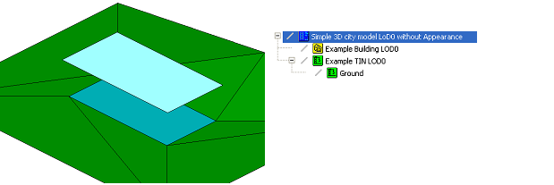

.清单3：摘自图 75 中可视化的LOD0级别建筑物的 CityGML 数据集。
[source,xml]
----
<?xml version="1.0" encoding="utf-8"?>
<CityModel xmlns:xsi="http://www.w3.org/2001/XMLSchema-instance" xmlns="http://www.opengis.net/citygml/2.0" xmlns:gml="http://www.opengis.net/gml" xmlns:xlink="http://www.w3.org/1999/xlink" xmlns:bldg="http://www.opengis.net/citygml/building/2.0" xmlns:dem="http://www.opengis.net/citygml/relief/2.0" xmlns:xAL="urn:oasis:names:tc:ciq:xsdschema:xAL:2.0"
xsi:schemaLocation="http://www.opengis.net/citygml/building/2.0 http://schemas.opengis.net/citygml/building/2.0/building.xsd http://www.opengis.net/citygml/relief/2.0 http://schemas.opengis.net/citygml/relief/2.0/relief.xsd "> 
<gml:name>Simple 3D city model LOD0 without Appearance</gml:name>
<gml:boundedBy>
<gml:Envelope srsDimension="3" srsName="urn:ogc:def:crs,crs:EPSG::25832,crs:EPSG::5783">
<gml:lowerCorner>458868.0 5438343.0 112.0</gml:lowerCorner>
<gml:upperCorner>458892.0 5438362.0 117.0</gml:upperCorner>
</gml:Envelope>
</gml:boundedBy>
<cityObjectMember>
<bldg:Building gml:id="GML_7b1a5a6f-ddad-4c3d-a507-3eb9ee0a8e68">
<gml:name>Example Building LOD0 </gml:name>
<bldg:function
codeSpace="http://www.sig3d.org/codelists/standard/building/2.0/_AbstractBuilding_function.xml">1000</bldg:function>
<bldg:yearOfConstruction>1985</bldg:yearOfConstruction>
<bldg:roofType
codeSpace=http://www.sig3d.org/codelists/standard/building/2.0/_AbstractBuilding_roofType.xml">1030</bldg:roofType>
<bldg:measuredHeight uom="#m">5.0</bldg:measuredHeight>
<bldg:storeysAboveGround>1</bldg:storeysAboveGround>
<bldg:storeyHeightsAboveGround uom="#m">3.0</bldg:storeyHeightsAboveGround>
<bldg:lod0FootPrint>
<gml:MultiSurface>
<gml:surfaceMember>
<gml:Polygon>
<gml:exterior>
<gml:LinearRing>
<gml:posList>458875.0 5438350.0 112.0 458885.0 5438350.0 112.0 458885.0 5438355.0 112.0 458875.0
5438355.0 112.0 458875.0 5438350.0 112.0 </gml:posList>
</gml:LinearRing>
</gml:exterior>
</gml:Polygon>
</gml:surfaceMember>
</gml:MultiSurface>
</bldg:lod0FootPrint>
<bldg:lod0RoofEdge>
<gml:MultiSurface>
<gml:surfaceMember>
<gml:Polygon>
<gml:exterior>
<gml:LinearRing>
<gml:posList>458874.6 5438355.312347524 115.0 458874.6 5438349.687652476 115.0 458885.4 5438349.687652476
115.0 458885.4 5438355.312347524 115.0 458874.6 5438355.312347524 115.0 </gml:posList>
</gml:LinearRing>
</gml:exterior>
</gml:Polygon>
</gml:surfaceMember>
</gml:MultiSurface>
</bldg:lod0RoofEdge>
<bldg:address>
<Address>
<xalAddress>
<xAL:AddressDetails>
<xAL:Country>
<xAL:CountryName>Germany</xAL:CountryName>
<xAL:Locality Type="Town">
<xAL:LocalityName>Eggenstein-Leopoldshafen</xAL:LocalityName>
<xAL:Thoroughfare Type="Street">
<xAL:ThoroughfareNumber>1</xAL:ThoroughfareNumber>
<xAL:ThoroughfareName>Hermann-von-Helmholtz-Platz</xAL:ThoroughfareName>
</xAL:Thoroughfare>
<xAL:PostalCode>
<xAL:PostalCodeNumber>76344</xAL:PostalCodeNumber>
</xAL:PostalCode>
</xAL:Locality>
</xAL:Country>
</xAL:AddressDetails>
</xalAddress>
<multiPoint>
<gml:MultiPoint>
<gml:pointMember>
<gml:Point>
<gml:pos srsDimension="3">458880.0 5438352.6 112.0 </gml:pos>
</gml:Point>
</gml:pointMember>
</gml:MultiPoint>
</multiPoint>
</Address>
</bldg:address>
</bldg:Building>
</cityObjectMember>
<cityObjectMember>
<dem:ReliefFeature gml:id="GML_6bb30328-7599-4500-90ef-766fde6aa67b">
<gml:name>Example TIN LOD0</gml:name>
<dem:lod>0</dem:lod>
<dem:reliefComponent>
<dem:TINRelief gml:id="GUID_04D4DsNGv1MfvYu5O3lkcW">
<gml:name>Ground</gml:name>
<dem:lod>0</dem:lod>
<dem:tin>
<gml:TriangulatedSurface gml:id="ground">
<gml:trianglePatches>
<gml:Triangle>
<gml:exterior>
<gml:LinearRing>
<gml:posList>458868 5438362 112 458875 5438355 112 458883 5438362 114 458868 5438362 112 </gml:posList>
</gml:LinearRing>
</gml:exterior>
</gml:Triangle>
…
</gml:trianglePatches>
</gml:TriangulatedSurface>
</dem:tin>
</dem:TINRelief>
</dem:reliefComponent>
</dem:ReliefFeature>
</cityObjectMember>
</CityModel>
----

=== CityGML数据集示例：LOD1级别建筑物

图76是LOD1级别建筑物和地形模型的案例。在LOD1级别使用体块表达建筑物。建筑体块的几何形状由实体 (__gml:Solid__) 描述，其外壳由六个平面 (__gml:Polygon__) 界定。除了几何形状外，该建筑还增加了更多属性。其中一些属性是枚举属性，用于演示CityGML __code list__机制的用法（参见第 10.14 章）。编码属性值取自 SIG 3D 提议的代码列表（参见附件 C）。

[[figure-76]]
.LOD1级别CityGML建筑模型示例（左侧为模型的三维表达；右侧为模型层级结构）。
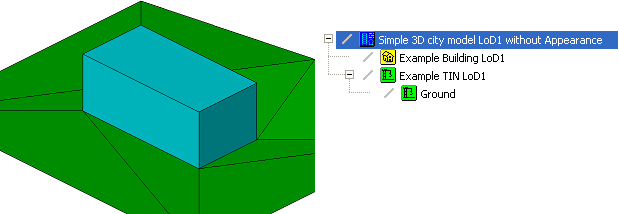

.清单 4：图 76 中可视化的LOD1级别建筑物的CityGML数据集摘录。
[source,xml]
----
<?xml version="1.0" encoding="utf-8"?>
<CityModel xmlns:xsi="http://www.w3.org/2001/XMLSchema-instance" xmlns="http://www.opengis.net/citygml/2.0" xmlns:gml="http://www.opengis.net/gml" xmlns:xlink="http://www.w3.org/1999/xlink" xmlns:bldg="http://www.opengis.net/citygml/building/2.0" xmlns:dem="http://www.opengis.net/citygml/relief/2.0" xmlns:xAL="urn:oasis:names:tc:ciq:xsdschema:xAL:2.0"
xsi:schemaLocation="http://www.opengis.net/citygml/building/2.0 http://schemas.opengis.net/citygml/building/2.0/building.xsd http://www.opengis.net/citygml/relief/2.0 http://schemas.opengis.net/citygml/relief/2.0/relief.xsd ">
<gml:name>Simple 3D city model LOD1 without Appearance</gml:name>
<gml:boundedBy>
<gml:Envelope srsDimension="3" srsName="urn:ogc:def:crs,crs:EPSG::25832,crs:EPSG::5783">
<gml:lowerCorner>458868.0 5438343.0 112.0</gml:lowerCorner>
<gml:upperCorner>458892.0 5438362.0 117.0</gml:upperCorner>
</gml:Envelope>
</gml:boundedBy>
<cityObjectMember>
<bldg:Building gml:id="GML_7b1a5a6f-ddad-4c3d-a507-3eb9ee0a8e68">
<gml:name>Example Building LOD1 </gml:name>
<bldg:function
codeSpace="http://www.sig3d.org/codelists/standard/building/2.0/_AbstractBuilding_function.xml">1000</bldg:function>
<bldg:yearOfConstruction>1985</bldg:yearOfConstruction>
<bldg:roofType
codeSpace="http://www.sig3d.org/codelists/standard/building/2.0/_AbstractBuilding_roofType.xml">1030</bldg:roofType>
<bldg:measuredHeight uom="#m">5.0</bldg:measuredHeight>
<bldg:storeysAboveGround>1</bldg:storeysAboveGround>
<bldg:storeyHeightsAboveGround uom="#m">3.0</bldg:storeyHeightsAboveGround>
<bldg:lod1Solid>
<gml:Solid>
<gml:exterior>
<gml:CompositeSurface >
<!-- Face Side 1 -->
<gml:surfaceMember>
<gml:Polygon>
<gml:exterior>
<gml:LinearRing>
<gml:posList>458875.0 5438350.0 112.0 458885.0 5438350.0 112.0 458885.0 5438350.0 116.0 458875.0
5438350.0 116.0 458875.0 5438350.0 112.0 </gml:posList>
</gml:LinearRing>
</gml:exterior>
</gml:Polygon>
</gml:surfaceMember>
<!-- Face Side 2 -->
<gml:surfaceMember>
<gml:Polygon>
<gml:exterior>
<gml:LinearRing>
<gml:posList>458885.0 5438350.0 112.0 458885.0 5438355.0 112.0 458885.0 5438355.0 116.0 458885.0
5438350.0 116.0 458885.0 5438350.0 112.0 </gml:posList>
</gml:LinearRing>
</gml:exterior>
</gml:Polygon>
</gml:surfaceMember>
<!-- Face Side 3 -->
<gml:surfaceMember>
<gml:Polygon>
<gml:exterior>
<gml:LinearRing>
<gml:posList>458885.0 5438355.0 112.0 458875.0 5438355.0 112.0 458875.0 5438355.0 116.0 458885.0
5438355.0 116.0 458885.0 5438355.0 112.0 </gml:posList>
</gml:LinearRing>
</gml:exterior>
</gml:Polygon>
</gml:surfaceMember>
<!-- Face Side 4 -->
<gml:surfaceMember>
<gml:Polygon>
<gml:exterior>
<gml:LinearRing>
<gml:posList>458875.0 5438355.0 112.0 458875.0 5438350.0 112.0 458875.0 5438350.0 116.0 458875.0
5438355.0 116.0 458875.0 5438355.0 112.0 </gml:posList>
</gml:LinearRing>
</gml:exterior>
</gml:Polygon>
</gml:surfaceMember>
<!-- Face Top -->
<gml:surfaceMember>
<gml:Polygon>
<gml:exterior>
<gml:LinearRing>
<gml:posList>458875.0 5438350.0 116.0 458885.0 5438350.0 116.0 458885.0 5438355.0 116.0 458875.0
5438355.0 116.0 458875.0 5438350.0 116.0 </gml:posList>
</gml:LinearRing>
</gml:exterior>
</gml:Polygon>
</gml:surfaceMember>
<!-- Face Bottom -->
<gml:surfaceMember>
<gml:Polygon>
<gml:exterior>
<gml:LinearRing>
<gml:posList>458875.0 5438350.0 112.0 458875.0 5438355.0 112.0 458885.0 5438355.0 112.0 458885.0
5438350.0 112.0 458875.0 5438350.0 112.0 </gml:posList>
</gml:LinearRing>
</gml:exterior>
</gml:Polygon>
</gml:surfaceMember>
</gml:CompositeSurface>
</gml:exterior>
</gml:Solid>
</bldg:lod1Solid>
<bldg:address>
<Address>
<xalAddress>
<xAL:AddressDetails>
<xAL:Country>
<xAL:CountryName>Germany</xAL:CountryName>
<xAL:Locality Type="Town">
<xAL:LocalityName>Eggenstein-Leopoldshafen</xAL:LocalityName>
<xAL:Thoroughfare Type="Street">
<xAL:ThoroughfareNumber>1</xAL:ThoroughfareNumber>
<xAL:ThoroughfareName>Hermann-von-Helmholtz-Platz</xAL:ThoroughfareName>
</xAL:Thoroughfare>
<xAL:PostalCode>
<xAL:PostalCodeNumber>76344</xAL:PostalCodeNumber>
</xAL:PostalCode>
</xAL:Locality>
</xAL:Country>
</xAL:AddressDetails> 
</xalAddress>
<multiPoint>
<gml:MultiPoint>
<gml:pointMember>
<gml:Point>
<gml:pos srsDimension="3">458880.0 5438352.6 112.0 </gml:pos>
</gml:Point>
</gml:pointMember>
</gml:MultiPoint>
</multiPoint>
</Address>
</bldg:address>
</bldg:Building>
</cityObjectMember>
<cityObjectMember>
<dem:ReliefFeature gml:id="GML_6bb30328-7599-4500-90ef-766fde6aa67b">
<gml:name>Example TIN LOD1</gml:name>
<dem:lod>1</dem:lod>
<dem:reliefComponent>
<dem:TINRelief gml:id="GML_4eb161b0-aa7e-4087-937c-5c4c427c7fc9">
<gml:name>Ground</gml:name>
<dem:lod>1</dem:lod>
<dem:tin>
<gml:TriangulatedSurface>
<gml:trianglePatches>
<gml:Triangle>
<gml:exterior>
<gml:LinearRing>
<gml:posList>458868.0 5438362.0 112.0 458875.0 5438355.0 112.0 458883.0 5438362.0 114.0 458868.0
5438362.0 112.0 </gml:posList>
</gml:LinearRing>
</gml:exterior>
</gml:Triangle>
<gml:Triangle>
…
</gml:Triangle>
… (more triangles)
</gml:trianglePatches>
</gml:TriangulatedSurface>
</dem:tin>
</dem:TINRelief>
</dem:reliefComponent>
</dem:ReliefFeature>
</cityObjectMember>
</CityModel>
----

=== CityGML数据集示例：LOD2级别建筑物

前几章的建筑模型现在以LOD2级别表示。该模型反映了建筑的屋顶结构并包含了构成模型边界的所有平面 (__bldg:boundedBy__)，这些平面在语义上对建筑模型的外壳进行了分类（__bldg:RoofSurface__、__bldg:WallSurface__和 __bldg:GroundSurface__）。除了带有属性的边界平面之外，该模型使用LOD2级别的实体 (__gml:Solid__) 描述建筑几何形态。根据__Building__模块（参见第 10.3.9 章）中第4项要求规定，该实体几何体块必须使用GML3 XLink机制（__xlink:href__，下面清单5中的粗体代码）来引用边界平面的几何数据。

[[figure-77]]
.LOD2级别CityGML建筑模型示例（左侧为模型的三维表达；右侧为模型层级结构）。
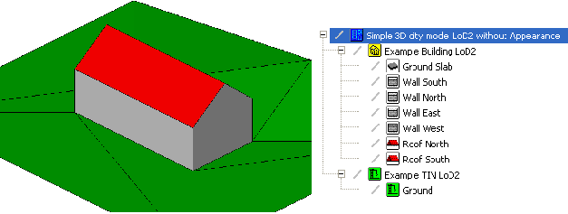

.清单 5：图 77 中可视化的LOD2级别建筑物的CityGML数据集摘录。
[source,xml]
----
<?xml version="1.0" encoding="utf-8"?>
<CityModel xmlns:xsi="http://www.w3.org/2001/XMLSchema-instance" xmlns="http://www.opengis.net/citygml/2.0" xmlns:gml="http://www.opengis.net/gml" xmlns:xlink="http://www.w3.org/1999/xlink" xmlns:bldg="http://www.opengis.net/citygml/building/2.0" xmlns:dem="http://www.opengis.net/citygml/relief/2.0" xmlns:xAL="urn:oasis:names:tc:ciq:xsdschema:xAL:2.0"
xsi:schemaLocation="http://www.opengis.net/citygml/building/2.0 http://schemas.opengis.net/citygml/building/2.0/building.xsd http://www.opengis.net/citygml/relief/2.0 http://schemas.opengis.net/citygml/relief/2.0/relief.xsd ">
<gml:name>Simple 3D city model LOD2 without Appearance</gml:name>
<gml:boundedBy>
<gml:Envelope srsDimension="3" srsName="urn:ogc:def:crs,crs:EPSG::25832,crs:EPSG::5783">
<gml:lowerCorner>458868.0 5438343.0 112.0</gml:lowerCorner>
<gml:upperCorner>458892.0 5438362.0 117.0</gml:upperCorner>
</gml:Envelope>
</gml:boundedBy>
<cityObjectMember>
<bldg:Building gml:id="GML_7b1a5a6f-ddad-4c3d-a507-3eb9ee0a8e68">
<gml:name>Example Building LOD2 </gml:name>
…   (further attributes see LOD1 example)
<bldg:lod2Solid>
<gml:Solid>
<gml:exterior>
<gml:CompositeSurface>
<!-- Ground Slab -->
<gml:surfaceMember xlink:href="#GML_d3981803-d4b0-4b5b-969c-53f657594757" />
<!-- Wall South -->
<gml:surfaceMember xlink:href="#GML_1d350a50-6acc-4d3c-8c28-326ca4305fd1" />
<!-- Wall North -->
<gml:surfaceMember xlink:href="#GML_d3909000-2f18-4472-8886-1c127ea67df1" />
<!-- Wall East -->
<gml:surfaceMember xlink:href="#GML_6286ffa9-3811-4796-a92f-3fd037c8e668" />
<!-- Wall West -->
<gml:surfaceMember xlink:href="#GML_5cc4fd92-d5de-4dd8-971e-892c91da2d9f" />
<!-- Roof North -->
<gml:surfaceMember xlink:href="#GML_ec6a8966-58d9-4894-8edd-9aceb91b923f" />
<!-- Roof South -->
<gml:surfaceMember xlink:href="#GML_b41dc792-5da6-4cd9-8f85-247583f305e3" />
</gml:CompositeSurface> 
</gml:exterior>
</gml:Solid>
</bldg:lod2Solid>
<bldg:boundedBy>
<bldg:GroundSurface>
<gml:name>Ground Slab</gml:name>
<bldg:lod2MultiSurface>
<gml:MultiSurface>
<gml:surfaceMember>
<gml:Polygon gml:id="GML_d3981803-d4b0-4b5b-969c-53f657594757">
<gml:exterior>
<gml:LinearRing>
<gml:posList>458875.0 5438350.0 112.0 458875.0 5438355.0 112.0 458885.0 5438355.0 112.0 458885.0 5438350.0 112.0 458875.0 5438350.0 112.0 </gml:posList>
</gml:LinearRing>
</gml:exterior>
</gml:Polygon>
</gml:surfaceMember>
</gml:MultiSurface>
</bldg:lod2MultiSurface>
</bldg:GroundSurface>
</bldg:boundedBy>
<bldg:boundedBy>
<bldg:WallSurface>
<gml:name>Wall South</gml:name>
<bldg:lod2MultiSurface>
<gml:MultiSurface>
<gml:surfaceMember>
<gml:Polygon gml:id="GML_1d350a50-6acc-4d3c-8c28-326ca4305fd1">
<gml:exterior>
<gml:LinearRing>
<gml:posList>458875.0 5438350.0 112.0 458885.0 5438350.0 112.0 458885.0 5438350.0 115.0 458875.0 5438350.0 115.0 458875.0 5438350.0 112.0 </gml:posList>
</gml:LinearRing>
</gml:exterior>
</gml:Polygon>
</gml:surfaceMember>
</gml:MultiSurface>
</bldg:lod2MultiSurface>
</bldg:WallSurface>
</bldg:boundedBy>
<bldg:boundedBy>
<bldg:WallSurface>
<gml:name>Wall North</gml:name>
<bldg:lod2MultiSurface>
<gml:MultiSurface>
<gml:surfaceMember>
<gml:Polygon gml:id="GML_d3909000-2f18-4472-8886-1c127ea67df1">
…
</gml:Polygon>
</gml:surfaceMember>
</gml:MultiSurface>
</bldg:lod2MultiSurface>
</bldg:WallSurface>
</bldg:boundedBy>
<bldg:boundedBy>
<bldg:WallSurface>
<gml:name>Wall East</gml:name>
<bldg:lod2MultiSurface>
<gml:MultiSurface>
<gml:surfaceMember>
<gml:Polygon gml:id="GML_6286ffa9-3811-4796-a92f-3fd037c8e668">
…
</gml:Polygon>
</gml:surfaceMember>
</gml:MultiSurface>
</bldg:lod2MultiSurface>
</bldg:WallSurface>
</bldg:boundedBy>
<bldg:boundedBy>
<bldg:WallSurface>
<gml:name>Wall West</gml:name>
<bldg:lod2MultiSurface>
<gml:MultiSurface>
<gml:surfaceMember>
<gml:Polygon gml:id="GML_5cc4fd92-d5de-4dd8-971e-892c91da2d9f">
…
</gml:Polygon>
</gml:surfaceMember>
</gml:MultiSurface>
</bldg:lod2MultiSurface>
</bldg:WallSurface>
</bldg:boundedBy>
<bldg:boundedBy>
<bldg:RoofSurface>
<gml:name>Roof North</gml:name>
<bldg:lod2MultiSurface>
<gml:MultiSurface>
<gml:surfaceMember>
<gml:Polygon gml:id="GML_ec6a8966-58d9-4894-8edd-9aceb91b923f">
…
</gml:Polygon>
</gml:surfaceMember>
</gml:MultiSurface>
</bldg:lod2MultiSurface>
</bldg:RoofSurface>
</bldg:boundedBy>
<bldg:boundedBy>
<bldg:RoofSurface>
<gml:name>Roof South</gml:name>
<bldg:lod2MultiSurface>
<gml:MultiSurface>
<gml:surfaceMember>
<gml:Polygon gml:id="GML_b41dc792-5da6-4cd9-8f85-247583f305e3">
…
</gml:Polygon>
</gml:surfaceMember>
</gml:MultiSurface>
</bldg:lod2MultiSurface>
</bldg:RoofSurface>
</bldg:boundedBy>
<bldg:address>
<Address>
<xalAddress>
<xAL:AddressDetails>
…
</xAL:AddressDetails>
</xalAddress>
<multiPoint>
<gml:MultiPoint>
<gml:pointMember>
<gml:Point>
<gml:pos srsDimension="3">458880.0 5438352.7 112.0 </gml:pos>
</gml:Point>
</gml:pointMember>
</gml:MultiPoint>
</multiPoint>
</Address>
</bldg:address>
</bldg:Building>
</cityObjectMember>
<cityObjectMember>
<dem:ReliefFeature gml:id="GML_6bb30328-7599-4500-90ef-766fde6aa67b">
<gml:name>Example TIN LOD2</gml:name>
<dem:lod>2</dem:lod>
<dem:reliefComponent>
<dem:TINRelief gml:id="GML_4eb161b0-aa7e-4087-937c-5c4c427c7fc9">
<gml:name>Ground</gml:name>
<dem:lod>2</dem:lod>
<dem:tin>
…
</dem:tin>
</dem:TINRelief>
</dem:reliefComponent>
</dem:ReliefFeature>
</cityObjectMember>
</CityModel>
----

=== LOD2级别建筑物的CityGML数据集示例: 具有CityGML拓扑特征的相邻建筑

这个例子说明了如何使用GML3的 XLink 机制（参见第 8.1 章）表达CityGML的拓扑结构。此示例的建筑模型是通过在LOD2建筑模型旁边增加一个相邻的车库得到的（参见图 78）。此车库在建模过程中被定义为建筑零件 (__bldg:BuildingPart__) 并与建筑外壳共享同一个平面几何图形。该模型对建筑物和车库都分别提供了边界平面 (__bldg:boundedBy__) 以及实体几何图形。车库与建筑物接触的墙面平面如图79所示。对于建筑物，该共用墙面的几何平面被拆分为非共享部分和共享部分（参见 __bldg:WallSurface__ 和 __gml:name__ “Wall East”）。车库通过其相应的 __bldg:WallSurface__（__gml:name__“Garage Wall West”）及其实体几何体来表达和建筑物东侧墙体接触的部分。由于需要对车库模型中与建筑接触部分的墙体平面进行反向， XLink的引用需要包含在 __gml:OrientableSurface__ 元素中。这个XLink通过从车库指向建筑物几何图形来明确表示两个物体之间的拓扑邻接关系。

[[figure-78]]
.LOD2级别CityGML建筑模型示例（左侧为模型的三维表达；右侧为模型层级结构）。
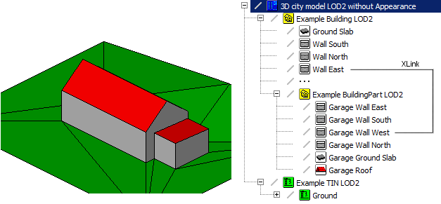

[[figure-79]]
.车库与建筑物相接的边界平面。对于建筑物，该共用墙面的几何平面被拆分为非共享部分和共享部分（参见 bldg:WallSurface 和 gml:name “Wall East”）。车库通过其相应的 XLink机制来表达和建筑物东侧墙体接触的部分。
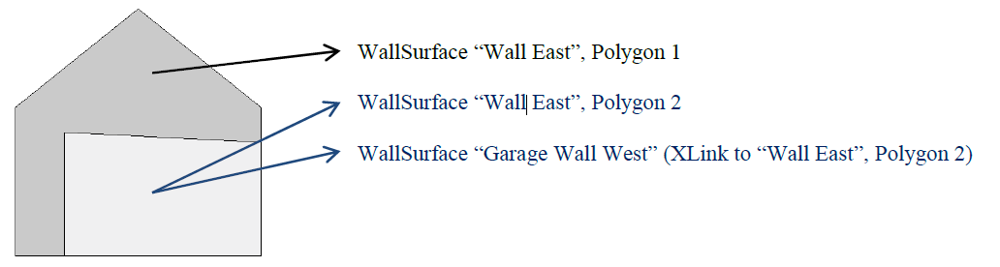

.清单 6：摘自CityGML数据集的LOD2级别具有相邻车库的建筑物，如图 78 所示。
[source,xml]
----
<?xml version="1.0" encoding="utf-8"?>
<CityModel xmlns:xsi="http://www.w3.org/2001/XMLSchema-instance" xmlns="http://www.opengis.net/citygml/2.0" xmlns:xAL="urn:oasis:names:tc:ciq:xsdschema:xAL:2.0" xmlns:xlink="http://www.w3.org/1999/xlink" xmlns:gml="http://www.opengis.net/gml" xmlns:dem="http://www.opengis.net/citygml/relief/2.0" xmlns:bldg="http://www.opengis.net/citygml/building/2.0"
schemaLocation="http://www.opengis.net/citygml/building/2.0 http://schemas.opengis.net/citygml/building/2.0/building.xsd http://www.opengis.net/citygml/relief/2.0 http://schemas.opengis.net/citygml/relief/2.0/relief.xsd">
<gml:name>3D city model LOD2 without Appearance</gml:name>
<gml:boundedBy>
<gml:Envelope srsDimension="3" srsName="urn:ogc:def:crs,crs:EPSG::25832,crs:EPSG::5783">
<gml:lowerCorner>458868.0 5438343.0 112.0</gml:lowerCorner>
<gml:upperCorner>458892.0 5438362.0 117.0</gml:upperCorner>
</gml:Envelope>
</gml:boundedBy>
<cityObjectMember>
<bldg:Building gml:id="GML_7b1a5a6f-ddad-4c3d-a507-3eb9ee0a8e68">
<gml:name>Example Building LOD2</gml:name>
…   (further attributes see LOD1 example)
<bldg:lod2Solid>
<gml:Solid>
<gml:exterior>
<gml:CompositeSurface>
<!-- Ground Slab -->
<gml:surfaceMember xlink:href="#GML_d3981803-d4b0-4b5b-969c-53f657594757"/>
<!-- Wall South -->
<gml:surfaceMember xlink:href="#GML_1d350a50-6acc-4d3c-8c28-326ca4305fd1"/>
<!-- Wall North -->
<gml:surfaceMember xlink:href="#GML_d3909000-2f18-4472-8886-1c127ea67df1"/>
<!-- Wall East 1 -->
<gml:surfaceMember xlink:href="#GML_56d1dd88-36dd-4d1e-bff0-3305fbffa778"/>
<!-- Wall East 2 -->
<gml:surfaceMember xlink:href="#GML_9f0465e6-f316-4f89-a9bd-eb21934ffe84"/>
<!-- Wall West -->
<gml:surfaceMember xlink:href="#GML_5cc4fd92-d5de-4dd8-971e-892c91da2d9f"/>
<!-- Roof North -->
<gml:surfaceMember xlink:href="#GML_ec6a8966-58d9-4894-8edd-9aceb91b923f"/>
<!-- Roof South -->
<gml:surfaceMember xlink:href="#GML_b41dc792-5da6-4cd9-8f85-247583f305e3"/>
</gml:CompositeSurface>
</gml:exterior>
</gml:Solid>
</bldg:lod2Solid>
<bldg:boundedBy>
<bldg:GroundSurface>
<gml:name>Ground Slab</gml:name>
<bldg:lod2MultiSurface>
<gml:MultiSurface>
<gml:surfaceMember>
<gml:Polygon gml:id="GML_d3981803-d4b0-4b5b-969c-53f657594757">
<gml:exterior>
<gml:LinearRing>
<gml:posList>458875.0 5438350.0 112.0 458875.0 5438355.0 112.0 458885.0 5438355.0 112.0 458885.0 5438350.0 112.0 458875.0 5438350.0 112.0 </gml:posList>
</gml:LinearRing>
</gml:exterior>
</gml:Polygon>
</gml:surfaceMember>
</gml:MultiSurface>
</bldg:lod2MultiSurface>
</bldg:GroundSurface>
</bldg:boundedBy>
…
<bldg:boundedBy>
<bldg:WallSurface>
<gml:name>Wall East</gml:name>
<bldg:lod2MultiSurface>
<gml:MultiSurface>
<gml:surfaceMember>
<gml:Polygon gml:id="GML_56d1dd88-36dd-4d1e-bff0-3305fbffa778">
<gml:exterior>
<gml:LinearRing>
<gml:posList>458885.0 5438350.0 112.0 458885.0 5438351.0 112.0 458885.0 5438351.0 114.5 458885.0 5438355.0 114.3 458885.0 5438355.0 115.0 458885.0 5438352.5 117.0 458885.0 5438350.0 115.0 458885.0 5438350.0 112.0</gml:posList>
</gml:LinearRing>
</gml:exterior>
</gml:Polygon>
</gml:surfaceMember>
<gml:surfaceMember>
<gml:Polygon gml:id="GML_9f0465e6-f316-4f89-a9bd-eb21934ffe84">
<gml:exterior>
<gml:LinearRing>
<gml:posList>458885.0 5438355.0 112.0 458885.0 5438355.0 114.3 458885.0 5438351.0 114.5 458885.0 5438351.0 112.0 458885.0 5438355.0 112.0</gml:posList>
</gml:LinearRing>
</gml:exterior>
</gml:Polygon>
</gml:surfaceMember>
</gml:MultiSurface>
</bldg:lod2MultiSurface>
</bldg:WallSurface> 
</bldg:boundedBy>
…
<bldg:consistsOfBuildingPart>
<bldg:BuildingPart gml:id="GMLID_BUI379228_1244_301">
<gml:name>Example BuildingPart LOD2</gml:name>
<bldg:function codeSpace="http://www.sig3d.org/codelists/standard/building/2.0/_AbstractBuilding_function.xml">1630</bldg:function>
<bldg:yearOfConstruction>1985</bldg:yearOfConstruction>
<bldg:roofType codeSpace="http://www.sig3d.org/codelists/standard/building/2.0/_AbstractBuilding_roofType.xml">1010</bldg:roofType>
<bldg:measuredHeight uom="#m">2.5</bldg:measuredHeight>
<bldg:lod2Solid>
<gml:Solid>
<gml:exterior>
<gml:CompositeSurface>
<!-- Garage Ground Slab -->
<gml:surfaceMember xlink:href="#GML_2e1ff653-b62b-41ee-9f99-d6852ae7d567"/>
<!-- Garage Wall South -->
<gml:surfaceMember xlink:href="#GML_f3f56c7b-7e59-47bc-ba03-d841032f1a37"/>
<!-- Garage Wall North -->
<gml:surfaceMember xlink:href="#GML_5339468c-b2cb-4a99-9eb5-8b0660fb26d3"/>
<!-- Garage Wall East -->
<gml:surfaceMember xlink:href="#GML_dab75f49-f6f8-4490-b86b-450b613e1fc2"/>
<!-- Garage Wall West (identical with Wall East 2 of Building) -->
<gml:surfaceMember>
<gml:OrientableSurface orientation="-">
<gml:baseSurface xlink:href="#GML_9f0465e6-f316-4f89-a9bd-eb21934ffe84"/>
</gml:OrientableSurface>
</gml:surfaceMember>
<!-- Garage Roof -->
<gml:surfaceMember xlink:href="#GML_7996bef1-f045-4704-be27-db27430d4f70"/>
</gml:CompositeSurface>
</gml:exterior>
</gml:Solid>
</bldg:lod2Solid>
<bldg:boundedBy>
<bldg:WallSurface>
<gml:name>Garage Wall East</gml:name>
<bldg:lod2MultiSurface>
<gml:MultiSurface>
<gml:surfaceMember>
<gml:Polygon gml:id="GML_dab75f49-f6f8-4490-b86b-450b613e1fc2">
<gml:exterior>
<gml:LinearRing>
<gml:posList>458887.5 5438355.0 114.3 458887.5 5438351.0 114.5 458887.5 5438351.0 112.0 458887.5
5438355.0 112.0 458887.5 5438355.0 114.3</gml:posList>
</gml:LinearRing>
</gml:exterior>
</gml:Polygon>
</gml:surfaceMember>
</gml:MultiSurface>
</bldg:lod2MultiSurface>
</bldg:WallSurface>
</bldg:boundedBy>
…
<bldg:boundedBy>
<bldg:WallSurface>
<gml:name>Garage Wall West</gml:name>
<bldg:lod2MultiSurface>
<gml:MultiSurface>
<gml:surfaceMember>
<!-- identical with Wall East 2 of Building -->
<gml:OrientableSurface orientation="-">
<gml:baseSurface xlink:href="#GML_9f0465e6-f316-4f89-a9bd-eb21934ffe84"/>
</gml:OrientableSurface>
</gml:surfaceMember>
</gml:MultiSurface>
</bldg:lod2MultiSurface>
</bldg:WallSurface>
</bldg:boundedBy>
…
</bldg:BuildingPart>
</bldg:consistsOfBuildingPart>
<bldg:address>
<Address>
<xalAddress>
<xAL:AddressDetails>
…
</xAL:AddressDetails>
</xalAddress>
<multiPoint>
…
</multiPoint>
</Address>
</bldg:address>
</bldg:Building>
</cityObjectMember>
<cityObjectMember>
<dem:ReliefFeature gml:id="GML_6bb30328-7599-4500-90ef-766fde6aa67b">
<gml:name>Example TIN LOD2</gml:name>
<dem:lod>2</dem:lod>
<dem:reliefComponent>
<dem:TINRelief gml:id="GML_4eb161b0-aa7e-4087-937c-5c4c427c7fc9">
<gml:name>Ground</gml:name>
<dem:lod>2</dem:lod>
<dem:tin>
…
</dem:tin>
</dem:TINRelief>
</dem:reliefComponent>
</dem:ReliefFeature>
</cityObjectMember>
</CityModel>
----

=== CityGML数据集示例：LOD3级别建筑物

本章示例的LOD3级别建筑模型（参见图 80）将门 (__bldg:Door__)、窗户 (__bldg:Window__) 和屋顶外檐 (__bldg:RoofSurface__) 添加到前几章的展示的LOD2模型中。同样，LOD3精度级别建筑模型的实体几何图形是通过使用 GML3 XLink 机制 (__xlink:href__) 引用主题边界表面的几何图形实现的。为了获得有效的实体几何图形，屋顶面在几何上被分割为屋顶板和屋顶外檐部分。建筑实体几何图形仅参考屋顶板部分。由多个表面组成的墙被建模为 __gml:CompositeSurface__，然后被建筑实体引用。包含门窗开口的边界表面用具有一个外部和多个内部线性环的多边形进行建模（根据__Building__模块第8号一致性要求，参见第 10.4.8 章）。

[[figure-80]]
.LOD3级别CityGML建筑模型示例（左侧为模型的三维表达；右侧为模型层级结构）。
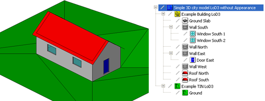

.清单 7：图 80 中可视化的LOD3级别建筑物的CityGML数据集摘录。
[source,xml]
----
<?xml version="1.0" encoding="utf-8"?>
<CityModel xmlns:xsi="http://www.w3.org/2001/XMLSchema-instance" xmlns="http://www.opengis.net/citygml/2.0" xmlns:gml="http://www.opengis.net/gml" xmlns:xlink="http://www.w3.org/1999/xlink" xmlns:bldg="http://www.opengis.net/citygml/building/2.0" xmlns:dem="http://www.opengis.net/citygml/relief/2.0" xmlns:xAL="urn:oasis:names:tc:ciq:xsdschema:xAL:2.0"
xsi:schemaLocation="http://www.opengis.net/citygml/building/2.0 http://schemas.opengis.net/citygml/building/2.0/building.xsd http://www.opengis.net/citygml/relief/2.0 http://schemas.opengis.net/citygml/relief/2.0/relief.xsd ">
<gml:name>Simple 3D city model LOD3 without Appearance</gml:name>
<gml:boundedBy>
<gml:Envelope srsDimension="3" srsName="urn:ogc:def:crs,crs:EPSG::25832,crs:EPSG::5783">
<gml:lowerCorner>458868.0 5438343.0 112.0</gml:lowerCorner>
<gml:upperCorner>458892.0 5438362.0 117.0</gml:upperCorner>
</gml:Envelope>
</gml:boundedBy>
<cityObjectMember>
<bldg:Building gml:id="GML_7b1a5a6f-ddad-4c3d-a507-3eb9ee0a8e68">
<gml:name>Example Building LOD3 </gml:name>
…   (further attributes see LOD1 example)
<bldg:boundedBy>
<bldg:GroundSurface>
<gml:name>Ground Slab</gml:name>
…   (see LOD2 example)
</bldg:GroundSurface>
</bldg:boundedBy>
<bldg:boundedBy>
<bldg:WallSurface>
<gml:name>Wall South</gml:name>
<bldg:lod3MultiSurface>
<gml:MultiSurface>
<gml:surfaceMember>
<gml:CompositeSurface gml:id="GML_1d350a50-6acc-4d3c-8c28-326ca4305fd1">
<gml:surfaceMember>
<gml:Polygon gml:id="PolyID10204_1916_571790_369478">
…
</gml:Polygon>
</gml:surfaceMember>
<gml:surfaceMember>
<gml:Polygon gml:id="PolyID10205_105_876837_53833">
<gml:exterior>
<gml:LinearRing>
<gml:posList>458875.0 5438350.0 112.0 458885.0 5438350.0 112.0 458885.0 5438350.0 115.0 458875.0 5438350.0 115.0 458875.0 5438350.0 112.0 </gml:posList>
</gml:LinearRing>
</gml:exterior>
<gml:interior>
<gml:LinearRing>
<gml:posList>458877.0 5438350.0 114.2 458878.5 5438350.0 114.2 458878.5 5438350.0 113.2 458877.0 5438350.0 113.2 458877.0 5438350.0 114.2 </gml:posList>
</gml:LinearRing>
</gml:interior>
<gml:interior>
<gml:LinearRing>
<gml:posList>458881.5 5438350.0 114.2 458883.0 5438350.0 114.2 458883.0 5438350.0 113.2 458881.5 5438350.0 113.2 458881.5 5438350.0 114.2 </gml:posList>
</gml:LinearRing>
</gml:interior>
</gml:Polygon>
</gml:surfaceMember>
<gml:surfaceMember>
…   (more surface members of the WallSurface)
</gml:surfaceMember>
</gml:CompositeSurface>
</gml:surfaceMember>
</gml:MultiSurface>
</bldg:lod3MultiSurface>
<bldg:opening>
<bldg:Window gml:id="GML_3b09d6a5-4c24-4847-a8a2-e97475e3de47">
<gml:name>Window South 1</gml:name>
<bldg:lod3MultiSurface>
<gml:MultiSurface>
<gml:surfaceMember>
<gml:Polygon gml:id="GML_5e07e2cc-c28c-480e-880f-dfdfe287bb9e">
…
</gml:Polygon>
</gml:surfaceMember>
</gml:MultiSurface>
</bldg:lod3MultiSurface>
</bldg:Window>
</bldg:opening>
<bldg:opening>
<bldg:Window gml:id="GML_f75f01cc-c584-4a62-b34a-4a0e2640550d">
<gml:name>Window South 2</gml:name>
<bldg:lod3MultiSurface>
<gml:MultiSurface>
<gml:surfaceMember>
<gml:Polygon gml:id="GML_d0ea2b6b-7992-4284-9a20-957a6c5c1cea">
…
</gml:Polygon>
</gml:surfaceMember>
</gml:MultiSurface>
</bldg:lod3MultiSurface>
</bldg:Window>
</bldg:opening>
</bldg:WallSurface>
</bldg:boundedBy>
<bldg:boundedBy>
<bldg:WallSurface>
<gml:name>Wall North</gml:name>
…   (see LOD2 example)
</bldg:WallSurface>
</bldg:boundedBy>
<bldg:boundedBy>
<bldg:WallSurface>
<gml:name>Wall East</gml:name>
<bldg:lod3MultiSurface>
<gml:MultiSurface>
<gml:surfaceMember>
<gml:CompositeSurface gml:id="GML_6286ffa9-3811-4796-a92f-3fd037c8e668">
... 
</gml:CompositeSurface>
</gml:surfaceMember>
</gml:MultiSurface>
</bldg:lod3MultiSurface>
<bldg:opening>
<bldg:Door gml:id="GML_93096bbb-5155-47fb-ae2c-e2f9327f3007">
<gml:name>Door East</gml:name>
<bldg:lod3MultiSurface>
<gml:MultiSurface>
<gml:surfaceMember>
<gml:Polygon gml:id="GML_8f988da9-22d7-41e5-ae94-880afd46a3c9">
…
</gml:Polygon>
</gml:surfaceMember>
</gml:MultiSurface>
</bldg:lod3MultiSurface>
</bldg:Door>
</bldg:opening>
</bldg:WallSurface>
</bldg:boundedBy>
<bldg:boundedBy>
<bldg:WallSurface>
<gml:name>Wall West</gml:name>
…   (see LOD2 example)
</bldg:WallSurface>
</bldg:boundedBy>
<bldg:boundedBy>
<bldg:RoofSurface>
<gml:name>Roof North</gml:name>
<bldg:lod3MultiSurface>
<gml:MultiSurface>
<!-- Roof slab -->
<gml:surfaceMember>
<gml:Polygon gml:id="GML_ec6a8966-58d9-4894-8edd-9aceb91b923f">
…   (see LOD2 example)
</gml:Polygon>
</gml:surfaceMember>
<!-- Roof overhanging -->
<gml:surfaceMember>
<gml:Polygon gml:id="GML_70fa738e-80a4-4774-8a3b-322f037fa482">
<gml:exterior>
<gml:LinearRing>
<gml:posList>458874.6 5438352.5 117 458875 5438352.5 117 458875 5438355 115 458885 5438355 115 458885 5438352.5 117 458885.4 5438352.5 117 458885.4 5438355.312347524 114.75012198097823 458874.6 5438355.312347524 114.75012198097823 458874.6 5438352.5 117 </gml:posList>
</gml:LinearRing>
</gml:exterior>
</gml:Polygon>
</gml:surfaceMember>
</gml:MultiSurface>
</bldg:lod3MultiSurface>
</bldg:RoofSurface>
</bldg:boundedBy>
<bldg:boundedBy>
<bldg:RoofSurface>
<gml:name>Roof South</gml:name>
<bldg:lod3MultiSurface>
<!-- Roof slab -->
<gml:MultiSurface>
<gml:surfaceMember>
<gml:Polygon gml:id="GML_b41dc792-5da6-4cd9-8f85-247583f305e3">
…   (see LOD2 example)
</gml:Polygon>
</gml:surfaceMember>
<!-- Roof overhanging -->
<gml:surfaceMember>
<gml:Polygon gml:id="GML_db6d8edc-4870-4523-a606-d440f36f8ec8">
…
</gml:Polygon>
</gml:surfaceMember>
</gml:MultiSurface>
</bldg:lod3MultiSurface>
</bldg:RoofSurface>
</bldg:boundedBy>
<bldg:lod3Solid>
<gml:Solid>
<gml:exterior>
<gml:CompositeSurface>
<!-- Ground Slab -->
<gml:surfaceMember xlink:href="#GML_d3981803-d4b0-4b5b-969c-53f657594757"/>
<!-- Wall South -->
<gml:surfaceMember xlink:href="#GML_1d350a50-6acc-4d3c-8c28-326ca4305fd1"/>
<!-- Window South 1 -->
<gml:surfaceMember xlink:href="#GML_5e07e2cc-c28c-480e-880f-dfdfe287bb9e"/>
<!-- Window South 2 -->
<gml:surfaceMember xlink:href="#GML_d0ea2b6b-7992-4284-9a20-957a6c5c1cea"/>
<!-- Wall North -->
<gml:surfaceMember xlink:href="#GML_d3909000-2f18-4472-8886-1c127ea67df1"/>
<!-- Wall East -->
<gml:surfaceMember xlink:href="#GML_6286ffa9-3811-4796-a92f-3fd037c8e668"/>
<!-- Door East -->
<gml:surfaceMember xlink:href="#GML_8f988da9-22d7-41e5-ae94-880afd46a3c9"/>
<!-- Wall West -->
<gml:surfaceMember xlink:href="#GML_5cc4fd92-d5de-4dd8-971e-892c91da2d9f"/>
<!-- Roof Slab North -->
<gml:surfaceMember xlink:href="#GML_ec6a8966-58d9-4894-8edd-9aceb91b923f"/>
<!-- Roof Slab South -->
<gml:surfaceMember xlink:href="#GML_b41dc792-5da6-4cd9-8f85-247583f305e3"/>
</gml:CompositeSurface>
</gml:exterior>
</gml:Solid>
</bldg:lod3Solid>
<bldg:address>
<Address>
...   (see LOD1 example)
</Address>
</bldg:address>
</bldg:Building>
</cityObjectMember>
<cityObjectMember>
<dem:ReliefFeature gml:id="GML_6bb30328-7599-4500-90ef-766fde6aa67b">
…   (see LOD1 example)
</dem:ReliefFeature>
</cityObjectMember>
</CityModel>
----

=== CityGML数据集示例：LOD4级别建筑物

在LOD4级别模型中，增加了建筑内部的内容（参见图 81）。该模型包含一个房间 (__bldg:Room__)，其中配备了一把摇椅 (__bldg:BuildingFurniture__)。房间以建筑内部的表面为边界进行围合（__bldg:InteriorWallSurface__、__bldg:FloorSurface__、__bldg:CeilingSurface__，通过房间的__bldg:boundedBy__属性关联），其几何图形由房间的 LOD4 实体几何图形 (__xlink:href__) 引用。如果内部边界表面的法向量指向房间，则在实体引用时，必须使用可定向表面 (__gml:OrientableSurface__) 翻转其方向，从而创建有效的实体几何图形（对于__gml:Solid__，包围体表面的法向量必须指向实体外）。

[[figure-81]]
.LOD4级别的CityGML建筑模型示例。为了更清晰地表达建筑室内和家具，建筑屋顶已被隐藏（左侧为模型的三维表达；右侧为模型层级结构）。
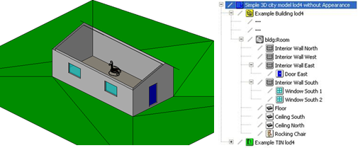

.清单 8：图 81 中可视化的LOD4级别建筑物的CityGML数据集摘录。
[source,xml]
----
<?xml version="1.0" encoding="utf-8"?>
<CityModel xmlns:xsi="http://www.w3.org/2001/XMLSchema-instance" xmlns="http://www.opengis.net/citygml/2.0" xmlns:gml="http://www.opengis.net/gml" xmlns:xlink="http://www.w3.org/1999/xlink" xmlns:bldg="http://www.opengis.net/citygml/building/2.0" xmlns:dem="http://www.opengis.net/citygml/relief/2.0" xmlns:xAL="urn:oasis:names:tc:ciq:xsdschema:xAL:2.0"
xsi:schemaLocation="http://www.opengis.net/citygml/building/2.0 http://schemas.opengis.net/citygml/building/2.0/building.xsd http://www.opengis.net/citygml/relief/2.0 http://schemas.opengis.net/citygml/relief/2.0/relief.xsd ">
<gml:name>Simple 3D city model LOD4 without Appearance</gml:name>
<gml:boundedBy>
<gml:Envelope srsDimension="3" srsName="urn:ogc:def:crs,crs:EPSG::25832,crs:EPSG::5783">
<gml:lowerCorner>458868.0 5438343.0 112.0</gml:lowerCorner>
<gml:upperCorner>458892.0 5438362.0 117.0</gml:upperCorner>
</gml:Envelope>
</gml:boundedBy>
<cityObjectMember>
<bldg:Building gml:id="GML_7b1a5a6f-ddad-4c3d-a507-3eb9ee0a8e68">
<gml:name>Example Building LOD4 </gml:name>
…   (further attributes see LOD1 example)
<bldg:boundedBy>
…   (outer shell see LOD3 example)
<bldg:lod4Solid>
…   (building solid representation see LOD3 example)
</bldg:lod4Solid>
<bldg:interiorRoom>
<bldg:Room>
<bldg:lod4Solid>
<gml:Solid>
<gml:exterior>
<gml:CompositeSurface>
<!-- Floor -->
<gml:surfaceMember>
<gml:OrientableSurface orientation="-">
<gml:baseSurface xlink:href="#GML_fa89e511-39b2-46de-9a13-9f4621576a46"/>
</gml:OrientableSurface>
</gml:surfaceMember>
<!-- Interior Wall North -->
<gml:surfaceMember>
<gml:OrientableSurface orientation="-">
<gml:baseSurface xlink:href="#GML_592ce9fa-0b98-4225-8d22-20eff4f86fc5"/>
</gml:OrientableSurface>
</gml:surfaceMember>
<!-- Interior Wall West -->
<gml:surfaceMember>
<gml:OrientableSurface orientation="-">
<gml:baseSurface xlink:href="#GML_a9fe597d-c338-43ad-a633-2a0beb273fac"/>
</gml:OrientableSurface>
</gml:surfaceMember>
<!-- Interior Wall East -->
<gml:surfaceMember>
<gml:OrientableSurface orientation="-">
<gml:baseSurface xlink:href="#GML_eaf1db16-56a3-4b86-ae19-2edbb604636f"/>
</gml:OrientableSurface>
</gml:surfaceMember>
<!-- Door East -->
<gml:surfaceMember>
<gml:OrientableSurface orientation="+">
<gml:baseSurface xlink:href="#GML_8f988da9-22d7-41e5-ae94-880afd46a3c9"/>
</gml:OrientableSurface>
</gml:surfaceMember>
<!-- Interior Wall South -->
<gml:surfaceMember>
<gml:OrientableSurface orientation="-">
<gml:baseSurface xlink:href="#GML_a718c157-c948-42cf-a786-0ce61044cff9"/>
</gml:OrientableSurface>
</gml:surfaceMember>
<!-- Window South 1 -->
<gml:surfaceMember>
<gml:OrientableSurface orientation="+">
<gml:baseSurface xlink:href="#GML_5e07e2cc-c28c-480e-880f-dfdfe287bb9e"/>
</gml:OrientableSurface>
</gml:surfaceMember>
<!-- Window South 2 -->
<gml:surfaceMember>
<gml:OrientableSurface orientation="+">
<gml:baseSurface xlink:href="#GML_d0ea2b6b-7992-4284-9a20-957a6c5c1cea"/>
</gml:OrientableSurface>
</gml:surfaceMember>
<!-- Ceiling North -->
<gml:surfaceMember>
<gml:OrientableSurface orientation="-">
<gml:baseSurface xlink:href="#GML_989aa5cf-ee07-4fd8-89b6-500a9d5ba8041"/>
</gml:OrientableSurface>
</gml:surfaceMember>
<!-- Ceiling South -->
<gml:surfaceMember>
<gml:OrientableSurface orientation="-">
<gml:baseSurface xlink:href="#GML_98841838-ee0b-402f-ba28-64ed61cb10f8"/>
</gml:OrientableSurface>
</gml:surfaceMember>
</gml:CompositeSurface>
</gml:exterior>
</gml:Solid>
</bldg:lod4Solid>
<bldg:boundedBy>
<bldg:InteriorWallSurface>
<gml:name>Interior Wall North</gml:name>
<bldg:lod4MultiSurface>
<gml:MultiSurface>
<gml:surfaceMember>
<gml:Polygon gml:id="GML_592ce9fa-0b98-4225-8d22-20eff4f86fc5">
…
</gml:Polygon>
</gml:surfaceMember>
</gml:MultiSurface>
</bldg:lod4MultiSurface>
</bldg:InteriorWallSurface>
</bldg:boundedBy>
<bldg:boundedBy>
<bldg:InteriorWallSurface>
<gml:name>Interior Wall West</gml:name>
<bldg:lod4MultiSurface>
<gml:MultiSurface> 
<gml:surfaceMember>
<gml:Polygon gml:id="GML_a9fe597d-c338-43ad-a633-2a0beb273fac">
…
</gml:Polygon>
</gml:surfaceMember>
</gml:MultiSurface>
</bldg:lod4MultiSurface>
</bldg:InteriorWallSurface>
</bldg:boundedBy>
<bldg:boundedBy>
<bldg:InteriorWallSurface>
<gml:name>Interior Wall East</gml:name>
<bldg:lod4MultiSurface>
<gml:MultiSurface>
<gml:surfaceMember>
<gml:CompositeSurface gml:id="GML_eaf1db16-56a3-4b86-ae19-2edbb604636f">
<gml:surfaceMember>
…
</gml:surfaceMember>
<gml:surfaceMember>
…
</gml:surfaceMember>
<gml:surfaceMember>
…
</gml:surfaceMember>
<gml:surfaceMember>
…
</gml:surfaceMember>
</gml:CompositeSurface>
</gml:surfaceMember>
</gml:MultiSurface>
</bldg:lod4MultiSurface>
<bldg:opening>
<bldg:Door>
<gml:name>Door East</gml:name>
<bldg:lod4MultiSurface>
<gml:MultiSurface>
<gml:surfaceMember>
<gml:OrientableSurface orientation="-">
<gml:baseSurface xlink:href="#GML_8f988da9-22d7-41e5-ae94-880afd46a3c9"> </gml:baseSurface>
</gml:OrientableSurface>
</gml:surfaceMember>
</gml:MultiSurface>
</bldg:lod4MultiSurface>
</bldg:Door>
</bldg:opening>
</bldg:InteriorWallSurface>
</bldg:boundedBy>
<bldg:boundedBy>
<bldg:InteriorWallSurface>
<gml:name>Interior Wall South</gml:name>
<bldg:lod4MultiSurface>
<gml:MultiSurface>
<gml:surfaceMember>
<gml:CompositeSurface gml:id="GML_a718c157-c948-42cf-a786-0ce61044cff9">
<gml:surfaceMember>
…
</gml:surfaceMember>
<gml:surfaceMember>
…
</gml:surfaceMember>
<gml:surfaceMember>
…
</gml:surfaceMember>
<gml:surfaceMember>
…
</gml:surfaceMember>
<gml:surfaceMember>
…
</gml:surfaceMember>
<gml:surfaceMember>
…
</gml:surfaceMember>
<gml:surfaceMember>
<gml:Polygon gml:id="GML_cf0b79ba-f31f-4bae-a10f-5bcc85ce2cf6">
<gml:exterior>
…
</gml:exterior>
<gml:interior>
…
</gml:interior>
<gml:interior>
…
</gml:interior>
</gml:Polygon>
</gml:surfaceMember>
<gml:surfaceMember>
…
</gml:surfaceMember>
<gml:surfaceMember>
…
</gml:surfaceMember>
</gml:CompositeSurface>
</gml:surfaceMember>
</gml:MultiSurface>
</bldg:lod4MultiSurface>
<bldg:opening>
<bldg:Window>
<gml:name>Window South 1</gml:name>
<bldg:lod4MultiSurface>
<gml:MultiSurface>
<gml:surfaceMember>
<gml:OrientableSurface orientation="-">
<gml:baseSurface xlink:href="#GML_5e07e2cc-c28c-480e-880f-dfdfe287bb9e"> </gml:baseSurface>
</gml:OrientableSurface>
</gml:surfaceMember>
</gml:MultiSurface>
</bldg:lod4MultiSurface>
</bldg:Window>
</bldg:opening>
<bldg:opening>
<bldg:Window>
<gml:name>Window South 2</gml:name>
<bldg:lod4MultiSurface>
<gml:MultiSurface>
<gml:surfaceMember>
<gml:OrientableSurface orientation="-">
<gml:baseSurface xlink:href="#GML_d0ea2b6b-7992-4284-9a20-957a6c5c1cea"> </gml:baseSurface>
</gml:OrientableSurface>
</gml:surfaceMember>
</gml:MultiSurface>
</bldg:lod4MultiSurface>
</bldg:Window>
</bldg:opening>
</bldg:InteriorWallSurface>
</bldg:boundedBy>
<bldg:boundedBy>
<bldg:FloorSurface>
<gml:name>Floor</gml:name>
<bldg:lod4MultiSurface>
<gml:MultiSurface>
<gml:surfaceMember>
<gml:Polygon gml:id="GML_fa89e511-39b2-46de-9a13-9f4621576a46">
…
</gml:Polygon>
</gml:surfaceMember>
</gml:MultiSurface>
</bldg:lod4MultiSurface>
</bldg:FloorSurface>
</bldg:boundedBy>
<bldg:boundedBy>
<bldg:CeilingSurface>
<gml:name>Ceiling South</gml:name>
<bldg:lod4MultiSurface>
<gml:MultiSurface>
<gml:surfaceMember>
<gml:Polygon gml:id="GML_989aa5cf-ee07-4fd8-89b6-500a9d5ba8041">
…
</gml:Polygon>
</gml:surfaceMember>
</gml:MultiSurface>
</bldg:lod4MultiSurface> 
</bldg:CeilingSurface>
</bldg:boundedBy>
<bldg:boundedBy>
<bldg:CeilingSurface>
<gml:name>Ceiling North</gml:name>
<bldg:lod4MultiSurface>
<gml:MultiSurface>
<gml:surfaceMember>
<gml:Polygon gml:id="GML_98841838-ee0b-402f-ba28-64ed61cb10f8">
…
</gml:Polygon>
</gml:surfaceMember>
</gml:MultiSurface>
</bldg:lod4MultiSurface>
</bldg:CeilingSurface>
</bldg:boundedBy>
<bldg:interiorFurniture>
<bldg:BuildingFurniture>
<gml:name>Rocking Chair</gml:name>
<bldg:function codeSpace="http://www.sig3d.org/codelists/standard/building/2.0/BuildingFurniture_function.xml"
>1340</bldg:function>
<bldg:lod4Geometry>
</gml:MultiSurface>
…
</gml:MultiSurface>
</bldg:lod4Geometry>
</bldg:BuildingFurniture>
</bldg:interiorFurniture>
</bldg:Room>
</bldg:interiorRoom>
<bldg:address>
…   (address see LOD1 example)
</bldg:address>
</bldg:Building>
</cityObjectMember>
<cityObjectMember>
<dem:ReliefFeature gml:id="GML_6bb30328-7599-4500-90ef-766fde6aa67b">
…   (see LOD1 example)
</dem:ReliefFeature>
</cityObjectMember>
</CityModel>
----

=== CityGML数据集示例：外观模型

以下CityGML数据集是基于G.2和G.3章中给出的LOD1和LOD2级别的简单建筑模型。此外，还定义了两个独立的外观主题——夏季主题和冬季主题——描述了建筑物和周围地形的不同外观。每个LOD精度级别的模型都拥有特定主题的独立外观。

此数据集中使用了CityGML外观模型的几个概念。在LOD1精度级别的模型中，一个__X3DMaterial__对象定义了整个建筑物的材质，同时该材质被应用于所有表面。此外，建筑物的地形和屋顶表面都被指定了含有地理参考的纹理材质（__GeoreferencedTexture__）。在LOD2中，建筑物的垂直表面单独使用参数化纹理材质（__ParameterizedTexture__），而屋顶表面和地形再次由含地理参考纹理材质（__GeoreferencedTexture__）表达。使用含地理参考纹理材质（__GeoreferencedTexture__）的对象使用ESRI世界文件（参见清单11）进行映射。以上建模方法得到了四种该数据集的可视化效果，如图82和图83所示。

[[figure-82]]
.使用CityGML的外观模型来可视化LOD1级别建筑模型。对于建筑模型和地形模型定义了两种显示主题：（a）左侧图表达了夏季显示风格，（b）右侧图片表达了冬季显示风格（图片来源：Hasso-Plattner-Institute）。
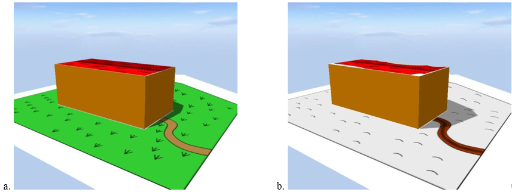

[[figure-83]]
.使用CityGML的外观模型来可视化LOD2级别建筑模型。对于建筑模型和地形模型定义了两种显示主题：（a）左侧图表达了夏季显示风格，（b）右侧图片表达了冬季显示风格（图片来源：Hasso-Plattner-Institute）。
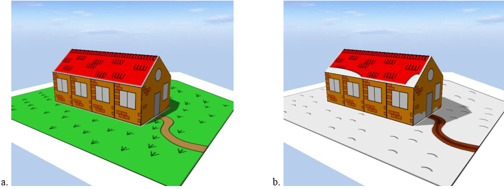

.清单 9：来自CityGML数据集的摘录，说明了CityGML的外观模型。 数据集在图82和图83中可视化。
[source,xml]
----
<?xml version="1.0" encoding="utf-8"?>
<CityModel xmlns="http://www.opengis.net/citygml/2.0" xmlns:xlink="http://www.w3.org/1999/xlink" xmlns:gml="http://www.opengis.net/gml"
xmlns:app="http://www.opengis.net/citygml/appearance/2.0" xmlns:dem="http://www.opengis.net/citygml/relief/2.0" xmlns:bldg="http://www.opengis.net/citygml/building/2.0" xmlns:xsi="http://www.w3.org/2001/XMLSchema-instance" 
xsi:schemaLocation="http://www.opengis.net/citygml/building/2.0 http://schemas.opengis.net/citygml/building/2.0/building.xsd http://www.opengis.net/citygml/relief/2.0 http://schemas.opengis.net/citygml/relief/2.0/relief.xsd http://www.opengis.net/citygml/appearance/2.0 http://schemas.opengis.net/citygml/appearance/2.0/appearance.xsd">
<gml:boundedBy>
<gml:Envelope srsDimension="3" srsName="urn:ogc:def:crs,crs:EPSG::25832,crs:EPSG::5783">
<gml:lowerCorner>458868.0 5438343.0 112.0</gml:lowerCorner>
<gml:upperCorner>458892.0 5438362.0 117.0</gml:upperCorner>
</gml:Envelope>
</gml:boundedBy>
<cityObjectMember>
<bldg:Building gml:id="GML_7b1a5a6f-ddad-4c3d-a507-3eb9ee0a8e68">
<bldg:function codeSpace="http://www.sig3d.org/codelists/standard/building/2.0/_AbstractBuilding_function.xml">1000</bldg:function>
<bldg:yearOfConstruction>1985</bldg:yearOfConstruction>
<bldg:roofType codeSpace="http://www.sig3d.org/codelists/standard/building/2.0/_AbstractBuilding_roofType.xml">1030</bldg:roofType>
<bldg:measuredHeight uom="#m">5.0</bldg:measuredHeight>
<bldg:storeysAboveGround>1</bldg:storeysAboveGround>
<bldg:storeyHeightsAboveGround uom="#m">3.0</bldg:storeyHeightsAboveGround>
<bldg:lod1Solid>
<gml:Solid>
<gml:exterior>
<gml:CompositeSurface gml:id="lod1Surface">
<gml:surfaceMember>
<gml:Polygon>
<gml:exterior>
<gml:LinearRing>
<gml:posList srsDimension="3">458875 5438350 112 458885 5438350 112 458885 5438350 116 458875
5438350 116 458875 5438350 112 </gml:posList>
</gml:LinearRing>
</gml:exterior>
</gml:Polygon>
</gml:surfaceMember>
…
<gml:surfaceMember>
<gml:Polygon gml:id="lod1RoofPoly1">
<gml:exterior>
<gml:LinearRing>
<gml:posList srsDimension="3">458875 5438350 116 458885 5438350 116 458885 5438355 116 458875
5438355 116 458875 5438350 116 </gml:posList>
</gml:LinearRing>
</gml:exterior>
</gml:Polygon>
</gml:surfaceMember>
…
</gml:CompositeSurface>
</gml:exterior>
</gml:Solid>
</bldg:lod1Solid>
<bldg:lod2Solid>
<gml:Solid>
<gml:exterior>
<gml:CompositeSurface>
<gml:surfaceMember>
<gml:CompositeSurface gml:id="fLeft">
<gml:surfaceMember>
<gml:Polygon>
<gml:exterior>
<gml:LinearRing gml:id="fLeftExt1">
<gml:posList srsDimension="3">458875 5438350 112 458880 5438350 112 458880 5438350 115 458875
5438350 115 458875 5438350 112 </gml:posList>
</gml:LinearRing>
</gml:exterior>
</gml:Polygon>
</gml:surfaceMember>
<gml:surfaceMember>
<gml:Polygon>
<gml:exterior>
<gml:LinearRing gml:id="fLeftExt2">
<gml:posList srsDimension="3">458880 5438350 112 458885 5438350 112 458885 5438350 115 458880
5438350 115 458880 5438350 112 </gml:posList>
</gml:LinearRing>
</gml:exterior>
</gml:Polygon>
</gml:surfaceMember>
</gml:CompositeSurface>
</gml:surfaceMember>
<gml:surfaceMember>
<gml:Polygon gml:id="fFront">
<gml:exterior>
<gml:LinearRing gml:id="fFrontExt">
<gml:posList srsDimension="3">458885 5438350 112 458885 5438355 112 458885 5438355 115 458885
5438352.5 117 458885 5438350 115 458885 5438350 112 </gml:posList>
</gml:LinearRing>
</gml:exterior>
</gml:Polygon>
</gml:surfaceMember>
<gml:surfaceMember>
<gml:Polygon gml:id="fRight">
<gml:exterior>
<gml:LinearRing gml:id="fRightExt">
<gml:posList srsDimension="3">458885 5438355 112 458875 5438355 112 458875 5438355 115 458885
5438355 115 458885 5438355 112 </gml:posList>
</gml:LinearRing>
</gml:exterior>
</gml:Polygon>
</gml:surfaceMember>
<gml:surfaceMember>
<gml:Polygon gml:id="fBack">
<gml:exterior>
<gml:LinearRing gml:id="fBackExt">
<gml:posList srsDimension="3">458875 5438355 112 458875 5438350 112 458875 5438350 115 458875
5438352.5 117 458875 5438355 115 458875 5438355 112 </gml:posList>
</gml:LinearRing>
</gml:exterior>
</gml:Polygon>
</gml:surfaceMember>
<gml:surfaceMember>
<gml:Polygon gml:id="lod2RoofPoly1">
<gml:exterior>
<gml:LinearRing>
<gml:posList srsDimension="3">458875 5438350 115 458885 5438350 115 458885 5438352.5 117 458875
5438352.5 117 458875 5438350 115 </gml:posList>
</gml:LinearRing>
</gml:exterior>
</gml:Polygon>
</gml:surfaceMember>
<gml:surfaceMember>
<gml:Polygon gml:id="lod2RoofPoly2">
<gml:exterior>
<gml:LinearRing>
<gml:posList srsDimension="3">458885 5438355 115 458875 5438355 115 458875 5438352.5 117 458885
5438352.5 117 458885 5438355 115 </gml:posList>
</gml:LinearRing>
</gml:exterior>
</gml:Polygon>
</gml:surfaceMember>
<gml:surfaceMember>
<gml:Polygon>
<gml:exterior>
<gml:LinearRing>
<gml:posList srsDimension="3">458875 5438350 112 458875 5438355 112 458885 5438355 112 458885
5438350 112 458875 5438350 112 </gml:posList>
</gml:LinearRing>
</gml:exterior>
</gml:Polygon>
</gml:surfaceMember>
</gml:CompositeSurface>
</gml:exterior>
</gml:Solid>
</bldg:lod2Solid>
<bldg:address>
…   (address see LOD1 example)
</bldg:address>
</bldg:Building>
</cityObjectMember>
<cityObjectMember>
<dem:ReliefFeature gml:id="GML_6bb30328-7599-4500-90ef-766fde6aa67b ">
<dem:lod>1</dem:lod>
<dem:reliefComponent>
<dem:TINRelief gml:id=" GML_4eb161b0-aa7e-4087-937c-5c4c427c7fc9">
<gml:name>Ground</gml:name> 
<dem:lod>1</dem:lod>
<dem:tin>
<gml:TriangulatedSurface gml:id="ground">
<gml:trianglePatches>
<gml:Triangle>
<gml:exterior>
<gml:LinearRing>
<gml:posList>458868 5438362 112 458875 5438355 112 458883 5438362 114 458868 5438362 112
</gml:posList>
</gml:LinearRing>
</gml:exterior>
</gml:Triangle>
…
</gml:trianglePatches>
</gml:TriangulatedSurface>
</dem:tin>
</dem:TINRelief>
</dem:reliefComponent>
</dem:ReliefFeature>
</cityObjectMember>
<app:appearanceMember>
<app:Appearance>
<app:theme>Summer</app:theme>
<app:surfaceDataMember>
<app:X3DMaterial gml:id="lod1Material">
<app:diffuseColor>1.0 0.6 0.0</app:diffuseColor>
<app:target>#lod1Surface</app:target>
</app:X3DMaterial>
</app:surfaceDataMember>
<app:surfaceDataMember>
<app:GeoreferencedTexture>
<app:imageURI>ground_summer.png</app:imageURI>
<app:wrapMode>none</app:wrapMode>
<app:referencePoint>
<gml:Point>
<gml:pos srsDimension="2">458870 5438360</gml:pos>
</gml:Point>
</app:referencePoint>
<app:orientation>0.05 0.0 0.0 -0.05</app:orientation>
<app:target>#ground</app:target>
<app:target>#lod1RoofPoly1</app:target>
<app:target>#lod2RoofPoly1</app:target>
<app:target>#lod2RoofPoly2</app:target>
</app:GeoreferencedTexture>
</app:surfaceDataMember>
<app:surfaceDataMember>
<app:ParameterizedTexture gml:id="sideTexture">
<app:imageURI>facade.png</app:imageURI>
<app:wrapMode>wrap</app:wrapMode>
<app:target uri="#fLeft">
<app:TexCoordList>
<app:textureCoordinates ring="#fLeftExt1">0.0 0.0 2.0 0.0 2.0 1.0 0.0 1.0 0.0 0.0</app:textureCoordinates>
<app:textureCoordinates ring="#fLeftExt2">2.0 0.0 4.0 0.0 4.0 1.0 2.0 1.0 2.0 0.0</app:textureCoordinates>
</app:TexCoordList>
</app:target>
<app:target uri="#fRight">
<app:TexCoordGen>
<app:worldToTexture>-0.4 0.0 0.0 183550.0 0.0 0.0 0.3333 -37.3333 0.0 0.0 0.0 1.0</app:worldToTexture>
</app:TexCoordGen>
</app:target>
</app:ParameterizedTexture>
</app:surfaceDataMember>
<app:surfaceDataMember>
<app:ParameterizedTexture>
<app:imageURI>front_back_summer.png</app:imageURI>
<app:wrapMode>none</app:wrapMode>
<app:target uri="#fFront">
<app:TexCoordList gml:id="frontTexCoord">
<app:textureCoordinates ring="#fFrontExt">0.0 0.0 0.5 0.0 0.5 0.6 0.25 1.0 0.0 0.6 0.0 0.0</app:textureCoordinates>
</app:TexCoordList>
</app:target>
<app:target uri="#fBack">
<app:TexCoordList gml:id="backTexCoord">
<app:textureCoordinates ring="#fBackExt">0.5 0.0 1.0 0.0 1.0 0.6 0.75 1.0 0.5 0.6 0.5 0.0</app:textureCoordinates>
</app:TexCoordList>
</app:target>
</app:ParameterizedTexture>
</app:surfaceDataMember>
</app:Appearance>
</app:appearanceMember>
<app:appearanceMember>
<app:Appearance>
<app:theme>Winter</app:theme>
<app:surfaceDataMember>
<app:GeoreferencedTexture>
<app:imageURI>ground_winter.png</app:imageURI>
<app:wrapMode>none</app:wrapMode>
<app:referencePoint>
<gml:Point>
<gml:pos srsDimension="2">458870 5438360</gml:pos>
</gml:Point>
</app:referencePoint>
<app:orientation>0.05 0.0 0.0 -0.05</app:orientation>
<app:target>#ground</app:target>
<app:target>#lod1RoofPoly1</app:target>
<app:target>#lod2RoofPoly1</app:target>
<app:target>#lod2RoofPoly2</app:target>
</app:GeoreferencedTexture>
</app:surfaceDataMember>
<app:surfaceDataMember xlink:href="#lod1Material"/>
<app:surfaceDataMember xlink:href="#sideTexture"/>
<app:surfaceDataMember>
<app:ParameterizedTexture>
<app:imageURI>front_back_winter.png</app:imageURI>
<app:wrapMode>none</app:wrapMode>
<app:target uri="#fFront" xlink:href="#frontTexCoord"/>
<app:target uri="#fBack" xlink:href="#backTexCoord"/>
</app:ParameterizedTexture>
</app:surfaceDataMember>
</app:Appearance>
</app:appearanceMember>
</CityModel>
----

以下三张图片（图 84 - 图 86）应用于LOD2建筑立面所使用参数化纹理材质（__ParameterizedTexture__）。图像 __facade.png__（参见图 84）使用纹理环绕模式贴附于建筑立面，并分别应用于夏季和冬季外观主题。

[[figure-84]]
.图像__facade.png__是用于表达LOD2级别建筑立面材质的纹理贴图（参见图83.a.b）（图片来源：Hasso-Plattner-Institute）。
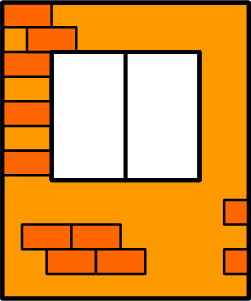

图85是LOD2精度级别模型在夏季外观主题下建筑正面和背面的纹理图集__front_back_summer.png__。该图像的部分区域做为立面纹理材质被分配给对应表面，此相关情况是通过__TextCoordList__对象来定义的。

[[figure-85]]
.图像__front_back_summer.png__是用于表达LOD2级别夏季外观主题建筑正面和背面材质的纹理图集（参见图83.a）（图片来源：Hasso-Plattner-Institute）。
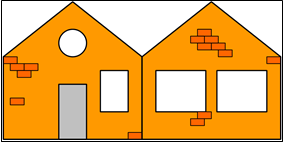

与__front_back_summer.png__相同，纹理图集__front_back_winter.png__包含了冬季主题中 LOD2级别的建筑正面和北面的纹理。

[[figure-86]]
.图像__front_back_winter.png__是用于表达LOD2级别冬季外观主题建筑正面和背面材质的纹理图集（参见图83.b）（图片来源：Hasso-Plattner-Institute）。
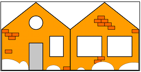

图87和图 88中所示的光栅图像被分配给LOD1和LOD2中建筑物的地形和屋顶表面。在数据集中，这是由链接到相应GML几何对象__GeoreferencedTexture__实现的。图像__ground_summer.png__（参见图87）是表示夏季主题的纹理，而__ground_winter.png__（参见图88）用于冬季主题。

[[figure-87]]
.图像__ground_summer.png__是用于夏季主题中LOD1和LOD2级别建筑物的地形和屋顶表面的纹理贴图（参见图 82 a和图 83 a）（图片来源：Hasso-Plattner-Institute）。
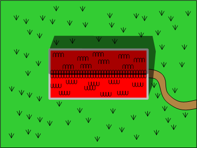

[[figure-88]]
.图像__ground_winter.png__是用于冬季主题中LOD1和LOD2级别建筑物的地形和屋顶表面的纹理贴图（参见图 82 b和图 83 b）（图片来源：Hasso-Plattner-Institute）。
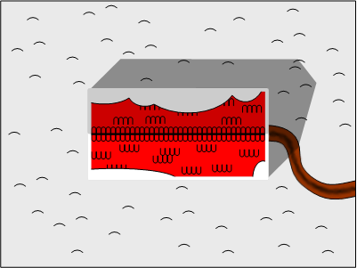

除了如清单9所示通过内部联结__GeoreferencedTexture__元素表示地理参考外，__Appearance__模块还支持使用带有图像文件的纹理映射（例如，使用地理参考TIFF）或提供单独的ESRI世界文件的方法。后者是一个六行文本文件，每行记录一个十进制数。这些数字对应于内联纹理映射的参数，并且可以进行1:1复制（反之亦然）。在ESRI世界文件的第1、3、2和 4 行中提供了由__GeoreferencedTexture__的__orientation__属性（由四个双精度浮点数组成的2x2行优先矩阵）所给出的旋转和缩放参数。__GeoreferencedTexture__对象中的__referencePoint__属性表示的世界空间左上角图像像素的中心位置对应于第5行和第6行。对于清单9中的示例，两个纹理图像的世界文件都包含以下值：

.清单 10：世界文件的内容为 GeoreferencedTexture 指定相同的纹理映射，如清单 9 中所示的内联地理参考所给。
----
0.05
0.0
0.0
-0.05
458870
5438360
----

为了有效地使用这个世界文件，它必须与纹理图像一起存储（文件命名方式请参见 http://en.wikipedia.org/wiki/World_file ）。此外，必须将内联纹理映射从清单9中的两个__GeoreferencedTexture__ 元素中删除，如以下摘录所示。用于表示__GeoreferencedTexture__的地理参考的两种替代方法都可在 http://schemas.opengis.net/citygml/examples/2.0/appearance/ 中找到。

.清单 11：改编的GeoreferencedTexture元素，其纹理映射由清单10中所示的世界文件提供。
[source,xml]
----
…
<app:GeoreferencedTexture>
<app:imageURI>ground_winter.png</app:imageURI>
<app:target>#ground</app:target>
<app:target>#lod1RoofPoly1</app:target>
<app:target>#lod2RoofPoly1</app:target>
<app:target>#lod2RoofPoly2</app:target>
</app:GeoreferencedTexture>
…
----

=== CityGML数据集示例：纹理坐标在含孔洞的复杂曲面中的应用

此案例介绍了纹理坐标在带孔洞的复杂表面的应用方法，并举例说明了覆盖的概念（参见第 9.1 章）。该案例表达了精度为LOD1 并且带有纹理的道路模型，此模型由一个环形交叉路口和两条相接的街道组成（图 89）。该模型包含两个使用了参数化纹理的对象（app:ParameterizedTexture）：一条是标准路段（rd，图 90），另一条是正在铺砌成标准道路的土路（dt，图 91）。所有几何图形都包含在gml:MultiSurface中。环形交叉路口由带孔洞的多边形 (roundaboutPoly)进行建模。交叉路口的外环 raEx 和内环raIn 都需要被赋予纹理坐标。为了有效的贴图，需选择合适的贴图坐标和包裹模式，这样可在容许的纹理扭曲范围内对路段进行贴图。如对模型精度LOD的级别需求更高，则应使用无纹理失真的贴图方法，这种方法需要为环形交叉路口添加额外的路段纹理（图 92）或专门构建可用于完整环形交叉路口的纹理（图 93）。在这两种情况下，模型中使用到的有效纹理小于纹理原文件，从而造成了一定的纹理空间浪费，浪费的区域被标记为红色。

[[figure-89]]
.带有材质的几何图像的渲染图（案例图片来源：Hasso-Plattner-Institute）。
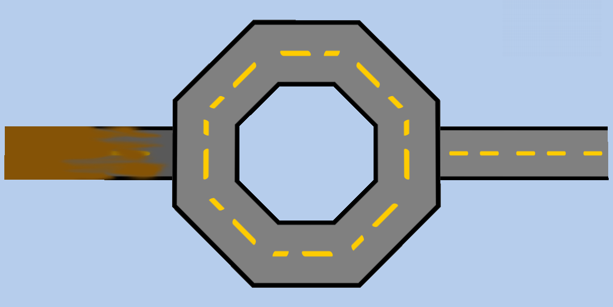

[[figure-90]]
.标准路段贴图纹理。

[[figure-91]]
.土路路段贴图纹理。

[[figure-92]]
.拐弯处路段的无失真贴图纹理。红色区域在模型中不会被显示，属于浪费的纹理。

[[figure-93]]
.完整环路无失真贴图纹理。红色区域在模型中不会被显示，属于浪费的纹理。
image::figures/annex_g/Fig93.png[align="center"]

与环路相接的土路需要使用不同的纹理。即使它的几何体 (dirtPoly)包含于已经有纹理的道路中，现有的纹理也会被覆盖并替换。只有当需要给已有纹理的几何对象集合中的某个对象赋予新的纹理材质时，才会发生覆盖。对同一个表面几何对象直接赋予两个纹理是不允许的。这个规定同样适用于材质。

.清单 12：CityGML数据集，说明了纹理坐标在带孔洞的复杂表面上的使用。 数据集在图 89 中可视化。
[source,xml]
----
<?xml version="1.0" encoding="utf-8"?>
<CityModel xmlns="http://www.opengis.net/citygml/2.0" xmlns:app="http://www.opengis.net/citygml/appearance/2.0" xmlns:tran="http://www.opengis.net/citygml/transportation/2.0" xmlns:gml="http://www.opengis.net/gml"
xmlns:xlink="http://www.w3.org/1999/xlink" xmlns:xsi="http://www.w3.org/2001/XMLSchema-instance" xsi:schemaLocation="http://www.opengis.net/citygml/appearance/2.0 http://schemas.opengis.net/citygml/appearance/2.0/appearance.xsd
http://www.opengis.net/citygml/transportation/2.0 http://schemas.opengis.net/citygml/transportation/2.0/transportation.xsd">
<gml:boundedBy>
<!--The srsName attribute references a local engineering CRS that is defined in the example dataset provided in annex G.9 -->
<gml:Envelope srsDimension="3" srsName="local-CRS-1">
<gml:lowerCorner>-45.0 -20.0 0.0</gml:lowerCorner>
<gml:upperCorner>45.0 20.0 10.0</gml:upperCorner>
</gml:Envelope>
</gml:boundedBy>
<cityObjectMember>
<tran:Road>
<app:appearance>
<app:Appearance>
<app:theme>visual</app:theme>
<app:surfaceDataMember>
<app:ParameterizedTexture gml:id="rd">
<app:imageURI>rd.png</app:imageURI>
<app:wrapMode>mirror</app:wrapMode>
<app:target uri="#road">
<app:TexCoordList>
<app:textureCoordinates ring="#raEx"> 0 1 1 1 0 1 1 1 0 1 1 1 0 1 1 1 0 1 </app:textureCoordinates>
<app:textureCoordinates ring="#raIn"> 0 0 1 0 0 0 1 0 0 0 1 0 0 0 1 0 0 0 </app:textureCoordinates>
<app:textureCoordinates ring="#roadEx"> 0 0 2.5 0 2.5 1 0 1 0 0 </app:textureCoordinates>
<app:textureCoordinates ring="#dirtEx"> 0 0 2.5 0 2.5 1 0 1 0 0 </app:textureCoordinates>
</app:TexCoordList>
</app:target>
</app:ParameterizedTexture>
</app:surfaceDataMember>
<app:surfaceDataMember>
<app:ParameterizedTexture gml:id="dt">
<app:imageURI>dt.png</app:imageURI>
<app:wrapMode>mirror</app:wrapMode>
<app:target uri="#dirtPoly">
<app:TexCoordList>
<app:textureCoordinates ring="#dirtEx"> 0 0 1 0 1 1 0 1 0 0 </app:textureCoordinates>
</app:TexCoordList>
</app:target>
</app:ParameterizedTexture>
</app:surfaceDataMember>
</app:Appearance>
</app:appearance>
<tran:lod1MultiSurface>
<gml:MultiSurface gml:id="road">
<gml:surfaceMember>
<gml:Polygon gml:id="roundaboutPoly">
 
<gml:exterior>
<gml:LinearRing gml:id="raEx">
<gml:posList srsDimension="3"> -8 20 5 -20 8 5 -20 -8 5 -8 -20 5 8 -20 5 20 -8 5 20 8 5 8 20 5
-8 20 5 </gml:posList>
</gml:LinearRing>
</gml:exterior>
<gml:interior>
<gml:LinearRing gml:id="raIn">
<gml:posList srsDimension="3"> -4 10 5 4 10 5 10 4 5 10 -4 5 4 -10 5 -4 -10 5 -10 -4 5 -10 4 5
-4 10 5 </gml:posList>
</gml:LinearRing>
</gml:interior>
</gml:Polygon>
</gml:surfaceMember>
<gml:surfaceMember>
<gml:Polygon gml:id="roadPoly">
<gml:exterior>
<gml:LinearRing gml:id="roadEx">
<gml:posList srsDimension="3"> 20 -4 5 45 -4 5 45 4 5 20 4 5 20 -4 5 </gml:posList>
</gml:LinearRing>
</gml:exterior>
</gml:Polygon>
</gml:surfaceMember>
<gml:surfaceMember>
<gml:Polygon gml:id="dirtPoly">
<gml:exterior>
<gml:LinearRing gml:id="dirtEx">
<gml:posList srsDimension="3"> -20 -4 5 -45 -4 5 -45 4 5 -20 4 5 -20 -4 5 </gml:posList>
</gml:LinearRing>
</gml:exterior>
</gml:Polygon>
</gml:surfaceMember>
</gml:MultiSurface>
</tran:lod1MultiSurface>
</tran:Road>
</cityObjectMember>
</CityModel>
----

=== CityGML数据集示例：局部坐标参考系的应用

以下数据集演示了如何在CityGML中使用本地工程坐标系。数据集基于附录G.2中给出的LOD1示例。利用__CityModel__的__gml:metaDataProperty__对本地CRS进行定义，可用该功能三维坐标系进行描述。该原点对应于参考地球表面的锚定点（这里：在德国），该锚定点可在使用本地CRS的__EngineeringDatum__中进行定义。该CRS坐标系为组合的投影坐标系，其中ETRS89 / UTM zone 32N; EPSG code 25832坐标系用于平面测量，DHHN92 height, EPSG code 5783用于高度参考。__CityModel__的__gml:Envelope__，通过__gml:id“local-CRS-1”__引用本地CRS，因此__gml:Envelope__继承了__CityModel__所有属性中的几何体和特征。如果有需要，也可以使用__CityModel__的成员参照系对进行覆盖，例如，为每个城市对象提供单独的定位点。

.清单 13：说明本地坐标参考系统使用的 CityGML 数据集。 数据集在第 272 页的图 76 中进行了可视化。
[source,xml]
----
<?xml version="1.0" encoding="utf-8"?>
<CityModel xmlns:xsi="http://www.w3.org/2001/XMLSchema-instance" xmlns="http://www.opengis.net/citygml/2.0" xmlns:xAL="urn:oasis:names:tc:ciq:xsdschema:xAL:2.0" xmlns:xlink="http://www.w3.org/1999/xlink" xmlns:gml="http://www.opengis.net/gml" xmlns:dem="http://www.opengis.net/citygml/relief/2.0" xmlns:bldg="http://www.opengis.net/citygml/building/2.0"
xsi:schemaLocation="http://www.opengis.net/citygml/building/2.0 http://schemas.opengis.net/citygml/building/2.0/building.xsd http://www.opengis.net/citygml/relief/2.0 http://schemas.opengis.net/citygml/relief/2.0/relief.xsd ">
<gml:metaDataProperty>
<!-- Local EngineeringCRS definition contained specified inline as metadata in this XML instance. -->
<!-- This CRS is referenced by geometry throughtout this instance by srsName value #local-CRS-1 -->
<gml:EngineeringCRS xmlns:metadata="urn:x-ogp:spec:schema-xsd:localmetadata" gml:id="local-CRS-1">
<gml:metaDataProperty>
<metadata:CommonMetaData>
<metadata:type>engineering</metadata:type>
</metadata:CommonMetaData>
</gml:metaDataProperty>
<gml:srsName codeSpace="XYZ">urn:ogc:def:crs:local:CRS:1</gml:srsName>
<gml:scope>CityGML</gml:scope>
<gml:usesCS>
<gml:CartesianCS gml:id="local-CS-1">
<gml:metaDataProperty>
<metadata:CommonMetaData>
<metadata:type>Cartesian</metadata:type>
<metadata:description>Cartesian 3D CS. Axes: UoM: m.</metadata:description>
</metadata:CommonMetaData>
</gml:metaDataProperty>
<gml:csName codeSpace="XYZ">urn:ogc:def:crs:local:CS:1</gml:csName>
<gml:usesAxis>
<gml:CoordinateSystemAxis gml:id="local-axis-1" gml:uom="urn:ogc:def:uom:EPSG::9001">
<gml:name/>
<gml:axisID>
<gml:name>X</gml:name>
</gml:axisID>
<gml:axisAbbrev>x</gml:axisAbbrev>
<gml:axisDirection codeSpace="XYZ">X</gml:axisDirection>
</gml:CoordinateSystemAxis>
</gml:usesAxis>
<gml:usesAxis>
<gml:CoordinateSystemAxis gml:id="local-axis-2" gml:uom="urn:ogc:def:uom:EPSG::9001">
<gml:name/>
<gml:axisID>
<gml:name>Y</gml:name>
</gml:axisID>
<gml:axisAbbrev>y</gml:axisAbbrev>
<gml:axisDirection codeSpace="XYZ">Y</gml:axisDirection>
</gml:CoordinateSystemAxis>
</gml:usesAxis> 
<gml:usesAxis>
<gml:CoordinateSystemAxis gml:id="local-axis-3" gml:uom="urn:ogc:def:uom:EPSG::9001">
<gml:name/>
<gml:axisID>
<gml:name>Z</gml:name>
</gml:axisID>
<gml:axisAbbrev>z</gml:axisAbbrev>
<gml:axisDirection codeSpace="XYZ">Z</gml:axisDirection>
</gml:CoordinateSystemAxis>
</gml:usesAxis>
</gml:CartesianCS>
</gml:usesCS>
<gml:usesEngineeringDatum>
<gml:EngineeringDatum gml:id="local-datum-1">
<gml:metaDataProperty>
<metadata:CommonMetaData>
<metadata:type>Cartesian datum</metadata:type>
</metadata:CommonMetaData>
</gml:metaDataProperty>
<gml:datumName codeSpace="XYZ">Datum1</gml:datumName>
<gml:anchorPoint codeSpace="urn:ogc:def:crs,crs:EPSG::25832,crs:EPSG::5783">
458868.0 5438343.0 112.0</gml:anchorPoint>
<!-- The anchor point defines the origin of the local CS with respect to the world CRS -->
<!-- In this example, the anchor point references a point on the earth (in Germany) using a compound CRS -->
<!-- For planimetry, the reference system ETRS89 / UTM zone 32N (EPSG code 25832) is used -->
<!-- The vertical reference system is DHHN92 height (EPSG code 5783) -->
</gml:EngineeringDatum>
</gml:usesEngineeringDatum>
</gml:EngineeringCRS>
</gml:metaDataProperty>
<gml:description>Simple example for a CityGML dataset using a local engineering CRS</gml:description>
<gml:name>Simple 3D city model LOD1 without Appearance</gml:name>
<gml:boundedBy>
<gml:Envelope srsName="#local-CRS-1">
<!-- Encoding of local-CRS-1 is specified in CityModel metadataProperty in this document-->
<gml:pos srsDimension="3">0.0 0.0 0.0</gml:pos>
<gml:pos srsDimension="3">24.0 19.0 4.0</gml:pos>
</gml:Envelope>
</gml:boundedBy>
<cityObjectMember>
<bldg:Building gml:id="GML_7b1a5a6f-ddad-4c3d-a507-3eb9ee0a8e68">
<gml:name>Example Building LOD1 </gml:name>
…   (Attributes see example LOD1)
<bldg:lod1Solid>
<gml:Solid>
<gml:exterior>
<gml:CompositeSurface gml:id="lod1Surface">
<!-- Face Side 1 -->
<gml:surfaceMember>
<gml:Polygon>
<gml:exterior>
<gml:LinearRing>
<gml:posList>7.0 7.0 0.0 17.0 7.0 0.0 17.0 7.0 4.0 7.0 7.0 4.0 7.0 7.0 0.0</gml:posList>
</gml:LinearRing>
</gml:exterior>
</gml:Polygon>
</gml:surfaceMember>
<!-- Face Side 2 -->
<gml:surfaceMember>
<gml:Polygon>
<gml:exterior>
<gml:LinearRing>
<gml:posList>17.0 7.0 0.0 17.0 12.0 0.0 17.0 12.0 4.0 17.0 7.0 4.0 17.0 7.0 0.0</gml:posList>
</gml:LinearRing>
</gml:exterior>
</gml:Polygon>
</gml:surfaceMember>
<!-- Face Side 3 -->
<gml:surfaceMember>
<gml:Polygon>
<gml:exterior>
<gml:LinearRing>
<gml:posList>17.0 12.0 0.0 7.0 12.0 0.0 7.0 12.0 4.0 17.0 12.0 4.0 17.0 12.0 0.0</gml:posList>
</gml:LinearRing>
</gml:exterior>
</gml:Polygon>
</gml:surfaceMember>
<!-- Face Side 4 -->
<gml:surfaceMember>
<gml:Polygon>
<gml:exterior>
<gml:LinearRing>
<gml:posList>7.0 12.0 0.0 7.0 7.0 0.0 7.0 7.0 4.0 7.0 12.0 4.0 7.0 12.0 0.0</gml:posList>
</gml:LinearRing>
</gml:exterior>
</gml:Polygon>
</gml:surfaceMember>
<!-- Face Top -->
<gml:surfaceMember>
<gml:Polygon>
<gml:exterior>
<gml:LinearRing>
<gml:posList>7.0 7.0 4.0 17.0 7.0 4.0 17.0 12.0 4.0 7.0 12.0 4.0 7.0 7.0 4.0</gml:posList>
</gml:LinearRing>
</gml:exterior>
</gml:Polygon>
</gml:surfaceMember>
<!-- Face Bottom -->
<gml:surfaceMember>
<gml:Polygon>
<gml:exterior>
<gml:LinearRing>
<gml:posList>7.0 7.0 0.0 7.0 12.0 0.0 17.0 12.0 0.0 17.0 7.0 0.0 7.0 7.0 0.0</gml:posList>
</gml:LinearRing>
</gml:exterior>
</gml:Polygon>
</gml:surfaceMember>
</gml:CompositeSurface>
</gml:exterior>
</gml:Solid>
</bldg:lod1Solid>
<bldg:address>
<Address>
…
</Address>
</bldg:address>
</bldg:Building>
</cityObjectMember>
<cityObjectMember>
<dem:ReliefFeature gml:id="GML_6bb30328-7599-4500-90ef-766fde6aa67b">
<gml:name>Example TIN LOD1</gml:name>
<dem:lod>1</dem:lod>
<dem:reliefComponent>
<dem:TINRelief gml:id="GUID_04D4DsNGv1MfvYu5O3lkcW">
<gml:name>Ground</gml:name>
<dem:lod>1</dem:lod>
<dem:tin>
<gml:TriangulatedSurface gml:id="ground">
<gml:trianglePatches>
<gml:Triangle>
<gml:exterior>
<gml:LinearRing>
<gml:posList>0.0 19.0 0.0 7.0 12.0 0.0 15.0 19.0 2.0 0.0 19.0 0.0</gml:posList>
</gml:LinearRing>
</gml:exterior>
</gml:Triangle>
<gml:Triangle>
…
 
</gml:Triangle>
… (more triangles)
</gml:trianglePatches>
</gml:TriangulatedSurface>
</dem:tin>
</dem:TINRelief>
</dem:reliefComponent>
</dem:ReliefFeature>
</cityObjectMember>
</CityModel>
----
