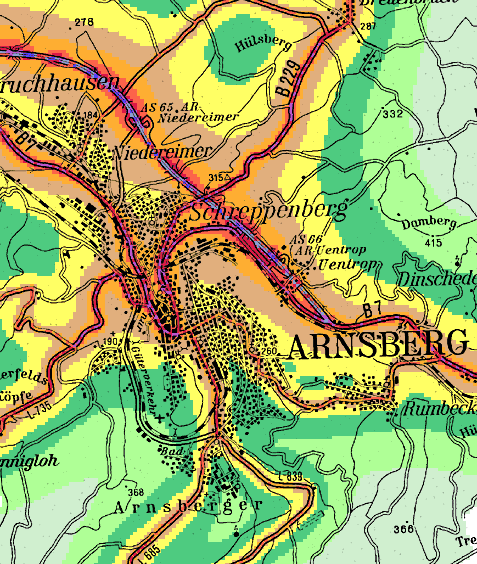
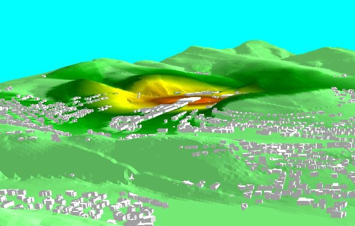
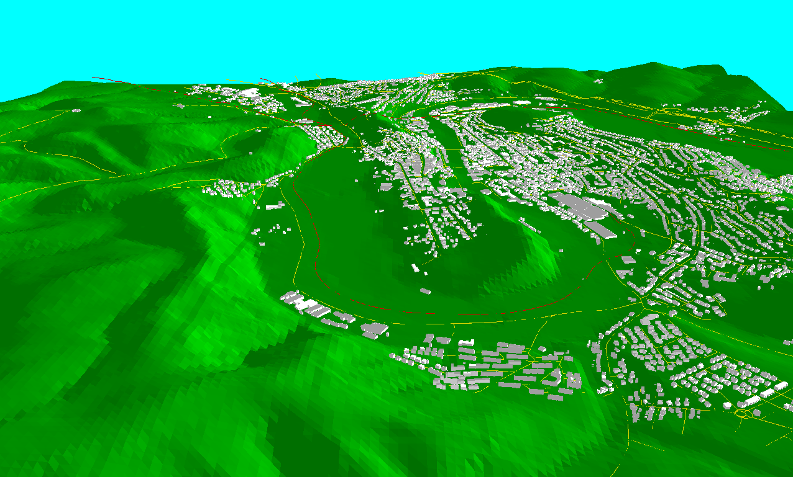
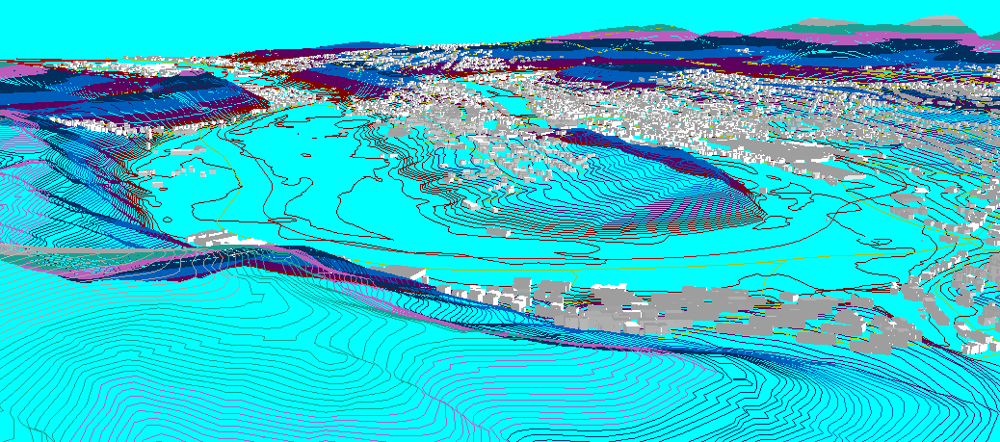
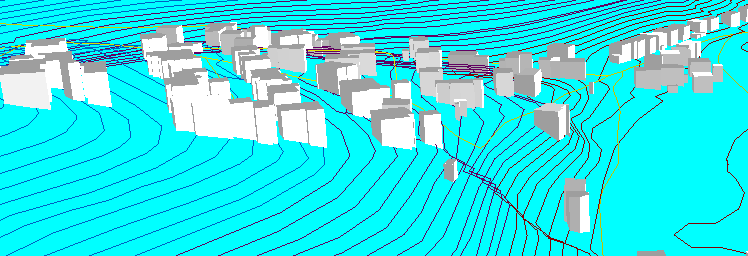
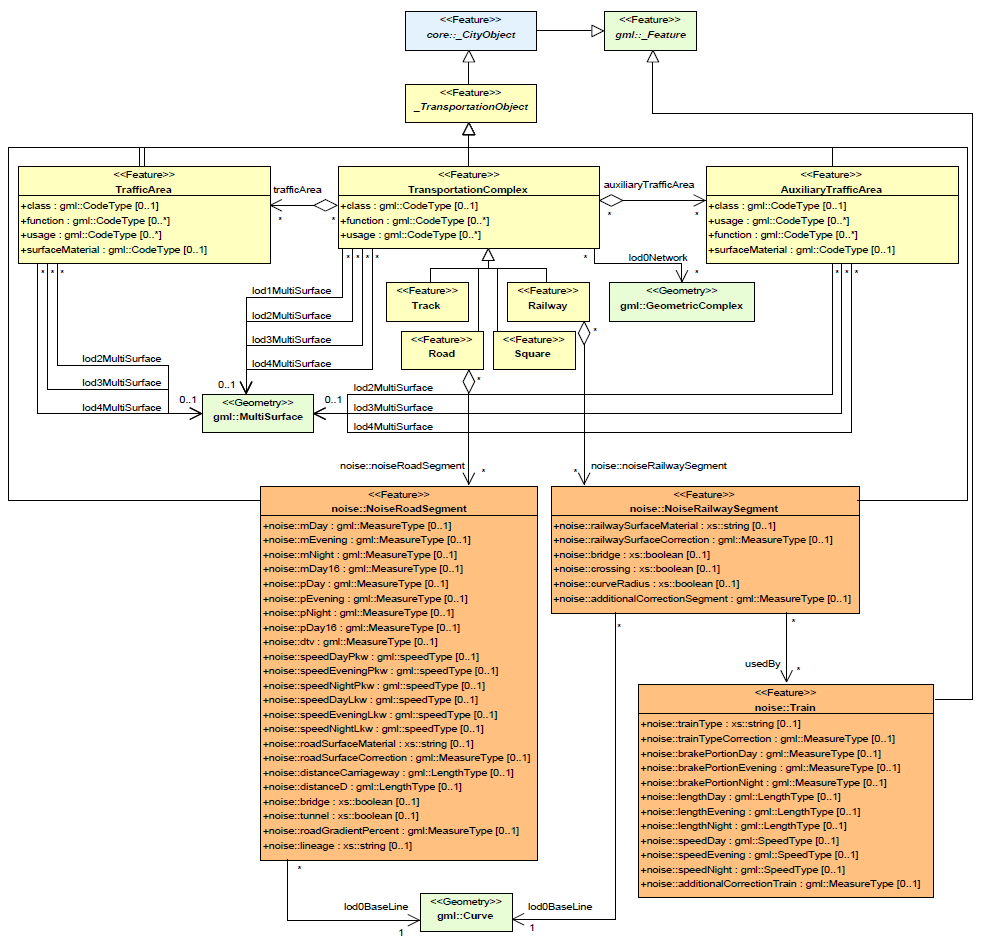
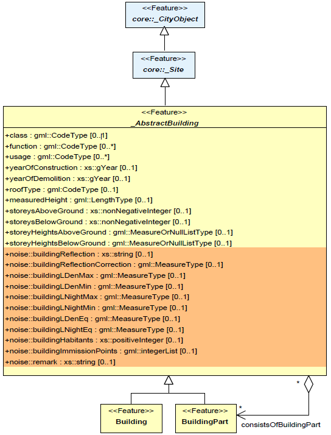
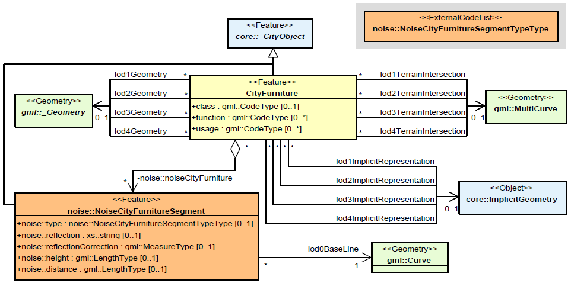

[appendix]
:appendix-caption: Annex
== （资料性附录）ADE在噪声干扰模拟中的应用示例

本附件介绍了如何在环境模拟应用程序中使用CityGML。相应的应用领域扩展 (ADE) 的定义包含在示例中。

欧盟环境噪声指令（2002/49/EG）要求欧盟成员国每5年计算一次建筑物4m高度处的噪声，并将结果记录在噪声图中。噪声图可为欧盟和受噪声影响的公民提供相关信息（图 94）。这些噪声图是基于声学模型和噪声传播计算得到的，并不是实际测量结果（图 95）。对于噪声传播计算，每个欧盟成员国都需要大量的专题数据和三维地理数据。由于需要进行噪声计算的空间范围很大，且大部分用户对数据颗粒度要求较高，因此为众多用户提供全域建筑物、道路、铁路和地形的三维地理数据是非常必要的。

道路噪音水平的计算需要交通流量、重型车辆占比、道路速度限制、路面类型和道路坡度等相关信息。此外，噪音水平取决于发射点和接收点之间的距离以及反射（例如在建筑物立面上）或屏蔽效果（例如噪声屏障）。噪音水平分别计算白天 (06.00-18.00)、晚上 (18.00-22.00) 和夜间 (22.00-06.00)三个时间段。由于噪音水平是在4m高度计算的，并且考虑到垂直反射面的影响（例如隔音屏障和建筑物），因此需要大量的三维地理数据。除了所有 三维地理数据之外，还需要特定的专题数据。例如，道路噪声计算还需要以下数据：10m网格的数字地形模型、具有主题属性（例如反射、居民）的三维建筑模型、具有主题属性（例如交通流量、重型车辆百分比）的三维道路数据、速度限制、路面类型、道路坡度、道路宽度）、三维隔音屏障及其主题属性（例如反射）。

[[figure-94]]
.图像__ground_winter.png__是用于冬季主题中LOD1和LOD2精度级别建筑物的地形和屋顶表面的纹理贴图（参见图 82 b和图 83 b）（图片来源：Hasso-Plattner-Institute）。

[[figure-95]]
.在生成图 94 中的噪声图之前，第一步需使用噪声计算软件基于三维CityGML地理数据对噪声发射源进行建模（来源：Surveying and Mapping Agency NRW, Stapelfeldt GmbH, Institute of Geodesy and Geoinfor-mation Uni Bonn）。

在北莱茵-威斯特法伦州，必须考虑一种特殊情况：由于该区域人口和交通路线密度高，因此是德国噪声计算区域最大和对象数量最多的地区。该项目的目的是为5年迭代周期和不同的噪声计算机构提供可持续、高效、多源的三维地理数据。

为了提供如此大量的全域三维地理数据，该项目的责任方，特别是北莱茵-威斯特法伦州环境、自然保护、农业和消费者保护部、北莱茵州自然、环境和消费者保护局-威斯特法伦州和北莱茵-威斯特法伦州测绘局决定使用北莱茵-威斯特法伦州的空间数据基础设施 (GDI NRW)，并将其扩展为全域范围的2.5D和3D地理信息网络服务。因此，实施了用于建筑模型、地形、道路和铁路数据的新OGC Web服务（例如，用于LOD1中的三维体块模型、三维道路和铁路数据的网页特征服务，以及用于DTM的网页覆盖服务）。

[[figure-96]]
.CityGML中的三维地理数据，用于计算图94中的噪声图：GeoTiff 中的DTM、CityGML 中的三维体块模型、CityGML 中的三维道路和铁路数据、CityGML 中更高级别道路的州道数据（来源：Surveying and Mapping Agency NRW, State Road Enterprice NRW, Stapelfeldt GmbH, Institute of Geodesy and Geoinformation Uni Bonn）。

CityGML与GeoTIFF一起用作网络服务和噪声计算软件之间的唯一交换格式（图 96 -图 98）。针对噪声指令的特殊要求，波恩大地测量和地理信息大学研究所和GDI NRW的特别兴趣小组SIG 3D共同开发了CityGML噪声应用模式。它基于 ADE 机制（参见第6.12和10.13章）。这种机制允许通过主题属性补充CityGML中现有的类和对象（例如建筑物）。这些属性的数量和类型是可选择的。CityGML模式还可以通过新类进行补充。因此，噪声应用模式包含新对象（例如根据噪声要求分割道路 - __NoiseRoadSegment__，图 99）以及附加到现有对象的噪声属性（例如建筑物的反射，图 100）。这些额外的噪声属性源自德国联邦政府为履行欧盟环境噪声指令而颁布的法规（参见 BImSchV 2006、VBUS 2006、VBUSch 2006）。

该项目的交互技术展示了一项重要的创新，因为这是第一次通过通用标准和网络服务提供全域范围的三维地理数据（参见 Czerwinski 等人，2006b）。因此，北莱茵-威斯特法伦州用于噪声计算的空间数据基础设施为欧盟2007/2/EC欧洲空间信息基础设施）的 INSPIRE指令提供了一个应用示例（参见 Czerwinski 等人，2007 年）。

[[figure-97]]
.CityGML中的三维地理数据，用于计算图94中的噪声图：用于生成CityGML隔断线的等高线、CityGML 中的三维体块模型、CityGML 中的三维公路和铁路数据和CityGML中更高级别道路的数据（来源：Surveying and Mapping Agency NRW, State Road Enterprise NRW, Stapelfeldt GmbH, Institute of Geodesy and Geoinformation Uni Bonn)。

[[figure-98]]
.此图为截取图97局部后放大的图，表明如何通过适当的CityGML建模将三维体块模型集成到DTM中（以ALK建筑物多边形的最低点作为生成建筑物底部的基准点）（来源：Surveying and Mapping Agency NRW, Stapelfeldt GmbH, Institute of Geodesy and Geoinformation Uni Bonn)。

=== CityGML噪声应用领域扩展

在本节中，CityGML噪声应用领域扩展的数据模型以UML图和XML模式给出。由于特定属性和对象类型的语义来源于德国关于噪声模拟计算的规定，因此这里不对其进行详细解释（参见BimSchV 2006、VBUS 2006、VBUSch 2006）。本节的目的是提供一个使用应用领域扩展机制扩展CityGML的示例。CityGML噪声应用领域扩展的XML模式定义，及示例数据集，可以从 http://schemas.opengis.net/citygml/examples/2.0/ade/noise-ade/ 获得。

[[figure-99]]
.CityGML噪声应用模式——交通模型（浅黄色=CityGML交通模块，浅橙色=CityGML噪声应用程序扩展）。前缀被用于指示与模型元素相关联的XML命名空间。没有前缀的元素名称在CityGML交通模块中定义。CityGML噪声应用程序扩展带有前缀“noise”（来源：波恩大学大地测量和地理信息研究所）。

[[figure-100]]
.CityGML噪声应用模式——建筑模型的摘录（浅黄色=CityGML建筑模块，浅橙色=CityGML噪声应用程序扩展)。前缀用于指示与模型元素关联的XML命名空间。不带前缀的元素名称在CityGML建筑模块中定义。CityGML噪声应用程序扩展带有前缀“noise”（来源：波恩大学大地测量和地理信息研究所）。

[[figure-101]]
.CityGML噪声应用模式——城市家具模型（浅黄色=CityGML城市家具模块，浅橙色=CityGML噪声应用程序扩展)。前缀用于指示与模型元素关联的XML命名空间。没有前缀的元素名称在CityGML的城市家具模块中定义。CityGML噪声应用程序扩展带有前缀“noise”（来源：波恩大学大地测量和地理信息研究所）。

*噪声应用程序扩展模式定义文件的表头*

[source,xml]
----

<?xml version="1.0" encoding="UTF-8"?>
<xsd:schema xmlns="http://www.citygml.org/ade/noise_de/2.0" xmlns:gml="http://www.opengis.net/gml" xmlns:core="http://www.opengis.net/citygml/2.0" xmlns:bldg="http://www.opengis.net/citygml/building/2.0" xmlns:frn="http://www.opengis.net/citygml/cityfurniture/2.0" xmlns:tran="http://www.opengis.net/citygml/transportation/2.0"
xmlns:xsd="http://www.w3.org/2001/XMLSchema"targetNamespace="http://www.citygml.org/ade/noise_de/2.0" elementFormDefault="qualified" attributeFormDefault="unqualified">
<xsd:import namespace="http://www.opengis.net/gml" schemaLocation="http://schemas.opengis.net/gml/3.1.1/base/gml.xsd"/>
<xsd:import namespace="http://www.opengis.net/citygml/2.0" schemaLocation="http://schemas.opengis.net/citygml/2.0/cityGMLBase.xsd"/>
<xsd:import namespace="http://www.opengis.net/citygml/transportation/2.0" schemaLocation="http://schemas.opengis.net/citygml/transportation/2.0/transportation.xsd"/>
<xsd:import namespace="http://www.opengis.net/citygml/building/2.0" schemaLocation="http://schemas.opengis.net/citygml/building/2.0/building.xsd"/>
<xsd:import namespace="http://www.opengis.net/citygml/cityfurniture/2.0" schemaLocation="http://schemas.opengis.net/citygml/cityfurniture/2.0/cityFurniture.xsd"/>
…
</xsd:schema>

----

*NoiseCityFurnitureSegmentTypeType,NoiseCityFurnitureSegment*

[source,xml]
----

<xsd:element name="noiseCityFurnitureSegmentProperty" type="NoiseCityFurnitureSegmentPropertyType" substitutionGroup="frn:_GenericApplicationPropertyOfCityFurniture"/>
<!-- ============================================================================================ -->
<xsd:complexType name="NoiseCityFurnitureSegmentPropertyType">
<xsd:sequence minOccurs="0">
<xsd:element ref="NoiseCityFurnitureSegment" minOccurs="0"/>
</xsd:sequence>
<xsd:attributeGroup ref="gml:AssociationAttributeGroup"/>
</xsd:complexType>
<!-- ============================================================================================ -->
<xsd:complexType name="NoiseCityFurnitureSegmentType">
<xsd:complexContent>
<xsd:extension base="core:AbstractCityObjectType">
<xsd:sequence>
<xsd:element name="type" type="gml:CodeType" minOccurs="0"/>
<xsd:element name="reflection" type="xsd:string" minOccurs="0"/>
<xsd:element name="reflectionCorrection" type="gml:MeasureType" minOccurs="0"/>
<xsd:element name="height" type="gml:LengthType" minOccurs="0"/>
<xsd:element name="distance" type="gml:LengthType" minOccurs="0"/>
<xsd:element name="lod0BaseLine" type="gml:CurvePropertyType"/>
</xsd:sequence>
</xsd:extension>
</xsd:complexContent>
</xsd:complexType>
<!-- ============================================================================================ -->
<xsd:element name="NoiseCityFurnitureSegment" type="NoiseCityFurnitureSegmentType" substitutionGroup="core:_CityObject"/>

----

*NoiseRoadSegmentType, NoiseRoadSegment*

[source,xml]
----

<xsd:element name="noiseRoadSegmentProperty" type="NoiseRoadSegmentPropertyType" substitutionGroup="tran:_GenericApplicationPropertyOfRoad"/>
<!-- ============================================================================================ -->
<xsd:complexType name="NoiseRoadSegmentPropertyType">
<xsd:sequence minOccurs="0">
<xsd:element ref="NoiseRoadSegment"/>
</xsd:sequence>
<xsd:attributeGroup ref="gml:AssociationAttributeGroup"/>
</xsd:complexType>
<!-- ============================================================================================ -->
<xsd:complexType name="NoiseRoadSegmentType">
<xsd:complexContent>
<xsd:extension base="tran:AbstractTransportationObjectType">
<xsd:sequence>
<xsd:element name="mDay" type="gml:MeasureType" minOccurs="0"/>
<xsd:element name="mEvening" type="gml:MeasureType" minOccurs="0"/>
<xsd:element name="mNight" type="gml:MeasureType" minOccurs="0"/>
<xsd:element name="mDay16" type="gml:MeasureType" minOccurs="0"/>
<xsd:element name="pDay" type="gml:MeasureType" minOccurs="0"/>
<xsd:element name="pEvening" type="gml:MeasureType" minOccurs="0"/>
<xsd:element name="pNight" type="gml:MeasureType" minOccurs="0"/>
<xsd:element name="pDay16" type="gml:MeasureType" minOccurs="0"/>
<xsd:element name="dtv" type="gml:MeasureType" minOccurs="0"/>
<xsd:element name="speedDayPkw" type="gml:SpeedType" minOccurs="0"/>
<xsd:element name="speedEveningPkw" type="gml:SpeedType" minOccurs="0"/>
<xsd:element name="speedNightPkw" type="gml:SpeedType" minOccurs="0"/>
<xsd:element name="speedDayLkw" type="gml:SpeedType" minOccurs="0"/>
<xsd:element name="speedEveningLkw" type="gml:SpeedType" minOccurs="0"/>
<xsd:element name="speedNightLkw" type="gml:SpeedType" minOccurs="0"/>
<xsd:element name="roadSurfaceMaterial" type="xsd:string" minOccurs="0"/>
<xsd:element name="roadSurfaceCorrection" type="gml:MeasureType" minOccurs="0"/>
<xsd:element name="distanceCarriageway" type="gml:LengthType" minOccurs="0"/>
<xsd:element name="distanceD" type="gml:LengthType" minOccurs="0"/>
<xsd:element name="bridge" type="xsd:boolean" minOccurs="0"/>
<xsd:element name="tunnel" type="xsd:boolean" minOccurs="0"/>
<xsd:element name="roadGradientPercent" type="gml:MeasureType" minOccurs="0"/>
<xsd:element name="lod0BaseLine" type="gml:CurvePropertyType"/>
<xsd:element name="lineage" type="xsd:string" minOccurs="0"/>
</xsd:sequence>
</xsd:extension>
</xsd:complexContent>
</xsd:complexType>
<!-- ============================================================================================ -->
<xsd:element name="NoiseRoadSegment" type="NoiseRoadSegmentType" substitutionGroup="core:_CityObject"/>

----

*NoiseRailwaySegmentType,NoiseRailwaySegment*

[source,xml]
----

<xsd:complexType name="NoiseRailwaySegmentPropertyType">
<xsd:sequence minOccurs="0">
<xsd:element ref="NoiseRailwaySegment"/>
</xsd:sequence>
<xsd:attributeGroup ref="gml:AssociationAttributeGroup"/>
</xsd:complexType>
<!-- ============================================================================================ -->
<xsd:complexType name="NoiseRailwaySegmentType">
<xsd:complexContent>
<xsd:extension base="tran:AbstractTransportationObjectType">
<xsd:sequence>
<xsd:element name="railwaySurfaceMaterial" type="xsd:string" minOccurs="0"/>
<xsd:element name="railwaySurfaceCorrection" type="gml:MeasureType" minOccurs="0"/>
<xsd:element name="bridge" type="xsd:boolean" minOccurs="0"/>
<xsd:element name="crossing" type="xsd:boolean" minOccurs="0"/>
<xsd:element name="curveRadius" type="gml:LengthType" minOccurs="0"/>
<xsd:element name="additionalCorrectionSegment" type="gml:MeasureType" minOccurs="0"/>
<xsd:element name="lod0BaseLine" type="gml:CurvePropertyType"/>
<xsd:element name="usedBy" type="TrainPropertyType" minOccurs="0" maxOccurs="unbounded"/>
</xsd:sequence>
</xsd:extension>
</xsd:complexContent>
</xsd:complexType>
<!-- ============================================================================================ -->
<xsd:element name="NoiseRailwaySegment" type="NoiseRailwaySegmentType" substitutionGroup="core:_CityObject"/>

----

*TrainType, TrainPropertyType*

[source,xml]
----

<xsd:complexType name="TrainPropertyType">
<xsd:sequence>
<xsd:element name="Train" type="TrainType"/>
</xsd:sequence>
<xsd:attributeGroup ref="gml:AssociationAttributeGroup"/>
</xsd:complexType>
<!-- ============================================================================================ -->
<xsd:complexType name="TrainType">
<xsd:complexContent>
<xsd:extension base="gml:AbstractFeatureType">
<xsd:sequence>
<xsd:element name="trainType" type="xsd:string"/>
<xsd:element name="trainTypeCorrection" type="gml:MeasureType" minOccurs="0"/>
<xsd:element name="brakePortionDay" type="gml:MeasureType" minOccurs="0"/>
<xsd:element name="brakePortionEvening" type="gml:MeasureType" minOccurs="0"/>
<xsd:element name="brakePortionNight" type="gml:MeasureType" minOccurs="0"/>
<xsd:element name="lengthDay" type="gml:LengthType" minOccurs="0"/>
<xsd:element name="lengthEvening" type="gml:LengthType" minOccurs="0"/>
<xsd:element name="lengthNight" type="gml:LengthType" minOccurs="0"/>
<xsd:element name="speedDay" type="gml:SpeedType" minOccurs="0"/>
<xsd:element name="speedEvening" type="gml:SpeedType" minOccurs="0"/>
<xsd:element name="speedNight" type="gml:SpeedType" minOccurs="0"/>
<xsd:element name="additionalCorrectionTrain" type="gml:MeasureType" minOccurs="0"/>
</xsd:sequence>
</xsd:extension>
</xsd:complexContent>
</xsd:complexType>

----

*Application specific attributes for _AbstractBuilding*

[source,xml]
----

<xsd:element name="buildingReflection" type="xsd:string" substitutionGroup="bldg:_GenericApplicationPropertyOfAbstractBuilding"/>
<xsd:element name="buildingReflectionCorrection" type="gml:MeasureType" substitutionGroup="bldg:_GenericApplicationPropertyOfAbstractBuilding"/>
<xsd:element name="buildingLDenMax" type="gml:MeasureType" substitutionGroup="bldg:_GenericApplicationPropertyOfAbstractBuilding"/>
<xsd:element name="buildingLDenMin" type="gml:MeasureType" substitutionGroup="bldg:_GenericApplicationPropertyOfAbstractBuilding"/>
<xsd:element name="buildingLDenEq" type="gml:MeasureType" substitutionGroup="bldg:_GenericApplicationPropertyOfAbstractBuilding"/>
<xsd:element name="buildingLNightMax" type="gml:MeasureType" substitutionGroup="bldg:_GenericApplicationPropertyOfAbstractBuilding"/>
<xsd:element name="buildingLNightMin" type="gml:MeasureType" substitutionGroup="bldg:_GenericApplicationPropertyOfAbstractBuilding"/>
<xsd:element name="buildingLNightEq" type="gml:MeasureType" substitutionGroup="bldg:_GenericApplicationPropertyOfAbstractBuilding"/>
<xsd:element name="buildingHabitants" type="xsd:positiveInteger" substitutionGroup="bldg:_GenericApplicationPropertyOfAbstractBuilding"/>
<xsd:element name="buildingAppartments" type="xsd:positiveInteger" substitutionGroup="bldg:_GenericApplicationPropertyOfAbstractBuilding"/>
<xsd:element name="buildingImmissionPoints" type="gml:integerList" substitutionGroup="bldg:_GenericApplicationPropertyOfAbstractBuilding"/>
<xsd:element name="remark" type="xsd:string" substitutionGroup="bldg:_GenericApplicationPropertyOfAbstractBuilding"/>

----

=== 示例数据集

以下数据集阐述了一份使用应用程序噪声模式的CityGML实例文档。它包含两个城市对象（CityObject）要素：道路对象和建筑对象。该数据集引用了CityGML噪声应用程序扩展的XML模式定义文件。该文件特地导入了部分CityGML模块的XML模式定义。这些CityGML模块（包括__CityGML Core__,__Building__,__Transportation__和__CityFurniture__）由噪声应用程序扩展所扩展而来。因此，被采用的CityGML模块所定义的所有类都可以在实例文档中使用。此外，还可以使用应用程序特定的添加项，例如新对象类型（例如__NoiseRoadSegment__），和附加的主题属性（例如为___AbstractBuilding__定义的属性）。这些附加元素与标准CityGML元素的不同之处在于，前者的命名空间的前缀__noise__是指噪声的模式定义。

.列表14：实现所示CityGML噪声应用模式的CityGML数据集

[source,xml]
----
<?xml version="1.0" encoding="ISO-8859-1"?>
<CityModel xmlns="http://www.opengis.net/citygml/2.0" xmlns:tran="http://www.opengis.net/citygml/transportation/2.0" xmlns:bldg="http://www.opengis.net/citygml/building/2.0" xmlns:noise="http://www.citygml.org/ade/noise_de/2.0" xmlns:gml="http://www.opengis.net/gml" xmlns:xlink="http://www.w3.org/1999/xlink"
xmlns:xAL="urn:oasis:names:tc:ciq:xsdschema:xAL:2.0" xmlns:xsi="http://www.w3.org/2001/XMLSchema-instance" xsi:schemaLocation="http://www.citygml.org/ade/noise_de NoiseADE/CityGML-NoiseADE.xsd">
<gml:boundedBy>
<gml:Envelope srsName="urn:ogc:def:crs,crs:EPSG:6.12:31466,crs:EPSG:6.12:5783">
<gml:pos srsDimension="3">5616000.0 2540097.5 54.5</gml:pos>
<gml:pos srsDimension="3">5673522.3 2576495.6 172.9</gml:pos>
</gml:Envelope>
</gml:boundedBy>
<cityObjectMember>
<tran:Road gml:id="CR_0815">
<gml:name>B1</gml:name>
<gml:boundedBy>
<gml:Envelope srsName="urn:ogc:def:crs,crs:EPSG:6.12:31466,crs:EPSG:6.12:5783">
<gml:pos srsDimension="3">5618686.0 2573988.4 158.0</gml:pos>
<gml:pos srsDimension="3">5618705.5 2574049.8 158.2</gml:pos>
</gml:Envelope>
</gml:boundedBy>
<tran:function>B1303</tran:function>
<noise:noiseRoadSegmentProperty>
<noise:NoiseRoadSegment gml:id="CNRS_0815">
<gml:boundedBy>
<gml:Envelope srsName="urn:ogc:def:crs,crs:EPSG:6.12:31466,crs:EPSG:6.12:5783">
<gml:pos srsDimension="3">5618686.0 2573988.4 158.0</gml:pos>
<gml:pos srsDimension="3">5618705.5 2574049.8 158.2</gml:pos>
</gml:Envelope>
</gml:boundedBy>
<noise:mDay uom="kfzph">2564.123</noise:mDay>
<noise:mEvening uom="kfzph">145.123</noise:mEvening>
<noise:mNight uom="kfzph">1231.123</noise:mNight>
<noise:mDay16 uom="kfzph">2010.123</noise:mDay16>
<noise:pDay uom="percent">25.123</noise:pDay>
<noise:pEvening uom="percent">35.123</noise:pEvening>
<noise:pNight uom="percent">45.123</noise:pNight>
<noise:pDay16 uom="percent">30.123</noise:pDay16>
<noise:dtv uom="kfzp24h">20564.123</noise:dtv>
<noise:speedDayPkw uom="kmph">130.123</noise:speedDayPkw>
<noise:speedEveningPkw uom="kmph">100.123</noise:speedEveningPkw>
<noise:speedNightPkw uom="kmph">50.123</noise:speedNightPkw>
<noise:speedDayLkw uom="kmph">80.123</noise:speedDayLkw>
<noise:speedEveningLkw uom="kmph">80.123</noise:speedEveningLkw>
<noise:speedNightLkw uom="kmph">50.123</noise:speedNightLkw>
<noise:roadSurfaceMaterial>Pflaster mit ebener Oberfläche</noise:roadSurfaceMaterial>
<noise:roadSurfaceCorrection uom="dB">2.123</noise:roadSurfaceCorrection>
<noise:distanceCarriageway uom="m">15.123</noise:distanceCarriageway>
<noise:distanceD uom="m">10.123</noise:distanceD>
<noise:bridge>true</noise:bridge>
<noise:tunnel>false</noise:tunnel>
<noise:roadGradientPercent uom="percent">5.245</noise:roadGradientPercent>
<noise:lod0BaseLine>
<gml:LineString srsName="urn:ogc:def:crs,crs:EPSG:6.12:31466,crs:EPSG:6.12:5783" srsDimension="3">
<gml:coordinates decimal="." cs="," ts=" ">5618686.0, 2573988.4,158.200000
5618692.5,2574008.8,158.000000 5618705.5,2574049.8,158.100000</gml:coordinates>
</gml:LineString>
</noise:lod0BaseLine>
<noise:lineage>ATKIS-LVermA</noise:lineage>
</noise:NoiseRoadSegment>
</noise:noiseRoadSegmentProperty>
…
</tran:Road>
</cityObjectMember>
<cityObjectMember>
<bldg:Building gml:id="UUID_ef6e19e3-c412-440b-8ba9-24900aa173b5">
<gml:name>small building</gml:name>
<creationDate>2007-01-04</creationDate>
<bldg:function>1060</bldg:function>
<bldg:measuredHeight uom="m">2.38</bldg:measuredHeight>
<bldg:lod1Solid>
<gml:Solid>
<gml:exterior>
<gml:CompositeSurface>
<gml:surfaceMember>
<gml:Polygon srsName="urn:ogc:def:crs,crs:EPSG:6.12:31466,crs:EPSG:6.12:5783">
<gml:outerBoundaryIs>
<gml:LinearRing>
<gml:coordinates cs="," decimal="." ts=" ">5662497.03,2559357.47,38.2357750703488 5662489.23,2559355.51,38.2357750703488 5662488.178,2559355.247,38.2357750703488
5662489.022,2559351.872,38.2357750703488 5662497.877,2559354.097,38.2357750703488
5662501.43,2559354.99,38.2357750703488 5662500.584,2559358.357,38.2357750703488
5662497.03,2559357.47,38.2357750703488</gml:coordinates>
</gml:LinearRing>
</gml:outerBoundaryIs>
</gml:Polygon>
</gml:surfaceMember>
…
</gml:CompositeSurface> 
</gml:exterior>
</gml:Solid>
</bldg:lod1Solid>
<bldg:address>
<Address>
<xalAddress>
<xAL:AddressDetails>
<xAL:Country>
<xAL:CountryName>Germany</xAL:CountryName>
<xAL:Locality Type="Town">
<xAL:LocalityName>Musterstadt</xAL:LocalityName>
<xAL:Thoroughfare Type="Street">
<xAL:ThoroughfareNumber>1</xAL:ThoroughfareNumber>
<xAL:ThoroughfareName>Musterstrasse</xAL:ThoroughfareName>
</xAL:Thoroughfare>
<xAL:PostalCode>
<xAL:PostalCodeNumber>10000</xAL:PostalCodeNumber>
</xAL:PostalCode>
</xAL:Locality>
</xAL:Country>
</xAL:AddressDetails>
</xalAddress>
</Address>
</bldg:address>
<noise:buildingReflection>Fassade</noise:buildingReflection>
<noise:buildingReflectionCorrection uom="dB">3.23</noise:buildingReflectionCorrection>
<noise:buildingLDenMax uom="dB">10</noise:buildingLDenMax>
<noise:buildingLDenMin uom="dB">30</noise:buildingLDenMin>
<noise:buildingLDenEq uom="dB">20</noise:buildingLDenEq>
<noise:buildingLNightMax uom="dB">40</noise:buildingLNightMax>
<noise:buildingLNightMin uom="dB">60</noise:buildingLNightMin>
<noise:buildingLNightEq uom="dB">50</noise:buildingLNightEq>
<noise:buildingHabitants>32</noise:buildingHabitants>
<noise:buildingAppartments>8</noise:buildingAppartments>
<noise:buildingImmissionPoints>45 1 1 1 50 2 2 2 </noise:buildingImmissionPoints>
</bldg:Building>
</cityObjectMember>
</CityModel>

----