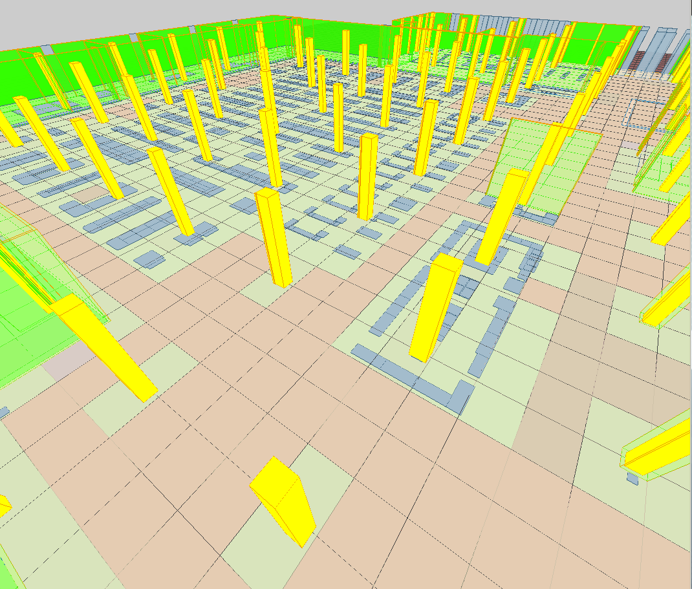
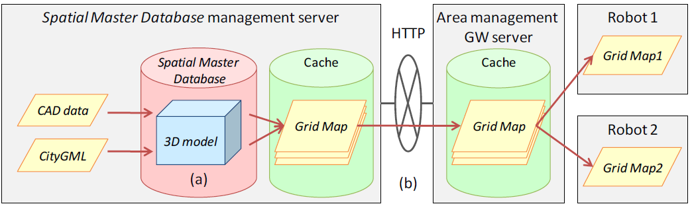
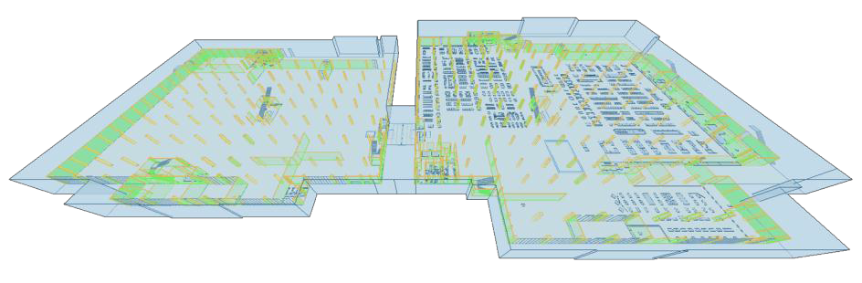
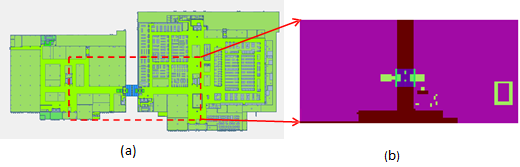
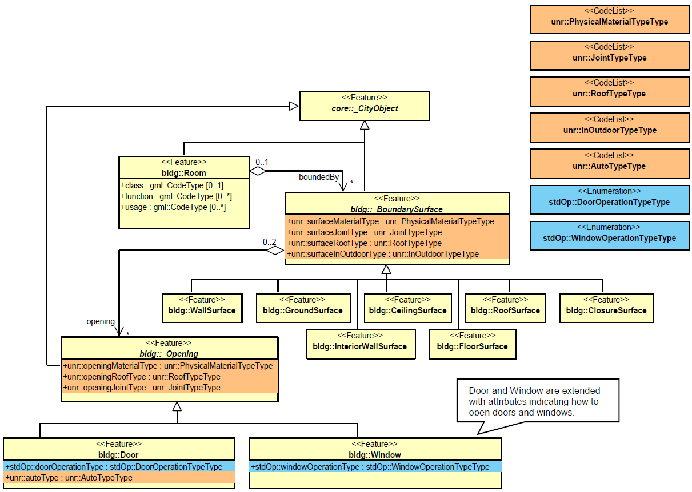
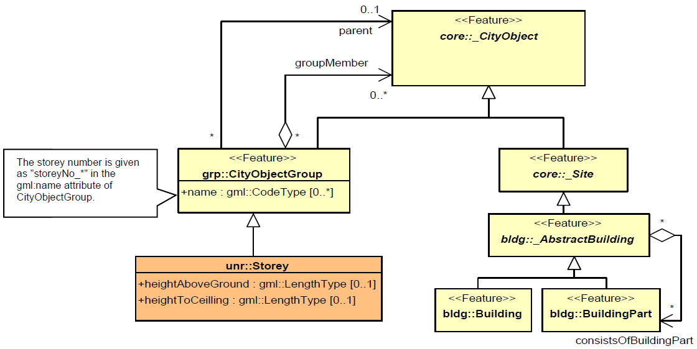

[appendix]
:appendix-caption: Annex
== （资料性附录）ADE在泛在网络机器人服务中的应用示例

本附件说明了CityGML在机器人服务中的使用。以相应的应用领域扩展（ADE）的定义为例。

=== 泛在网络机器人概述

在机器人领域，有一个起源于日本的概念叫网络机器人，其目的是通过连接多个机器人来实现先进机器人服务。目标是超越单个机器人的能力极限。嵌入环境中的传感器和互联网上的代理人，也被广泛视为机器人，推动了通过网络连接机器人的网络机器人技术研发。与单个机器人相比，连接多个机器人提供了更好的认知能力和交互能力，人们认为先进的机器人服务是可以实现的。

在日本，网络机器人论坛成立于2003年，其目标是顺利有效地推进网络机器人的研发及其标准化。有大约150个成员，包括机械制造商、电子制造商、电信运营商、研究机构、学术专家、经济组织和地方政府。他们从事网络机器人的研究、推广、开发和标准化等活动。

在国家层面，日本内务省自2009年起开始“面向老年人和残疾人的泛在网络机器人技术（UNR）研发”，日本的泛在网络机器人研发工作正在全面展开。

在泛在网络机器人的研究与开发项目中，网络机器人服务从单点扩展到多点是一个值得考虑的问题。为了扩展网络机器人的活动范围，提供各种机器人服务，需要有一个框架来控制周围环境信息作为空间属性，并以机器人能够理解的方式提供服务。 在这些研究和开发项目中，控制网络机器人空间属性的数据库称为空间主数据库。基于机器人在建筑物内外移动的假设，在空间主数据库中使用了CityGML模型，该模型能够提供室内外特征的表示。然而，移动机器人还是缺乏必要的信息，例如楼层结构、地板材料和门属性。因此，使用ADE机制对CityGML数据模型进行了扩展。图102示出了空间主数据库3D可视化的示例，该空间主数据库是使用从CityGML生成的Robotics ADE，并且在这些研究项目中使用。

用于移动机器人室内定位的坐标系不是室外使用的全局坐标系，而是为每个建筑物配置的局部坐标系。如果建筑有多个楼层，则可能会为每个楼层应用不同的坐标系。此外，一个楼层可能应用多个坐标系。为了与人类进行有效交互，对每个建筑设置的多个坐标系进行控制，以及使用空间主数据库，对单个对象的语义知识进行管理，变得特别关键。

[[figure-102]]
.购物中心的3D空间主数据库。 这是从CityGML和Robotics ADE生成的，用于日本无处不在的网络机器人服务研究项目。 每个楼层的高度是在空间主数据库中将原始2D CAD数据转换为3D数据时设置的。 因此，某些设备（例如家具）的高度未设置并以2D方式显示。 此外，由空间主数据库的网格地图功能生成的网格地图（带有障碍物信息）附着在地板表面的地面上。 网格地图由给定大小的网格单元组成，并根据障碍物是否存在进行颜色编码。机器人使用这些网格图来识别它们是否可以通过每个网格（绿色=墙壁，黄色=柱子，蓝色=设备，绿色地板=有障碍物（例如柱子和家具）的网格单元，红色地板=没有障碍物的网格单元）。

在研发项目中，2010年在一家商业设施进行了演示实验。图103显示了在一家购物中心进行的实验。机器人提供的服务包括与顾客交谈、带顾客参观商店、协助购物等。这个购物中心设施由多个建筑物组成，测试了机器人在建筑物内外移动并带领顾客参观商店的服务。

空间主数据库信息被转换成栅格地图（光栅地图）格式，并由服务器提供给机器人。栅格地图是PNG图像格式，支持四种栅格地图类型：障碍物、地板材质、地板坡度和地板凹凸纹理。网格图是将地板表面划分为给定大小的网格单元，并对每个网格单元的信息进行编码。每个网格单元的信息以网格地图图像格式，并基于不同颜色像素进行显示。该网格单元需要有关地板材料、地板坡度和地板凹凸的信息。取决于机器人移动机构的功能和限制，上述信息可能成为机器人无法通过的障碍。 在用于演示实验的商场中，建筑物之间的走廊存在高角度的斜坡。实验中使用了两种不同类型的机器人，一种能爬坡，另一种不能。后一个机器人通过网络呼叫前一个机器人，当它到达网格地图上所示的不可通行区域时，它就将客户指南交给了前一个机器人。

[[figure-103]]
.使用机器人（日本ATR的Robovie-II）在购物中心进行的演示实验中的场景（来源：“Robovie II在超市帮助老年顾客”，©ATR（国际高级电信研究所）。

=== 空间主数据库概述

本节对用于网络机器人的空间主数据库进行概述。

在建立空间主数据库的数据模型时，考虑了与CityGML LOD4的兼容性。此外，还添加了移动机器人所必需的地板材料（__materialType__）、__Storey__和门属性（__doorOperationType__）的数据。第I.3节提供了更多细节。

图104示出了在第I.1节中描述的演示实验中，使用的空间主数据库管理系统的配置。该系统将建筑物的信息，如CAD数据或CityGML数据导入到空间主数据库中。当将其转换为栅格地图时，该系统搜索目标三维对象并将其投影到二维地板表面。下一步是将其划分为网格，指定楼层编号、楼层面积（边界框）和网格大小（宽度和长度）来划分楼层表面。最后，生成与每个网格信息相关的PNG图像（信息以像素值形式表示），例如地板材料或是否存在障碍物。将三维模型转换为网格地图后，系统将其提供给区域管理网关服务器。

[[figure-104]]
.空间主数据库管理系统的配置。

进行演示实验的购物中心由两座建筑物（室内）和一个连接建筑物的走廊（室外）组成（如图105所示）。空间主数据库主要存储室内空间数据、走廊室外空间数据。图106示出了基于地板材料，生成的栅格图示例。基于WMS（仓库管理系统）接口提供网格地图服务。其中，WMS接口基于“室外和室内3D路由服务工程报告” 进行开发（cf. Sato 2009, OGC Doc. No. 09-067r2）。

[[figure-105]]
.购物中心的 3D 模型，由两座建筑物（室内）和连接建筑物的走廊（室外）组成。

[[figure-106]]
.当网格图是地板材料时，从空间数据 (a) 生成网格图 (b) 的示例。

=== CityGML ADE概述

本节介绍如何使用CityGML实现第I.2节中介绍的空间主数据库。具体来说，本节展示了作为机器人应用程序架构，其数据模型的UML图和XML模式。该机器人应用程序架构是基于两组ADE实现的。之所以要准备两个ADE，是因为泛在网络机器人服务需要两种类型的信息。一个ADE是提供一般信息，它不仅可用于机器人服务，也可用于室内服务。另一个是关于机器人服务的信息。第一个ADE是__CityGML Standard Opening ADE__，基于CityGML扩展的___Opening__、__Door__和__Window__类的架构。第二个ADE是__UNR（Ubiquitous Network Robots）ADE__，它是一个添加类（如__Storey__）和属性（如门类型和地板材质）的架构，上述类泛在网络机器人是必需的。

本节的目的是提供一个示例，说明如何使用多个AED扩展CityGML。由于特定属性和对象类型（作为代码表实现）的语义来自日本国家泛在网络机器人服务研究项目，因此这里不详细解释它们。本节介绍了标准开口ADE和UNR ADE。ADE的详细信息在CityGML Wiki中进行了解释（参见http://www.citygmlwiki.org/index.php/CityGML-ADEs). 两个ADE的XML模式定义以及示例数据集和代码列表可以从下方链接中进行查看 http://schemas.opengis.net/citygml/examples/2.0/ade/robotics-ade/ 。

[[figure-107]]
.CityGML Robotics 应用模式 - 标准开口和 UNR 模型，包括门窗（浅黄色 = CityGML 模块，浅蓝色 = CityGML 标准开口 ADE，浅橙色 = UNR ADE）。 前缀用于指示与模型元素关联的 XML 命名空间。 前缀__stdOp__与CityGML 标准开放 ADE（来源：柏林技术大学大地测量和地理信息科学研究所）相关联，前缀__unr__与 UNR ADE 相关联（来源：中央研究实验室，日立有限公司）。 CityGML 模型元素与推荐的 CityGML 前缀相关联。

[[figure-108]]
.CityGML Robotics 应用模式——UNR Storey 模型（浅黄色=CityGML 模块，浅橙色=UNR ADE）。 前缀用于指示与模型元素关联的 XML 命名空间。 前缀__unr__与 UNR ADE 相关联（来源：Hitachi, Ltd. 中央研究实验室）。 CityGML 模型元素与推荐的 CityGML 前缀相关联。

*标准架构定义的文件头*

[source,xml]
----

<xsd:schema xmlns="http://unr.crl.hitachi.co.jp/ade/standard_opening" xmlns:xsd="http://www.w3.org/2001/XMLSchema" xmlns:gml="http://www.opengis.net/gml" xmlns:bldg="http://www.opengis.net/citygml/building/2.0"
targetNamespace="http://unr.crl.hitachi.co.jp/ade/standard_opening" elementFormDefault="qualified" attributeFormDefault="unqualified">
<xsd:import namespace="http://www.opengis.net/gml" schemaLocation="http://schemas.opengis.net/gml/3.1.1/base/gml.xsd"/>
<xsd:import namespace="http://www.opengis.net/citygml/building/2.0" schemaLocation="http://schemas.opengis.net/citygml/building/2.0/building.xsd"/>
…
</xsd:schema>

----

*Door的应用程序特定属性*

[source,xml]
----

<xsd:element name="doorOperationType" type="DoorOperationTypeType" substitutionGroup="bldg:_GenericApplicationPropertyOfDoor"/>
<xsd:simpleType name="DoorOperationTypeType">
<xsd:restriction base="xsd:string">
<xsd:enumeration value="swinging"/>
<xsd:enumeration value="double_acting"/>
<xsd:enumeration value="sliding"/>
<xsd:enumeration value="folding"/>
<xsd:enumeration value="revolving"/>
<xsd:enumeration value="rollingup"/>
<xsd:enumeration value="userdefined"/>
<xsd:enumeration value="notdefined"/>
</xsd:restriction>
</xsd:simpleType>

----

*Window的应用程序特定属性*
[source,xml]
----

<xsd:element name="windowOperationType" type="WindowOperationTypeType" substitutionGroup="bldg:_GenericApplicationPropertyOfDoor"/>
<xsd:simpleType name="WindowOperationTypeType">
<xsd:restriction base="xsd:string">
<xsd:enumeration value="sidehungrighthand"/>
<xsd:enumeration value="sidehunglefthand"/>
<xsd:enumeration value="tiltandturnrighthand"/>
<xsd:enumeration value="tiltandturnlefthand"/>
<xsd:enumeration value="tophung"/>
<xsd:enumeration value="bottomhung"/>
<xsd:enumeration value="pivothorizontal"/>
<xsd:enumeration value="pivotvertical"/>
<xsd:enumeration value="slidinghorizontal"/>
<xsd:enumeration value="slidingvertical"/>
<xsd:enumeration value="removablecasement"/>
<xsd:enumeration value="fixedcasement"/>
<xsd:enumeration value="otheroperation"/>
<xsd:enumeration value="notdefined"/>
</xsd:restriction>
</xsd:simpleType>

----

*UNR ADE架构定义的文件头*

[source,xml]
----

<xsd:schema xmlns="http://unr.crl.hitachi.co.jp/ade/unr" xmlns:xsd="http://www.w3.org/2001/XMLSchema" xmlns:gml="http://www.opengis.net/gml" xmlns:core="http://www.opengis.net/citygml/2.0" xmlns:bldg="http://www.opengis.net/citygml/building/2.0" xmlns:grp="http://www.opengis.net/citygml/cityobjectgroup/2.0"
targetNamespace="http://unr.crl.hitachi.co.jp/ade/unr" elementFormDefault="qualified" attributeFormDefault="unqualified">
<xsd:import namespace="http://www.opengis.net/gml" schemaLocation="http://schemas.opengis.net/gml/3.1.1/base/gml.xsd"/>
<xsd:import namespace="http://www.opengis.net/citygml/building/2.0" schemaLocation="http://schemas.opengis.net/citygml/building/2.0/building.xsd"/>
<xsd:import namespace="http://www.opengis.net/citygml/cityobjectgroup/2.0" schemaLocation="http://schemas.citygml.org/citygml/cityobjectgroup/2.0/cityObjectGroup.xsd"/>
…
</xsd:schema>

----

*UNR StoreyType, Storey*

[source,xml]
----

<xsd:complexType name="StoreyPropertyType">
<xsd:sequence minOccurs="0">
<xsd:element ref="Storey"/>
</xsd:sequence>
<xsd:attributeGroup ref="gml:AssociationAttributeGroup"/>
</xsd:complexType>
<xsd:element name="storeyProperty" type="StoreyPropertyType" substitutionGroup="grp:_GenericApplicationPropertyOfCityObjectGroup"/>

<xsd:complexType name="StoreyType">
<xsd:complexContent>
<xsd:extension base="grp:CityObjectGroupType">
<xsd:sequence>
<xsd:element name="heightAboveGround" type="gml:LengthType" minOccurs="0" maxOccurs="1"/>
<xsd:element name="heightToCeiling" type="gml:LengthType" minOccurs="0" maxOccurs="1"/>
</xsd:sequence>
</xsd:extension>
</xsd:complexContent>
</xsd:complexType>
<xsd:element name="Storey" type="StoreyType" substitutionGroup="grp:CityObjectGroup"/>

----

*_Opening的应用程序特定属性*

[source,xml]
----

<xsd:element name="openingMaterialType" type="PhysicalMaterialTypeType" substitutionGroup="bldg:_GenericApplicationPropertyOfOpening"/>
<xsd:element name="openingRoofType" type="RoofTypeType" substitutionGroup="bldg:_GenericApplicationPropertyOfOpening"/>
<xsd:element name="openingJointType" type="JointTypeType" substitutionGroup="bldg:_GenericApplicationPropertyOfOpening"/>

----

*Door的应用程序特定属性*

[source,xml]
----

<xsd:element name="autoType" type="AutoTypeType" substitutionGroup="bldg:_GenericApplicationPropertyOfDoor"/>

----

*_BoundarySurface的应用程序特定属性*

[source,xml]
----

<xsd:element name="surfaceMaterialType" type="PhysicalMaterialTypeType" substitutionGroup="bldg:_GenericApplicationPropertyOfBoundarySurface"/>
<xsd:element name="surfaceRoofType" type="RoofTypeType" substitutionGroup="bldg:_GenericApplicationPropertyOfBoundarySurface"/>
<xsd:element name="surfaceJointType" type="JointTypeType" substitutionGroup="bldg:_GenericApplicationPropertyOfBoundarySurface"/>
<xsd:element name="surfaceInOutdoorType" type="InOutdoorTypeType" substitutionGroup="bldg:_GenericApplicationPropertyOfBoundarySurface"/>

----

=== 示例数据集

以下数据集说明了使用Robotics应用模式的CityGML实例文档。它包含三个_CityObject要素：具有__Storey__对象属性的__CityObjectGroup__对象、具有材料类型属性的__FloorSurface__对象和具有__doorOperationType__属性的__Door__对象。该数据集引用了Robotics ADE的XML模式定义文件。该文件特地导入了由CityGML标准Opening ADE（扩展的模块为__CityGML Core__和__Building__模块）和UNR ADE（扩展的模块为__CityGML Core__,__Building__和__CityObjectGroup__模块）共同扩展的CityGML模块的XML模式定义。因此，被采用的CityGML模块所定义的所有类都可以在实例文档中使用。此外，还可以使用特定应用程序的添加项，例如新的对象类型（例如__Storey__），和附加主题属性（例如为__Door__定义的属性）。这些附加元素与标准CityGML元素的不同之处在于，前者的命名空间的前缀__stdOp__和__unr__指代的是Robotics模式定义。

为了使用多个ADE文件，需要遵循XML模式规则，并在__xsi:schemaLocation__标签中明确指定要读取多个（XML模式的）ADE文件。在以下数据集中，两对模式位置，标准开放ADE和UNR ADE，在__xsi:schemaLocation__中被编码。当使用类似于CityGML解析器等软件的时候，必须读取多个XML模式文件。此外，当使用多个ADE文件时，可能会出现循环引用等问题，应尽量避免。

.列表15：摘自使用了被图示说明过的CityGML Robotics应用程序模式的CityGML数据集。请参阅模式中包含的代码列表，以获取有关属性值（例如__unr:openingMaterialType__对应2491）的信息。
[source,xml]
----

<?xml version="1.0" encoding="UTF-8"?>
<CityModel xmlns="http://www.opengis.net/citygml/2.0" xmlns:xlink="http://www.w3.org/1999/xlink" xmlns:xsi="http://www.w3.org/2001/XMLSchema-instance" xmlns:gml="http://www.opengis.net/gml"
xmlns:bldg="http://www.opengis.net/citygml/building/2.0" xmlns:grp="http://www.opengis.net/citygml/cityobjectgroup/2.0" xmlns:stdOp="http://unr.crl.hitachi.co.jp/ade/standard_opening" xmlns:unr="http://unr.crl.hitachi.co.jp/ade/unr"
xsi:schemaLocation="http://unr.crl.hitachi.co.jp/ade/standard_opening http://unr.crl.hitachi.co.jp/ade/standard_opening/stdOp.xsd http://unr.crl.hitachi.co.jp/ade/unr http://unr.crl.hitachi.co.jp/ade/unr/unr.xsd">
<cityObjectMember>
<grp:CityObjectGroup gml:id="Storey_0">
<gml:name>Sample Storey 0</gml:name>
<gml:name>storeyNo_0</gml:name>
<grp:class>building separation</grp:class>
<grp:function>lod4Storey</grp:function>
<grp:groupMember xlink:href="#FloorSurface_1"/>
<grp:groupMember xlink:href="#Door_1"/>
<unr:storeyProperty>
<unr:Storey>
<unr:heightAboveGround uom="#m">0.0</unr:heightAboveGround>
<unr:heightToCeiling uom="#m">5.0</unr:heightToCeiling>
</unr:Storey>
</unr:storeyProperty>
</grp:CityObjectGroup>
</cityObjectMember>

<cityObjectMember>
<bldg:Building>
…
<bldg:boundedBy>
<bldg:FloorSurface gml:id="FloorSurface_1">
<gml:name>Sample FloorSurface 1</gml:name>
<bldg:lod4MultiSurface>
<gml:MultiSurface>
<gml:surfaceMember>
<gml:Polygon>
<gml:exterior>
<gml:LinearRing>
<gml:posList srsDimension="3"> 0.0 0.0 0.0 50.0 0.0 0.0 50.0 50.0 0.0 0.0 50.0 0.0 0.0 0.0 0.0
</gml:posList>
</gml:LinearRing>
</gml:exterior>
</gml:Polygon>
</gml:surfaceMember>
</gml:MultiSurface>
</bldg:lod4MultiSurface>
<unr:surfaceMaterialType>2491</unr:surfaceMaterialType>
<unr:surfaceRoofType>2</unr:surfaceRoofType>
<unr:surfaceInOutdoorType>2</unr:surfaceInOutdoorType>
<unr:surfaceJointType>4</unr:surfaceJointType>
</bldg:FloorSurface>
</bldg:boundedBy>
…
<bldg:boundedBy>
<bldg:WallSurface>
…
<bldg:opening>
<bldg:Door gml:id="Door_1">
<gml:name>Sample Door 1</gml:name>
<bldg:lod4MultiSurface>
<gml:MultiSurface>
<gml:surfaceMember>
<gml:Polygon>
<gml:exterior>
<gml:LinearRing>
<gml:posList srsDimension="3"> 0.0 0.0 0.0 0.0 0.0 20.0 0.0 10.0 20.0 0.0 10.0 0.0 0.0 0.0 0.0 </gml:posList>
</gml:LinearRing>
</gml:exterior>
</gml:Polygon>
</gml:surfaceMember>
</gml:MultiSurface>
</bldg:lod4MultiSurface>
<unr:openingMaterialType>2491</unr:openingMaterialType>
<unr:openingRoofType>2</unr:openingRoofType>
<unr:openingJointType>1</unr:openingJointType>
<stdOp:doorOperationType>swinging</stdOp:doorOperationType>
</bldg:Door>
</bldg:opening>
</bldg:WallSurface>
</bldg:boundedBy>
…
</bldg:Building>
</cityObjectMember>
</CityModel>

----