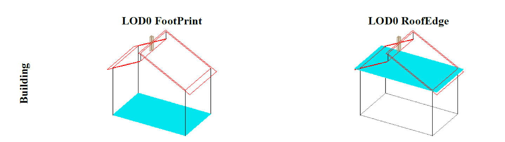
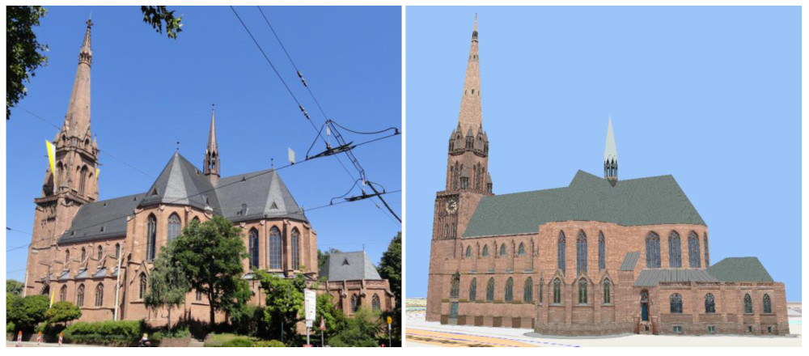
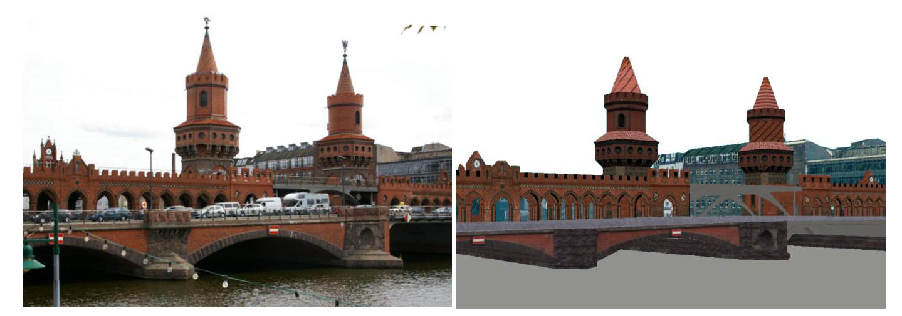
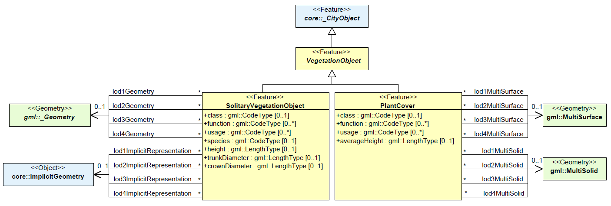
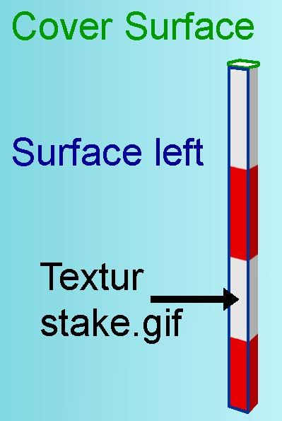

== 主题模型

:name_cityfurniture: 城市家具
:name_xml_schema_definition: XML模式定义
:name_xml_namespace: XML命名空间
:name_code_list: 代码列表
:name_3d: 三维
:name_thematic: 主题
:name_delimitation_stake: 定界桩
:name_feature: 要素
:name_conformance_requirements: 一致性要求
:name_generic: 泛型
:name_referential_integrity: 引用一致性
:name_ade: 应用领域扩展
:name_annex: 附录
:xrefstyle: short

CityGML的主题模型，是由虚拟3D城市模型中最重要的对象类型定义而成。在许多不同的应用领域中，这些对象类型十分重要。大多数主题类（可传递地）都是由基本类 __Feature__ 和 __FeatureCollection__ 派生而来，这些基本概念在ISO 19109和GML3中定义，可用于表示单一空间对象和它们之间的聚合。特征包含空间属性和非空间属性，这些属性被映射到GML3的特征属性，并具有相应的数据类型。几何特性与第8章中描述的几何类互相关联。主题模型还包括不同类型的特征类之间的相互关系，如聚合，概括和关联。

显式建模的目的是在不同的应用程序之间实现高度的语义互操作性。通过指定主题概念及其语义以及它们到UML和GML3的映射，不同的应用程序可以依赖于一组定义良好的 __feature types__ ，属性和数据类型。这些特征类型，属性和数据类型具有标准化的含义或解释。为了允许在CityGML中没有明确建模的对象和/或属性的交换，引入了 __generic city objects__ 和 __attributes__ 的概念以及CityGML的 __ADE__ 机制（参见第10.12章和第10.13章）。

CityGML主题模型的每个字段都由一单独的个CityGML扩展模块进行解释。因此，扩展模块是通过分割整个CityGML主题数据模型而得到的。所有扩展模块都基于CityGML核心模块，并且依赖于CityGML核心模块。核心部分包括CityGML数据模型的基本概念和组件。实施者可以根据特定的信息需求或应用领域选择将CityGML扩展模块与核心部分结合起来。对于CityGML的2.0版本，定义了以下13个主题扩展模块： __外观，桥梁，建筑，城市家具，城市对象组，泛型，土地利用，地形，交通，隧道，植被，水体和纹理表面 [已弃用] __。CityGML模块之间的有效组合被称为CityGML专用文件。通过这种方式，CityGML专用文件可以允许对整个CityGML数据模型进行部分实现（参见第7章）。

CityGML数据模型所涵盖的主题领域将在本章的子章节中介绍。每个子章节都与特定的CityGML模块相关。

=== CityGML核心模块

__CityGML Core__ 模块定义了整个CityGML数据模型的基本概念和组件。它形成了CityGML数据模型的基础数据结构，也包括了所有扩展模块的依赖关系。因此，核心模块必须由任何符合要求的系统来实现。首先，核心模块提供了抽象的基类，扩展模块中的主题类是从这些抽象基类（可传递地）派生的。除抽象类外，核心还包含非抽象的内容，例如可由多个扩展模块使用的基本数据类型和主题类。图21中的UML图说明了CityGML的核心模块，XML模式定义见下文和附录A.1。

[[Fig21]]
.CityGML核心模块的UML图。属性名称括号中的数字，表示该属性的多重性：每个对象的属性其最小和最大出现次数。例如，名称在类功能中是可选的（0），或者可以出现多次（星号），城市对象可以出现最多一个__ creationDate __。前缀用于指示与模型元素关联的XML名称空间。没有前缀的元素名在CityGML核心模块中定义）

CityGML数据模型中所有主题类的基类都是抽象类__ _CityObject__。__ _CityObject__提供了创建日期与终止日期，用于管理特征的历史记录，以及在其他数据集中对同一对象的外部引用。此外，还提供了两个定性属性 __relativeToTerrain__ 和 __relativeToWater__ ，用于指定特征相对于地形和水面的位置。其中的拓扑关系如图22所示。这两个属性都有助于简单而高效的查询，比如地下建筑物的数量（__entirelyBelowTerrain__），而不需要额外的数字地形模型或水体模型。

[[Fig22]]
.CityGML对象相对于 a) 地形和 b) 水面的拓扑关系。
image::figures/clause_10/Fig22.png[align="center"]

__ _CityObject__ 是GML类 __ _Feature__ 的一个子类，因此它从__ _GML__继承元数据属性（例如，关于继承关系，质量，准确性，本地CRS的信息）和名称属性。一个__ _CityObject__可以有多个名称，这些名称可以由一个 __codeSpace__ 进行限定。该功能可以用于如下场景，区分正式名称和流行名称或不同语言的名称（参见GML objects的name属性，Cox等人，2004）。__ _CityObject__ 的泛化属性 __generalizesTo__ 可用于关联特征，这些特征以不同的细节层次表示同一真实世界对象，即特征及其泛化对应物。这种关系的方向是从特征到相应的广义特征。

主题类可能有基于关系，属性和几何的继承子类。__ _CityObject__ 专用子类的特征可以聚合到单个 __CityModel__，这是一个具有可选元数据的特征集合。除非另有说明，通常，每个特性都有属性 __class, function, 和usage__。__class__ 属性只能出现一次，而 __usage__ 和 __function__ 属性可以使用多次。__class__ 属性允许对__ _CityObject__主题类层次结构之外的要素进行分类。例如，建筑特征由主题子类表示建筑：建筑_首先是__ _CityObject__（该子类在CityGML的构建模块中定义，参见第10.3章）。进一步的分类，例如住宅或行政大楼，可以使用类的__class__属性进行建模建筑：建筑。属性函数通常表示对象的预期用途或用途，例如建筑物的酒店或购物中心，而属性用途通常定义其实际用途。attrib utes__class__, __function__ 和 __usage__ 的可能值可以在代码列表中指定，建议按照GML 3.1.1的简单字典专用文件（参见第6.6章和第10.14章）将代码列表实现为简单字典。附录C提供了由SIG 3D提出和维护的代码列表，其中包含可行的属性值，用户可以扩展或重新定义这些属性值。

除了主题内容外，核心模块还提供了隐式几何的概念，作为GML3几何模型的增强。由于这一概念与CityGML的空间模型密切相关，因此已在第8.2章中介绍。

CityGML中主题模型的顶级类层次结构如图23所示。__ _CityObject__ 的子类包括城市模型的不同主题字段，这些字段由单独的CityGML扩展模块覆盖：地形，建筑物，桥梁，隧道，土地使用对象，水体，植被，一般城市对象，城市家具对象，城市对象组和交通。为了指示定义__ _CityObject__ 的相应子类的扩展模块，图23中的类名前面有前缀。每个前缀都与一个CityGML扩展模块相关联（参见第4.3章和第7章了解CityGML扩展模块和相应前缀的列表）。

[[Fig23]]
.CityGML的顶级类层次结构。前缀用于指示与模型元素关联的XML名称空间。没有前缀的元素名称在CityGML核心模块中定义。

CityGML的泛型模块（参见第6.11和10.12章）中定义的类__GenericCityObject__ 和__ _genericAttribute__，允许对任何其他主题类未涵盖或在CityGML中未表示属性的3D对象进行建模和交换。例如，在将来，从核心模块的抽象类__ _Site__中派生的地块可能会由其他子类加以补充，如发掘，城墙或路堤。目前，为了表示和交换这些特性，应该使用类__ GenericCityObject__。但是，只有在任何其他CityGML模块未提供适当的主题类或属性的情况下，才能使用通用城市对象和属性的概念。

如果使用__Generics__ 模块，则可以为每个 __CityObject__ 分配任意数量的泛型属性，用来表示特征的附加属性。为此，__Generics__模块通过属性元素__ _generictAttribute__扩充抽象基类__ _CityObject__。使用CityGML的应用领域扩展机制将附加属性__ _generictAttribute__注入到__ _CityObject__中（参见第10.13章）。通过这种方式，__ _CityObject__的每个主题子类都继承了这个属性，因此也就都可以包含泛型属性。因此，泛型模块对定义__ _CityObject__的主题子类中，所有CityGML扩展模块都有一定的影响。

关于特征曲面的外观信息可以由CityGML的外观模块提供的类 __Appearance__ 来表示（参见第9章）。与核心的其他主题扩展不同的是，它不是从__ _CityObject__ 派生出来的，而是从GML类 _Feature_ 派生出来的。—__ _CityObject__ 要素和__Apperance__ 要素可以使用__ CityObjectMember__ 和__appearanceMember__ 以任意顺序包含在__CityModel__ 要素集合中 （参见第9章和第10.1.1章）。此外，外观可以存储在__ _CityObject__ 本身的内联中。为了使城市对象能够存储外观信息，外观模块使用CityGML的应用领域扩展机制，通过属性元素外观来扩充抽象基类__ _CityObject__（参见第10.13章）。因此，只有在支持__Apperance__ 模块的情况下，__Apperance__ 属性才能对_CityObject及其主题子类可用。所以，像通用模块一样，__Apperance__ 模块对任何其他扩展模块都有直接影响。

为了完整性，图23中还示出了 __TexturedSurface__。该外观建模方法已经被弃用，并会在将来的CityGML版本中被删除。由于 __TexturedSurface__ 所包含的信息可以无损地转换到__Appearance__ 模块，因此强烈建议不要使用__TexturedSurface__。

*XML 命名空间*

CityGML __CityGML Core__模块的XML命名空间由统一资源标识符（URI）标识http://www.opengis.net/citygml/relief/2.0. 在__Relief__模块的xmlschema定义中，这个URI还用于标识默认名称空间。

==== 基本元素
*Abstract__ _CityObject__Type, ___ _CityObject__*
[source, xml]
----
include::code/clause_10/abstract_city_object_type_CityObject.xml[]
----

*CityModelType, CityModel*
[source, xml]
----
include::code/clause_10/city_model_type_city_model.xml[]
----

*__ _CityObject__Member*
[source,xml]
----
include::code/clause_10/city_object_member.xml[]
----

*AbstractSiteType, _Site*
[source,xml]
----
include::code/clause_10/abstract_site_type_site.xml[]
----

抽象类 __ _site__是建筑物，桥梁，隧道，设施等的父类。CityGML未来的扩展（如发掘，城墙或路堤）将被建模为__ _site__的子类。作为__CityObject__的子类，__ _Site__ 继承所有属性和关系，特别是id，名称，外部引用和泛化关系。

==== Generalisation relation, RelativeToTerrainType 和 RelativeToWaterType

*GeneralizationRelationType*
[source,xml]
----
include::code/clause_10/generalization_relation_type.xml[]
----

*RelativeToTerrainType, RelativeToWaterType*
[source,xml]
----
include::code/clause_10/relative_to_terrain_type_relative_to_water_type.xml[]
----

==== 外部引用

__ExternalReference__ 定义了从 __ _CityObject__ 到另一个信息系统中相应对象的超链接，例如在ALKIS，ATKIS或OS MasterMap中。 引用由外部信息系统的名称（用URI表示）和外部对象的引用（用字符串或URI表示）组成。如果__ExternalReference__ 中缺少__informationSystem__元素，则__ExternalObjectReference__ 必须是URI。

*ExternalReferenceType, ExternalObjectReferenceType*
[source,xml]
----
include::code/clause_10/external_reference_type_external_object_reference_type.xml[]
----

==== 地址信息
CityGML核心模块提供了在虚拟城市模型中表示真实世界要素地址信息的方法。由于并非每个真实世界的功能都被分配了地址，因此没有为基类__ _CityObject__定义相应的__address__属性，但如果需要，则可以在其子类中对地址进行声明。例如，建筑模型为其子类__ _AbstractBuilding__和__Door__声明__address__属性。两个类都引用核心模块的相应数据类型来表示地址信息（参见第10.3章）。

地址信息具有xalAddress属性和multiPoint(可选择)属性。例如，对于建筑要素，__multiPoint__特性允许指定与相应地址关联的建筑入口位置。点坐标可以是2D或3D。将地址建模为特征有一个优点，即GML3可以使用XLinks对特征进行引用。这意味着，地址可能被存储在外部文件中，或可被外部Web进行调用。CityGML文件中的地址属性元素不包含内联地址信息，只包含对相应外部特征的引用。

地址信息是使用oasis2003发布的__xALaddress__标准指定，该标准为各种国际地址提供了通用模式。因此，__Address__的__xalAddress__属性的子元素必须根据OASIS xAL模式进行构造。

*AddressPropertyType, AddressType, Address*
[source,xml]
----
include::code/clause_10/AddressPropertyType_ AddressType_ Address.xml[]
----

以下两个CityGML数据集的摘录包含用xAL表示德语和英语地址的示例。根据CityGML __Buildings__模块（参见第10.3章），地址信息附加到建筑对象(__bldg:Building__)。通常，如果CityGML实例文档包含地址信息，则命名空间前缀 “xAL” 应在根元素中声明，并且必须引用urn:oasis:names:tc:ciq:xsdschema：xAL:2.0。附录G.1中提供了一个完整的CityGML数据集示例，其中包含带有地址元素的建筑物。
[source,xml]
----
include::code/clause_10/example_buildingWithAddress.xml[]
----

[source,xml]
----
include::code/clause_10/example_buildingWithAddress_2.xml[]
----

==== 代码列表

__ImplicitGeometry__的__mimeType__属性指定为__gml:CodeType__. 此属性的值可以在代码列表中被枚举。这个代码列表的建议规范可以在附件C.6中找到。

==== 一致性要求

*基础要求*

. __CityModel__元素（类型：__CityModelType__，替换组：__gml : FeatureCollection__）只能包含__ cityObjectMember__元素（类型：__gml:FeaturePropertyType__), __app:appearanceMember__元素 （类型：app:__AppearancePropertyType__)，和__gml:featureMember__元素（类型：__gml:FeaturePropertyType__)作为功能成员。
. __ExternalObjectReference__引入了两个元素__name__（类型：__xs:string__）和__uri__（类型：__xs:anyURI__）。外部引用可以由它们中的任何一个指定。但是，如果没有提供__ExternalReferenceType__类型的__informationSystem__属性元素（类型：__xs:anyURI__），则必须提供__ExternalObjectReference__的__uri__元素。
. 为了表示某个特征的地址信息，该特征的相应主题类应定义__AddressPropertyType__类型的属性。因此，对于所有CityGML扩展模块，只有__AddressPropertyType__类型应用于提供地址信息的元素。
. 由于隐式几何的概念（参见第8.2章）是__CityGML Core__模块的一部分，因此为隐式几何引入的一致性要求（参见第8.3.3章）是核心一致性要求的一部分。

*引用一致性*
[start=5]
. __ _CityObjectMember__元素（类型：__gml:FeaturePropertyType__)可能包含一个__ _CityObject__元素，该元素通常是派生子类的对象，如__bldg:Building__，使用GML 3.1.1中的XLink概念，对远程 __ _CityObject__ 的内联或XLink引用。在后一种情况下__ _CityObjectMember__的__XLink:href__ 属性只能指向远程__ _CityObject__元素（其中远程__ _CityObject__元素位于另一个文档或同一文档中的其他位置）。必须给出包含的元素或引用，但不能同时给出或不给出。
. __AddressPropertyType__类型可以包含__Address__元素内联或使用gml3.1.1的远程__Address__元素XLink引用。在后一种情况下，__AddressPropertyType__的__XLink:href__ 属性，其对应元素只能指向远程地址元素（其中远程地址元素位于另一个文档或同一文档的其他位置）。必须给出包含的元素或引用，但不能同时给出或不给出。

=== 数字地形模型（DTM）

城市模型的一个重要部分是地形。CityGML的数字地形模型（DTM）由专题扩展模块__Relief__提供（参见第7章）。在CityGML中，地形由lod0-4中的类__relief-feature__表示（图24描绘了UML图，XML模式定义见附录A.9）。__ReliefFeature__由__ReliefComponent__的一个或多个实体组成。其有效性可以限制在由可选有效范围多边形定义的特定区域。由于__ReliefFeature__和__ReliefComponent__继承自__ _CityObejct__，因此相应的属性和关系也被继承下来。__ReliefFeature__可以与不同概念的地形表示进行关联。地形可以指定为规则光栅或栅格（__RasterRelief__），三角网（__TINReflief__），打断线（__BreaklineRelief__）或质点（__MasspointRelief__）。这四种类型由相应的GML3类实现：__gml:RectifiedGridCoverage__实现栅格图， __gml:MultiCurve__可实现打断线， __gml:MultiPoint__ 实现质量点类型，__gml:TriangulatedSurface / gml:Tin__都可构成三角网数据。如果在__gml:TriangulatedSurfaces__中，显示表达了三角面，同时__gml:Tin__中 只表示三维点，这时其中三角剖分可通过标准方法重建（Delaunay三角剖分，参见Okabe et al.1992）。打断线由三维曲线表示。质点只是一组三维点。

[[Fig24]]
.CityGML中数字地形模型的UML图。前缀用于指示与模型元素关联的XML名称空间。没有前缀的元素名称在CityGML Relief模块中定义。

在CityGML数据集中，四种地形类型可以以不同的方式组合在一起，产生了很高的灵活性。首先，每种类型可以用不同的细节级别来表示，反映出不同的精确度或分辨率。第二，可以通过多种类型的组合来描述地形的一部分，例如通过光栅和打断线，或者通过三角网和打断线。在这种情况下，打断线必须与三角形共享几何图形。第三，相邻区域可以用不同类型的地形模型来表示。为了便于这种组合，为每个地形对象提供了表示其有效性范围的__空间属性__（图25）。在大多数情况下，常规光栅数据集的有效范围与其边界框相对应。此有效范围由二维示意图多边形表示，该多边形可能有孔。例如，这一概念可以通过粗网格对地形进行建模，其中一些显著区域由详细的高精度TIN表示。两种类型之间的边界由相应地形对象的范围属性给出。

[[Fig25]]
.使用有效范围多边形在CityGML中嵌套DTM（图：IGG Uni Bonn）。
image::figures/clause_10/Fig25.jpg[align="center",width="80%"]

DTM的精度和分辨率不一定依赖于其他CityGML扩展模块（如建筑模型）的特性。因此，有可能将LOD较高的建筑模型集成到精度或分辨率较低的DTM中。

这种方法与__TIC__相互作用（参见第6.5章）。TIC可以像断线一样用于调整DTM以适应不同的特征，如建筑物，桥梁或城市家具，从而确保DTM的一致表示。如有必要，可能需要处理重新成角。也可以通过DTM和相应特征的自交集求出TIC。

__ReliefFeature__和__ReliefComponent__都有一个__lod__属性，表示相应的细节级别。在大多数情况下，__ReliefFeature__的LOD与__ReliefComponent__的LOD匹配。但是，也允许指定具有高LOD的__ReliefFeature__，该__ReliefFeature__由__ReliefComponent__组成，其中一些__ReliefComponent__的LOD可以低于聚合__ReliefFeature__的LOD。其思想是，例如，对于LOD3场景，在LOD2中使用规则栅格以及由LOD3中__ReliefComponent__定义的某些高精度区域就足够了。LOD2网格和LOD3组件可以使用有效范围多边形的概念进行集成。因此，尽管一些__ReliefComponent__将被分类为较低的LOD，但是通过将其LOD值设置为3之后，__ReliefFeature__也可以与其他LOD3模型一起使用。

*XML 命名空间*

CityGML __Relief__模块的XML命名空间由统一资源标识符（URI）标识http://www.opengis.net/citygml/relief/2.0. 在__Relief__模块的xmlschema定义中，这个URI还用于标识默认名称空间。

==== Relief feature and relief component

*ReliefFeatureType, ReliefFeature*
[source,xml]
----
include::code/clause_10/ReliefFeatureType_ReliefFeature.xml[]
----

*AbstractReliefComponentType, _ReliefComponent*
[source,xml]
----
include::code/clause_10/AbstractReliefComponentType_ReliefComponent.xml[]
----

==== 不规则三角网格地形
*TINReliefType, TINRelief*
[source,xml]
----
include::code/clause_10/TINReliefType_TINRelief.xml[]
----
__TINRelief__的几何图形由GML几何图形类定义__gml:TriangulatedSurface__. 这部分可以显式地提供一组三角形(__gml:TriangulatedSurface__)或者通过使用子类（__gml:Tin__ ）指定控制点、中断线和停止线。在后一种情况下，处理包含__gml:Tin__ 需要通过使用约束Delaunay三角剖分算法重建三角剖分曲面（参见Okabe et al.1992）。

==== 栅格地形

*RasterReliefType, RasterRelief, Elevation*
[source,xml]
----
include::code/clause_10/RasterReliefType_RasterRelief_Elevation.xml[]
----

==== 质量点地形
*MassPointReliefType, MassPointRelief*
[source,xml]
----
include::code/clause_10/MassPointReliefType_MassPointRelief.xml[]
----

==== 折断线地形
*BreaklineReliefType, BreaklineRelief*
[source,xml]
----
include::code/clause_10/BreaklineReliefType_BreaklineRelief.xml[]
----

__BreaklineRelief__的几何图形可以由折断线和山脊/山谷线组成。折断线表示地形坡度的突变，脊线/谷线表示地形坡度符号的变化。__BreaklineRelief__必须至少包含上述两种类型中的一种。

==== 一致性要求

*基础要求*

. __gml:Polygon__几何元素描述了使用__ _ReliefComponent__的范围属性（类型：__gml:PolygonPropertyType）的有效范围，该元素应作为2D 底边轮廓多边形进行表示，该多边形可能具有内孔。

*引用一致性*
[start=2]
. __ReliefFeature__元素的__reliefComponent__属性可以包含一个内嵌的__ _ReliefComponent__元素，或者直接使用GML 3.1.1的XLink概念，对远程__ _ReliefComponent__元素进行XLink引用。在后一种情况下__ _reliefComponent__属性中的__XLink:href__, 只能指向远程__ _ReliefComponent__元素（其中远程__ _ReliefComponent__元素位于另一个文档或同一文档中的其他位置）。另外，必须给出所包含的元素或引用，在这种条件下，只能选择同时给，或者同时不给。
.	__TINRelief__元素的__tin__属性可以包含一个内嵌的__gml:TriangulatedSurface__元素，或者 直接使用GML 3.1.1的XLink概念，对远程__gml:TriangulatedSurface__ 元素进行XLink引用。在后一种情况下__TIN__属性中的__XLink:href__ 属性，只能指向远程__gml:TriangulatedSurface__元素（其中远程__gml:TriangulatedSurface__元素位于另一个文档或同一文档中的其他位置）。另外，必须给出所包含的元素或引用，在这种条件下，只能选择同时给，或者同时不给。
.	__RasterRelief__元素的__grid__属性可以包含一个内嵌的__gml:RectifiedGridCoverage__ 元素，或者直接使用GML 3.1.1的XLink概念，对远程__gml:RectifiedGridCoverage__元素进行XLink引用。在后一种情况下__gml:RectifiedGridCoverage__元素的__XLink:href__只能指向远程__gml:RectifiedGridCoverage__元素（其中远程__gml:RectifiedGridCoverage__元素位于另一个文档或同一文档中的其他位置）。另外，必须给出所包含的元素或引用，在这种条件下，只能选择同时给，或者同时不给。

=== 建筑模型

建筑模型是CityGML最详细的主题概念之一。它允许在五个细节等级（LOD0到LOD4）中表示建筑物和建筑部件的主题属性和空间几何。CityGML的建筑模型由主题扩展模块__Building__定义（参见第7章）。图26提供了LOD1–4等级的3D城市和建筑模型示例。

[[Fig26]]
.LOD1（左上），LOD2（右上），LOD3（左下）和LOD4（右下）中的城市或建筑模型示例（来源：雷克林豪森区，m-g-h ingenieure+architekten GmbH）。

建筑模型的UML图如图27所示，XML模式定义见附录A.4和下文。该模型的关键类是__ _AbstractBuilding__，它是主题类__ _Site__（继承自__ _CityObject__）的子类. __ _AbstractBuilding__是专门针对建筑或建筑部件的。 因为__ _AbstractBuilding__是由建筑部件组成的，而建筑部件又可以是__ _AbstractBuildings__，所以可以实现任意深度的聚合层次结构。作为父类 __ _CityObject__的子类，__ _AbstractBuilding__继承来自__ _CityObject__的所有属性，就像GML3标准功能属性一样(__gml:name__ etc.)以及CityGML特有的属性，如__外部引用__（参见第6.7章）。__ _AbstractBuilding__未明确涵盖的其他属性可以通过CityGML __泛型__模块进行建模（参见第10.12章）或使用CityGML应用领域扩展机制（参见。
第10.13章）。

建筑综合体由许多不同的建筑组成，如工厂或医院综合体，应使用__CityObjectGroup__的概念进行聚合（参见第6.8章）。例如，综合体的主建筑可以表示为 “main building”。 

__Building__和__BuildingPart__，都继承了__ _AbstractBuilding__的属性，如下：建筑物类别，功能（如住宅，公共或工业），用途，建造年份，拆除年份，屋顶类型，测量高度以及地上和地下楼层的数量和对应高度。这组参数适用于粗略重建建筑物的三维形状，可由地籍系统提供。此外，对__Building__或__BuildingPart__也可以指定对应的__Address__特征。

[[Fig27]]
.CityGML建筑模型的UML图。前缀用于指示与模型元素关联的XML名称空间。不带前缀的图元名称在CityGML __Building__模块中定义。
image::figures/clause_10/Fig27.png[align="center"]

__ _AbstractBuilding__的几何表示和语义结构如图27所示。模型从LOD0到LOD4依次细化。因此，并非建筑模型的所有部件在每个LOD中都具有等量的表示，并且并非每个LOD中都允许聚合。在CityGML中，所有对象类都与每个LOD的最小获取标准相关（参见第6.2章）。通过为相应的LOD提供不同的几何图形，可以在不同的LOD中表示相同的对象。

在LOD0中，建筑可以用水平的三维表面来表示。这些可以分别代表建筑物的底边轮廓和屋顶边缘。这样可以轻松地将二维数据集成到模型中。在许多国家，这些二维几何图形很容易存在，例如地籍或地形数据。地籍数据通常描述地面上建筑物的底边轮廓，地形数据通常是底边轮廓和屋顶层（屋顶边缘）几何图形的混合体，通常从区域/卫星图像中通过摄影测量提取或从机载激光数据中提取。建筑模型允许包含上述两者。在这种情况下，可以将大型悬挑屋顶建模为更详细的LOD2和LOD3描述的初步阶段。曲面几何体需要三维坐标，但要求属于同一曲面的所有顶点，其高度值相同。如果将二维几何体导入这两个LOD0几何体中的任何一个，则需要为所有顶点选择适当的高度值。建筑物底边轮廓通常位于建筑物地面的最低标高处，而屋顶边缘表示应放置在屋顶标高处（例如屋檐高度）。

在LOD1中，建筑模型由建筑外壳的几何体表示。也可以选择 __gml:MultiCurve__ 对__TIC__进行表示（参见第6.5章）。此几何表示在LOD2中通过附加__gml:MultiSurface__ 和__gml:MultiCurve__，用于对屋顶悬挑，柱或天线等建筑细节进行建模。在LOD2和更高的LOD中，建筑物的外立面也可以通过__ _BoundarySurface__和__BuildingInstallation__进行语义区分。__ _BoundarySurface__是建筑物外壳的一部分，具有墙（__WallSurface__），屋顶（__RoofSurface__），地面（__GroundSurface__），外部地面（__OuterFloorSurface__），外部天花板（__Outer-CeilingSurface__）或封闭面（__ClosureSurface__）等特殊功能。__BuildingInstallation__可用于建筑元素，如阳台，烟囱，老虎窗或外部楼梯，这些元素强烈影响建筑物的外观。一个__BuildingInstallation__可以具有属性__class__，__function__和__usage__（参见图27）。

在LOD3中，__ _BoundarySurface__对象（门和窗）中的洞口可以表示为主题对象。在LOD4中(分辨率最高)，可以表达由多个房间组成的建筑内部，在建筑模型中由__Room__表示。这种可扩展性赋予了建筑物的虚拟信息承载性，例如博物馆中的游客信息（“基于位置的服务”），住宿标准的检查或建筑物日光照明的呈现。在该部分内容中，可通过使用CityGML提供的一般分组概念实现（参见第10.3.6章），基于用户定义的任意标准（例如，用于定义与某一楼层相对应的房间）对房间进行聚合。建筑物的内部装置，即建筑物内不能移动的物体（与家具不同），用__IntBuildingInstallation__表示。如果装置连接到特定房间（如散热器或灯具），则与房间类别相关，否则（如椽或管道）与建筑相关。一个__Room__可能具有属性__class__，__function__和__usage__，其值可在代码列表中定义（第10.3.8章和附录C.1）。__class__的属性允许根据所述功能对房间进行分类，例如商务或私人房间，并且该属性只能出现一次。__function__的属性可用于表示房间的主要用途，例如客厅，厨房。如果对象的实际使用方式与函数不同，则可以使用 __usage__属性。这两个属性可以出现多次。

房间的可见表面在几何上可以表示为__Solid__或__MultiSurface__。从语义上讲，曲面可以构造成特定的__ _BoundarySurface__s__，表示地板（__FloorSurface__），天花板（__CeilingSurface__）和内墙（__InteriorWallSurface__）。房间家具，如桌子和椅子，可以用__BuildingFurniture__表示。__BuildingFurniture__具有__class__，__funtion__和__usage__等属性。附录G.1至G.6提供了包含单个建筑模型的示例CityGML文件，该模型包含了从LOD0到LOD4模型，包括建筑内部。

*XML 命名空间*

CityGML __Building__ 模块的XML命名空间由统一资源标识符（URI）标识http://www.opengis.net/citygml/building/2.0. 在__building__模块的xmlschema定义中，这个URI还用于标识默认名称空间。

==== 建筑和建筑部件
*BuildingType, Building*
[source,xml]
----
include::code/clause_10/BuildingType_Building.xml[]
----

__Building__是__ _AbstractBuilding__的两个子类之一。如果建筑物仅由一个（同质）部分组成，则应使用该类别。由不同结构段组成的建筑物，例如层数或屋顶类型不同的建筑物，必须被分割成一个具有一个或多个附加__BuildingPart__的__Building__（见图28）。建筑中心部分的几何和非空间特性应在聚合__Building__特征中表示。

*BuildingPartType, BuildingPart*
[source,xml]
----
include::code/clause_10/BuildingPartType_BuildingPart.xml[]
----
__BuildingPart__派生自__ _AbstractBuilding__。它用于对建筑物的部件进行建模（见图28）。__BuildingPart__对象应仅与一栋建筑或建筑部件相关。

[[Fig28]]
.由一个建筑（右）和两个建筑部件（左）组成的建筑示例（来源：科堡市）。
image::figures/clause_10/Fig28.jpg[align="center",width="80%"]

*AbstractBuildingType, _AbstractBuilding*
[source,xml]
----
include::code/clause_10/AbstractBuildingType_AbstractBuilding.xml[]
----

抽象类__ _AbstractBuilding__包含建筑属性，其几何表示以及建筑或建筑部件在不同LOD中的几何/语义表示。这些属性描述如下：

a) 建筑物或建筑部件（__class__），不同的预期用途（__function__）和不同的实际用途（__usage__）的分类。这些属性的数值可以在代码列表中指定。

b) 建造或建筑部件的建造年份（__yearOfConstruction__）和拆除年份（__yearOfDemolition__）。这些属性可用于描述城市模型中建筑发展的年表。时间点指的是真实世界的时间。

c) 建筑或建筑部分的屋顶类型（__roofType__）。可以在代码列表中指定此属性数值。

d) 建筑物或建筑物部分的测量相对高度（__measureHeight__）。

e) 地平面上（__storeyAboveGround__）和下（__storeyBelowGround__）的层数。

f) 地平面以上（__storeyHeightsAboveGround__）和以下（__storeyHeightsBelowGround__）的层高列表。列表中的第一个值表示最近楼层的高度。最后一个值是最远的高度。

在图29和图30中通过展示相同建筑物在5个LoD层级中的对应物，可以清楚阐明跨越不同等级的细节层次，建筑模型在地理度量表示的复杂度和粒度，以及将模型的主题结构划分为具有特殊语义含义的组件方面是不同的。在__ _AbstractBuilding__里，有许多与某些LOD相关联的属性。

[[Fig29]]
.使用水平三维曲面在LOD0中有两种建模方式。左侧显示建筑示意图（__lod0FootPrint__）（青色），表示地面上建筑的形状。相应的曲面表示位于地面。右图显示了__lod0RooTEgde__表示（青色），该表示来自建筑物屋顶的水平投影，位于屋檐高度（来源：KIT，由Franz提供）

[[Fig30]]
.LOD1–LOD4中的建筑模型（来源：KIT，由Franz Josef Kaiser提供）

这五种类型，显示了建筑模型的不同几何和语义主题与LOD的对应关系。在LOD1–4中，建筑物的体积可以用__gml:Solid geometry__和/或__gml:MultiSurface geometry__来表示。三维地形相交曲线（TIC）的定义，用于将不同来源的建筑物与数字地形模型相结合，也可以在LOD1–4中定义。TIC（可选）在建筑物或建筑物部分周围构建闭合环。
在LOD0中（参见图29），建筑物由底边轮廓线和顶部水平表面表示。
在LOD1（参见图30）中，建筑物的不同结构实体被聚合到一个简单的块中，在细节上没有区别。建筑内外部不做区分，只使用一个相应的特性（__lod1Solid__或__lod1MultiSurface__）。

在LOD2和更高层次的细节中，建筑物的外部不仅在几何上表示为__gml:Solid geometry__ 和/或__gml:MultiSurface geometry__，也可以由语义对象组成。在语义上构造建筑外部对象的基类，__ _BoundarySurface__，该类型与__gml:MultiSurface__ 有强联系（参见第10.3.2章）。 如果在建筑模型中既有利用体积/平面的建筑外部几何表示，又有通过__ _BoundarySurfaces__来进行语义定义的情况，则不能仅仅靠几何表示明确定义几何，必须引用__ _BoundarySurface__ 中的__gml:MultiSurface__。

[width="100%",options="header",caption=""]
|====================
|几何/语义主题 |属性类型|LOD0|LOD1|LOD2|LOD3|LOD4
|建筑底面轮廓与屋顶边界 |__gml:MultiSurfaceType__ | *·* | | | | 
|建筑外壳体块部件 |__gml:SolidType__ | | *·* | *·* |*·* | *·*
|建筑外壳表皮部件 |__gml:MultiSurfaceType__ | | *·* | *·* |*·* | *·*
|地形相切曲线 |__gml:MultiCurveType_ | | *·* | *·* |*·* | *·*
|建筑外壳曲线部件 |__gml:MultiCurveType__ | | | *·* |*·* | *·*
|建筑部件 |__BuildingPartType__ | | *·* | *·* |*·* | *·*
|边界表面 |__AbstractBoundarySurfaceType__ | | | *·* |*·* | *·*
|外部建筑装置 |__BuildingInstallationType__| | | *·* |*·* | *·*
|开口 |__AbstractOpeningType__| | | |*·* | *·*
|房间 |__RoomType__| | | | | *·*
|内部建筑装置 |__IntBuildingInstallationType__| | | | | *·*
|====================

除了__BuildingPart__外，建筑的较小部件（建构物/外部建筑装置）也会强烈影响建筑特征。这些特性由__BuildingInstallation__进行建模（参见第10.3.2章）。该类型中主要有，烟囱（参见。图30），老虎窗（见图28），阳台，外楼梯或天线。如果其范围超过第6.2章中规定的建议最小尺寸， 则__BuildingInstallations__仅可包括在LOD2模型中。对于__BuildingInstallations__的几何表示，可以使用图9所示GML子集中的任意几何对象。

__ _AbstractBuilding__没有可以使用为LOD3的属性。除了对几何精度要求较高和最小尺寸较小外，LOD2和LOD3建筑的主要区别在于__ _BoundarySurface__（参见第10.3.3章）。在LOD3中，通过使用抽象类__ _Opening__和其派生子类__Window__和__Door__，对建筑物中与窗或门相对应的开口（见图30）进行建模（参见第10.3.4章）。
对于建筑外部，LOD4数据模型与LOD3数据模型相同。但是LOD4提供了一种可能性，可以用__IntBuildingInstallation__和__Room__对建筑物的内部结构进行建模（参见第10.3.5章）。

可以使用__address__特性为每个__Building__或__BuildingPart__特征指定地址（数量自选）。相应的__AddressPropertyType__定义可以在CityGML核心模块中查看（参见第10.1.4章）。

==== 外部建筑装置
*BuildingInstallationType, BuildingInstallation*
[source,xml]
----
include::code/clause_10/BuildingInstallationType_BuildingInstallation.xml[]
----

__BuildingInstallation__是建筑物的外部构件，它不具有建筑部件的意义，但对建筑物的外部特性有很大的影响。例如烟囱，楼梯，天线，阳台或楼梯和路径上方的附加屋顶。__BuildingInstallation__具有__class__, __function__ 和 __usage__属性。属性类（只能出现一次）表示安装的一般分类。通过__function__和__usage__属性，可以描述建筑装置的名义功能和实际功能。对于上述三个属性，其数值可以在代码列表中指定。对于__BuildingInstallation__的几何表示，可以使用图9所示GML子集中的任意几何对象。或者，也可以将几何体作为__ImplicitGeometry__。根据__ImplicitGeometry__的概念，建筑装置的原型几何仅需要在局部坐标系中存储一次，在后续可以通过调取建筑装置的特征进行引用（见第8.2章）。建筑物装置的可见表面可使用边界表面的概念进行语义分类（参见10.3.3）。__BuildingInstallation__只可以与一个建筑或建筑部件相关。

==== 边界表面
*AbstractBoundarySurfaceType, __ _BoundarySurface__*
[source,xml]
----
include::code/clause_10/AbstractBoundarySurfaceType_BoundarySurface.xml[]
----

__ _BoundarySurface__是几个主题类的抽象基类，用于构造建筑物的外表皮以及房间的可见表面以及外部和内部建筑装置。它是__ _CityObject__的一个子类，因此继承了所有属性，如GML3标准特征属性(__gml:name__ etc.)以及CityGML特有的属性，比如__ExternalReferences__。从__ _BoundarySurface__出发，衍生出了屋顶表面（__RoofSurface__）, 墙面（__WallSurface__）, 地面（__GroundSurface__）, 外墙面 （__OuterCeilingSurface__）, 外地板表面（__OuterFloorSurface__）, 封闭表面（__ClosureSurface__），地板表面（__FloorSurface__）, 内墙面（__InteriorWallSurface__）和 天花板表面（__CeilingSurface__）等专题类。建筑表面的专题分类在图31（建筑外表皮）和图32（内表面）进行了说明。

对于Lod2到Lod4之间，几何体的__ _BoundarySurface__可以由不同的gml:MultiSurface geometry定义。

在LOD3和LOD4中，__ _BoundarySurface__可能包含门和窗的__Openings__类（参见第10.3.4章）。如果开口的几何位置在拓扑结构上位于__gml:MultiSurface__几何体的曲面组件内（例如 __gml:Polygon__)，这些开口必须表示为该曲面内的孔。孔由相应曲面几何体对象内的内环表示。根据GML3，这些点必须以相反的顺序指定（当从曲面法向量的相反方向看时，外部边界为逆时针方向，内部边界为顺时针方向）。如果开口由__Door__, __Window__, 或__ClosureSurface__类型进行围合，则其外边界可由与周围表面的内环（表示孔）相同的点组成。__Openings__的边界表面属于相关的相邻边界表面。例如，如果门分隔开口，则门一侧属于__InteriorWallSurface__，另一侧属于__WallSurface__（图32右侧）。

[[Fig31]]
.建筑外壳的_BoundarySurfaces分类示例（来源：KIT）
image::figures/clause_10/Fig31.png[align="center",width="80%"]

[[Fig32]]
.边界表面分类（左），尤其是开口（右）（图：IGG Uni Bonn）。

*GroundSurfaceType, GroundSurface*
[source,xml]
----
include::code/clause_10/GroundSurfaceType_GroundSurface.xml[]
----
通过__GroundSurface__，对建筑物或建筑部件的接地面进行建模。定义接地面的多边形与建筑物底面轮廓线一致。但是，接地板的表面法线向下。

*OuterCeilingSurfaceType, OuterCeilingSurface*
[source,xml]
----
include::code/clause_10/OuterCeilingSurfaceType_OuterCeilingSurface.xml[]
----
属于建筑外表皮且方向朝下的大部分水平表面可建模为__OuterCeilingSurface__。例如凉廊天花板或通道天花板的可见部分。

*WallSurfaceType, WallSurface*
[source,xml]
----
include::code/clause_10/WallSurfaceType_WallSurface.xml[]
----
建筑外立面的所有部分（该建筑外立面属于建筑外表皮的一部分）都可以通过类__WallSurface__进行建模。

*OuterFloorSurfaceType, OuterFloorSurface*
[source,xml]
----
include::code/clause_10/OuterFloorSurfaceType_OuterFloorSurface.xml[]
----
属于建筑外表皮且方向朝上的大部分水平表面可以建模为__OuterFloorSurface__。例如凉廊的地板。

*RoofSurfaceType, RoofSurface*
[source,xml]
----
include::code/clause_10/RoofSurfaceType_RoofSurface.xml[]
----
建筑物或建筑部件的主要屋顶部分可以用__RoofSurface__表示。具有特定语义的屋顶次要部分（如天窗或烟囱）应建模为__BuildingInstallation__。

*ClosureSurfaceType, ClosureSurface*
[source,xml]
----
include::code/clause_10/ClosureSurfaceType_ClosureSurface.xml[]
----
建筑物中没有门或窗的开口可以使用__ClosureSurface__（虚拟表面）进行分隔（参见第6.4章）。因此，像谷仓或机库这样的开放式建筑，为了能够计算它们的体积，可以考虑为关闭状态。__ClosureSurfaces__也用于内部建筑模型。如果两个具有不同功能的房间（如厨房和客厅）直接相连，而没有单独的门，则应使用__ClosureSurface__来分隔或连接两个房间的体积。

*FloorSurfaceType, FloorSurface*
[source,xml]
----
include::code/clause_10/FloorSurfaceType_FloorSurface.xml[]
----
__FloorSurface__只能在LOD4内部建筑模型中，用于对房间地板进行建模。

*InteriorWallSurfaceType, InteriorWallSurface*
[source,xml]
----
include::code/clause_10/InteriorWallSurfaceType_InteriorWallSurface.xml[]
----
InteriorWallSurface只能在LOD4内部建筑模型中使用，可对房间墙的可见表面进行建模。

*CeilingSurfaceType, CeilingSurface*
[source,xml]
----
include::code/clause_10/CeilingSurfaceType_CeilingSurface.xml[]
----
__CeilingSurface__只能在LOD4内部建筑模型中使用，可对房间天花板进行建模。

==== 开口
*AbstractOpeningType, _Opening*
[source,xml]
----
include::code/clause_10/AbstractOpeningType_Opening.xml[]
----
__ _Opening__是一个抽象基类，用于在语义上描述墙和屋顶等外部或内部表面上的门或窗。开口（__ _Opening__）仅存在于LOD3或LOD4模型中。每个开口都与类型为__gml:MultiSurface__的几何体进行关联。如果不关联的话，几何体需要作为其中的__ImplicitGeometry__。根据隐式几何的概念，开口的原型几何体仅需要在局部坐标系中存储一次，可由其他开口进行调用（见第8.2章）。

*WindowType, Window*
[source,xml]
----
include::code/clause_10/WindowType_Window.xml[]
----
__Window__可用于对建筑外表皮中的窗口或相邻房间之间的舱口进行建模。__Window__和__Door__的形式上的区别在于，在正常情况下窗户并不是专门用来运送人或车辆的。

*DoorType, Door*
[source,xml]
----
include::code/clause_10/DoorType_Door.xml[]
----
__Door__可用于在建筑物的外表皮中或相邻房间之间，对门进行建模。人们可以用门进出建筑物或房间。与__ClosureSurface__不同的是，门可能是关闭的，阻碍了人们的通行。一扇门可以分配多个地址。相应的__AddressPropertyType__在CityGML核心模块中定义（参见第10.1.4章）。

==== 建筑内部
*RoomType, Room*
[source,xml]
----
include::code/clause_10/RoomType_Room.xml[]
----

__Room__是一个语义对象，用于对建筑内部的自由空间进行建模，并且大部分情况下，只与一个建筑或建筑部件相关。__Room__为闭合的（如果需要的话，可以使用__ClosureSurface__），并且几何体通常用实体（__Lod4Solid__）来描述。然而，如果不能保证边界的拓扑正确性，几何体也可以作为一个__多曲面__（__Lod4MultiSurface__）给出。由于当作为GML外表皮时，其表面法线必须指向外部，因此当应__Room__被指定__Appearances__时，必须考虑这一点。在这种情况下，纹理和颜色必须放置在相应曲面的背面，以便从房间内部可见。

除了几何表示之外，房间可见表面的不同部分可以通过特定的__BoundarySurfaces__（__FloorSurface__，__CeilingSurface__，__InteriorWallSurface__和__ClosureSurface__，参见第10.3.3章）进行建模。

在为相邻房间之间的进行通道建模，需特殊考虑。房间实体通过用舱口，门或门口的封闭曲面进行拓扑连接。如果房间之间有共同的__ _Openings__或__ClosureSurfaces__，则房间被定义为相邻。在几何形体上表示开口的面是两个房间实体边界的一部分，或者该开口在语义级别上由两个房间引用。这种邻接意味着一种可达性图结构，可用于确定烟或气体的扩散，但也可用于使用经典最短路径算法计算逃生路线。

[[Fig33]]
.从房间表面的拓扑邻接导出的可达性图（图：IGG Uni Bonn）。
image::figures/clause_10/Fig33.jpg[align="center",width="80%"]

*BuildingFurnitureType, BuildingFurniture*
[source,xml]
----
include::code/clause_10/BuildingFurnitureType_BuildingFurniture.xml[]
----
房间里可能包含__BuildingFurnitures__和__IntBuildingInstallations__。__BuildingFurniture__是房间的可移动部分，如椅子或家具。__BuildingFurniture__对象应仅与一个房间对象相关。它的几何体可以由显式几何体或隐式几何体对象表示。根据__ImplicitGeometry__的概念，建筑家具的原型几何体仅在局部坐标系统中存储一次，可利用其特征进行调用（见第8.2章）。

*IntBuildingInstallationType, IntBuildingInstallation*
[source,xml]
----
include::code/clause_10/IntBuildingInstallationType_IntBuildingInstallation.xml[]
----
__IntBuildingInstallation__是建筑物内具有特定功能或语义的对象。与__BuildingFurnitures__不同的是，__IntBuildingInstallations__永久附着在建筑结构上，不能移动。典型的例子是室内楼梯，栏杆，散热器或管道。__IntBuildingInstallation__类的对象既可以与__Room__相关联，也可以与完整的__Building/BuildingParth__相关联（__ _AbstractBuilding__，参见第10.3.1章）。但是，它们应该仅与一个房间或一个建筑/建筑部分对象相关。__IntBuildingInstallation__具有__class__, __function__ 和 __usage__属性。属性__class__只能出现一次，它表示内部建筑组件的一般分类。通过__function__和__usage__属性，可以描述建筑装置的名义功能和实际功能。对于上述所有三个属性，其数值可以在代码列表中指定。对于__IntBuildingInstallation__的几何表示，可以使用图9所示的GML子集中的任意几何对象。或者，几何体可以作为隐式几何体对象给出。根据隐式几何的概念，原型内部建筑安装的几何仅在本地坐标系统中存储一次，可基于其特征进行调用（见第8.2章）。内部建筑装置的可见表面可以使用边界表面的概念进行语义分类（参见10.3.3）。

==== 使用城市对象组对建筑楼层进行建模

由于AEC/FM标准IFC（IAI 2006）中提供了楼层表示，因此CityGML目前没有提供具体的概念。然而，一个楼层可以用CityGML的城市对象组(__ _CityObjectGroups__)概念表示为某一高度上所有建筑特征的显式集合（参见第10.11章）。这将包括__Rooms__，__Doors__，__Windows__，__IntBuilidingInstallations__和__BuildingFurniture__。如果主题表面（如墙和内墙）也应与特定楼层相关联，则可能需要对这些表面进行垂直分割（每层一个），因为在虚拟3D城市模型中，这些表面通常跨越整个建筑立面。

为了使用CityGML的通用分组概念对建筑楼层进行建模，必须使用__ CityObjectGroup__的嵌套层次结构。在第一步中，将属于特定层的所有语义对象分组。相应__CityObjectGroup__对象的属性设置如下：

* __class__属性应指定值“__建筑物分隔__”
* __function__属性应指定值“__lodX-Storey__”，X在1和4之间，以便注意该组的楼层数及特定的LOD等级。
* 楼层名称或编号可以存储在__gml:name__属性中. 楼层编号属性应用decimal X数值对“__storeyNo_X__”进行表示。

在第二步中，表示不同楼层的__ CityObjectGroup__将自己分组。通过使用__ CityObjectGroup__的通用聚合概念，“楼层组”与相应的__Building__或__BuildingPart__相关联。“__building storeys__”属性将被赋予至楼层__class__属性。

==== 示例
KIT北校区的LOD1模型如图34所示，由596栋建筑和187个建筑部分组成。建筑物底部轮廓线取自地籍信息系统，并按给定高度拉伸。具有唯一标识符和单个高度值的建筑建模为一个建筑(__bldg:Building__). 具有唯一标识符但高度值不同的建筑被建模为一个建筑(__bldg:Building__)一个或多个建筑部件(__bldg:BuildingPart__). 建筑和建筑部件都具有实体几何图形，它们的高度值另外表示为专题属性(__bldg:measuredHeight__). 图34显示了KIT Campus North（左）和CityGML LOD1模型（右）的航拍照片。

[[Fig34]]
.KIT北校区的LOD1模型（来源：KIT）。
image::figures/clause_10/Fig34.jpg[align="center",width="80%"]

全纹理LOD2建筑模型的示例如图35所示，该图显示了位于德国卡尔斯鲁厄市的Bernhardus教堂。在图35的左侧，示出了真实世界中教堂的照片，而右侧示出了具有照片级真实感纹理的教堂的CityGML建筑模型。该模型由一个接地面，多个墙曲面和屋顶曲面构成。教堂时钟上方的轨道线被建模为建筑装置（__BuildingInstallation__）。

[[Fig35]]
.卡尔斯鲁厄伯恩哈德斯教堂的纹理LOD2模型（来源：KIT，卡尔斯鲁厄市提供）。

图36中所示的模型是从建筑物规划阶段生成的三维CAD模型导出的。在图36的左侧显示了建筑物，而在右侧显示了LOD3模型。建筑物本身由墙面，屋顶面和接地面构成。门和窗的模型包括分隔缝。根据地籍资料显示，大楼旁边的汽车端口不是大楼的一部分。因此，汽车港口，阳台和烟囱被建模为建筑设施（BuildingInstallation）。模型还包含建筑师规划的地形相交曲线（lod3TerrainIntersection）。

为了确定建筑的体积，建筑实体（lod3Solid）使用XLink机制引用了模型中所有边界曲面（包括门和窗）的几何图形。因此，屋顶曲面被拆分为表示屋顶本身的曲面和表示屋顶悬挑的曲面。

[[Fig36]]
.在LOD3中建模的建筑示例。烟囱，阳台和汽车港口被建模为建筑安装（来源：KIT，由弗兰兹·约瑟夫·凯瑟提供）。
image::figures/clause_10/Fig36.jpg[align="center",width="80%"]

==== 代码列表
__ _AbstractBuilding__的属性（__class__, __function__, __usage__和__roofType__），以及__BuildingInstallation__, __Room__, __BuildingFurniture__ 和 __IntBuildingInstallation__的属性（__class__，__function__和__usage__）可以通过__gml:CodeType__进行规定. 这些属性的值可以在代码列表中枚举。有关相应代码清单的建议见附件C.1。

==== 一致性要求
*基础要求*

. 如果__Building__仅由一个（同质）部件组成，则应以建筑部件表示。但是，如果建筑物由单独的结构件组成，则应将其建模为具有一个或多个__BuildingPart__的__Building__。只有建筑的几何和非空间属性才能在聚合建筑元素中表示。

*基于不同lod的建筑模型构件使用限制*
[start=2]
. 当使用__gml:MultiSurface__几何形体关联上__LOD0FootPrint__和__LOD0RoofEdge__属性时，必须具有三维坐标。对于每个曲面，属于同一曲面的坐标元组，其高度值应相同。

. __ _AbstractBuilding__中__lodXSolid__，__lodXMultiSurface__属性，X∈[1..4]，（__gml:SolidPropertyType__，__gml:MultiSurfacePropertyType__）可用于表示每个LOD中建筑物的外表皮（作为体积或表面模型）。

. 从LOD2开始，可以使用__ _AbstractBuilding__的__boundedBy__属性（类型：__BoundarySurfacePropertyType__）将__AbstractBuilding__的外表皮语义分解为__BoundarySurface__元素。其中，只允许将__RoofSurface__, __WallSurface__, __GroundSurface__, __OuterCeilingSurface__, __OuterFloor-Surface__ 和 __ClosureSurface__ 作为__ _BoundarySurface__ 的子类。__boundedBy__属性（注意不要与__gml:__boundedBy__搞混)如果建筑物仅在LOD1中显示，则不得使用。
+

当使用__ _BoundarySurface__元素，对建筑外表面进行表示时，需要有一个额外的形态对表面模型进行表示（使用__lodXSolid__和__lodXMultiSurface__, X∈[2..4]）。属性不应明确定义几何图形，但过程中必须使用XLink，对每层LOD中__ _BoundarySurface__ 里__gml:MultiSurface__ 元素中的相对应组件进行引用。 

. 从LOD2开始，建筑外表皮的曲线部分可以使用__lodXMultiCurve__，__ _AbstractBuiilding__属性进行表示，建筑物的财产。但是如果建筑物仅在LOD1中表示，则不得使用该属性。

. 从LOD2开始，__ _AbstractBuilding__的__outerBuildingInstallation__属性（类型：BuildingInstallationPropertyType）可用于对BuildingInstallation元素建模。BuildingInstallation元素只能用于表示不具有建筑部件重要性的建筑外部特征。如果建筑物仅在LOD1中表示，则不得使用该属性。

. 从LOD2开始，BuildingInstallation元素的几何体可以使用BuildingInstallation的__boundedBy__属性（类型：BoundarySurfacePropertyType），按__ _BoundarySurface__元素进行语义分类。其中，只允许将屋顶表面，墙面，地表面，外墙面，外地板表面和封闭表面作为__ _BoundarySurface__的子类。

. 从LOD3开始，可以使用__ _BoundarySurface__的opening属性（类型：__OpeningPropertyType__）对__BoundarySurface__元素的开口进行建模。其中，当__ _BoundarySurface__元素仅在LOD2中表示时，不可以使用该属性。因此，在LOD2中表示__ _BoundarySurface__的曲面几何体必须拥有与其他曲面的连接。
__ _BoundarySurface__的opening属性可以包含或引用__ _Opening__元素。如果__ _Opening__元素的几何位置，在拓扑关系上位于边界曲面的曲面组件内，则开口也必须表示为该曲面的内孔。__ _Opening__元素的开口面，应属于对应的相邻边界表面，即__ _BoundarySurface__。

. 从LOD4开始，__ _AbstractBuilding__中的interiorRoom属性（类型： __InteriorRoomPropertyType__）可用于按__Room__元素对建筑内部的空间进行语义建模。如果建筑仅以LOD 1–3表示，则不得使用该属性。__Room__元素可以使用__lod4Solid / lod4MultiSurface__属性以几何形式，表示为体积或曲面模型(__gml:SolidPropertyType__，__gml:MultiSurfacePropertyType__)。
此外，房间可见表面的不同部分可以由主题边界表面(__ _BoundarySurface__)元素建模。只允许将__FloorSurface__, __CeilingSurface__, __InteriorWallSurface__ 和 __ClosureSurface__)作为__ _BoundarySurface__的子类。当房间的可见表面由__ _BoundarySurface__表示时，其中使用__lod4Solid__和__lod4MultiSurface__属性作为体积或表面模型的几何表示，不应明确定义几何体。但过程中必须使用XLink，对__ _BoundarySurface__ 里__gml:MultiSurface__元素中的相对应组件进行引用。

. 从LOD4开始，__ _AbstractBuilding__的__interiorBuildingInstallation__属性（类型：__IntBuildingInstallationPropertyType__）可用于表示建筑物内永久附着在建筑结构上的不可移动对象。如果建筑物仅在LOD 1–3中表示，则不应使用__interiorBuildingInstallation__属性。此外，仅当对象无法与房间元素关联时，才应使用__interiorBuildingInstallation__属性。在后一种情况下，应使用相应房间元素的__roomInstallation__属性（类型：__IntBuildingInstallationPropertyType__）来表示对象。

. 从LOD4开始，可以使用__IntBuildingInstallation__的__boundedBy__属性（类型：__BoundarySurfacePropertyType__）按__BoundarySurface__元素对__IntBuildingInstallation__元素的几何体进行语义分类。其中，只允许将__FloorSurface__，__CeilingSurface__，__InteriorWallSurface__和__ClosureSurface__作为__ _BoundarySurface__的子类。

*引用一致性*
[start=12]
. __ _AbstractBuilding__中的__boundedBy__属性（类型：__BoundarySurfacePropertyType__）可以包含在内部定义过的__ _BoundarySurface__元素，或使用XLink对外部的__ _BoundarySurface__元素进行引用。在后一种情况下__boundedBy__属性的__xlink:href__属性只能指向外部的__ _BoundarySurface__元素（其中外部__ _BoundarySurface__元素位于另一个文档或同一文档中的其他位置）。该元素及引用，只能选择都给出，或都不给出。
+

只有__RoofSurface__，__WallSurface__，__GroundSurface__，__OuterCeilingSurface__，__OuterFloorSurface__和__ClosureSurface__元素，可以被__ _AbstractBuilding__的__boundedBy__属性进行封装或引用。

. 元素__ _AbstractBuilding__的__outerBuildingInstallation__属性（类型：__BuildingInstallationPropertyType__）可以包含在内部定义过的__BuildingInstallation__元素或使用XLink对外部__BuildingInstallation__元素的进行引用。在后一种情况下__ _outerBuildingInstallation__属性的XLink:href 属性只能指向外部的__ _BuildingInstallation__元素（其中外部__ _BuildingInstallation__元素位于另一个文档或同一文档中的其他位置）。该元素及引用，只能选择都给出，或都不给出。

. __ _AbstractBuilding__元素的__interiorBuildingInstallation__属性（类型：__IntBuildingInstallationPropertyType__）可以包含在内部定义过的__ _IntBuildingInstallation__元素或使用XLink对外部__ _IntBuildingInstallation__元素进行引用。在后一种情况下__ interiorBuildingInstallation__属性的__xlink:href__属性只能指向外部的__ _IntBuildingInstallation__元素（其中外部__ _IntBuildingInstallation__元素位于另一个文档或同一文档中的其他位置）。该元素及引用，只能选择都给出，或都不给出。

. __ _AbstractBuilding__元素的__interiorRoom__属性（类型：__InteriorRoomPropertyType__）可以包含在内部定义过的__ _Room__元素或使用XLink对外部__ _Room__元素进行引用。在后一种情况下__ interiorRoom__属性的__xLink:href__ 属性只能指向外部的__ _Room__元素（其中外部__ _Room__元素位于另一个文档或同一文档中的其他位置）。该元素及引用，只能选择都给出，或都不给出。

. __ _AbstractBuilding__的__consistsOfBuildingPart__属性（类型：__BuildingPartPropertyType__）可以包含在内部定义过的__ _BuildingPart__元素或使用XLink对外部__ _BuildingPart__元素进行引用。在后一种情况下__consistsOfBuildingPart__属性的__xlink:href__属性只能指向外部的__ _BuildingPart__元素（其中外部__ _BuildingPart__元素位于另一个文档或同一文档中的其他位置）。该元素及引用，只能选择都给出，或都不给出。

. __ _AbstractBuilding__的__address__属性（类型：__core:AddressPropertyTyp__)可以包含在内部定义过的__core:Address__元素或使用XLink对外部__core:Address__元素进行引用。在后一种情况下__address__属性的__xlink:href__属性只能指向外部的__core:Address__元素（其中外部__core:Address__元素位于另一个文档或同一文档中的其他位置）。该元素及引用，只能选择都给出，或都不给出。

. __ _BoundarySurface__的__opening__属性（类型：__OpeningPropertyType__）可以包含在内部定义过的__ _Opening__元素或使用XLink对外部__ _Openin__元素进行引用。在后一种情况下__opening__属性的__xlink:href__属性只能指向外部的__ _Opening__元素（其中外部__ _Opening__元素位于另一个文档或同一文档中的其他位置）。该元素及引用，只能选择都给出，或都不给出。

. __Door__元素的地址属性可以包含在内部定义过的__core:Address__元素或使用XLink对外部__core:Address__元素进行引用。在后一种情况下__address__属性的__xlink:href__ 属性只能指向外部的__core:Address__元素（其中外部__core:Address__元素位于另一个文档或同一文档中的其他位置）。该元素及引用，只能选择都给出，或都不给出。

. __BuildingInstallation__的__boundedBy__属性（类型：__BoundarySurfacePropertyType__）可以包含在内部定义过的__ _BoundarySurface__元素或使用XLink对外部__ _BoundarySurface__元素进行引用。在后一种情况下__boundedBy__属性的__xlink:href__ 属性只能指向外部的__ _BoundarySurface__元素（其中外部__ _BoundarySurface__元素位于另一个文档或同一文档中的其他位置）。该元素及引用，只能选择都给出，或都不给出。

. __IntBuildingInstallation__的__boundedBy__属性（类型：__BoundarySurfacePropertyType__）可以包含在内部定义过的__ _BoundarySurface__元素或使用XLink对外部__ _BoundarySurface__元素进行引用。在后一种情况下__boundedBy__属性的__xlink:href__ 属性只能指向外部的__ _BoundarySurface__元素（其中外部__ _BoundarySurface__元素位于另一个文档或同一文档中的其他位置）。该元素及引用，只能选择都给出，或都不给出。
只有__FloorSurface__，__CeilingSurface__，__InteriorWallSurface__和__ClosureSurface__元素，可以被__IntBuildingInstallation__的__boundedBy__属性进行封装或引用。

. __Room__的__boundedBy__属性（类型：__BoundarySurfacePropertyType__）可以包含在内部定义过的__ _BoundarySurface__元素或使用XLink对外部__ _BoundarySurface__元素进行引用。在后一种情况下__boundedBy__属性的__xlink:href__ 属性只能指向外部的__ _BoundarySurface__元素（其中外部__ _BoundarySurface__元素位于另一个文档或同一文档中的其他位置）。该元素及引用，只能选择都给出，或都不给出。
只有__FloorSurface__，__CeilingSurface__，__InteriorWallSurface__和__ClosureSurface__元素，可以被__Room__的__boundedBy__属性进行封装或引用。

. __Room__的__interiorFurniture__属性（类型：__InteriorFurniturePropertyType__）可以包含在内部定义过的__BuildingFurniture__元素或使用XLink对外部__BuildingFurniture__元素进行引用。在后一种情况下__interiorFurniture__属性的__xlink:href__ 属性只能指向外部的__BuildingFurniture__元素（其中外部__BuildingFurniture__元素位于另一个文档或同一文档中的其他位置）。该元素及引用，只能选择都给出，或都不给出。

. __Room__的__roomInstallation__属性（类型：__IntBuildingInstallationPropertyType__）可以包含在内部定义过的__IntBuildingInstallation__元素或使用XLink对外部__IntBuildingInstallation__元素进行引用。在后一种情况下__roomInstallation__属性的__xlink:href__ 属性只能指向外部的__IntBuildingInstallation__元素（其中外部__IntBuildingInstallation__元素位于另一个文档或同一文档中的其他位置）。该元素及引用，只能选择都给出，或都不给出。

. __BuildingInstallation__的__lodXImplicitRepresentation__（类型：__core:ImplicitRepresentationPropertyType__)属性可以包含在内部定义过的__core:ImplicitGeometry__元素或使用XLink对外部__core:ImplicitGeometry__元素进行引用。在后一种情况下__lodXImplicitRepresentation__属性的__xlink:href__ 属性只能指向外部的__core:ImplicitGeometry__元素（其中外部__core:ImplicitGeometry__元素位于另一个文档或同一文档中的其他位置）。该元素及引用，只能选择都给出，或都不给出。

. __BuildingInstallation__的__lod4ImplicitRepresentation__属性（类型：__core:ImplicitRepresentationPropertyType__) 可以包含在内部定义过的__core:ImplicitGeometry__元素或使用XLink对外部__core:ImplicitGeometry__元素进行引用。在后一种情况下__lod4ImplicitRepresentation__属性的__xlink:href__ 属性只能指向外部的__core:ImplicitGeometry__元素（其中外部__core:ImplicitGeometry__元素位于另一个文档或同一文档中的其他位置）。该元素及引用，只能选择都给出，或都不给出。

. __ _Opening__的__lodXImplicitRepresentation__（类型：__core:ImplicitRepresentationPropertyType__)属性可以包含在内部定义过的__core:ImplicitGeometry__元素或使用XLink对外部__core:ImplicitGeometry__元素进行引用。在后一种情况下__lodXImplicitRepresentation__属性的__xlink:href__ 属性只能指向外部的__core:ImplicitGeometry__元素（其中外部__core:ImplicitGeometry__元素位于另一个文档或同一文档中的其他位置）。该元素及引用，只能选择都给出，或都不给出。

. __BuildingFurniture__的__lod4ImplicitRepresentation__属性（类型：__core:ImplicitRepresentationPropertyType__) 可以包含在内部定义过的__core:ImplicitGeometry__元素或使用XLink对外部__core:ImplicitGeometry__元素进行引用。在后一种情况下__lod4ImplicitRepresentation__属性的__xlink:href__ 属性只能指向外部的__core:ImplicitGeometry__元素（其中外部__core:ImplicitGeometry__元素位于另一个文档或同一文档中的其他位置）。该元素及引用，只能选择都给出，或都不给出。

=== 隧道模型

隧道模型与建筑模型密切相关。它支持在LOD1到LOD4四个级别中表示隧道和隧道部分的主题和几何信息。CityGML的隧道模型由主题扩展模块__Tunnel__定义（参见第7章）。图37提供了每个LOD的隧道模型的示例。

[[Fig37]]
.LOD1（左上），LOD2（右上），LOD3（左下）和LOD4（右下）中的隧道模型示例（来源：Google 3D warehouse）。
image::figures/clause_10/Fig37.jpg[align="center",width="80%"]

隧道模型的UML如图38所示。XML模式定义见附录A.11。该模型的关键类是__ _AbstractTunnel__，它是主题类__ _Site__（父类__ _CityObject__的衍生类）的子类。__ _AbstractTunnel__专用于__Tunnel__或__TunnelPart__。由于一个__ _AbstractTunnel__由__TunnelParts__组成，而__TunnelParts__又是__ _AbstractTunnel__，因此可以实现任意深度的聚合层次结构。作为根类__ _CityObject__的子类，__ _AbstractTunnel__继承__ _CityObject__的所有属性，如GML3标准特征属性(__gml:name__ etc.)以及CityGML特有的属性，如外部引用（参见第6.7章）。__ _AbstractTunnel__未明确包含的其他属性可以建模为CityGML __泛型__模块（参见第10.12章）或使用CityGML应用领域扩展机制（参见第10.13章）提供的__泛型__属性。

__Tunnel__和__TunnelPart__两个类都继承了__ _AbstractTunnel__的属性：即，__Tunnel__的类，函数，用途，建设年份和拆除年份。与__ _AbstractBuilding__不同的是，__Address__特性不能分配给__ _AbstractTunnel__。

[[Fig38]]
.CityGML隧道模型的UML图。前缀用于指示与模型元素关联的XML名称空间。没有前缀的元素名称在CityGML隧道模块中定义。

__ _AbstractTunnel__的几何表示和语义结构如图38所示。模型从LOD1到LOD4依次细化。因此，并非隧道模型的所有组件在每个LOD中都具有相同的表示，并且并非每个LOD中都允许进行聚合。在CityGML中，所有对象类都与每个LOD的建议最小标准相关（参见第6.2章）。通过为相应的LOD提供不同的几何图形，可以在不同的LOD中表示对象。

与建筑和桥梁模型类似（参见第10.3章和第10.5章），只有隧道的外壳在LOD1–3中表示，LOD1–3由隧道与周围土壤，水或室外空气的边界表面组成。隧道内部只能在LOD4中建模。尽管内部建筑环境与地下物体（如隧道或地下建筑）相关性较强，但CityGML对所有主题模块采用一致的LOD概念。相反，如果在所有LOD中都可以表示地下对象的内部，则地下对象的LOD概念必须与地上对象的LOD概念有很大的不同。这需要精确定义“过渡曲面”，它界定了两个LOD概念的范围。此外，部分地上和地下的特征必须分为地上部分（根据地上LOD概念建模）和地下部分（根据地下LOD概念建模）。然而，这种分割违反了CityGML的特征统一概念，在许多情况下是不可行的，因为地上和地下之间的过渡，通常不能确切地知道或取决于地形模型的LOD。所以，CityGML将统一的LOD概念应用于地上和地下对象。结果如下，隧道与隧道内物体（如公路和铁路）之间的贯穿可能发生在LOD1–3。

在LOD1中，隧道模型由隧道空间的几何表示组成。或者，也可以指定一条表示地形剖面间曲线的多曲线（参见第6.5章）。在LOD2中，通过额外的多曲面和多曲线对几何表示进行了细化。

在LOD2和更高的LOD中，隧道的外部结构也可以通过__ _BoundarySurface__和__TunnelInstallation__进行语义区分。边界表面是隧道外壳的一部分，具有墙面（（__WallSurface__），屋顶表面（__RoofSurface__），地面（__GroundSurface__），外地板表面（__OuterFloorSurface__），外天花板（__OuterCeilingSurface__）或封闭表面（__ClosureSurface__）等特殊功能。__TunnelInstallation__主要用于会强烈影响隧道外观的外部楼梯，等类型的隧道元素。__TunnelInstallation__可以具有__class__，__function__和__usage__属性（参见图38）。

在LOD3中，__ _BoundarySurface__对象（门和窗）中的开口可以表示为主题对象。

在LOD4中，最高级别的分辨率，也就是由多个空心空间组成的隧道内部，在隧道模型中由__HollowSpace__表示。上述的方式提高了隧道的虚拟可接近性，例如用于隧道行驶，用于模拟灾害管理或用于呈现隧道内的光照。通过采用CityGML提供的一般分组概念（参见第10.11章），根据用户定义的任意标准（例如，用于定义与水平或垂直截面相对应的空心空间）对空心空间进行聚合。隧道的内部装置，即隧道内不能移动的物体（与家具相反），由Int__TunnelInstallation__表示。如果装置连接到特定的中空空间（如灯具，通风机），则它们与HollowSpace相关联，否则（如管道）与__AbstractTunnel__相关联。一个HollowSpace可以具有__class__，__function__和__usage__属性，其可能的值可以在代码列表中枚举（第10.4.7章，附录C）。__class__属性允许对空心空间进行一般分类，例如商业或私人房间，并且只定义一次。__function__属性用于表示空心空间的主要用途，例如控制区域，安装空间，存储空间。如果对象的实际使用方式与实际功能不同，则可以使用__usage__属性。这两个属性可以出现多次。

空心空间的可见表面在几何上可以表示为__Solid__或__MultiSurface__。从语义上讲，曲面可以被构造成特定的__ _BoundarySurfaces__，用来表示地板（__FloorSurface__），天花板（__CeilingSurface__）和内墙（__InteriorWallSurface__）。空心空间家具与控制区内的可移动设备一样，可以用具有__TunnelFurniture__属性的CityGML隧道模型来表示。__TunnelFurniture__可以具有__class__，__function__和__usage__等属性。

*XML 命名空间*

CityGML隧道模块的XML命名空间由统一资源标识符（URI）标识http://www.opengis.net/citygml/tunnel/2.0. 在__Tunnel__模块的XML模式定义中，此URI还用于标识默认名称空间。

==== 隧道和隧道部件
*TunnelType, Tunnel*
[source,xml]
----
include::code/clause_10/TunnelType_Tunnel.xml[]
----
__Tunnel__是__ _AbstractTunnel__的两个子类之一。如果隧道仅由一个（同源）部分组成，则应使用此类。由结构段组成的隧道，例如隧道入口和地铁，必须分为有一个或多个__TunnelPart__的隧道。隧道中心部分的几何特性和非空间特性应在聚合__Tunnel__中表示。

*TunnelPartType, TunnelPart*
[source,xml]
----
include::code/clause_10/TunnelPartType_TunnelPart.xml[]
----
如果隧道的截面在几何形状和/或属性上不同，则可以将隧道分成多个部分（参见图39）。与__Tunnel__类似，__TunnelPart__派生自__ _AbstractTunnel__并继承__ _AbstractTunnel__的所有属性。__TunnelPart__对象应该只与一个隧道或隧道部件对象相关。

[[Fig39]]
.使用两个隧道部件建模的隧道示例（来源：Helmut Stracke）。

*AbstractTunnelType, __ _AbstractTunnel__*
[source,xml]
----
include::code/clause_10/AbstractTunnelType_AbstractTunnel.xml[]
----

抽象类__ _AbstractTunnel__包含隧道属性的属性，几何形体表示，以及隧道或隧道部分在不同细节级别的几何/语义表示。这些属性描述如下：

a) 隧道或隧道部分的分类（__class__），不同的功能（__function__）和用法（__usage__）。这些属性的类型是__gml:CodeType__ ，并且在单独的代码列表中对此赋值。

b) 隧道或隧道部分的建造年份（__yearOfConstruction__）和拆除年份（__yearOfDemolition__）。__yearOfConstruction__为隧道竣工的年份。__yearOfDemolition__是隧道拆除完成的年分。日期（年）指的是真实世界时间（如2011年）。

隧道模型跨越了不同的细节层次，其几何表示的复杂性和粒度不同，模型的主题结构也不同。这如图40所示，显示了四个不同LOD中的同一隧道。__ _AbstractTunnel__类，的某些属性也与lod级别相关。

[[Fig40]]
.LOD1–LOD4中的隧道模型（来源：KIT）。
image::figures/clause_10/Fig40.png[align="center",width="80%"]

下方图表6，显示了隧道模型的几何表达和语义主题与LOD的对应关系。在每个LOD中，隧道的体积可以用__gml:Solid__几何 和/或__gml:MultiSurface__ 几何. 三维地形相交曲线（TIC）的定义，可以用于将不同来源的隧道与数字地形模型相结合，也可用于所有LOD。TIC可以（但不是必须）在隧道或隧道部分周围建造封闭环。

[width="100%",options="header",caption=""]
|====================
|几何/语义主题 |属性类型|LOD1|LOD2|LOD3|LOD4
|隧道外壳体块部件 |__gml:SolidType__ | *·* | *·* |*·* | *·*
|隧道外壳表皮部件 |__gml:MultiSurfaceType__ | *·* | *·* |*·* | *·*
|地形相切曲线 |__gml:MultiCurveType_ | *·* | *·* |*·* | *·*
|隧道外壳曲线部件 |__gml:MultiCurveType__ | | *·* |*·* | *·*
|隧道部件 |__TunnelPartType__ | *·* | *·* |*·* | *·*
|边界表面 |__AbstractBoundarySurfaceType__ | | *·* |*·* | *·*
|外部隧道装置 |__TunnelInstallationType__| | *·* |*·* | *·*
|开口 |__AbstractOpeningType__| | |*·* | *·*
|中空空间 |__HollowSpaceType__| | | | *·*
|内部建筑装置 |__Int__TunnelInstallation__Type__| | | | *·*
|====================

==== 外部隧道装置
*__TunnelInstallation__Type, __TunnelInstallation__*

__TunnelInstallation__是隧道的外部构件，它不具有__TunnelPart__的重要性，但对隧道的外部特性有很大影响，例如楼梯。__TunnelInstallation__具有__class__，__function__和__usage__属性。__class__类（只需定义一次）表示安装的一般分类。通过__function__和__usage__，可以描述隧道安装的名义和实际功能。对于所有三个属性，可在代码列表中进行指定。对于__TunnelInstallation__的几何表示，可以使用图9所示的GML子集中的任意几何对象。或者，其几何体可以作为__ImplicitGeometry__对象给出。根据__ImplicitGeometry__的概念，原型隧道安装的几何形体只需要在局部坐标系中存储一次，之后可以根据其特征被调用（见第8.2章）。隧道装置的可见表面可使用边界表面的概念进行语义分类（参见10.3.3）。__TunnelInstallation__对象应仅与一个__tunnel__或__tunnelPart__对象相关。

==== 边界表面
[source,xml]
----
include::code/clause_10/BoundarySurfaces.xml[]
----
__ _BoundarySurface__是多个主题类的抽象基类，用于构造隧道的外部外壳，空心空间的可见表面以及隧道的外部和内部装置。它是__ _CityObject__的一个子类，因此继承了所有属性，如GML3标准特征属性(__gml:name__ etc.)以及CityGML特有的属性，比如__外部引用__。从边界表面出发，衍生出了如下专题类： __RoofSurface__ , __WallSurface__ , __GroundSurface__ , __OuterCeilingSurface__ , __OuterFloorSurface__ , __ClosureSurface__ , __FloorSurface__ , __InteriorWallSurface__ 和 __CeilingSurface__。对于不同类型的隧道横截面，隧道表面的专题分类如图41所示，具体如下。

[[Fig41]]
.不同横截面隧道的边界表面使用示例。墙表面，屋顶表面，地表面，外墙面和外地板表面在LOD2–4中可用，而内墙面，地板表面和天花板表面仅可在LOD4中用于建模空心墙的内部边界表面

对于2到4之间的LOD等级，__ _BoundarySurface__的几何体可以由不同的__gml:MultiSurface__ 几何进行定义. 从LOD3开始，__ _BoundarySurface__可以包含门和窗之类的开口（参见第10.4.4章）。如果开口的几何位置在拓扑上位于__gml:MultiSurface__的曲面组件内（例如，__gml:Polygon__)，这些开口需要表示为该曲面内的孔。孔由相应曲面几何体对象内的内环表示。根据GML3，点必须以相反的顺序指定（外部边界为逆时针方向，内部边界为顺时针方向，与曲面法向量方向相反）。如果此类开口由__Window__或__Door__密封，则其外边界可由与周围表面的内环（表示孔）相同的点组成。开口的边界表面属于相关的相邻边界表面。例如，如果一扇门封住了开口，那么门的一侧面属于__InteriorWallSurface__，另一侧的面属于__WallSurface__（参考图32的右部分了解建筑模型中的相同情况）。

*GroundSurfaceType, GroundSurface*
[source,xml]
----
include::code/clause_10/Tunnel_GroundSurfaceType_GroundSurface.xml[]
----
隧道或隧道部件的底板由__GroundSurface__进行建模。__GroundSurface__通常是隧道与周围土壤（土壤，岩石等）/水之间的边界表面。

*OuterCeilingSurfaceType, OuterCeilingSurface*
[source,xml]
----
include::code/clause_10/Tunnel_OuterCeilingSurfaceType_OuterCeilingSurface.xml[]
----
属于隧道外表皮且方向朝下的大部分水平面可建模为__OuterCeilingSurface__。例如崩塌保护器的可见部分或隧道与周围土壤/水之间的边界表面。

*WallSurfaceType, WallSurface*
[source,xml]
----
include::code/clause_10/Tunnel_WallSurfaceType_WallSurface.xml[]
----
属于隧道外壳的隧道立面的所有部分都可以通过__WallSurface__建模。通常，__WallSurface__是隧道与周围土壤（土壤，岩石等）或水之间的边界表面。

*OuterFloorSurfaceType, OuterFloorSurface*
[source,xml]
----
include::code/clause_10/Tunnel_OuterFloorSurfaceType_OuterFloorSurface.xml[]
----
属于隧道外表皮且方向朝上的大部分水平表面可建模为__OuterFloorSurfaceType__。

*RoofSurfaceType, RoofSurface*
[source,xml]
----
include::code/clause_10/Tunnel_RoofSurfaceType_RoofSurface.xml[]
----
属于隧道外表皮并主要用于保护隧道不受上方影响的边界表面用__RoofSurface__表示。这些边界的方向主要是向上的。

*ClosureSurfaceType, ClosureSurface*
[source,xml]
----
include::code/clause_10/Tunnel_ClosureSurfaceType_ClosureSurface.xml[]
----
没有门或窗填充的隧道或中空空间中的开口，可以使用__ClosureSurface__密封（参见第6.4章）。例如，隧道的入口可以建模为__ClosureSurface__。

*FloorSurfaceType, FloorSurface*
[source,xml]
----
include::code/clause_10/Tunnel_FloorSurfaceType_FloorSurface.xml[]
----
__FloorSurface__只能用于LOD4内部隧道模型中，以便对空心空间的地板进行建模。

*InteriorWallSurfaceType, InteriorWallSurface*
[source,xml]
----
include::code/clause_10/Tunnel_InteriorWallSurfaceType_InteriorWallSurface.xml[]
----
__InteriorWallSurface__仅允许在LOD4内部隧道模型中用于建模空心空间的可见墙面。

*CeilingSurfaceType, CeilingSurface*
[source,xml]
----
include::code/clause_10/Tunnel_CeilingSurfaceType_CeilingSurface.xml[]
----
__CeilingSurface__仅允许在LOD4内部隧道模型中使用，对空心空间的天花板进行建模。

==== 开口
*AbstractOpeningType, _Opening*
[source,xml]
----
include::code/clause_10/Tunnel_AbstractOpeningType_Opening.xml[]
----
__ _Openin__是一个抽象的基类，用于在语义上描述外边界和内边界上的门或窗等开口。开口仅存在于LOD3或LOD4模型中。每个开口都关联着__gml:MultiSurface__几何形体。或者，在使用开口的过程中，几何体可以作为__ImplicitGeometry__对象。根据__ImplicitGeometry__的概念，开口模型的原型几何仅需要在局部坐标系中存储一次，之后可通过开口模型的特征进行调用（见第8.2章）。

*WindowType, Window*
[source,xml]
----
include::code/clause_10/Tunnel_WindowType_Window.xml[]
----
__Window__用于对隧道外壳和空心空间中的窗口或相邻空心空间之间的舱口进行建模。__Window__和__Door__的形式上的区别在于，在正常情况下窗户并不是专门用来运送人或车辆的。

*DoorType, Door*
[source,xml]
----
include::code/clause_10/Tunnel_DoorType_Door.xml[]
----
__Door__用于在隧道的外壳中或相邻空心空间之间对门进行建模。人们可以用门进出隧道或地下空间。与__ClosureSurface__不同的是，门可能会关闭，阻止人员或车辆通行。

==== 隧道内部

*HollowSpaceType, HollowSpace*
[source,xml]
----
include::code/clause_10/Tunnel_HollowSpaceType_HollowSpace.xml[]
----
__HollowSpace__是一个语义对象，用于对隧道内的自由空间进行建模，并且应该仅与一个隧道或隧道部分对象相关。该空间为闭合空间（可以使用__closurespace__），并且其几何体通常使用实体（__lod4Solid__）来描述。但是，如果不能保证边界的拓扑正确性，其几何体也可以是__MultiSurface__（__lod4MultiSurface__）。如果__HollowSpace__被指定为外观，则该几何的表面法线必须指向外部。在这种情况下，纹理和颜色必须放置在相应表面的背面，以便从中空空间内部可见。

除了几何表示之外，__HollowSpace__可见表面的不同部分可以通过特定的边界表面（__FloorSurface__, __CeilingSurface__, __InteriorWallSurface__, 和__ClosureSurface__，参见第10.4.3章）进行建模。

*TunnelFurnitureType, TunnelFurniture*
[source,xml]
----
include::code/clause_10/Tunnel_TunnelFurnitureType_TunnelFurniture.xml[]
----
空心空间可能有__TunnelFurniture__。__TunnelFurniture__是中空空间的可移动部分。__TunnelFurniture__对象应仅与一个空心空间相关。它的几何体可以由显式几何体或隐式几何体对象表示。根据隐式几何的概念，__TunnelFurniture__的几何原型仅在局部坐标系中存储，可通过特征对该模型进行调用（见第8.2章）。

*IntTunnelInstallationType, IntTunnelInstallation*
[source,xml]
----
include::code/clause_10/Tunnel_IntTunnelInstallationType_IntTunnelInstallation.xml[]
----
__IntTunnelInstallation__是隧道内具有特定功能或语义的对象。与__TunnelFurniture__不同，__IntTunnelInstallation__对象属于永久附着在隧道结构上，不能移动。典型的例子是室内楼梯，栏杆，散热器或管道。Int__TunnelInstallation__对象可以与中空空间（HollowSpace类）相关联，也可以与完整的隧道或隧道部分相关联（__IntTunnelInstallation__类，见第10.4.1章）。但是，它们应该仅与一个空心空间或一个隧道/隧道零件对象相关。

__IntTunnelInstallation__具有__class__, __function__ 和 __usage__等属性。类属性只能需要定义一次，它表示内部隧道组件的分类。通过函数和用法，可以描述隧道安装的名义和实际功能。对于上述三个属性，可以在代码列表中对数值进行指定。对于__IntTunnelInstallation__的几何表示，可以使用图9所示的GML子集中任意几何对象。或者，几何体可以作为隐式几何体对象给出。根据隐式几何的概念，__IntTunnelInstallation__的几何原型仅需要在局部坐标系中存储一次，可通过其特征对其进行调用（见第8.2章）。__IntTunnelInstallation__的可见表面可使用边界表面的概念进行语义分类（参见10.4.3）。

==== 示例
图42所示为德国卡尔斯鲁厄市中心的人行地道。在图42的左侧，一张照片说明了真实世界的情况。地下通道的两个入口在照片中都用虚线矩形标出。在图的右侧，显示了CityGML隧道模型。为了使得整个隧道及其地下实体更清晰可见，隧道周围的地形从模型中移除。图43从不同的视角示出了相同的地下通道。相机位于左入口（图42中的黑色虚线矩形）的前面，并指向右入口的方向（图42中的白色虚线矩形）。在图43的右侧，从相同的透视图示出隧道模型。为了使隧道的地下部分可见，对地形表面进行开孔。模型的背景中显示了附近建筑物的LOD1表示。

[[Fig42]]
.LOD3中建模的隧道示例（左侧为真实情况；右侧为CityGML模型）（来源：KIT，卡尔斯鲁厄市提供）。
image::figures/clause_10/Fig42.jpg[align="center",width="80%"]

[[Fig43]]
.从不同的角度显示相同的LOD3隧道。摄像机位于左入口前方，指向右入口方向。（左侧为真实情况；右侧为CityGML模型）。右侧的模型还包括背景中附近建筑物的LOD1表示（浅棕色绘制）（来源：KIT，由卡尔斯鲁厄市提供）。
image::figures/clause_10/Fig43.jpg[align="center",width="80%"]

上述模型细分为一个__Tunnel__（实际地下通道）和两个__TunnelPart__（两个入口）。隧道和隧道部件由__GroundSurface__, __WallSurface__, __RoofSurface__进行限定。__ClosureSurface__对象用于实际密封隧道入口。为安全起见，两个入口均设有栏杆，栏杆模型为__TunnelInstallation__。由于该模型具有较高的几何精度和语义丰富性，将其归类为LOD3。

==== 代码列表
__AbstractTunnel__，__TunnelInstallation__，__HollowSpace__，__TunnelFurniture__和__IntTunnelInstallation__的__class__, __function__ 和 __usage__属性，指定为__gml:CodeType__。 这些属性的值可以在代码中通过枚举进行使用。相应代码见附录C.2。

==== 一致性要求
*基础要求*

. 如果隧道仅由一个（同质）部分组成，则应使用__Tunnel__进行表示。但是，如果隧道由单个结构段组成，则应将其建模为具有一个或包含多个__TunnelPart__元素的__Tunnel__。只有隧道主体的几何和非空间特性才应在聚合__Tunnel__中表示。

*基于不同LOD的隧道模型构件使用限制*
[start=2]
. __lodXSolid__和__lodXMultiSurface__，属性(__gml:SolidPropertyType__ resp. __gml:MultiSurfacePropertyType__)在每个LOD中，隧道可以几何地表示隧道的外壳（作为体积或表面模型）。对于LOD1，必须使用__lod1Solid__或__lod1MultiSurface__，但不能同时使用两者。从LOD2开始，这两个属性可以单独使用。

. 从LOD2开始，__ _AbstractTunnel__的外表皮可以使用__ _AbstractTunnel__的__boundedBy__属性（类型：__BoundarySurfacePropertyType__）在语义上进一步分解为__ _BoundarySurface__元素。目前只允许将屋顶表面，墙面，地面，外墙面，外地板表面和封闭表面可以作为__ _BoundarySurface__的子类。__boundedBy__属性（注意：不要与__gml:boundedByproperty__混淆)如果隧道仅以LOD1表示，则不得使用。
当使用__ _BoundarySurface__元素，对隧道外表面进行表示时，需要有一个额外的形态对表面模型进行表示（使用__lodXSolid__和__lodXMultiSurface__）。属性不应明确定义几何图形，但过程中必须使用XLink，对每层LOD中__ _BoundarySurface__ 里__gml:MultiSurface__ 元素中的相对应组件进行引用。 

. 从LOD2开始，隧道外表皮可以使用__lodXMultiCurve__进行表示，属于__ _AbstractTunnel__。如果隧道仅在LOD1中表示，则不得使用该属性。

. 从LOD2开始，__ _ AbstractTunnel__的__outerTunnelInstallation__属性（类型：__TunnelInstallationPropertyType__）可用于对__TunnelInstallation__元素建模。__TunnelInstallation__元素只能用于表示隧道的外部特征，而不具有隧道部件的重要性。如果隧道仅以LOD1表示，则不得使用__outerTunnelInstallation__属性。

. 从LOD2开始，__TunnelInstallation__元素的几何体可以使用__TunnelInstallation__的__boundedBy__属性（类型：__BoundarySurfacePropertyType__）按__BoundarySurface__元素进行语义分类。目前只允许将屋顶表面，墙面，地面，外墙面，外地板表面和封闭表面作为__ _BoundarySurface__的子类。

. 从LOD3开始，可以使用__BoundarySurface__的opening属性（类型：__OpeningPropertyType__）对__BoundarySurface__元素的开口进行建模。此属性不应用于仅在LOD2中表示的边界曲面元素。因此，在LOD2中表示边界曲面的曲面几何体属于全连接面。
__ _BoundarySurface__的opening属性可以包含或引用__ _Opening__元素。如果开口元素的几何位置在拓扑上位于边界曲面的曲面组件内，则开口也必须表示为该曲面的内孔。开口元素的边界表面应属于相邻边界表面。

. 从LOD4开始，__ _AbstractTunnel__的__interiorHollowSpace__属性（类型：__InteriorHollowSpacePropertyType__）可以通过__HollowSpace__元素对隧道内的空间进行语义建模。如果隧道仅在LOD 1–3中表示，则不应使用此属性。__HollowSpace__元素可使用__lod4Solid__或__lod4MultiSurface__属性，以几何形式表示为曲面或体积模型(__gml:SolidPropertyType__ resp. __gml:MultiSurfacePropertyType__)。
此外，空心空间可见表面的部件可由__ _BoundarySurface__元素进行建模。只允许将地板表面，天花板表面，内部墙面和封闭表面作为__ _BoundarySurface__的子类。如果空心空间的可见表面由__ _BoundarySurface__元素表示，则使用__lod4Solid__和__lod4MultiSurface__属性的体量/表皮模型不应明确定义几何图形，但过程中必须使用XLink，对__ _BoundarySurface__ 里__gml:MultiSurface__ 元素中的相对应组件进行引用。 

. 从LOD4开始，__ _AbstractTunnel__的__interiorTunnelInstallation__属性（类型：Int__TunnelInstallationPropertyType__）可用于表示隧道内永久附着在隧道结构上的不可移动对象。如果隧道仅在LOD 1–3中表示，则不应使用__interiorTunnelInstallation__属性。此外，仅当对象无法与__HollowSpace__元素关联时，才应使用__interiorTunnelInstallation__属性。当对象可以和__HollowSpace__进行关联时，应使用相应__HollowSpace__元素的__hollowspaceinstallation__属性（类型：__IntTunnelInstallationPropertyType__）来表示对象。

. 从LOD4开始，__IntTunnelInstallation__元素的几何体可以使用__IntTunnelInstallation__的__boundedBy__属性（类型：__BoundarySurfacePropertyType__）按__BoundarySurface__元素进行语义分类。目前只允许将__FloorSurface__，__CeilingSurface__，__InteriorWallSurface__和__ClosureSurface__作为__ _BoundarySurface__的子类。

*引用一致性*
[start=11]
. __ _AbstractTunnel__的__boundedBy__（类型：__BoundarySurfacePropertyType__）属性可以包含在内部定义过的__ _BoundarySurface__元素或使用XLink对外部__ _BoundarySurface__元素进行引用。在后一种情况下__boundedBy__属性的__xlink:href__ 属性只能指向外部的__ _BoundarySurface__元素（其中外部__ _BoundarySurface__元素位于另一个文档或同一文档中的其他位置）。该元素及引用，只能选择都给出，或都不给出。
+

只有屋顶表面，墙面，地表面，外墙面，外地板表面和封闭表面元素才允许由__ _AbstractTunnel__的__boundedBy__属性进行封装或引用。
. __ _AbstractTunnel__的__outerTunnelInstallation__（类型：__TunnelInstallationPropertyType__）属性可以包含在内部定义过的__TunnelInstallation__元素或使用XLink对外部__TunnelInstallation__元素进行引用。在后一种情况下__outerTunnelInstallation__属性的__xlink:href__ 属性只能指向外部的__TunnelInstallation__元素（其中外部__TunnelInstallation__元素位于另一个文档或同一文档中的其他位置）。该元素及引用，只能选择都给出，或都不给出。

. __ _AbstractTunnel__的__interiorTunnelInstallation__（类型：__IntTunnelInstallationPropertyType__）属性可以包含在内部定义过的__IntTunnelInstallation__元素或使用XLink对外部__IntTunnelInstallation__元素进行引用。在后一种情况下__interiorTunnelInstallation__属性的__xlink:href__ 属性只能指向外部的__IntTunnelInstallation__元素（其中外部__IntTunnelInstallation__元素位于另一个文档或同一文档中的其他位置）。该元素及引用，只能选择都给出，或都不给出。

. __ _AbstractTunnel__的__interiorHollowSpace__（类型：__InteriorHollowSpacePropertyType__）属性可以包含在内部定义过的__HollowSpace__元素或使用XLink对外部__HollowSpace__元素进行引用。在后一种情况下__interiorHollowSpace__属性的__xlink:href__ 属性只能指向外部的__HollowSpace__元素（其中外部__HollowSpace__元素位于另一个文档或同一文档中的其他位置）。该元素及引用，只能选择都给出，或都不给出。

. __ _AbstractTunnel__的__consistsOfTunnelPart__（类型：__TunnelPartPropertyType__）属性可以包含在内部定义过的__TunnelPart__元素或使用XLink对外部__TunnelPart__元素进行引用。在后一种情况下__consistsOfTunnelPart__属性的__xlink:href__ 属性只能指向外部的__TunnelPart__元素（其中外部__TunnelPart__元素位于另一个文档或同一文档中的其他位置）。该元素及引用，只能选择都给出，或都不给出。

. __ _BoundarySurface__的__opening__（类型：__OpeningPropertyType__）属性可以包含在内部定义过的__ _Opening__元素或使用XLink对外部__ _Opening__元素进行引用。在后一种情况下opening属性的__xlink:href__ 属性只能指向外部的__ _Opening__元素（其中外部__ _Opening__元素位于另一个文档或同一文档中的其他位置）。该元素及引用，只能选择都给出，或都不给出。

. __TunnelInstallation__的__boundedBy__（类型：__BoundarySurfacePropertyType__）属性可以包含在内部定义过的__ _BoundarySurface__元素或使用XLink对外部__ _BoundarySurface__元素进行引用。在后一种情况下__boundedBy__属性的__xlink:href__ 属性只能指向外部的__ _BoundarySurface__元素（其中外部__ _BoundarySurface__元素位于另一个文档或同一文档中的其他位置）。该元素及引用，只能选择都给出，或都不给出。

. __IntTunnelInstallation__的__boundedBy__（类型：__BoundarySurfacePropertyType__）属性可以包含在内部定义过的__ _BoundarySurface__元素或使用XLink对外部__ _BoundarySurface__元素进行引用。在后一种情况下__boundedBy__属性的__xlink:href__ 属性只能指向外部的__ _BoundarySurface__元素（其中外部__ _BoundarySurface__元素位于另一个文档或同一文档中的其他位置）。该元素及引用，只能选择都给出，或都不给出。
+

只有__FloorSurface__, __CeilingSurface__, __InteriorWallSurface__ 和 __ClosureSurface__元素才允许由__ _AbstractTunnel__的__boundedBy__属性进行封装或引用。

. __HollowSpace__的__boundedBy__（类型：__BoundarySurfacePropertyType__）属性可以包含在内部定义过的__ _BoundarySurface__元素或使用XLink对外部__ _BoundarySurface__元素进行引用。在后一种情况下__boundedBy__属性的__xlink:href__ 属性只能指向外部的__ _BoundarySurface__元素（其中外部__ _BoundarySurface__元素位于另一个文档或同一文档中的其他位置）。该元素及引用，只能选择都给出，或都不给出。 只有屋顶表面，墙面，地表面，外墙面，外地板表面和封闭表面元素才允许由__HollowSpace__的__boundedBy__属性进行封装或引用。

. __HollowSpace__的__interiorFurniture__（类型：__InteriorFurniturePropertyType__）属性可以包含在内部定义过的__TunnelFurniture__元素或使用XLink对外部__TunnelFurniture__元素进行引用。在后一种情况下__interiorFurniture__属性的__xlink:href__ 属性只能指向外部的TunnelFurniture元素（其中外部__TunnelFurniture__元素位于另一个文档或同一文档中的其他位置）。该元素及引用，只能选择都给出，或都不给出。

. __HollowSpace__的__hollowSpaceInstallation__（类型：__IntTunnelInstallationPropertyType__）属性可以包含在内部定义过的__IntTunnelInstallation__元素或使用XLink对外部__IntTunnelInstallation__元素进行引用。在后一种情况下__hollowSpaceInstallation__属性的__xlink:href__ 属性只能指向外部的__IntTunnelInstallation__元素（其中外部Int__TunnelInstallation__元素位于另一个文档或同一文档中的其他位置）。该元素及引用，只能选择都给出，或都不给出。

. __TunnelInstallation__的__lodXImplicitRepresentation__（类型：__core:ImplicitRepresentationPropertyType__）属性可以包含在内部定义过的__core:ImplicitGeometry__元素或使用XLink对外部__core:ImplicitGeometry__元素进行引用。在后一种情况下__lodXImplicitRepresentation__属性的__xlink:href__ 属性只能指向外部的__core:ImplicitGeometry__元素（其中外部__core:ImplicitGeometry__元素位于另一个文档或同一文档中的其他位置）。该元素及引用，只能选择都给出，或都不给出。

. __IntTunnelInstallation__的__lod4ImplicitRepresentation__（类型：__core:ImplicitRepresentationPropertyType__）属性可以包含在内部定义过的__core:ImplicitGeometry__元素或使用XLink对外部__core:ImplicitGeometry__元素进行引用。在后一种情况下__lod4ImplicitRepresentation__属性的__xlink:href__ 属性只能指向外部的__core:ImplicitGeometry__元素（其中外部__core:ImplicitGeometry__元素位于另一个文档或同一文档中的其他位置）。该元素及引用，只能选择都给出，或都不给出。

. _Opening的__lodXImplicitRepresentation__（类型：__core:ImplicitRepresentationPropertyType__）属性可以包含在内部定义过的__core:ImplicitGeometry__元素或使用XLink对外部__core:ImplicitGeometry__元素进行引用。在后一种情况下__lodXImplicitRepresentation__属性的__xlink:href__ 属性只能指向外部的__core:ImplicitGeometry__元素（其中外部__core:ImplicitGeometry__元素位于另一个文档或同一文档中的其他位置）。该元素及引用，只能选择都给出，或都不给出。

. __TunnelFurniture__的__lod4ImplicitRepresentation__（类型：__core:ImplicitRepresentationPropertyType__）属性可以包含在内部定义过的__core:ImplicitGeometry__元素或使用XLink对外部__core:ImplicitGeometry__元素进行引用。在后一种情况下__lod4ImplicitRepresentation__属性的__xlink:href__ 属性只能指向外部的__core:ImplicitGeometry__元素（其中外部__core:ImplicitGeometry__元素位于另一个文档或同一文档中的其他位置）。该元素及引用，只能选择都给出，或都不给出。

=== 桥梁模型
桥梁模型允许在四个细节层次（LOD 1–4）中表示桥梁和桥梁部分的主题，空间和视觉方面。CityGML的桥梁模型由主题扩展模块bridge定义（参见第7章）。图44示出了所有lod中的桥模型的示例。

[[Fig44]]
.LOD1（左上），LOD2（右上），LOD3（左下）和LOD4（右下）中的桥梁模型示例（来源：Google 3D warehouse）
image::figures/clause_10/Fig44.jpg[align="center",width="80%"]

桥梁模型在结构和属性方面类似于建筑模型（参见第10.3章）。桥梁模型的UML图如图45所示，XML模式定义如附录A.3所示。

[[Fig45]]
.桥梁模型的UML图，第一部分。
image::figures/clause_10/Fig45.png[align="center",width="100%"]

（可移动或不可移动的）桥由Bridge类的对象表示。这个类从抽象基类__ _AbstractBridge__衍生，并继承其属性和关系。空间特性由四个LOD（__lod1Solid__到__lod4Solid__的关系）中的每一个的实体定义。与建筑模型类似，从LOD1（块模型）到LOD3（建筑模型），语义和几何的丰富性都增加了。每个LOD中桥梁的简单示例如图46所示。室内结构（如房间）专用于LOD4。为了涵盖拓扑不满足实体特性（本质上是水密性）的桥梁模型情况，允许使用多曲面表示（__lod1MultiSurface__到__lod4MultiSurface__）。桥梁与地形表面接触的线由地形交点曲线表示。除了桥梁的实体表示外，绳索或天线等线性特征还可以通过LOD1多曲线到LOD4多曲线关系进行几何指定。如果这些特征应以语义表示，则可使用特征__BridgeFurniture__或__BridgeConstructionElement__（见第10.5.2节）。所有与语义对象和地理度量属性的关系都列在下图表7中。

[[Fig46]]
.桥梁模型的UML图，第一部分。
image::figures/clause_10/Fig46.png[align="center",width="80%"]

__ _AbstractBridge__的语义属性是__class__，__function__，__usage__和_movable。__class__属性用于对桥梁进行分类，例如区分不同的结构类型（参见图48）。__function__属性允许独立于构造表示桥梁的利用率。其可选用的值可以是铁路桥，公路桥，人行天桥，渡槽等。当桥梁的功能，与上述功能不同时，可以使用属性__usage__进行赋值。这些属性的类型是__gml:CodeType__，其值可以在代码列表中定义。桥的名称可以用__gml:name__ 属性，它通过__gml:_Feature__，__ _CityObject__和__ _Site__从基类__gml:_gml__继承。可以使用__address__属性为每个桥或桥零件特征分配零个或多个地址。相应的__AddressPropertyType__在CityGML核心模块中定义（参见第10.1.4章）。

[width="100%",options="header",caption=""]
|====================
|几何/语义主题 |属性类型|LOD1|LOD2|LOD3|LOD4
|桥梁外壳体块部件 |__gml:SolidType__ | *·* | *·* |*·* | *·*
|桥梁外壳表皮部件 |__gml:MultiSurfaceType__ | *·* | *·* |*·* | *·*
|地形相切曲线 |__gml:MultiCurveType_ | *·* | *·* |*·* | *·*
|桥梁外壳曲线部件 |__gml:MultiCurveType__ | | *·* |*·* | *·*
|桥梁部件 |__BridgePartType__ | *·* | *·* |*·* | *·*
|边界表面 |__AbstractBoundarySurfaceType__ | | *·* |*·* | *·*
|外部桥梁装置 |__BridgeFurnitureType__| | *·* |*·* | *·*
|桥梁建造要素 |__BridgeConstructionElementType__|*·* | *·* |*·* | *·*
|开口 |__AbstractOpeningType__| | |*·* | *·*
|桥梁空间 |____BridgeRoom__Type__| | | | *·*
|内部建筑装置 |__IntBridgeFurnitureType__| | | | *·*
|====================

boolean属性__is_movable__，用于指定桥是否可移动。可运动的几何建模延迟到本标准的后续版本。图47中描绘了一些类型的可移动桥。

[[Fig47]]
.移动桥示例（来源：ISO 6707）。
image::figures/clause_10/Fig47.png[align="center",width="80%"]

[[Fig48]]
.不同类型桥梁的示例。

*XML 命名空间*

CityGML桥梁模块的XML命名空间由统一资源标识符（URI）标识http://www.opengis.net/citygml/bridge/2.0. 在__Bridge__模块的xmlschema定义中，这个URI还用于标识默认名称空间。

==== 桥梁和桥梁部件
*BridgeType, Bridge*
[source,xml]
----
include::code/clause_10/Bridge_BridgeType_Bridge.xml[]
----

*BridgePartType, BridgePart*
[source,xml]
----
include::code/clause_10/Bridge_BridgePartType_BridgePart.xml[]
----

如果桥的某些部分在属性值方面与其他桥不同，或者坡道等部件可以标识为它们自己的对象，则这些部分可以表示为__BridgePart__。一个桥可以由多个桥部件组成。与Bridge一样，__BridgePart__也是__ _AbstractBridge__的一个子类，因此具有相同的属性和关系。__consistOfBridgePart__表示桥（或桥部件）及其桥部件之间的聚合层次结构。通过这种方法，可以对任意深度的聚合层次结构进行建模。每个__BridgePart__只属于一个__Bridge__（或__BridgePart__）。与建筑模型类似，桥梁的聚合结构形成一棵结构树。带有零件的桥其中的一个简单示例是双桥。第10.5.6章给出了另一个例子。

*AbstractBridgeType, __ _AbstractBridge__*
[source,xml]
----
include::code/clause_10/Bridge_AbstractBridgeType_AbstractBridge.xml[]
----

抽象类__AbstractBridge__是__Bridges__和__BridgeParts__的基类。它包含桥属性，纯几何表示以及桥或桥零件在不同详细程度上的几何/语义表示的属性。属性描述：

a) 桥梁或桥梁部分（__class__）的分类，不同的预期用途（__function__）和不同的实际用途（__usage__）。这些属性类型的数值可以在代码列表中指定。

b) 桥梁或桥梁部分的建造年份（__yearOfConstruction__）和拆除年份（__yearOfDemolition__）。这些属性可用于描述城市模型中桥梁发展的年表。时间点指的是真实世界的时间。

c) 桥是否可移动由Boolean属性__isMovable__指定。

==== 桥梁建造要素和桥梁装置
*BridgeConstructionElementType, BridgeConstructionElement*
[source,xml]
----
include::code/clause_10/Bridge_BridgeConstructionElementType_BridgeConstructionElement.xml[]
----

*BridgeFurnitureType, BridgeFurniture*
[source,xml]
----
include::code/clause_10/Bridge_BridgeFurnitureType_BridgeFurniture.xml[]
----

不具有__BridgePart__大小，影响或意义的桥梁图元可以建模为__BridgeConstructionElement__或__BridgeFurniture__。从结构的角度来看，必不可少的构件被建模为__BridgeConstructionElement__，例如塔架，锚具等结构构件（参见图49）。构造元素的一般分类以及预期和实际功能由属性__class__, __function__ 和 __usage__表示。可能存在于LOD1到LOD4中的__BridgeConstructionElement__的几何图形为__gml:_Geometry__。或者，几何体可以作为__ImplicitGeometry__。根据隐式几何的概念，桥梁构造原型的几何模型仅在局部坐标系中存储一次，可通过其桥梁构造元素特征进行调用（参见第8.2章）。桥梁结构元素的可见表面可以使用边界表面的概念进行语义分类（参见第10.5.3章）。

尽管__BridgeConstructionElement__具有结构相关性，但__BridgeFurniture__代表桥梁的一个构件，可以在不倒塌桥梁的情况下消除该构件（如楼梯，天线，栏杆）。__BridgeFurniture__仅出现在LOD 2至4中，其几何表示为__gml:_Geometry__。同样，隐式几何的概念也可以应用于桥梁设施，其可见表面可以使用边界表面的概念进行语义分类（参见第10.5.3章）。__BridgeFurniture__包含语义属性__class__，__function__和__usage__。属性类给出了桥梁安装的分类。通过属性功能和用法，可以描述__BridgeFurniture__的名义功能和实际功能。所有属性的类型为__gml:CodeType__，其值可以在代码列表中定义。

[[Fig49]]
.桥梁结构悬索桥的构件。

==== 边界表面
*AbstractBoundarySurfaceType, _BoundarySurface*
[source,xml]
----
include::code/clause_10/Bridge_AbstractBoundarySurfaceType_BoundarySurface.xml[]
----

桥梁的主题边界表面与建筑模块相似__ _BoundarySurface__是多个主题类的抽象基类，用于构造桥梁的外表面以及房间，桥梁构造元素和桥梁内外装置的可见表面。它是__ _CityObject__的一个子类，因此继承了所有属性，如GML3标准特征属性(__gml:name__ etc.)以及CityGML特有的属性，比如外部引用。从边界表面出发，延伸出了屋顶表面，墙面，地面，外墙面，外地板表面，封闭表面，地板表面，内墙面和天花板表面等专题类。

对于Lod2到Lod4之间的每个等级，__ _BoundarySurface__的几何体可以由不同的__gml:MultiSurface__ 进行构建。

在LOD3和LOD4中，__ _BoundarySurface__包含门和窗之类的__ _Openings__ （参见第10.5.4章）。如果__ _Openings__的几何位置在拓扑上位于__gml:MultiSurface__的曲面组件内（例如 __gml:Polygon__)，这些开口则表示为该曲面内的孔。孔由相应曲面几何体对象内的内环表示。根据GML3，这些点必须以相反的顺序指定（当从曲面法向量的相反方向看时，外部边界为逆时针方向，内部边界为顺时针方向）。如果此类开口由__Door__，__Window__或__ClosureSurface__密封，则其外边界由与周围表面的内环（表示孔），其相同的点组成。__Opening__的边界表面属于相邻边界表面。例如，如果门密封了开口，则门的一侧属于__InteriorWallSurface__，另一侧属于__WallSurface__。

图 50 描绘了具有 __RoofSurfaces__，__WallSurfaces__，__OuterFloorSurfaces__ 和 __OuterCeilingSurfaces__ 的桥梁。 除了 __Bridges__ 和 __BridgeParts__ 之外，__BridgeConstructionElements__，__BridgeFurnitures__ 以及 __IntBridgeFurnitures__ 也都可以与 __ _BoundarySurface__ 相关。__ _BoundarySurfaces__ 出现在 LOD2 到 LOD4 中。 在 LOD3 和 LOD4 中，该表面可能包含 __ _Openings__（参见第 10.3.4 章），如门和窗。

[[Fig50]]
.桥的不同边界表面。

*GroundSurfaceType, GroundSurface*
[source,xml]
----
include::code/clause_10/Bridge_GroundSurfaceType_GroundSurface.xml[]
----
桥梁或桥梁零件的接地板面由 __GroundSurface__ 进行建模。定义接地板的多边形与桥梁底部轮廓线一致。但是，接地板面的表面法线指向下方。

*OuterCeilingSurfaceType, OuterCeilingSurface*
[source,xml]
----
include::code/clause_10/Bridge_OuterCeilingSurfaceType_OuterCeilingSurface.xml[]
----
属于外桥表面，且方向朝下的大部分水平表面可以建模为__OuterCeilingSurface__。

*WallSurfaceType, WallSurface*
[source,xml]
----
include::code/clause_10/Bridge_WallSurfaceType_WallSurface.xml[]
----
属于外桥表面的桥梁立面，其所有部分都可以通过__WallSurface__进行建模。

*OuterFloorSurfaceType, OuterFloorSurface*
[source,xml]
----
include::code/clause_10/Bridge_OuterFloorSurfaceType_OuterFloorSurface.xml[]
----
属于外桥表面且方向朝上的大部分水平表面，可以建模为__OuterFloorSurface__。

*RoofSurfaceType, RoofSurface*
[source,xml]
----
include::code/clause_10/Bridge_RoofSurfaceType_RoofSurface.xml[]
----
桥梁或桥梁部分的主要屋顶部分由__RoofSurface__类表示。

*ClosureSurfaceType, ClosureSurface*
[source,xml]
----
include::code/clause_10/Bridge_ClosureSurfaceType_ClosureSurface.xml[]
----
没有被门或窗填充的桥梁开口可以被虚拟表面（__ClosureSurface__）进行密封（参见第 6.4 章）。 因此，通过虚拟封闭具有开口的桥，可以计算它们的体积。__ClosureSurfaces__也用于内部桥梁模型。 如果两个不同的房间在没有分隔门的情况下直接连接，则应使用__ClosureSurface__来分隔或连接两个房间的体积。

*FloorSurfaceType, FloorSurface*
[source,xml]
----
include::code/clause_10/Bridge_FloorSurfaceType_FloorSurface.xml[]
----
__FloorSurface__只能在 LOD4桥梁内部模型中，用于对桥梁房间的地板进行建模。

*InteriorWallSurfaceType, InteriorWallSurface*
[source,xml]
----
include::code/clause_10/Bridge_InteriorWallSurfaceType_InteriorWallSurface.xml[]
----
__InteriorWallSurface__只能在 LOD4 桥梁内部模型中，用于对桥梁房间墙壁的可见表面进行建模。

*CeilingSurfaceType, CeilingSurface*
[source,xml]
----
include::code/clause_10/Bridge_CeilingSurfaceType_CeilingSurface.xml[]
----

==== 开口
*AbstractOpeningType, _Opening*
[source,xml]
----
include::code/clause_10/Bridge_AbstractOpeningType_Opening.xml[]
----
_Opening 是抽象基类，用于在语义上描述门或窗等外边界表面或内边界表面（如墙壁和屋顶）中的开口。 开口仅存在于 LOD3 或 LOD4 模型中。 每个__ _Opening__ 都与一个 __gml:MultiSurface__ 几何体相关联。 或者，其几何形体可以作为__ImplicitGeometry__对象。 根据__ImplicitGeometry__的概念，开口的原型几何，仅需要在局部坐标系中存储一次，并通过其特征进行调用（见第8.2章）。

*WindowType, Window*
[source,xml]
----
include::code/clause_10/Bridge_WindowType_Window.xml[]
----
__Window__用于建模桥梁外表皮中的窗口或相邻房间之间的舱口。__Window__和__Door__的形式上的区别在于，在正常情况下__Window__并不是专门用来运送人或车辆的。

*DoorType, Door*
[source,xml]
----
include::code/clause_10/Bridge_DoorType_Door.xml[]
----
__Door__主要用于在桥的外表皮中或相邻房间之间，对门进行建模。人们可以用门进出桥或房间。与__ClosureSurface__不同的是，__Door__可能是关闭的，阻碍了人们的通行。一扇门可以分配多个地址（也可以不进行分配）。相应的__Address__属性类型在CityGML核心模块中定义（参见第10.1.4章）。

==== 桥梁内部
__BridgeRoom__，__IntBridgeFurniture__和__BridgeFurniture__表示桥梁内部构造。它们的设计类似于建筑模块中的__Room__, __IntBuildingInstallation__ 和 __BuildingFurniture__。桥梁内部只能在LOD4中建模。

*BridgeRoomType, BridgeRoom*
[source,xml]
----
include::code/clause_10/Bridge_BridgeRoomType_BridgeRoom.xml[]
----
__BridgeRoom__是一个语义对象，用于对桥梁内部的空间进行建模，并且仅与一个桥梁或桥梁部件对象相关。该对象本身是闭合的（如果需要的话，可以使用__ClosureSurfaces__），并且该几何体通常使用实体（__lod4Solid__）来描述。然而，如果不能保证边界的拓扑正确性，几何体性质也可以是多曲面（__lod4MultiSurface__）。在为__BridgeRoom__曲面指定外观时，必须将GML实体外表皮的表面法线指向外部。在这种情况下，纹理和颜色必须放置在相应曲面的背面，以便从房间内部可见。

除了几何表示之外，房间可见表面的不同部分可以由特定的__BoundarySurfaces__（__FloorSurface__, __CeilingSurface__, __InteriorWallSurface__, 和 __ClosureSurface__）进行建模；参见第10.5.3章）。

*BridgeFurnitureType, BridgeFurniture*
[source,xml]
----
include::code/clause_10/Bridge_BridgeFurnitureType_BridgeFurniture.xml[]
----
__BridgeRooms__包括__BridgeFurnitures__， __IntBridgeFurnitures__。__BridgeFurniture__是房间的可移动部分，如椅子或家具。__BridgeFurniture__对象应仅与一个房间对象相关。它的几何体可以由显式几何体或隐式几何体对象表示。根据隐式几何的概念，桥梁设施的原型几何模型仅需要在局部坐标系统中存储一次，并通过其特征进行调用（见第8.2章）。

*IntBridgeFurnitureType, IntBridgeFurniture*
[source,xml]
----
include::code/clause_10/Bridge_IntBridgeInstallationType_IntBridgeInstallation.xml[]
----
__IntBridgeFurniture__是桥中具有特定功能或语义的对象。与__BridgeFurniture__不同的是，__IntBridgeFurniture__永久附着在桥梁结构上，不能移动。例如楼梯，栏杆和加热器。__IntBridgeFurniture__的对象可以与房间（__BridgeRoom__）相关联，也可以与完整的桥梁/桥梁部件相关联（__ _AbstractBridge__，参见第10.5.1章）。但是，它们应该仅与一个房间或一个桥梁/桥梁部件对象相关。__IntBridgeFurniture__具有__class__，__function__和__usage__属性。__class__只能出现一次，它表示桥梁内部组件的一般分类。通过__function__和__usage__属性，可以描述桥梁安装的名义和实际功能。对于上述三个属性，其值可以在代码列表中进行指定。对于__IntBridgeFurniture__的几何形体表示，可以使用图9所示的GML子集中的任意几何对象。或者，几何体可以作为隐式几何体对象。根据隐式几何的概念，__IntBridgeFurniture__的几何模型原型仅需要在局部坐标系中存储一次，并通过其特征进行调用（见第8.2章）。__IntBridgeFurniture__的可见表面可以使用边界表面的概念进行语义分类（参见10.5.3）。

==== 示例
横跨德国莱茵河的里斯桥有三个桥段，由桥塔隔开。图51（左）描绘了包含一个桥梁特征的Rees桥梁模型，该桥梁特征由三个__BridgePart__特征组成。桥塔在结构上是必不可少的，__BridgeConstructionElement__s来表示。在塔架的顶部，有四个灯具，它们被建模为__BridgeFurniture__特征（参见图51的右部分）。

[[Fig51]]
.Rees桥梁，由一个桥梁特征和三个桥梁部件特征（左）组成。桥包含__BridgeConstructionElement__和__BridgeFurniture__功能（右）。

在下面的图52中，Rees桥梁的主要部分在左侧如照片所示（来源：Harald Halfpapp），而LOD2桥模型的相应部分在右侧如图所示（来源：Recklinghausen/KIT区）。

[[Fig52]]
.Rees桥（左图（来源：Harald Halfpap）；右图LOD2模型（来源：Recklinghausen区/KIT））。

德国卡尔斯鲁厄有两座桥横跨莱茵河。第一座是一座双轨铁路桥，建造成桁架桥（见图53）。第二座是一座四车道公路桥，作为斜拉桥建造（见图53）。

[[Fig53]]
.卡尔斯鲁厄莱茵河大桥（左照片，右3D CityGML模型）（来源：KIT，卡尔斯鲁厄市提供）。

在CityGML中，这两座桥都被建模为具有__BridgeConstructionElements__和__BridgeInstallations__的单个__Bridge__对象。斜拉桥的建造要素是河流两侧和河流中间的基脚，以及缆索和桥塔。桁架桥的建造元素是基脚和桁架本身。两座桥都有几个栏杆，这些栏杆被建模为__BridgeFurniture__。

奥伯本布尔大桥如图54中所示，其位于柏林中心，横渡斯普雷河，用作具有内部房间的桥梁示例。图54的左侧描绘了真实世界的桥梁，而右侧显示了相应的CityGML模型。桥梁的外部几何结构用__gml:MultiSurface__进行建模（为__lod4MultiSurface__），并对其指定为照片级真实感纹理。此外，位于两个桥塔中的内部房间用实体几何形体表示为__BridgeRoom__对象(__lod4Solid__）。由于其高几何精度和对两个桥塔内部结构的表示，该模型被归类为LOD4。

[[Fig54]]
.柏林的“Oberbaumbrücke”桥在LOD4中被表示为桥梁模型（左照片，右为3D CityML模型）（来源：柏林商业，技术和妇女参议院；柏林商业定位中心；柏林理工大学；KIT）。

==== 代码列表
__ _AbstractBridge__，__BridgeConstructionElement__，__BridgeInstallation__，__BridgeRoom__，__BridgeFurniture__和__IntBridgeFurniture__特性的__class__，__function__和__usage__属性，指定为__gml:CodeType__. 这些属性的值可以在代码列表中进行枚举。有关相应代码清单的建议见附件C.3。

==== 一致性要求
*基础要求*

.如果一个桥只由一个部分组成，它应该用__Bridge__来表示。但是，如果桥梁由单独的结构段组成，则应将其建模为具有一个或多个__BridgePart__的__Bridge__。只有桥梁主体的几何和非空间特性才能在聚合__Bridge__元素中表示。

*基于不同lod的桥梁模型构件使用限制*
[start=2]
. __lodXSolid__和__lodXMultiSurface__，__ _AbstractBridge__的属性(__gml:SolidPropertyType__，__gml:MultiSurfacePropertyType__)可以使用几何信息对每个LOD中桥梁的外表皮进行表示（作为体量或表面模型）。对于LOD1，必须使用__lod1Solid__或__lod1MultiSurface__，但不能同时使用两者。从LOD2开始，这两个属性可以单独使用并进行建模。

. 从LOD2开始，__ _AbstractBridge__的外表皮可以使用__ _AbstractBridge__的__boundedBy__属性（类型：__BoundarySurfacePropertyType__），对该属性在语义上分解为__ _BoundarySurface__元素。只允许将__RoofSurface__,__WallSurface__,__GroundSurface__,__OuterCeilingSurface__,__OuterFloorSurface__和__ClosureSurface__作为__ _BoundarySurface__的子类。__boundedBy__属性（注意：不要与__gml:boundedByproperty__混淆)。如果桥梁仅以LOD1表示，则不得使用。
当使用__ _BoundarySurface__元素，对桥梁外表面进行表示时，需要有一个额外的形态对表面模型进行表示（使用__lodXSolid__和__lodXMultiSurface__）。属性不应明确定义几何图形，但过程中必须使用XLink，对每层LOD中__ _BoundarySurface__ 里__gml:MultiSurface__ 元素中的相对应组件进行引用。

. 从LOD2开始，可以使用__lodXMultiCurve__(属于__ _AbstractBridge__的属性)表示桥壳的曲线部分 [2..4]。如果桥梁仅以LOD1表示，则不得使用此属性。

. 从LOD1开始，__ _AbstractBridge__的__outerBridgeConstruction__属性（类型：__bridgeconstructionelementpropertypeType__）可用于对__BridgeConstructionElement__进行建模。__BridgeConstructionElement__只能用于表示桥梁的外部特征，这些特征不具有桥梁部件的重要性，但从结构角度来看是必不可少。

. 从LOD2开始，__BridgeConstructionElement__元素的几何体可以使用__BridgeConstructionElement__的__boundedBy__属性，（类型：__BoundarySurfacePropertyType__）通过__BoundarySurface__元素进行语义分类。如果桥梁结构元素仅在LOD1中表示，则不得使用__boundedBy__属性（注意：不要与__gml:boundedByproperty__混淆)。

. 从LOD2开始，__ _AbstractBridge__的__outerBridgeFurniture__属性（类型：__BridgeFurniturePropertyType__）可用于为__BridgeFurniture__元素进行建模。__BridgeFurniture__元素仅用于表示桥梁的外部特征，这些特征不具有桥梁部件的重要性，并且从结构角度来看不是必要的。

. 从LOD2开始，可以使用__BridgeFurniture__的__boundedBy__属性（类型：__BoundarySurfacePropertyType__），按__BoundarySurface__元素对__BridgeFurniture__元素的几何体进行语义分类。只允许将__RoofSurface__, __WallSurface__, __GroundSurface__, __OuterCeilingSurface__, __OuterFloorSurface__ 和 __ClosureSurface__作为__BoundarySurface__的子类。

. 从LOD3开始，可以使用__BoundarySurface__的__opening__属性（类型：__OpeningPropertyType__）对__BoundarySurface__元素的开口进行建模。此属性不应用于在LOD2中进行表示的__ _BoundarySurface__元素。因此，在LOD2中表示__ _BoundarySurface__的曲面几何体必须是全连接。
+ 
__ _BoundarySurface__的__opening__属性可以包含或引用__ _Opening__元素。如果__ _Opening__元素的几何位置在拓扑上位于边界曲面的曲面组件内，则开口必须表示为该曲面的内孔。__ _Opening__元件的开口面应属于相邻边界表面。

. 从LOD4开始，__ _AbstractBridge__的__interiorBridgeRoom__属性（类型：__InteriorBridgeRoomPropertyType__）可以通过__BridgeRoom__元素对桥内部的空间进行语义建模。如果桥梁仅在LOD 1–3中表示，则不得使用此属性。__BridgeRoom__元素可以使用其__lod4Solid__或__lod4MultiSurface__属性以几何形式表示为曲面或体积模型(__gml:SolidPropertyType__，__gml:MultiSurfacePropertyType__)。
+

此外，桥梁内部空间可见表面的不同部分可由主题__ _BoundarySurface__元素进行建模。其中只允许将地板表面，天花板表面，内部墙面和封闭表面作为__ _BoundarySurface__的子类。如果房间的可见表面由__ _BoundarySurface__元素表示，则使用__lod4Solid__和__lod4MultiSurface__属性的体量/表皮模型，不应明确定义几何图形。过程中必须使用XLink，对__ _BoundarySurface__ 里__gml:MultiSurface__元素中的相对应组件进行引用。

. 从LOD4开始，__ _AbstractBridge__的__interiorBridgeFurniture__属性（类型：__IntBridgeFurniturePropertyType__）可用于表示桥梁内部永久性连接到桥结构的不可移动对象。如果桥梁仅在LOD 1–3中表示，则不应使用__interiorBridgeFurniture__属性。此外，仅当对象无法与__BridgeRoom__元素相关联时，才应使用__interiorBridgeFurniture__属性。在后一种情况下，应使用相应__BridgeRoom__元素的__BridgeRoomInstallation__属性（类型：__IntBridgeFurniturePropertyType__）来表示对象。

. 从LOD4开始，可以使用__IntBridgeFurniture__的__boundedBy__属性（类型：__BoundarySurfacePropertyType__）按__BoundarySurface__元素对__IntBridgeFurniture__元素的几何体进行语义分类。其中只允许将__FloorSurface__，__CeilingSurface__，__InteriorWallSurface__和__ClosureSurface__作为__ _BoundarySurface__的子类。

*引用一致性*
[start=13]
. __ _AbstractBridge__的__boundedBy__（类型：__BoundarySurfacePropertyType__）属性可以包含在内部定义过的__ _BoundarySurface__元素或使用XLink对外部__ _BoundarySurface__元素进行引用。在后一种情况下__boundedBy__属性的__xlink:href__ 属性只能指向外部的__ _BoundarySurface__元素（其中外部__ _BoundarySurface__元素位于另一个文档或同一文档中的其他位置）。该元素及引用，只能选择都给出，或都不给出。
只有__rooftsurface__，__WallSurface__，__GroundSurface__，__OuterCeilingSurface__，__OuterFloorSurface__和__closuresurface__元素才允许由__ _AbstractBridge__的__boundedBy__属性进行封装或引用。

. __ _AbstractBridge__的__outerBridgeConstruction__（类型：__BridgeConstructionElementPropertyType__）属性可以包含在内部定义过的__BridgeConstructionElement__元素或使用XLink对外部__BridgeConstructionElement__元素进行引用。在后一种情况下__outerBridgeConstruction__属性的__xlink:href__ 属性只能指向外部的__BridgeConstructionElement__元素（其中外部__BridgeConstructionElement__元素位于另一个文档或同一文档中的其他位置）。该元素及引用，只能选择都给出，或都不给出。

. __ _AbstractBridge__的__outerBridgeFurniture__（类型：__BridgeFurniturePropertyType__）属性可以包含在内部定义过的__BridgeFurniture__元素或使用XLink对外部__BridgeFurniture__元素进行引用。在后一种情况下__outerBridgeFurniture__属性的__xlink:href__ 属性只能指向外部的__BridgeFurniture__元素（其中外部__BridgeFurniture__元素位于另一个文档或同一文档中的其他位置）。该元素及引用，只能选择都给出，或都不给出。

. __ _AbstractBridge__的interior__BridgeFurniture__（类型：__IntBridgeFurniturePropertyType__）属性可以包含在内部定义过的__IntBridgeFurniture__元素或使用XLink对外部__IntBridgeFurniture__元素进行引用。在后一种情况下__interiorBridgeFurniture__属性的__xlink:href__ 属性只能指向外部的__IntBridgeFurniture__元素（其中外部__IntBridgeFurniture__元素位于另一个文档或同一文档中的其他位置）。该元素及引用，只能选择都给出，或都不给出。

. __ _AbstractBridge__的__interiorBridgeRoom__（类型：__InteriorBridgeRoomPropertyType__）属性可以包含在内部定义过的__BridgeRoom__元素或使用XLink对外部__BridgeRoom__元素进行引用。在后一种情况下__interiorBridgeRoom__属性的__xlink:href__ 属性只能指向外部的__BridgeRoom__元素（其中外部__BridgeRoom__元素位于另一个文档或同一文档中的其他位置）。该元素及引用，只能选择都给出，或都不给出。

. __ _AbstractBridge__的__consistsOfBridgePart__（类型：__BridgePartPropertyType__）属性可以包含在内部定义过的__BridgePart__元素或使用XLink对外部的__BridgePart__元素进行引用。在后一种情况下__consistsOfBridgePart__属性的__xlink:href__ 属性只能指向外部的__BridgePart__元素（其中外部__BridgePart__元素位于另一个文档或同一文档中的其他位置）。该元素及引用，只能选择都给出，或都不给出。

. __ _AbstractBridge__的__address__（类型：__core:AddressPropertyType__）属性可以包含在内部定义过的__core:Address__元素或使用XLink对外部的__core:Address__元素进行引用。在后一种情况下__address__属性的__xlink:href__ 属性只能指向外部的__core:Address__元素（其中外部__core:Address__元素位于另一个文档或同一文档中的其他位置）。该元素及引用，只能选择都给出，或都不给出。

. __ _BoundarySurface__的__opening__（类型：__OpeningPropertyType__）属性可以包含在内部定义过的__ _Opening__元素或使用XLink对外部的__ _Opening__元素进行引用。在后一种情况下__opening__属性的__xlink:href__ 属性只能指向外部的__ _Opening__元素（其中外部__ _Opening__元素位于另一个文档或同一文档中的其他位置）。该元素及引用，只能选择都给出，或都不给出。

. __Door__的__address__（类型：__core:AddressPropertyType__）属性可以包含在内部定义过的__core:Address__元素或使用XLink对外部的__core:Address__元素进行引用。在后一种情况下__address__属性的__xlink:href__ 属性只能指向外部的__core:Address__元素（其中外部__core:Address__元素位于另一个文档或同一文档中的其他位置）。该元素及引用，只能选择都给出，或都不给出。

. __BridgeConstru-tionElement__的__boundedBy__（类型：__BoundarySurfacePropertyType__）属性可以包含在内部定义过的__ _BoundarySurface__元素或使用XLink对外部的__ _BoundarySurface__元素进行引用。在后一种情况下__boundedBy__属性的__xlink:href__ 属性只能指向外部的__ _BoundarySurface__元素（其中外部__ _BoundarySurface__元素位于另一个文档或同一文档中的其他位置）。该元素及引用，只能选择都给出，或都不给出。

. __BridgeFurniture__的__boundedBy__（类型：__BoundarySurfacePropertyType__）属性可以包含在内部定义过的__ _BoundarySurface__元素或使用XLink对外部的__ _BoundarySurface__元素进行引用。在后一种情况下__boundedBy__属性的__xlink:href__ 属性只能指向外部的__ _BoundarySurface__元素（其中外部__ _BoundarySurface__元素位于另一个文档或同一文档中的其他位置）。该元素及引用，只能选择都给出，或都不给出。
屋顶表面，墙面，地表面，外墙面，外地板表面和封闭表面元素只允许被__BridgeFurniture__的__boundedBy__属性进行封装或引用。

. __IntBridgeFurniture__的__boundedBy__（类型：__BoundarySurfacePropertyType__）属性可以包含在内部定义过的__ _BoundarySurface__元素或使用XLink对外部的__ _BoundarySurface__元素进行引用。在后一种情况下__boundedBy__属性的__xlink:href__ 属性只能指向外部的__ _BoundarySurface__元素（其中外部__ _BoundarySurface__元素位于另一个文档或同一文档中的其他位置）。该元素及引用，只能选择都给出，或都不给出。
屋顶表面，墙面，地表面，外墙面，外地板表面和封闭表面元素只允许被__IntBridgeFurniture__的__boundedBy__属性进行封装或引用。

. __BridgeRoom__的__boundedBy__（类型：__BoundarySurfacePropertyType__）属性可以包含在内部定义过的__ _BoundarySurface__元素或使用XLink对外部的__ _BoundarySurface__元素进行引用。在后一种情况下__boundedBy__属性的__xlink:href__ 属性只能指向外部的__ _BoundarySurface__元素（其中外部__ _BoundarySurface__元素位于另一个文档或同一文档中的其他位置）。该元素及引用，只能选择都给出，或都不给出。
屋顶表面，墙面，地表面，外墙面，外地板表面和封闭表面元素只允许被__BridgeRoom__的__boundedBy__属性进行封装或引用。

. __BridgeRoom__的__interiorFurniture__（类型：InteriorFurniturePropertyType）属性可以包含在内部定义过的__BridgeFurniture__元素或使用XLink对外部的__BridgeFurniture__元素进行引用。在后一种情况下__interiorFurniture__属性的__xlink:href__ 属性只能指向外部的__BridgeFurniture__元素（其中外部__BridgeFurniture__元素位于另一个文档或同一文档中的其他位置）。该元素及引用，只能选择都给出，或都不给出。

. __BridgeRoom__的__bridgeRoomInstallation__（类型：__IntBridgeFurniturePropertyType__）属性可以包含在内部定义过的__IntBridgeFurniture__元素或使用XLink对外部的__IntBridgeFurniture__元素进行引用。在后一种情况下__bridgeRoomInstallation__属性的__xlink:href__ 属性只能指向外部的__IntBridgeFurniture__元素（其中外部__IntBridgeFurniture__元素位于另一个文档或同一文档中的其他位置）。该元素及引用，只能选择都给出，或都不给出。

. __BridgeConstructionElement__的__lodXImplicitRepresentation__（类型：__core:ImplicitRepresentationPropertyType__）属性可以包含在内部定义过的__core:ImplicitGeometry__元素或使用XLink对外部__core:ImplicitGeometry__元素进行引用。在后一种情况下__lodXImplicitRepresentation__属性的__xlink:href__ 属性只能指向外部的__core:ImplicitGeometry__元素（其中外部__core:ImplicitGeometry__元素位于另一个文档或同一文档中的其他位置）。该元素及引用，只能选择都给出，或都不给出。

. __BridgeFurniture__的__lodXImplicitRepresentation__（类型：__core:ImplicitRepresentationPropertyType__）属性可以包含在内部定义过的__core:ImplicitGeometry__元素或使用XLink对外部__core:ImplicitGeometry__元素进行引用。在后一种情况下__lodXImplicitRepresentation__属性的__xlink:href__ 属性只能指向外部的__core:ImplicitGeometry__元素（其中外部__core:ImplicitGeometry__元素位于另一个文档或同一文档中的其他位置）。该元素及引用，只能选择都给出，或都不给出。

. __ _Opening__的__lodXImplicitRepresentation__（类型：__core:ImplicitRepresentationPropertyType__）属性可以包含在内部定义过的__core:ImplicitGeometry__元素或使用XLink对外部__core:ImplicitGeometry__元素进行引用。在后一种情况下__lodXImplicitRepresentation__属性的__xlink:href__ 属性只能指向外部的__core:ImplicitGeometry__元素（其中外部__core:ImplicitGeometry__元素位于另一个文档或同一文档中的其他位置）。该元素及引用，只能选择都给出，或都不给出。

. __IntBridgeFurniture__的__lod4ImplicitRepresentation__（类型：__core:ImplicitRepresentationPropertyType__）属性可以包含在内部定义过的__core:ImplicitGeometry__元素或使用XLink对外部__core:ImplicitGeometry__元素进行引用。在后一种情况下__lod4ImplicitRepresentation__属性的__xlink:href__ 属性只能指向外部的__core:ImplicitGeometry__元素（其中外部__core:ImplicitGeometry__元素位于另一个文档或同一文档中的其他位置）。该元素及引用，只能选择都给出，或都不给出。

. __BridgeFurniture__的__lod4ImplicitRepresentation__（类型：__core:ImplicitRepresentationPropertyType__）属性可以包含在内部定义过的__core:ImplicitGeometry__元素或使用XLink对外部__core:ImplicitGeometry__元素进行引用。在后一种情况下__lod4ImplicitRepresentation__属性的__xlink:href__ 属性只能指向外部的__core:ImplicitGeometry__元素（其中外部__core:ImplicitGeometry__元素位于另一个文档或同一文档中的其他位置）。该元素及引用，只能选择都给出，或都不给出。

=== 水体

水在城市化进程中一直扮演着重要的角色，城市最好建在河流旁和易于靠岸的地方。显然，水对人类的营养和卫生是必不可少的。水体提供了最经济的交通方式，同时也是阻碍直接进入其他地点的隔离带。在水道上建立桥梁，是第一次努力建设的尝试，并产生了今天的高科技桥梁。许多城市的景观都是以水为主，这直接关系到{name_3d}城市模型。此外，作为娱乐的场所和发生潜在危害（如洪水）的地方，水体对城市生活非常重要。

水体与建筑物，道路和地形的永久性不同的独特特征，将在该专题模型中得到考虑。水体是动态表面。潮汐以一定的规律出现，但不定期事件在自然力量中占据主导地位，例如洪水事件。此时能看见的水面的高度及其覆盖区域会发生变化，因此必须以一种不同于地形或建筑物等邻接对象的建模方式对其语义和几何形状进行建模。

第一种水体建模方法满足了{name_3d}城市模型的要求。它不继承任何水文或其他动态方面的信息。在这方面，它并不是完整的。然而，这里给出的语义和几何描述将允许动态的和概念上不同的描述在之后得到进一步的发展。CityGML的水体模型包含在专题扩展模块__WaterBody__中（参见第7章）。

水体模型代表河流，运河，湖泊和盆地的专题和{name_3d}几何形状方面的信息。在LOD 2-4中，水体以不同的专题表面为边界线。其中包括必须提供的__WaterSurface__，定义为水和空气之间的边界；可选的__WaterGroundSurface__，定义为水和地下之间的边界（例如DTM或{name_3d}盆地对象的地面）；以及__WaterClosureSurface__，可包含零个或多个，定义为不同水体之间或水与某个建模区域的边界之间的虚拟边界（见xref:Fig55[]）。可以利用__WaterSurface__作为动态元素以表示潮滩的临时变化情况。

[[Fig55]]
.CityGML定义的水体的图示（图片来源：波恩大学大地测量和地理信息研究所）
image::figures/clause_10/Fig55.png[align="center",width="80%"]

水体模型的UML图如xref:Fig56[]所示，{name_xml_schema_definition}见下文和{name_annex}A.13。每个__WaterBody__对象具有__class__，__function__和__usage__等属性，其取值可以在{name_code_list}中进行枚举（参见第10.6.3章和{name_annex}C.9）。__class__属性定义了对象的分类，例如湖泊，河流或喷泉，并且只能出现一次。__function__属性包含对象的目的，例如国家水道或公共泳池，而__usage__属性定义了其实际用途，例如水体是否通航。后两个属性均可多次出现。

__WaterBody__是___WaterObject__的子类，是根类___ _CityObject__的衍生对象。将来___WaterObject__类可能会在水对象的更多子类中得到细分。__WaterBody__的几何表达会随着不同的细节级别而具有差异。由于__WaterBody__是___ _CityObject__的子类，因此它也是继承了__gml:name__属性的要素。__WaterBody__可通过__ _WaterBoundarySurface__类在语义上进行细分。__ _WaterBoundarySurface__是水体外表皮的一部分，具有部分特殊功能，如__WaterSurface__，__WaterGroundSurface__或__WaterClosureSurface__。与任何___ _CityObject__一样，__WaterBody__，__WaterSurface__，__WaterGroundSurface__和__WaterClosureSurface__都可以分配__外部引用__（参见第6.7章），并且可以使用CityGML的{name_generic}模块（参见第10.12章）的{name_generic}属性对其进行扩充。

__WaterSurface__的可选属性__waterLevel__可用于描述水位，此时必须给定相应的{name_3d}表面几何形状。当水体受潮汐影响时，这一点尤其重要。其允许的取值可以在相应的{name_code_list}中进行定义。

[[Fig56]]
.CityGML中水体模型的UML图。前缀用于指示与模型元素相关的{name_xml_namespace}。不带前缀的元素名称将在CityGML的__WaterBody__模块中定义。

LOD0和LOD1都只进行较低程度的的描述和较高程度的概念化。此处河流通过__MultiCurve__几何体进行建模，而小溪则被省略。具有明显范围的大海，海洋和湖泊则表示为））__MultiSurface__（xref:Fig56[]）。可以为每个__WaterBody__分配不同类型的几何组合。线性水体可表示为{name_3d}曲线的网络。每条曲线由直线段组成，其中线的方向表示流动方向（水流从曲线的第一个点，例如__gml:LineString__，流到最后一个点）。湖泊或海洋等面对象由水面的{name_3d}表面几何图形表示。

从LOD1开始，水体也可以以充满水的__Solids__的形式进行建模。如果水体由LOD2或更高细节级别的__gml:Solid__表示，则对应专题的__WaterClosureSurface__，__WaterGroundSurface__和__WaterSurface__对象的表面几何形状必须与__gml:Solid__的外壳重合。如果对于每个LOD X相应的__lodXSolid__（其中X介于2和4之间）没有对几何体进行冗余的表达，而是引用__WaterClosureSurface__，__WaterGroundSurface__和__WaterSurface__的__lodXSurface__元素（其中X介于2和4之间）所对应的几何元素（可运用GML3的语言特性）。

LOD2到LOD4需要更高级别的细节，因此任何__WaterBody__都可以由专题表面或由周围专题表面构成的固定实体勾勒出轮廓。

__WaterSurface__，__WaterClosureSurface__和__WaterGroundSurface__类的每个对象都必须至少具有一个关联的几何体。这意味着CityGML实例文档中的每个__WaterSurface__，__WaterClosureSurface__和__WaterGroundSurface__要素都必须至少包含以下属性之一：__lod2Surface__，__lod3Surface__，__lod4Surface__。

水体模型还隐含了__TerrainIntersectionCurves__(TIC) 的概念。例如，为了指定DTM与__WaterBody__的{name_3d}几何图形的精确交集，或将__WaterBody__或__WaterSurface__调整到周围的DTM上（参见第6.5章）。此时__WaterSurface__多边形的环则暗示了水体与地形或盆地的交集。

.{name_xml_namespace}

CityGML的__WaterBody__模块的{name_xml_namespace}由统一资源标识符（URI）标识 http://www.opengis.net/citygml/waterbody/2.0 。在__WaterBody__模块的{name_xml_schema_definition}中，此URI还用于标识默认命名空间。

==== 水体

.AbstractWaterObjectType, _WaterObject

[source,xml]
----
include::code/clause_10/abstract_water_object_type.xml[]
----

.WaterBodyType, WaterBody

[source,xml]
----
include::code/clause_10/water_body_type.xml[]
----

==== 边界表面

根据不同的功能和特性，为了构建固定的或复合的表面几何形状，定义了三种水边界类（xref:Fig55[]）。

. “从空气到水”的边界类。__WaterSurface__对模型来说是强制性的，需要通常使用摄影测量分析或地图探索的方式进行注册。其几何表达可能因潮滩或水位变化而有所不同。这可以通过包含具有不同__waterLevels__（__gml:CodeType__）的不同静态水面来反映，例如最高洪水事件，平均海平面，或最低水位等级。上述内容提供了描述较为重要的水面的机会，通常这些水位对于类似于潮汐带等现象的表达而言很重要。
. “从水到地面”的边界类。__WaterGroundSurface__可以通过声纳探测或其他深度测量方式获取。“水到建筑物”的边界也是地表面的组成部分。地表可能与水下地形模型相同，但也描述了其他水下物体的轮廓。该概念的用处源于水闸，防水石，防洪堤，或潮汐发电站等水防建筑的存在。使用__WaterGroundSurface__作为与人造建筑物的边界层，在城市环境中经常出现。此类对象可能完全包裹着建模得到的水体，例如喷泉和游泳池。__WaterSurface__对象与__WaterGroundSurface__对象共同把__WaterBody__围合成一个体量模型。
. “从水到水”的边界类。__WaterClosureSurface__是一个可选要素。当水体的__WaterSurfaces__和__WaterGroundSurfaces__的并集未能定义为封闭的体量时，该要素将得以使用。然后__WaterClosureSurface__将用作实现水体量的围合，并将水体量与仅具有表面的水体量分开。该功能可以在河流的横截面和地表在其流经部分仅有部分信息可获取的情况下使用。

__ _WaterBoundarySurfaces__应仅作为对应的__WaterBody__对象的一部分，不应成为CityGML模型中的独立对象。

.AbstractWaterBoundarySurfaceType, _WaterBoundarySurface

[source,xml]
----
include::code/clause_10/abstract_water_boundary_surface_type.xml[]
----

.WaterSurfaceType, WaterSurface

[source,xml]
----
include::code/clause_10/water_surface_type.xml[]
----

.WaterGroundSurfaceType, WaterGroundSurface

[source,xml]
----
include::code/clause_10/water_ground_surface_type.xml[]
----

.WaterClosureSurfaceType, WaterClosureSurface

[source,xml]
----
include::code/clause_10/water_closure_surface_type.xml[]
----

==== {name_code_list}

__WaterBody__的__class__，__function__，__usage__属性，以及__WaterSurface__要素的__waterLevel__属性指定为__gml:CodeType__。这些属性的值可以在{name_code_list}中进行枚举。相应的代码可在{name_annex}C.9中查找。

==== {name_conformance_requirements}

.基础要求

. 对于LOD0和LOD1，可以使用__gml:MultiCurve__几何元素将__WaterBody__几何形体建模为线性网络。在这种情况下，每个__gml:MultiCurve__应由直线段组成。其中线的方向表达出流向。流向是从线段的第一个点到最后一个点。
. 从LOD2开始，__WaterBody__的外表皮可以使用__WaterBody__的__boundedBy__属性（类型：__boundedByWaterSurfacePropertyType__）在语义上分解为多个__ _WaterBoundarySurface__元素。如果水体仅在较低级别的LOD中得到表达，则不应使用__boundedBy__属性。
+
如果外表皮由__ _WaterBoundarySurface__元素表示，则不应使用__WaterBody__的__lodXSolid__，X∈[2..4]属性对水体量进行额外的几何表达，但是必须借助GML 3.1.1的XLink概念，对每层LOD中__ _WaterBoundarySurface__对象里相应的__gml:MultiSurface__元素中进行引用。
. 每个__ _WaterBoundarySurface__元素必须至少有一个与其关联的表面几何形体。该几何形体由___WaterBoundarySurce__的__lodXSurface__，X∈[2..4]属性给出。
. __ _WaterBoundarySurface__元素只能作为相应 __WaterBody__元素的一部分。在CityGML模型中，该元素不能作为独立的城市对象。

.{name_referential_integrity}

[start=5]
. __WaterBody__元素的__boundedBy__属性（类型：__boundedByWaterSurfacePropertyType__）可以在内部包含__ _WaterBoundarySurface__元素，或借助GML 3.1.1的XLink概念，对外部的__ _WaterBoundarySurface__元素进行XLink引用。在后一种情况下__boundedBy__属性的__XLink:href__属性只能指向外部的__ _WaterBoundarySurface__元素（其中外部__ _WaterBoundarySurface__元素位于另一份文档或同一文档中的其他位置）。被包含的元素及对外部的引用，只需提供其中之一，而不能两者都提供，或两者都不提供。

=== 交通对象

CityGML的交通模型是一个多功能，多尺度的模型，侧重于专题和功能，以及几何或拓扑方面的信息。交通要素在LOD0中被表达为线性网络。从LOD1开始，所有交通要素都由{name_3d}表面进行几何描述。交通要素的面建模将使得几何路线规划算法的应用成为可能。这可用于确定交通路线上所需的限制和操作。该信息还可用于现实世界中移动机器人的轨迹规划，或在{name_3d}可视化和训练模拟器中自动放置替身（虚拟人）或车辆的模型。CityGML的交通模型由专题扩展模块__Transportation__提供（参见第7章）。

其中最主要的类为__TransportationComplex__。它可以表达道路，轨道，铁路，或广场等。图57说明了四个不同的专题类。

[[Fig57]]
.__TransportationComplex__类的表达(1)（图片来源：德国莱茵金属国防电子公司）

__TransportationComplex__由__TrafficArea__和__AuxiliaryTrafficArea__两部分组成。xref:Fig58[]描绘了虚拟{name_3d}城市模型中LOD2的__TransportationComplex__设置的示例。__Road__由几个__TrafficArea__组成，分别用于人行道，车行道，停车场，以及这些区域位于凸起花坛之下的__AuxiliaryTrafficArea__。

[[Fig58]]
.CityGML中LOD2层级的__TransportationComplex__类的表达示例。其中的道路是__TrafficArea__类和__AuxiliaryTrafficArea__类的集合体（图片来源：索林根市波恩大学大地测量和地理信息研究所）

xref:Fig59[]描述了交通模型的UML图。其中{name_xml_schema_definition}见{name_annex}A.10。

[[Fig59]]
.CityGML中交通模型的UML图。前缀用于指示与模型元素相关的{name_xml_namespace}。不带前缀的元素名称将在CityGML的__Transportation__模块中定义。

道路本身被表达为__TransportationComplex__，并可进一步细分为__TrafficArea__和__AuxiliaryTrafficArea__。__TrafficArea__是在交通方面很重要的元素，如车行道，步行区，自行车道。__AuxiliaryTrafficArea__描述了道路的其余元素，如路缘石，中间车道和绿地等。

可以通过__Track__，__Road__，__Railway__和__Square__等子对象来对__TransportationComplex__对象进行专题方面的进一步区分。每个__TransportationComplex__都有__class__，__function__和__usage__属性，其取值可以在{name_code_list}中进行枚举（第10.7.4章和{name_annex}C.8）。__class__属性描述了对象的分类；__function__描述了对象的用途，例如国家高速公路，乡道，或机场；而如果实际用途与功能不同，则可以使用__usage__属性。__function__和__usage__属性都可以多次出现。

此外，__TrafficArea__和__AuxiliaryTrafficArea__都具有__class__，__function__，__usage__和__surfaceMaterial__属性。__class__属性描述了对象的分类。对于__TrafficArea__，__function__描述了对象是否属于车行道，步行区，还是自行车道；__usage__属性则指示哪些交通模式（例如行人，汽车，电车，旱冰鞋）可以使用它。__surfaceMaterial__属性指定路面类型，且可用于__AuxiliaryTrafficArea__（例如沥青，混凝土，砾石，土壤，铁路，草地）。__AuxiliaryTrafficArea__的__function__属性定义了其功能是否为路缘石，中间车道或绿色区域。其数值可以在{name_code_list}中指定。

每个交通区域的形状由表面几何形状进行定义。可以通过使用预定义目录的属性来定义其他元数据。这将影响每个交通区域的__class__，__function__，__usage__及其__surfaceMaterial__。属性目录可能会因客户或国家的不同而有所不同。下表显示了各种__TrafficArea__的示例：

[%header,cols="1,1,1",frame=ends,grid=rows]
|===
|示例|乡道|高速公路入口

|__TransportationComplex__ - __function__|道路|道路

|__TrafficArea__ - __usage__|汽车，货车，公交车，出租车，摩托车|汽车，货车，公交车，出租车，摩托车

|__TrafficArea__ - __function__|行车道|高速公路入口

|__TrafficArea__ - __surfaceMaterial__|沥青|混凝土
|===

[%header,cols="1,1,1",frame=ends,grid=rows]
|===
|示例|机场跑道|机场停机坪

|__TransportationComplex__ - __function__|道路|停机坪

|__TrafficArea__ - __usage__|飞机|飞机，汽车，货车，公交车，行人

|__TrafficArea__ - __function__|机场-跑道|机场-停机坪

|__TrafficArea__ - __surfaceMaterial__|混凝土|混凝土
|===

__TransportationComplex__是___TransportationObject__和根类__ _CityObject__的子类。__TransportationComplex__的几何表达因细节级别的不同会有变化。由于__TransportationComplex__是__ _CityObject__的子类，因此它继承了属性__gml:name__。街道名称也存储在__Road__要素的__gml:name__属性中。

在最粗糙的LOD0中，交通混合体通过线对象建模形成线性网络。在该抽象层次上，可实现路径查找或其他类似分析的算法。它还可以用于生成交通网络的示意图和可视化。由于交通网络这样的抽象定义不包含针对交通对象的明确描述，因此生成图形可视化界面可能是可视化应用的任务，例如，可使用已定义好每个交通对象的具体样式（宽度，颜色和纹理）的库。

从LOD1开始，__TransportationComplex__将提供明确的表面几何图形，以反映对象的实际形状，而不仅仅是它的中心线。LOD2到LOD4级别中，它将进一步按专题被细分为用于主要交通的__TrafficArea__：例如汽车，火车，公共交通，飞机，自行车或行人，以及用于对交通目的而言没那么重要的__AuxiliaryTrafficArea__：例如道路标记，绿地或花盆。每个LOD的__TransportationComplex__的不同表达方式如图60所示。

[[Fig60]]
.__TransportationComplex__类的实际情况（示例展示的是高速公路的局部）（图片来源：德国莱茵金属国防电子公司）

在LOD0中，广场等面状交通对象的建模方式应与GDF中的建模方式相同。GDF是大多数汽车导航系统所使用的交通网络ISO标准。在GDF中，广场通常使用围绕该区域的环进行表达，并且该环与邻近道路相连。CityGML并不涵盖交通网络模型所包含的功能性特征（例如速度限制），因为它旨在补充而不是取代GDF等现有标准。但是，如果特定的功能必须与CityGML交通对象发生关联，此时则可以使用CityGML的__{name_generic}__模块（参见第10.12章）提供__{name_generic}属性__。此外，可以通过使用__ExternalReferences__（参见第6.11章）从其他信息系统添加更多感兴趣的对象。例如，为汽车导航提供额外信息的GDF数据集可用于交通流的模拟和可视化。可以使用字典的概念（参见第6.6章）对对象的属性值进行扩充或替换。这些目录可能会随着所处国家或使用用户的不同而有所不同（特别是国家专属的道路标志和信号）。

[[Fig61]]
.LOD2-4层级的__TransportationComplex__类，对具有复杂横剖面设计的道路的表达（示例展示的是城市道路）（图片来源：德国莱茵金属国防电子公司）

以下示例展示了一个复杂的城市交叉口。图62中左图是一个训练模拟器的编辑器界面的截屏。它允许定义由交通对象，外部引用，建筑物和植被对象所组成的道路网络。图62中右图展示了交叉口的{name_3d}形象，其中包括所有被引用的静态和动态模型。

[[Fig62]]
.复杂的城市交叉口：带有表面描述和外部引用的线性交通网络（图片来源：德国莱茵金属国防电子公司）
image::figures/clause_10/Fig62.jpg[align="center",width="80%"]

.{name_xml_namespace}

CityGML__Transportation__模块的{name_xml_namespace}由统一资源标识符（URI）标识 http://www.opengis.net/citygml/transportation/2.0 。在__Transportation__模块的{name_xml_schema_definition}中，该URI也用于标识默认命名空间。

==== 交通混合体

.AbstractTransportationObjectType, _TransportationObject

[source,xml]
----
include::code/clause_10/abstract_transportation_object_type.xml[]
----

___TransportationObject__表示交通对象的抽象基类。CityGML交通模型未来的扩展应按照该类的子类的形式进行建模。

.TransportationComplexType, TransportationComplex

[source,xml]
----
include::code/clause_10/transportation_complex_type.xml[]
----

该类型和元素描述了道路或铁路等交通混合体可从不同的专题部分（即交通区域，例如人行道和辅助交通区域）组合而成。作为___ _CityObject__的子类，__TransportationComplex__继承了其所有的属性和关系，特别是id，名称，外部引用，和{name_generic}关系。此外，它还表达为不同专题类型的交通混合体的基类。

==== 交通混合体的子类

.TrackType, Track

[source,xml]
----
include::code/clause_10/track_type.xml[]
----

__Track__是主要供行人使用的小路。它是__TransportationComplex__的子类，因此继承了它的所有属性和关系。

.RoadType, Road

[source,xml]
----
include::code/clause_10/road_type.xml[]
----

__Road__旨在用于表达汽车等车辆使用为主的交通要素，例如街道，高速公路和乡村道路等。它是__TransportationComplex__的子类，因此继承了它的所有属性和关系。

.RailwayType, Railway

[source,xml]
----
include::code/clause_10/railway_type.xml[]
----

__Railway__表示有轨电车或火车等轨道车辆所使用的路线。它是__TransportationComplex__的子类，因此继承了它的所有属性和关系。

.SquareType, Square

[source,xml]
----
include::code/clause_10/square_type.xml[]
----

__Square__是城市中常见的开放区域（例如广场，集市广场）。它是__TransportationComplex__的子类，因此继承了它的所有属性和关系。

==== 交通混合体的细分

.TrafficAreaType, TrafficArea

[source,xml]
----
include::code/clause_10/traffic_area_type.xml[]
----

.AuxiliaryTrafficAreaType, AuxiliaryTrafficArea

[source,xml]
----
include::code/clause_10/auxiliary_traffic_area_type.xml[]
----

==== {name_code_list}

__TransportationComplex__，__TrafficArea__和__AuxiliaryTrafficArea__要素的__class__，__function__和__usage__属性，以及__TrafficArea__和__AuxiliaryTrafficArea__要素的__surfaceMaterial__属性都被指定为__gml:CodeType__。这些属性的值都可以在{name_code_list}中进行枚举。相应的{name_code_list}都可在{name_annex}C.8中查找。

==== {name_conformance_requirements}

.基础要求

. 对于LOD0，__TransportationComplex__的几何形状应使用GML线对象进行建模，以便表达出交通混合体的中心线。这些线对象应构成一个线性网络。因此，__TransportationComplex__元素的__lod0Network__属性（类型：__gml:GeometricComplexPropertyType__）可能只包含或只引用合适的曲线几何元素。
. 从LOD2开始，可以使用__TransportationComplex__元素的__trafficArea__属性（类型：__TrafficAreaPropertyType__）以及__AuxiliaryTrafficArea__属性（类型：__AuxiliaryTrafficAreaPropertyType__）。如果交通混合体仅以较低的LOD级别表达，则不应使用这些属性。

.{name_referential_integrity}

[start=3]
. __TransportationComplex__元素的__trafficArea__属性（类型：__TrafficAreaPropertyType__）可以在内部包含__TrafficArea__元素，或借助GML 3.1.1的XLink概念，对外部的__TrafficArea__元素进行XLink引用。在后一种情况下，__trafficArea__属性的__XLink:href__属性只能指向外部的__TrafficArea__元素（其中外部的__TrafficArea__元素位于另一份文档或同一文档中的其他位置）。被包含的元素及对外部的引用，只需提供其中之一，而不能两者都提供，或两者都不提供。
. __TransportationComplex__元素的__AuxiliaryTrafficArea__属性（类型：__TrafficAreaPropertyType__）可以在内部包含__AuxiliaryTrafficArea__元素，或借助GML 3.1.1的XLink概念，对外部的__AuxiliaryTrafficArea__元素进行XLink引用。在后一种情况下，__AuxiliaryTrafficArea__属性的__XLink:href__属性只能指向外部的__AuxiliaryTrafficArea__元素（其中外部__AuxiliaryTrafficArea__元素位于另一份文档或同一文档中的其他位置）。被包含的元素及对外部的引用，只需提供其中之一，而不能两者都提供，或两者都不提供。

=== 植被对象

植被要素是{name_3d}城市模型的重要组成部分，因为它们可辅助对周围环境的识别。对植被对象进行分析和可视化后，便可对其分布，结构和多样性进行研究，并可对动植物栖息地进行分析，推导出动植物群所受到的影响。植被模型可用作针对诸如森林火灾模拟，城市曝气模拟或微气候模拟的基础。该模型还可用于检测森林破坏，检测障碍物（例如和航空交通相关的障碍），或环境保护领域的分析任务等。CityGML的植被模型由专题扩展模块__Vegetation__定义（参见第7章）。

CityGML的植被模型对树木等独立植被对象，和诸如森林或其他植物群落等生物群落的植被区（xref:Fig63[]）进行了区分。单个植被对象由__SolitaryVegetationObject__类建模，而对于填充了特定植被的区域，则使用__PlantCover__类。__PlantCover__要素的几何形态可以是__MultiSurface__或__MultiSolid__。这取决于该植被的垂直范围。例如，对于森林，使用__MultiSolid__表达可能更合适。植被模型的UML图如xref:Fig64[]所示，{name_xml_schema_definition}见下文和{name_annex}A.12。

[[Fig63]]
.__SolitaryVegetationObject__类和__PlantCover__类的植被对象示例（图片来源：Recklinghausen）
image::figures/clause_10/Fig63.jpg[align="center",width="60%"]

__SolitaryVegetationObject__可能具有__class__，__function__，__usage__，__species__，__height__，__trunkDiameter__和__crownDiameter__属性。__class__属性包含了对象或植物习性的分类，例如树，灌木，草，并且只能出现一次（见第10.8.4章和{name_annex}C.7）。__species__定义了物种的名称，例如__Abies alba__，并且最多只能出现一次（参见第10.8.4章和{name_annex}C.7）。可选属性__function__和__usage__表示对象的预期真实用途，例如植物园，并且可以多次出现。__class__，__species__，__function__和__usage__的属性值可以在{name_code_list}中定义。__height__属性包含对象的相对高度。__crownDiameter__和__trunkDiameter__属性分别表示植物冠和树干直径。树干直径常用于城市的地籍法规（例如树木管理规则）。

__PlantCover__要素可能具有__class__，__function__，__usage__和__averageHeight__属性。__PlantCover__的植物群落由__class__属性表示。该属性的值可以在{name_code_list}中指定（参见第10.8.4章和{name_annex}C.7）。其取值不仅可以描述单一的植物类型或物种，还可以表示植物群落中植物类型常见组合。该信息可用于生成逼真的{name_3d}可视化效果，其中__PlantCover__区域会自动填充相应的（可能随机）混组的{name_3d}植物对象。__function__，__usage__属性指代着对象的预期真实目的，例如国家森林，并且可以多次出现。__averageHeight__属性表示植被的相对平均高度。

由于__SolitaryVegetationObject__和__PlantCover__都是从___ _CityObject__类继承而来的，它们继承了城市对象的的所有属性，尤其是名称（__gml:name__）和指向外部信息系统对应对象的__ExternalReference__，其中可能包含来自公共环境机构的植物信息（见第6.7章）。

[[Fig64]]
.CityGML中植被对象的UML图。前缀用于指示与模型元素相关的{name_xml_namespace}。不带前缀的元素名称将在CityGML的__Vegetation__模块中定义。

__SolitaryVegetationObject__的几何图形可以在LOD 1-4中由具有绝对坐标值的GML几何图形明确定义，或者通过____ImplicitGeometry____原型进行定义（参见第8.2章）。独立植被对象可能是在隐式几何体适用的情形下最典型的例子之一，因为对于大多数的植被对象类型而言，例如同一物种的树木，在大多数情况下都可以认为其形状是相同的。

此外，与季节变化相关的植物外观可以使用____ImplicitGeometry____进行表达。出于可视化的目的，只有定义了形状和外观的对象数据库的内容需要被替换（如图65所示）。

[[Fig65]]
.植被对象在不同季节的可视化（1）（图片来源：Recklinghausen）

__SolitaryVegetationObject__或__PlantCover__类对象在每个LOD中可能都具有不同的几何体。其中__SolitaryVegetationObject__与表达任意GML几何体的__gml:_Geometry__类相关联（通过关系__lodXGeometry__, X∈[1..4]）；__PlantCover__只使用__gml:MultiSolid__或__gml:MultiSurface__进行建模。__PlantCover__的其中一个示例是通过__gml:MultiSolid__建模的实体森林模型，参见xref:Fig66[]。

[[Fig66]]
.森林实体的可视化/建模示例（图片来源：Recklinghausen区）
image::figures/clause_10/Fig66.jpg[align="center",width="80%"]

.{name_xml_namespace}

CityGML的__植被__模块的{name_xml_namespace}由统一资源标识符 (URI)标识 http://www.opengis.net/citygml/vegetation/2.0 。在__植被__模块的{name_xml_schema_definition}中，此URI还用于标识默认命名空间。

==== 植被对象

.AbstractVegetationObjectType, _VegetationObject

[source,xml]
----
include::code/clause_10/vegetation_object.xml[]
----

==== 孤立植被对象

.SolitaryVegetationObjectType, SolitaryVegetationObject

[source,xml]
----
include::code/clause_10/solitary_vegetation_object.xml[]
----

==== 植被覆盖对象

.PlantCoverType, PlantCover

[source,xml]
----
include::code/clause_10/plant_cover_object.xml[]
----

==== {name_code_list}

__PlantCover__和__SolitaryVegetationObject__要素的__class__，__function__和__usage__属性，以及__SolitaryVegetationObject__要素的__species__属性被指定为__gml:CodeType__。这些属性的值可以在{name_code_list}中进行枚举。相应的{name_code_list}可在{name_annex}C.7中查找。

==== CityGML数据集示例

以下是CityGML数据集的两个片段，包含一棵独立树（__SolitaryVegetationObject__）和一个植物群落（__PlantCover__）。独立树具有以下属性：__class__=1070（落叶树），__species__=1040（水青冈/山毛榉），__height__=8米，__trunckDiameter__=0.7米，__crownDiameter__=8.0米。植物群落具有以下属性：__class__=1180（菊苣苔属），__averageHeight__=0.5m。__class__和__species__的属性取自SIG 3D提出的{name_code_list}，见{name_annex}C.7。

[source,xml]
----
include::code/clause_10/example_citygml_dataset_solitary_vegetation_object.xml[]
----

[source,xml]
----
include::code/clause_10/example_citygml_dataset_plant_cover.xml[]
----

==== {name_conformance_requirements}

.{name_referential_integrity}

__SolitaryVegetationObject__元素的__lodXImplicitRepresentation__，X∈[1..4]（类型：__core:ImplicitRepresentationPropertyType__）属性可以在内部包含一个__core:ImplicitGeometry__元素，或借助GML 3.1.1的XLink概念，对外部的__core:ImplicitGeometry__元素进行XLink引用。在后一种情况下,__lodXImplicitRepresentation__，X∈[1..4]属性的__XLink:href__属性只能指向外部的__core:ImplicitGeometry__元素（其中外部的__core:ImplicitGeometry__元素位于另一份文档，或同一文档中的其他位置）。被包含的元素及对外部的引用，只需提供其中之一，而不能两者都提供，或两者都不提供。

=== {name_cityfurniture}

{name_cityfurniture}是不可移动的物体，如路灯，红绿灯，交通标志，花盆，广告栏，长凳，{name_delimitation_stake}或公共汽车站（如图67和68所示）。{name_cityfurniture}对象可以在交通区，住宅区，广场或建筑区找到。{name_cityfurniture}对象的建模用于可视化，例如城市交通，但也用于分析当地的结构条件。使用这些精细建模的{name_cityfurniture}对象，可以促进对城市模型中特殊位置的识别，城市模型本身也变得更加生动。CityGML的{name_cityfurniture}模型由{name_thematic}扩展模块__CityFurniture__定义（参见第7章）。

例如，{name_cityfurniture}对象可以对城市交通状况的模拟产生重要影响。导航系统因此得以实现，例如，视觉障碍的人可使用交通灯作为导航目标。同样，{name_cityfurniture}对象对于重型车辆运输的规划非常重要。它们必须知道障碍物的确切位置以及更准确的相关信息。

[[Fig67]]
.广告牌和庇护所以__CityFurniture__对象的形式建模（来源：德国Barkenberg的{name_3d}城市模型）
image::figures/clause_10/Fig67.jpg[align="center",width="80%"]

[[Fig68]]
.真实场景中的灯笼和{name_delimitation_stake}（来源：德国Barkenberg的{name_3d}城市模型）
image::figures/clause_10/Fig68.jpg[align="center",width="80%"]

{name_cityfurniture}模型的UML图如xref:Fig69[]所示，{name_xml_schema_definition}见下文和{name_annex}A.5。

__CityFurniture__可以具有__class__，__function__和__usage__属性。其值可在相应的{name_code_list}中规定（第10.9.2章和{name_annex}C.4）。__class__属性用于对对象进行分类，如红绿灯，交通标志，{name_delimitation_stake}或垃圾桶，并且只需要定义一次。__function__属性描述{name_cityfurniture}对象所属的{name_thematic}领域（例如交通，交通管制，建筑），并且可以多次出现。__usage__属性表示对象的真正用途。

[[Fig69]]
.CityGML中{name_cityfurniture}对象的UML图。前缀用于指示与模型元素相关的{name_xml_namespace}。不带前缀的元素名称在CityGML的__CityFurniture__模块中定义。
image::figures/clause_10/Fig69.png[align="center",width="100%"]

由于__CityFurniture__是___ _CityObject__的子类，它是一个{name_feature}，它因此继承了__gml:name__属性。同样地，与___ _CityObject__一样，__CityFurniture__对象可以指定__外部引用__（参见第6.7章），并且可以使用CityGML__泛型__模块（参见第10.12章），通过__泛型属性__进行扩充。对于__外部引用__，{name_cityfurniture}对象可以链接到外部{name_thematic}数据库。因此，不能在CityGML中建模的对象，其语义信息可以在{name_3d}城市模型中传输并用于进一步处理，例如来自电力线路或管道系统，交通标志地籍或用于灾害管理的水资源的信息。

{name_cityfurniture}对象可以用特定的几何图形在城市模型中进行表示，但在大多数情况下，同一类型对象具有相同的几何图形。LOD1-4中__CityFurniture__对象的几何图形可以由显式几何图形（__lodXGeometry__，其中__X__介于1和4之间）或____ImplicitGeometry____对象（__lodXImplicitRepresentation__，其中__X__介于1和4之间）表示。根据____ImplicitGeometry____的概念，{name_cityfurniture}原型的几何信息仅需要在局部坐标系中存储一次，并被其他{name_cityfurniture}{name_feature}调用（见第8.2章）。例如，可以从城市地图或公私外部信息系统中获取{name_cityfurniture}对象的空间信息。

为了指定DTM与{name_cityfurniture}对象的{name_3d}几何体的精确交集，后者可以为每个LOD设置__TerrainIntersectionCurve__（TIC）（参见第6.5章）。这将使得DTM和{name_cityfurniture}对象之间的过渡变得顺畅。

.{name_xml_namespace}
--
CityGML __CityFurniture__模块的{name_xml_namespace}由统一资源标识符（URI）进行标识 http://www.opengis.net/citygml/cityfurniture/2.0 。 在__CityFurniture__模块的{name_xml_schema_definition}中，该URI还被用于识别默认的命名空间。
--

==== {name_cityfurniture}对象

.CityFurnitureType, CityFurniture
[source,xml]
----
include::code/clause_10/cityfurniture_object.xml[]
----

==== {name_code_list}

__CityFurniture__{name_feature}的__class__，__function__和__usage__属性被指定为__gml:CodeType__。这些属性的值将在{name_code_list}中进行列举。相应{name_code_list}可在{name_annex}C.4中查找。

==== CityGML示例数据集

下面的CityGML示例数据集是LOD3中{name_delimitation_stake}模型的片段，包含属性__class__=1000和__function__=1520（{name_delimitation_stake}）。其编码属性值取自SIG 3D提出的{name_code_list}（参见{name_annex}C.4）。对象ID为__stake0815__的{name_delimitation_stake}，有一个__外部引用__指向德国ALKIS数据库中的地籍对象 ( http://www.adv-online.de )，可由其URI标识进行识别：__urn:adv:oid:DEHE123400007001__。

示例数据集显示了上表面（__gml:id "cover"__）和左表面（__gml:id "surfLeft"__）的几何图形。xref:Fig70[]对其进行了描述。上表面指定了一个固定的材质（白色），左表面通过指示相关材质的坐标的方式使用纹理图像__stack.gif__进行纹理设置。两种表面的外观都使用CityGML的__外观__模块进行建模（参见第9章）。

[[Fig70]]
.一个简单的{name_cityfurniture}对象的示例（来源：Recklinghausen区）

[source, xml]
----
include::code/clause_10/example_citygml_dataset.xml[]
----

==== {name_conformance_requirements}

.{name_referential_integrity}
--
* __CityFurniture__元素的__lodXImplicitRepresentation__（X ∈ [1..4]）（类型：__core:ImplicitRepresentationPropertyType__）属性可能包含内部定义的__core:ImplicitGeometry__元素，或使用GML 3.1.1的XLink概念对外部的__core:ImplicitGeometry__元素进行XLink引用。在后一种情况下，__lodXImplicitRepresentation__（X ∈ [1..4]）属性的__XLink:href__属性只能指向外部的__core:ImplicitGeometry__元素（其中外部__core:ImplicitGeometry__元素位于另一个文档或同一文档中的其他位置）。被包含的元素及对外部的引用，只需提供其中之一，而不能两者都提供，或两者都不提供。
--

=== 土地利用

__LandUse__对象可以用来描述用于特定土地利用类型的地球表面区域，也可以用来描述具有土地覆盖的地球表面区域。这些土地覆盖的区域既包括植被覆盖的区域，也包括未被植被覆盖的区域，如沙地，岩石，泥滩，森林，草地等（即实体外表）。土地利用和土地覆盖是两个不同的概念；前者描述地球表面的人类活动，后者描述地球表面的物理和生物意义上的覆盖。然而，这两者是相互联系，且在实践中往往是相互融合的。CityGML中的__LandUse__对象代表了这两个概念：它们可以用来表示地块，与空间规划相关的对象，与休闲相关的对象，在{name_3d}层面描述某区域物理特征的对象（例如湿地）。xref:Fig71[]显示了土地利用对象的UML图。{name_xml_schema_definition}见第10.10.1章和{name_annex}A.8。CityGML的土地利用模型由__LandUse__专题扩展模块提供（参见第7章）。

[[Fig71]]
.CityGML土地利用对象的UML图。前缀用于表示与模型元素相关的{name_xml_namespace}。没有前缀的元素名字在CityGML的__LandUse__模块中定义。

每个__LandUse__对象都具有__class__，__function__和__usage__属性。__class__属性用于表示土地使用对象的分类，如聚落区，工业区，农田等，且只能出现一次。{name_code_list}中指定了其所包含的值（参见{name_annex}C.5）。__function__属性定义了对象的用途或它们的性质，例如玉米地或荒地。而如果对象的实际使用方式与__function__属性定义不同，则可以使用__usage__属性。这两个属性都可以出现多次。

__LandUse__对象在LOD 0-4所有层级中都具有定义，并且在每一层级的LOD中可能具有不同的几何图形。__LandUse__对象表面的几何图形需要包含{name_3d}坐标值。其必须是GML3的__MultiSurface__。它可以指定纹理或颜色等外观属性（此时将使用CityGML的外观模型，参见第9章）。

__LandUse__对象可以用来对地球表面建立连贯的几何/语义细分方式。在这种情况下，通过只定义一次__LineStrings__边界，并使用XLinks在相应的__Polygons__中进行引用，相邻__LandUse__对象之间的拓扑关系就得以落实（参见第8.1章）。xref:Fig72[]展示了土地利用细分。其中土地利用对象的几何图形表示为三角化曲面。事实上，它们是DTM约束三角剖分的结果，并考虑了由土地利用分类的二维矢量地图所定义的分割线。

[[Fig72]]
.LOD0的区域模型包括了CityGML的土地利用对象
image::figures/clause_10/Fig72.jpg[align="center",width="60%"]

.{name_xml_namespace}
--
CityGML的__LandUse__模块的{name_xml_namespace}由统一资源标识符（URI）标识 http://www.opengis.net/citygml/landuse/2.0. 在__LandUse__模块的{name_xml_schema_definition}中，此URI还用于标识默认的命名空间。
--

==== 土地使用对象

.LandUseType, LandUse
[source,xml]
----
include::code/clause_10/landuse_object.xml[]
----

==== {name_code_list}

LandUse的__class__，__function__和__usage__属性指定为__gml:CodeType__。这些属性的值将在{name_code_list}中进行列举。相应的{name_code_list}可见{name_annex}C.5。

==== {name_conformance_requirements}

.基础要求
__gml:MultiSurface__几何元素在表示__LandUse__对象的几何图形时，必须在每个LOD层级提供{name_3d}坐标值。

=== 城市对象组

第6.8章介绍了CityGML对象组的概念。__CityObjectGroup__使用软件工程中的复合设计模式进行建模（参见Gamma等人，1995）：__CityObjectGroup__聚合了城市对象，并进一步被定义为特殊的__城市对象__。这意味着一个组可能成为另一个组的成员，从而实现了递归的聚合模式。然而，在CityGML的实例文档中，必须（通过生成模型的应用程序）确保其不包含循环分组。xref:Fig73[]显示了__CityObjectGroup__的UML图。其XML模式可参见{name_annex}A.6。CityGML的分组概念由专题扩展模块__ _CityObject__Group__定义（参见第7章）。

[[Fig73]]
.CityGML城市对象组的UML图。前缀用于表示与模型元素相关的{name_xml_namespace}。没有前缀的元素名字在CityGML的__ _CityObject__Group__模块中定义。
image::figures/clause_10/Fig73.jpg[align="center",width="80%"]

__CityObjectGroup__具有__class__，__function__和__usage__属性。__class__属性允许对其所描述的功能进行组分类，并且只允许出现一次。__function__属性用来表示对象组的主要功能，有可能是它所属的专题领域（例如场地，建筑，交通，建筑，未知等）。如果对象的实际使用方式与__function__不同，则可以使用__usage__属性。这两个属性都可以出现多次。对象组中的每个成员都可以通过__role__名字来进行特殊标定，以反映每个___ _CityObject__在对象组中所扮演的角色。此外，__CityObjectGroup__可以从第8.1章xref:clause_8-spatial_model.adoc#figure-9[图9]所示的GML3子集中选择性地选取几何体对象，用于表示该对象组成员的几何体所生成的通用几何体。

将__ _CityObject__Group__对象链接到___ _CityObject__对象的父关联使得采用通用层次分组概念进行建模成为可能。被命名的组件组合体（即城市对象）可以被添加到某一被视为父对象的特定城市对象。父关联与组合对象相连，同时其组成员提供了部件信息。该概念可用于表示建筑物中的楼层（参见第10.3.6节：使用城市对象组对建筑物楼层进行建模）。

.{name_xml_namespace}
--
CityGML __ _CityObject__Group__模块的{name_xml_namespace}由统一资源标识符（URI）标识 http://www.opengis.net/citygml/__ _CityObject__group/2.0. 在__ _CityObject__Group__模块的{name_xml_schema_definition}中，此URI还用于标识默认命名空间。
--

==== 城市对象组

.__ _CityObject__GroupType, __ _CityObject__Group

[source,xml]
----
include::code/clause_10/city_object_group.xml[]
----

==== {name_code_list}

__ _CityObject__Group__{name_feature}的__class__，__function__和__usage__属性指定为__gml:CodeType__。这些属性的值将在{name_code_list}中进行列举。相应的{name_code_list}可参见{name_annex}C.10。

==== {name_conformance_requirements}

.基础要求

. CityGML实例文档中不得包含循环分组。

.{name_referential_integrity}

[start=2]
. __ _CityObject__Group__元素的__groupMember__属性（类型：__ _CityObject__GroupMemberType__）可以在内部包含一个__core:___ _CityObject__元素，或借助GML 3.1.1的XLink概念，包含一个对外部__core:___ _CityObject__元素的XLink引用。在后一种情况下，__groupMember__属性的__XLink:href__属性只能指向外部的__core:___ _CityObject__元素（其中外部的__core:___ _CityObject__元素位于另一份文档中，或同一文档中的其他位置）。被包含的元素及对外部的引用，只需提供其中之一，而不能两者都提供，或两者都不提供。

. __ _CityObject__Group的parent（类型：__ _CityObject__GroupParentType）属性可以包含在内部定义过的core:___ _CityObject__元素或使用XLink对外部的core:___ _CityObject__元素进行引用。在后一种情况下parent属性的__xlink:href__ 属性只能指向外部的core:___ _CityObject__元素（其中外部core:___ _CityObject__元素位于另一个文档或同一文档中的其他位置）。被包含的元素及对外部的引用，只需提供其中之一，而不能两者都提供，或两者都不提供。

=== {name_generic}城市对象与属性

{name_generic}城市对象和属性的概念允许存储和交换未被CityGML经过明确定义的任何专题类涵盖的{name_3d}对象，或包含CityGML尚未表达属性的{name_3d}对象。这些对CityGML数据模型的{name_generic}扩展，是通过在专题扩展模块__Generics__中定义的__Generic__ _CityObject__类和___genericAttribute__类实现的（参见第7章）。为了避免语义互用性方面的问题，只有在任何其他CityGML模块都未能提供合适的专题类或属性时，才使用{name_generic}扩展。

xref:Fig74[]显示了{name_generic}对象和属性的UML图。{name_xml_schema_definition}见下文和{name_annex}A.7。

[[Fig74]]
.CityGML{name_generic}对象和属性的UML图。前缀用于表示与模型元素相关的{name_xml_namespace}。无前缀的的元素名字将在CityGML的__Generics__模块中定义。

{name_generic}属性是与城市对象关联的“名称-数值”对。每个{name_generic}属性都有一个可自由选择但必须存在的标识符__name__。属性值的数据类型可以是__String__，__Integer__，__Double__（浮点数），__URI__，__Date__和__gml:MeasureType__。属性类型通过选择___genericAttribute__的特定子类来定义，例如__stringAttribute__，__intAttribute__等。__measureAttribute__有助于表达测量值。它的值属于结构化类型__gml:MeasureType__。该类型提供__xs:anyURI__类型的可选属性__uom__(units of measure，测量单位)。其中__xs:anyURI__类型指向着表达该单位大小的参考系统。

{name_generic}属性可以通过使用__genericAttributeSet__被分配到拥有各自统一名称的不同组之下。__genericAttributeSet__类继承了__genericAttribute__类，因此它也以{name_generic}属性的形式呈现。它的值是被包含的{name_generic}属性的集合。它的__name__属性为整个集合提供了名称标识符。由于__genericAttributeSet__本身就是{name_generic}属性，它也可以被包含在{name_generic}属性集合之中，从而实现了任意深度的递归嵌套。__genericAttributeSet__的__codeSpace__属性（属于__xs:anyURI__类型）用于将属性集合与某一主体相关联，例如，定义了该属性集及其所包含属性的组织或社会团体。通过这种方法，即使{name_generic}属性集享有相同的名称，它们也可以被清楚地区分开来。

为了对{name_generic}属性建模，CityGML__Core__模块中定义的抽象基类___ _CityObject__通过使用CityGML的{name_ade}机制的附加属性元素___genericAttribute__进行了自我扩充（参见第6.12章）。通过这种方式，___ _CityObject__的每个专题子类继承了该属性，并因此可以被分配到任意数量的{name_generic}属性。
这样就可以对CityGML数据模型已定义好的专题类中没有表达出来的要素属性进行表达。因此，__{name_generic}__模块对定义___ _CityObject__之下专题子类的所有CityGML扩展模块都有一定的影响。

__Generic__ _CityObject__的__class__，__function__和__usage__属性可以定义为__gml:CodeType__。__class__属性允许对专题领域内的对象进行分类，例如管道，电力线，水坝或未知对象。__function__属性描述该__Generic__ _CityObject__所属的专题领域（例如，场地，交通，建筑，能源供应，供水，未知等）。如果对象的实际使用方式与__function__不同，则可以使用__usage__属性。这两个属性都可以出现多次出现。

__Generic__ _CityObject__的几何体既可以是显式的GML3几何体，也可以是____ImplicitGeometry____（见第8.2章）。在显式几何体的情况下，对于每个LOD层级，对象只能有一个几何体。该几何体可以是任意的{name_3d}GML几何体对象（即__gml:_Geometry__类。它是所有GML几何体__lodXGeometry__的基类，其中X∈[0..4])。对于显式几何体，必须要根据城市模型的坐标系给出相应的绝对坐标值。对于____ImplicitGeometry____，则必须要给出对象的参考点（锚点），以及可选的变换矩阵。为了计算出对象的实际位置，必须将局部坐标转换为城市模型的坐标系，并且必须添加锚点坐标。____ImplicitGeometry____的形状可以以具有专有格式的外部资源形式给出，例如来自本地文件系统或外部Web服务的VRML或DXF文件。此外，可以使用__relativeGeometry__属性，把形状定义为具有局部笛卡尔坐标的{name_3d}GML3几何体（更多详细信息请参见第8.2章）。

为了准确描述DTM与__Generic__ _CityObject__的{name_3d}几何体的交集，后者可以在每个LOD层级包含__TerrainIntersectionCurves__（参见第6.5章）。这对于{name_3d}可视化，以及驾驶模拟器等特定应用而言很重要。例如，如果一座城墙（例如中国的长城）被表示为__Generic__ _CityObject__，则必须确保DTM和城墙之间的平稳过渡。

.{name_xml_namespace}

--
CityGML的__{name_generic}__模块的{name_xml_namespace}由统一资源标识符（URI）标识 http://www.opengis.net/citygml/generics/2.0. 在__{name_generic}__模块的{name_xml_schema_definition}中，该URI还用于标识默认命名空间。
--

==== {name_generic}城市对象

.Generic__ _CityObject__Type, Generic__ _CityObject__

[source,xml]
----
include::code/clause_10/generic_city_object.xml[]
----

==== {name_generic}属性

.AbstractGenericAttributeType, _genericAttribute, StringAttributeType, stringAttribute等

[source,xml]
----
include::code/clause_10/generic_attributes_1.xml[]
----

.GenericAttributeSetType, genericAttributeSet

[source,xml]
----
include::code/clause_10/generic_attributes_2.xml[]
----

==== {name_code_list}

__Generic__ _CityObject__要素的__class__，__function__和__usage__属性可以被指定为__gml:CodeType__。这些属性的值将在{name_code_list}中进行列举。

==== {name_conformance_requirements}

.{name_generic}城市对象和属性的使用限制

. __Generic__ _CityObject__元素只应当被用于对CityGML其他模块都没有提供的专题城市对象——也就是CityGML整体数据模型没有涵盖的对象进行建模。如果有合适的专题类可用，则应使用该专题类，且相应的CityGML模块也必须被CityGML实例文档采用。
. __core:___ _CityObject__的__genericAttribute__属性只能用于描述CityGML数据模型专门定义的专题类中未能表达的要素的属性。因此，只有当表达该要素的合适的专题类没法提供合适属性的情况下，才应当使用{name_generic}属性进行建模。

.{name_referential_integrity}

[start=3]
. __Generic__ _CityObject__元素的__lodXImplicitRepresentation__属性，X∈[0..4]（所属类型：__core:ImplicitRepresentationPropertyType__）可以在内部包含__core:ImplicitGeometry__元素，或借助GML 3.1.1的XLink概念，包含对外部的__core:ImplicitGeometry__元素的XLink引用。在后一种情况下，__lodXImplicitRepresentation__属性，X∈[0..4]的__XLink:href__属性只能指向外部的__core:ImplicitGeometry__元素（其中外部的__core:ImplicitGeometry__元素位于另一份文档中，或同一文档中的其他位置）。被包含的元素及对外部的引用，只需提供其中之一，而不能两者都提供，或两者都不提供。

=== {name_ade}（ADE）

CityGML被设计为独立于应用的信息模型，并负责为{name_3d}城市和景观模型转换格式。但是，部分特定的应用通常需要对其他类型的信息进行建模和格式转换。通常来说，有两种不同的方法把城市模型数据和应用数据进行结合：

. 将CityGML对象嵌入到（更大的）应用框架中，并在应用框架内建立起应用数据和CityGML数据之间的联系。例如，CityGML数据片段可以基于应用的数据模型结构被嵌入到应用的XML数据文件中，或存储为应用对象的属性。

. 将与应用直接相关的信息容纳到CityGML实例文档中。该方法是可行的，尤其是当应用的这些信息的组织遵循着与CityGML模式定义相同的结构的时候。如果应用数据可以使用CityGML对象的附加属性进行表达，这种方法就进一步可行了。此时只需要再定义新的要素类型。

在下文中，我们将关注第二种方式，因为只有这种方法处于本规范的涉及领域内。{name_generic}属性和对象被认为是最有可能支持应用的特定数据格式转换（参见第10.12节）。虽然已经可以实现在不更改{name_xml_schema_definition}的情况下扩展 CityGML，但是这种灵活性有以下缺点：

* {name_generic}属性和对象可以在CityGML实例文档中随意出现，但是目前没有对名称，数据类型和多重性进行正式规范。因此，对于应用而言，不能保证{name_generic}属性的实例在每个CityGML要素中将会被包含的最少或最多的次数的。与预定义的CityGML对象不同，{name_generic}对象和属性的具体排布方式和出现次数无法通过XML解析器进行验证。这可能会降低语义的互用性。
* 如果CityGML实例文档需要同时扩充来自不同应用的特定信息，则可能发生{name_generic}属性或对象的命名冲突。
* 只有部分的预定义数据类型可被用于{name_generic}属性。此外，{name_generic}对象的结构可能不适合表达更复杂的对象。

如果应用信息的结构良好，则最好以系统的方式来表达它们，即，基于CityGML的模式定义对额外的正式模式进行定义。这种XML模式称为CityGML{name_ade}（ADE）。它允许基于经过扩展的CityGML和ADE模式对实例文档进行验证，因此有助于维护在同一应用领域工作的不同系统之间的语义和句法的互用性。为了防止命名冲突，每个ADE都必须在其所属的命名空间中进行定义。该命名空间必须和与CityGML模块相关联的命名空间不同。一个ADE模式可扩展一个或多个CityGML模块模式。相关的CityGML模块模式必须通过ADE模式导入。

ADE概念定义了一种扩展现有CityGML要素类型的特殊方式。其允许在同一实例文档中同时使用不同的ADE（见下文）。例如，ADE的规范可用于以下应用领域：文化遗产（抽象类 ___ _CityObject__的扩展，例如，时间阶段信息和纪念碑保护状态）；地下物体（隧道，地下通道）或城市照明（路灯和房屋灯光等光源）的表达；房地产管理（CityGML要素的经济参数；包含由OSCRE定义的为房地产资产定义的属性）；公用事业网络（作为地形特征）；美国国家建筑信息模型标准（NBIMS）定义的其他建筑属性。

==== ADE技术原理

每个ADE由其自己的XML模式文件进行定义。其目标命名空间由指定CityGML ADE的信息社区提供。该社区通常不是OGC，SIG 3D。该命名空间应受其所属的信息社区管辖，并且必须以未曾使用且全局唯一的URI的形式给出。此URI将在CityGML ADE实例文档中用于使其区别于CityGML的基础元素。由于URI指代着信息社区，它同时也表示该ADE的发起者。

ADE的XML模式文件应可被所有需要创建和解析CityGML实例文档（包括ADE特定的扩展）的人获取，或者在互联网上能被访问。

ADE的XML模式可以定义CityGML的各种扩展。但是，所有扩展都应属于以下两个类别之一：

. 新的要素类型需要在ADE命名空间中定义，并且是基于CityGML的抽象或具体类。通常来说，此机制遵循与GML应用模式定义相同的原则。这意味着新的要素类型必须从现有（此处即指CityGML）要素类型继承而来。例如，新的要素类型可以通过诸如__ _CityObject__或__AbstractBuilding__的抽象类，或诸如__CityFurniture__的具体类的子类来定义。新的要素类型自动从各自的CityGML父类中继承所有的属性和关联。
. 现有CityGML要素类型可扩展至应用特定的属性（在ADE命名空间中）。这些属性可以具有简单或复杂的数据类型，也可包括几何信息或嵌套于其中的要素（即要素属性）。后者还可用于对和其他要素的关系进行建模。
+
在这种情况下，CityGML的要素类型的扩展并不是通过XML模式的继承机制来实现的。相反，每个CityGML要素类型在其XML模式定义中都提供了一个“钩”（hook），以允许ADE为其附加其他属性。这个“钩”是形式为__GenericApplicationPropertyOf<要素类型名称>__的GML属性，其中__<要素类型名称>__和包含它的要素类型的定义名称相同。这些类型的属性的数据类型都来源于XSD命名空间的__xsd:anyType__。其中__GenericApplicationPropertyOf<要素类型名称>__的最小出现次数为0，最大出现次数则无限制。这意味着，CityGML模式允许每个CityGML要素可以具有任意数量的附加属性，其中包含___GenericApplicationPropertyOf<要素类型名称>__的任意XML内容。例如，CityGML要素类型__LandUse__定义中的最后一个属性是__GenericApplicationPropertyOfLandUse__元素（参见第10.10.1章）。
+
此类属性被称为“钩”，表示可附加特定的应用属性，因为它们被ADE用作替代组的头部。每当ADE想要向现有CityGML要素类型添加额外属性的时候，它应在ADE命名空间中使用合适的数据类型声明相应的元素。在元素声明中，该元素应明确被分配的相应的替代组。该替代组由对应的CityGML模块的命名空间中对应的__GenericApplicationPropertyOf<要素类型名称>__进行定义。后续小节将给出一个示例。
+
通过遵循上述概念，即可以为不同的信息社区指定不同的ADE。每个ADE都可以将它们特定的属性添加到相同的CityGML要素类型中，因为它们都可属于同一个替代组。此时，CityGML实例文档便可让CityGML要素同时包含不同ADE的附加信息。

需要注意的是，使用ADE会带来额外的复杂性，因为数据文件可能包含来自不同命名空间的混杂在一起的信息（包括要素，属性），而不仅仅来自GML和CityGML模块命名空间。然而，被扩展的CityGML实例文档很容易会被非“模式意识”的应用处理，即不以通用的方式解析和编译GML应用模式的应用。这些应用可能会简单地跳过CityGML实例文档中任何不是来自CityGML模块或GML命名空间的内容。因此，建筑物仍需要由具有标准CityGML属性的__<__bldg:Building__>__元素进行表达，但仍可能会包含来自不同命名空间的属性。同样，来自不同于CityGML模块或GML的命名空间的要素也会被跳过（例如，可视化应用）。

==== ADE示例

在本节中，ADE的机制将通过一个简短的示例进行说明。该示例涉及虚拟{name_3d}城市模型应用于生成噪声污染地图。在我们的示例中，此任务需要CityGML的两个扩展：建筑物需要被扩展，以便表达“噪声反射校正”值和居民数量；作为一种新的要素类型，必须对噪声屏障进行定义，且该类型也具有“噪声反射校正”值。

为了实现该模型而定义的XSD模式为噪声扩展声明了一个新的命名空间（ http://www.citygml.org/ade/noise_de/2.0 ）。此外，还声明了CityGML扩展模块的命名空间（相应的前缀请参见第4.3章和第7章），并导入相应的模式定义文件。XML模式添加了__buildingReflectionCorrection__和__buildingHabitants__元素。这两个元素都是由CityGML__Building__模块定义的替换组__bldg:_GenericApplicationPropertyOfAbstractBuilding__的成员。因此，这两个元素都可以用作CityGML建筑要素的子元素。噪声屏障则表示为__NoiseCityFurnitureSegment__元素。对应的类型__NoiseCityFurnitureSegmentType__被定义为CityGML__Core__模块提供的CityGML抽象类型__core:Abstract__ _CityObject__Type__的子类型，并被赋予了XML和XSD的分级机制。另一个元素__noiseCityFurnitureSegmentProperty__也被添加到替代组__frn:_GenericApplicationPropertyOfCityFurniture__作为其中的成员。通过这种方式，隔音屏障可以按照CityGML城市家具对象的子元素的形式进行建模。

CityGML噪声ADE的这个示例的XSD文件如以下片段所示（完整的CityGML噪声ADE可在{name_annex}H中查看）：

[source,xml]
----
include::code/clause_10/example_ade_1.xml[]
----

下面描述了相应的实例文档中要素集合的示例。两个CityGML建筑物包含的应用属性，通过在命名空间的前缀__noise__实现与CityGML属性的区分。其他属性，__function__和__geometry__，由相应的CityGML模块定义。除了建筑物之外，作为城市家具元素的子元素的隔音屏障，也被包含在要素集合中。需要注意的是，序列中子元素的顺序并非是任意的：ADE子模式定义的子元素必须出现在CityGML模块定义的子元素之后。但是ADE的属性中没有规定排序。

[source,xml]
----
include::code/clause_10/example_ade_2.xml[]
----

=== {name_code_list}

CityGML要素类型一般会包括可以通过离散值进行枚举的属性。例如，建筑物的__roof type__属性就是这样的一个示例。其属性值通常包括马鞍形屋顶，四坡屋顶，半坡屋顶，平屋顶，斜屋顶，或帐篷屋顶。如果此类属性直接通过字符串输入，拼写错误，同一概念的不同名称将会破坏互用性。

如果值列表是固定的，其将在CityGML模式中通过使用__enumeration__属性类型指定其所允许的属性值并强制执行。枚举类型的属性只能从预定义列表中获取值。这样的属性的示例包括抽象基类__core:___ _CityObject__（CityGML__Core__模块，参见第10.1章）的__relativeToTerrain__和__relativeToWater__属性，以及抽象类__app:_Texture__（__Apparence__模块，参见第9.4章）的__wrapMode__属性。

如果枚举所有可能出现的属性值的方法不合适，则需要将属性类型指定为__gml:CodeType__。其允许的属性值可通过在CityGML模式之外定义的__{name_code_list}__提供。此类属性的例子包括__class__，__function__和__usage__。它们可用于几乎所有CityGML要素类型。{name_code_list}包含了防止拼写错误的经过编码的属性值，并确保相同的编码被用于相同的概念。如果为__gml:CodeType__类型的属性提供{name_code_list}，则只能从给定的{name_code_list}中获取数值。这允许应用去验证属性值，从而促进了语义和句法的互用性。为__gml:CodeType__声明的__codeSpace__可选属性用于将属性与相应的{name_code_list}建立联系。如果存在这样的__codeSpace__，则其值应为标识{name_code_list}的恒定URI。如果没有给出__codeSpace__，那么属性值只能被编译为简单的文本标记，并需要额外的知识对其进行验证。

{name_code_list}的治理与CityGML模式和规范的治理相互分离。因此，任何组织或信息社区都可以根据他们的信息需求来指定代码列表。每个__codeSpace__应只有一个治理主体，因此每个{name_code_list}同样也只有一个治理主体，对{name_code_list}的内容和维护工作负责。此时，{name_code_list}值在CityGML模式之外被管理。因此，与CityGML模式强制执行的固定枚举的方法相比，{name_code_list}的更改不需要对CityGML模式和规范进行修订。

对于不同的国家{name_code_list}（例如，源于国家法律或法规）和不同的信息社区而言，{name_code_list}的内容可能具有很大差异。为此，该国际标准没有为__gml:CodeType__类型的任何属性指定规范的{name_code_list}。但是，{name_annex}C为由SIG 3D提出和维护的部分属性提供了非规范性的{name_code_list}。这些{name_code_list}可以在CityGML实例文档中直接引用，并作为{name_code_list}定义的示例。{name_annex}C中给出的{name_code_list}包括非规范性的{name_code_list}。这些{name_code_list}被收录在本国际标准的1.0旧版本中，以确保向后兼容性。

推荐按照GML 3.1.1的__Simple 
Dictionary Profile__（参见Whiteside，2005）将{name_code_list}以__simple dictionary__的形式实现。下面给出了以__simple dictionary__形式实现的{name_code_list}的示例。它展示了SIG 3D提出的{name_code_list}的一个片段。其为___AbstractBuilding__类（__Building__模块，参见第10.3章）的__roofType__属性的{name_code_list}。

[source,xml]
----
include::code/clause_10/example_code_list_1.xml[]
----

在简单字典的概念中，{name_code_list}本身由__gml:Dictionary__元素表示。其允许的属性取值由__gml:Dictionary__所包含的__gml:Definition__条目列出。对于每一项定义，被编码的属性值都通过__gml:name__子元素来指定。CityGML实例文档中任何引用该{name_code_list}的属性，只能使用定义条目的__gml:name__元素所指定的属性值中选取。如果属性值未被任意一项定义条目指定，则该属性值无效。定义条目中的__gml:description__子元素为被编码的属性值提供了额外的文本描述。例如，该描述可用作对被编码的属性值的易读的注释。

以下CityGML实例文档的摘录说明了{name_code_list}机制的用法。该文档包含一个__bldg:Building__对象。其__roofType__值取自列表2所示的{name_code_list}。__roofType__元素的__codeSpace__属性通过全局唯一的由SIG 3D进行管理和维护的URL http://www.sig3d.org/codelists/standard/building/2.0/_AbstractBuilding_roofType.xml 对{name_code_list}进行定义。根据此{name_code_list}，编码属性值__1000__表示该建筑物的__flat roof__。

[source,xml]
----
include::code/clause_10/example_code_list_2.xml[]
----
