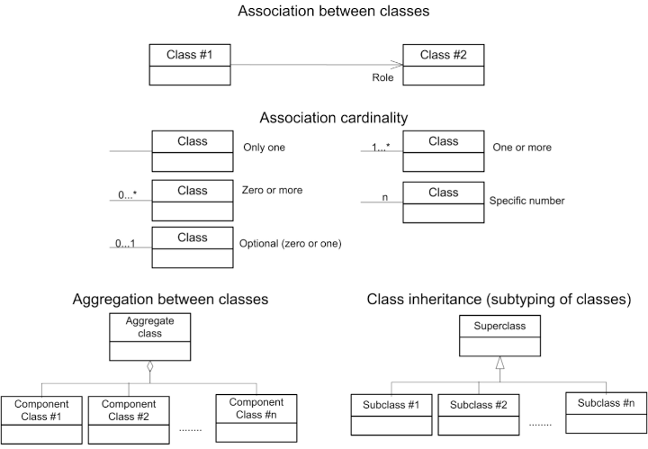
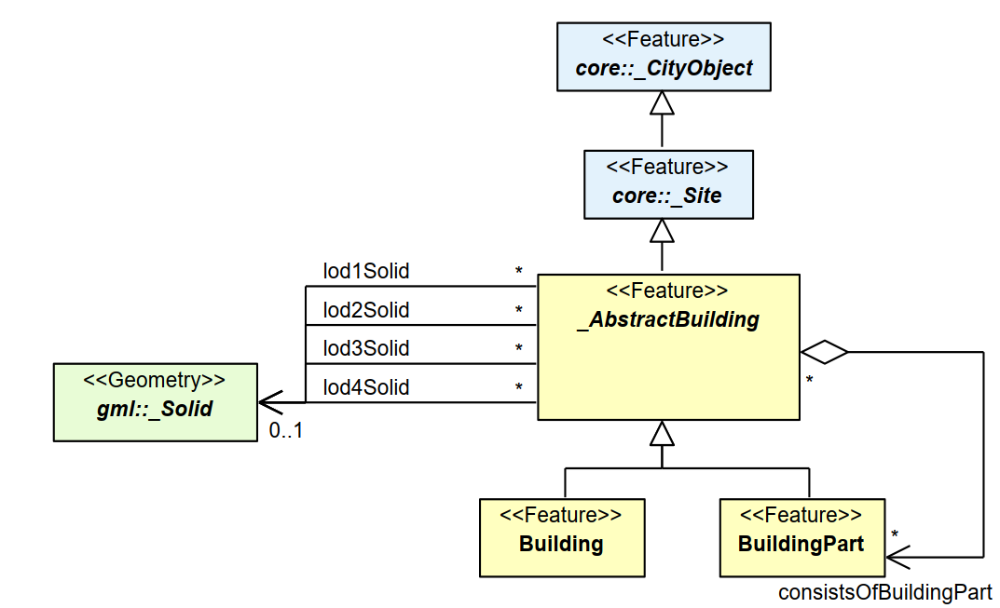

== 约定

=== 术语缩写

本文中使用的缩写如下： 
[width="80%",options="header",caption=""]
|====================
|缩写 |英文全称|中文对应解释 
|2D |Two Dimensional|二维
|3D |Three Dimensional|三维
|AEC |Architecture, Engineering, Construction|建筑、工程、施工 
|ALKIS |German National Standard for Cadastral Information|德国地籍信息国家标准
|ATKIS |German National Standard for Topographic and Cartographic Information|德国地形和制图信息国家标准
|B-Rep |Boundary Representation|边界表示法
|bSI |buildingSMART International|国际智慧建筑物联盟
|CAD |Computer Aided Design|计算机辅助设计
|COLLADA |Collaborative Design Activity|协同设计活动
|CSG |Constructive Solid Geometry|构造实体几何
|DTM |Digital Terrain Model|数字地形模型
|DXF |Drawing Exchange Format|图形交换格式
|EuroSDR |European Spatial Data Research Organisation|欧洲空间数据研究组织
|ESRI |Environmental Systems Research Institute|环境系统研究所
|FM |Facility Management|设施管理
|GDF |Geographic Data Files|地理数据文件
|GDI-DE |Spatial Data Infrastructure Germany (Geodateninfrastruktur Deutschland)|德国空间数据基础设施
|GDI NRW |Geodata Infrastructure North-Rhine Westphalia|北莱茵河威斯特伐利亚地理数据基础设施
|GML |Geography Markup Language|地理标记语言
|IAI |International Alliance for Interoperability (now buildingSMART International (bSI))|国际互操作联盟（现已更名为国际智慧建筑物联盟）
|IETF |Internet Engineering Task Force|互联网工程特别工作组
|IFC |Industry Foundation Classes|工业基础类
|ISO |International Organization for Standardisation|国际标准化组织
|LOD |Level of Detail|细节层次模型
|NBIMS |National Building Information Model Standard|国家建筑信息模型标准
|OASIS |Organisation for the Advancement of Structured Information Standards|国际结构化信息标准推进组织
|OGC |Open Geospatial Consortium|国际开放地理信息协会
|OSCRE |Open Standards Consortium for Real Estate|房地产开放标准联盟
|SIG 3D |Special Interest Group 3D of the GDI-DE|GDI-DE的三维特别兴趣小组
|TC211 |ISO Technical Committee 211|ISO 211技术委员会
|TIC |Terrain Intersection Curve|地形相交曲线
|TIN |Triangulated Irregular Network|不规则三角网
|UML |Unified Modeling Language|统一建模语言
|URI |Uniform Resource Identifier|统一资源标识符
|VRML |Virtual Reality Modeling Language|虚拟现实建模语言
|W3C |World Wide Web Consortium|万维网联盟
|W3DS |OGC Web 3D Service|OGC网络三维服务
|WFS |OGC Web Feature Service|OGC网络要素服务
|X3D |Open Standards XML-enabled 3D file format of the Web 3D Consortium|Web3D联盟支持XML的3D文件开放标准
|XML |Extensible Markup Language|可扩展标记语言
|xAL |OASIS extensible Address Language|OASIS可扩展地址语言
|====================

=== UML表示法
在本文档中，使用统一建模语言（UML）静态结构图（见Booch et al. 1997）形式呈现CityGML标准，使用的UML表示法如下图1所示。 

[[figure-1]]
.UML符号图（详见ISO TS 19103，地理信息-概念模式语言）

根据GML3, CityGML中所有模型元素间的关联均为单向的。因此，CityGML中的关联只能单向导航。导航的方向以箭头表示。通常，关联中的元素，所使用的上下文由其角色进行指定。角色会显示在关联目标的附近。如果图形表示不明确，则必须将角色的位置绘制到关联所指向的元素上。

使用到的模板如下： 

* &#171;Geometry&#187;表示对象的几何形状。几何图形是从抽象GML类型 _AbstractGeometryType_ 派生的可识别和可区分对象。 +
* &#171;Feature&#187;表示根据ISO 19109定义的主题要素。要素是从抽象GML类型 _AbstractFeatureType_ 派生的可识别和可区分对象。 +
* &#171;Object&#187;表示从抽象GML类型 _AbstractGMLType_ 派生的可识别和可区分对象。 +
* &#171;Enumeration&#187;在指定文字值的固定列表中，枚举有效的属性值。枚举在CityGML模式中由内联指定。 +
* &#171;CodeList&#187;枚举有效的属性值。与枚举不同，值列表是开放的，因此在CityGML模式中没有给出。可以在外部代码列表中提供允许的值。建议按照GML3.1.1简单字典配置文件(参见第6.6章和第10.14章)将代码列表实现为简单字典。 +
* &#171;Union&#187;是一个属性列表。其语义是，在任何时候只能使用一个一个属性。 +
* &#171;PrimitiveType&#187;作为实现中原始类型支持的表示。 +
* &#171;DataType&#187;作为一组缺乏标识符的值的描述符。数据类型包括原始预定义类型和用户可定义类型。因此，数据类型是只有很少或无操作的类别，其主要目的是保存另一个类的抽象状态，用于传输、存储、编码或长期存储。 +
* &#171;Leaf&#187;是在UML包图中使用，表示没有其他子类型。 +
* &#171;XSDSchema&#187;在UML包图中使用，表示包含特定命名空间的所有定义的XSD模式的根元素。所有包内容或组件类都放在一个模式中。 +
* &#171;ApplicationSchema&#187;在UML包图中使用，表示XML模式定义从根本上依赖于XML模式元语言中另一个独立标准概念。例如，ApplicationSchema表示GML的扩展符合GML的“应用模式规则”。

为了增强CityGMLUML图表的可读性，如果类属于不同的UML包，则用不同的颜色描述（见图8 UML包的概述）。配色方案如下:

- [yellow]#标为黄色的类# 属于UML包讨论的主题。例如，在介绍 _CityGML Core_ 模块的10.1章中，黄色用来表示 _CityGML Core_ UML包中定义的类。同样，在10.3章UML图中显示的黄色类是该章中 _Building_ 模块讨论的主题。

- [blue]#标为蓝色的类# 与黄色相关联的包不同。为明确表示这些类，它们的类名称带有一个命名空间前缀，在整个规范中与CityGML模块唯一相关联（参见4.3节中命名空间和前缀列表）。例如，在 _Building_ 模块的上下文中，_CityGML Core_ 模块中的类被标为蓝色，它们的类名前面有前缀 _core_ 。

- [green]#标为绿色的类# 是在GML3中定义的，它们的类名前面有 _gml_ 前缀。
 
以下的UML图表示例展示了本规范中使用的UML表示法和配色方案。在本例中，黄色类与CityGML建筑模块相关联，蓝色类是 _CityGML Core_ 模块，绿色类表示GML3定义的几何元素。

[[figure-2]]
.展示了整个CityGML规范中使用的UML符号和配色方案的UML示例图

=== XML命令空间和命令空间前缀

CityGML数据模型按主题分解为核心模块和主题扩展模块。包括核心在内的所有模块都由其自身的XML模式文件指定，每个都定义了全局唯一的XML命名空间。扩展模块基于核心模块，因此包含（通过参考）CityGML核心模式。

在本文档中，模块命名空间与推荐的前缀相关联。这些前缀在本规范的规范性部分中统一使用，用于所有UML图和CityGML实例文档示例。表1中列出了CityGML核心模块和扩展模块及其XML命名空间标识符和推荐的命名空间前缀。

.表1: CityGML模块列表，其关联的XML命名空间标识符，以及命名空间前缀示例
[width="80%",options="header",caption=""]
|====================
|CityGML模块 |命名空间标识符|命名空间前缀
|CityGML核心 |http://www.opengis.net/citygml/2.0 |core
|外观|http://www.opengis.net/citygml/appearance/2.0  |app
|桥梁|http://www.opengis.net/citygml/bridge/2.0  | brid
|建筑|http://www.opengis.net/citygml/building/2.0  | bldg
|城市家具|http://www.opengis.net/citygml/cityfurniture/2.0 |frn
|城市对象群组 | http://www.opengis.net/citygml/cityobjectgroup/2.0 | grp
|泛型 | http://www.opengis.net/citygml/generics/2.0 | gen
|土地利用 | http://www.opengis.net/citygml/landuse/2.0 | luse
|地形 | http://www.opengis.net/citygml/relief/2.0 | dem
|交通设施 | http://www.opengis.net/citygml/transportation/2.0 | tran
|隧道 | http://www.opengis.net/citygml/tunnel/2.0 | tun
|植被 | http://www.opengis.net/citygml/vegetation/2.0 | veg
|水体 | http://www.opengis.net/citygml/waterbody/2.0 | wtr
|纹理表面 [已弃用] | http://www.opengis.net/citygml/texturedsurface/2.0 | tex
|====================

表2中显示了与该标准相关的XML模式定义，以及本文档中一致使用的相应XML命名空间标识符和命名空间前缀。 

.表2: XML模式定义列表、其相关的XML命名空间标识符，以及本文档中使用的命名空间前缀示例
[width="80%",options="header",caption=""]
|====================
|XML模式定义|命名空间标识符|命名空间前缀
|地理标记语言3.1.1版(来自OGC)|http://www.opengis.net/gml | gml
|可扩展地址语言2.0版(来自OASIS)|urn:oasis:names:tc:ciq:xsdschema:xAL:2.0 | xAL
|Schematron Assertion语言1.5版|http://www.ascc.net/xml/schematron | sch
|====================

=== XML模式

该标准的规范部分使用W3C XML模式语言，来描述符合CityGML数据实例的语法。XML模式是一种具有多种功能的语言。虽然不熟悉XML模式的读者可以按照一般的方式查看描述，但该标准并非用于介绍XML模式。为了充分理解该标准，读者需要对XML模式有一定的了解。 
