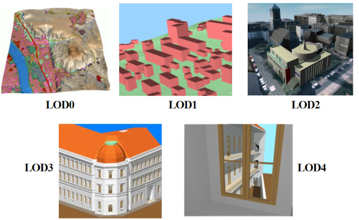

== CityGML一般性特征

=== 模块化

CityGML数据模型由虚拟三维城市模型中最重要的对象类型的类定义组成，这些类在许多不同的应用领域都被认为是必需的或重要的。然而，我们并不需要为了符合标准而去支持整个CityGML数据模型，而是根据实际需求构造一个CityGML数据模型的子集即可。为此，CityGML数据模型采用了模块化结构(参见第7章)。

CityGML数据模型按主题分解为核心模块和主题扩展模块。核心模块包括CityGML数据模型的基本概念和组件，它是任何遵循标准的系统必须实现的。基于核心模块，每个扩展模块涵盖了虚拟三维城市模型的一个特定主题领域。CityGML介绍了以下13个主题扩展模块:外观、桥梁、建筑、城市家具、城市对象组、泛型城市对象、土地土地利用、地形、交通、隧道、植被、水体和纹理表面[已弃用]。

与核心模块相结合的任何扩展模块的任意组合，均是符合CityGML标准的实现。这种模块组合称为CityGML profiles(CityGML专用文件)。因此，CityGML专用文件允许对整个CityGML数据模型进行有效的部分实现。

=== 多尺度建模（5级LOD）

CityGML支持不同级别的LOD。LODs反映了具有不同应用需求的独立数据收集过程。此外，LOD有助于高效可视化和数据分析(如图3所示)。在一个CityGML数据集中，同一物体可以同时用不同的LOD来表示，这样就可以在不同的分辨率下对同一个物体进行分析和可视化。此外，两个包含有不同LOD的同一物体的CityGML数据集可以被合并和整合。然而，用户或应用程序有责任确保不同LOD的物体是指同一个真实世界的物体。

最粗略的LOD0级别基本上是一个2.5维的数字地形模型，上面覆盖着航空图像或地图。在LOD0中，建筑可以用迹线或屋顶边缘多边形来表示。众所周知，LOD1是由带平屋顶结构的棱柱状建筑组成的块状模型。相比之下，LOD2中的建筑有不同的屋顶结构和不同主题的边界表面。LOD3表示有详细的墙和屋顶结构的建筑模型，可能包含门和窗户。LOD4在LOD3的基础上又为建筑物添加了内部结构。例如，LOD4中的建筑由房间、室内门、楼梯和家具组成。在所有的LOD外观信息，如高分辨率纹理可以映射到结构中(参见6.9)。

[[figure-3]]
.CityGML定义的5个LOD等级（来源于IGG Uni BOom）

LOD的特点还包括不同的精度和物体的最小尺寸(参见表3)。本标准中给出的精度要求尚未最终确定，仅作为讨论建议。精度描述为绝对三维点坐标的标准差。在未来版本的CityGML中将增加相对三维点精度，它通常比绝对精度要高得多。在LOD1中，点的定位精度和高度精度应小于等于5m，而所有的对象都应至少为6m × 6m的迹线。LOD2的定位精度和高度精度建议在2m以上，在此LOD中，所有迹线至少是4m × 4m的对象都应该被考虑。LOD3中两种类型的精度都应该是0.5m，建议最小迹线为2m × 2m。最后，LOD4的定位精度和高度精度应优于0.2m。通过这些数据，5个LOD的分类可以用来评估三维城市模型数据集的质量，并使数据集具有可比性，为其整合提供支持。

.表3: CityGML的LOD 0-4及其提出的精度要求(讨论方案，基于: Albert 发布于2003年)。
[width="80%",options="header",caption=""]
|====================
|====================

而在CityGML中，每个对象在每个LOD中都可以有不同的表示，通常同一LOD中的不同对象会被概括为较低LOD中的一个聚合对象来表示。CityGML通过在城市对象之间提供一个明确的概括关联来支持聚合/分解（进一步的细节见第10.1章的UML图）。

=== 连贯语义几何建模

CityGML最重要的设计原则之一是语义和几何/拓扑属性的一致性建模。在语义层，真实世界的实体由要素表示，如建筑、墙壁、窗户或房间。描述还包括要素间的属性、关系和聚合层次结构(部分-整体-关系)。因此，要素之间的部分关系只能在语义层得到，无需考虑几何图形。但是，在空间层面上，几何对象被分配到表示其空间位置和范围的要素中。因此，该模型由两个层次结构组成:语义层和几何层，在这两个层中，相应的对象通过关系关联在一起(参考Stadler & Kolbe 2007)。这种方法的优点是，在语义/或几何查询或执行分析中，可以在语义和几何的两个层次结构中以及在两个层之间任意对象间引用。
如果两个层次都是针对一个特定对象而存在，那么它们必须是一致的(即必须确保它们互相匹配)。例如，如果建筑的墙壁在语义层上有两个窗户和一个门，那么表示墙壁的几何图形也必须包含窗户和门的几何部分。

=== 闭合曲面

没有体积几何模型的物体，必须使用__ClosureSurface__被虚拟封闭以计算其体积（例如人行地下通道或飞机库）。一共有13个特殊的表面，当需要计算体积时，它们会被考虑进去，而当它们不相关或不合适时，例如在可视化中，就会被忽略。

闭合面的概念也被用来对地下物体的入口进行建模。隧道或人行地下通道等物体必须被建模成封闭的实体，用于计算其体积，例如在洪水模拟。地下物体的入口也必须封闭，以避免数字地形模型中的洞(见图4)。但是，在近距离可视化中，入口必须开放。因此，闭合面是建模这些入口的合理方法。

[[figure-4]]
.闭合曲面封闭开放结构。通道是地下物体(左)。入口被虚拟闭合曲面封闭，它既是DTM的一部分，也是地下物体的一部分(右)(图:IGG Uni Bonn)。

=== 地形相交曲线（TIC）

城市建模的一个关键问题是三维物体和地形的整合。比如，将不同LOD的地形和三维物体结合起来，或者它们来自不同的供应商，经常会出现三维物体漂浮在地形上或沉入地形中这种问题（Kolbe和Gröger 2003）。为了克服这个问题，引入了三维物体的地形交汇曲线（__TerrainIntersectionCurve__）。这些曲线表示地形与三维物体接触的确切位置（见图5）。TIC可以应用于建筑物和建筑物部件（参见第10.3章）、桥梁、桥梁部件和桥梁建筑元素（参见第10.5章）、隧道和隧道部件（参见第10.4章）、城市家具对象（参见第10.9章）和一般城市对象（参见第10.12章）。例如，如果一个建筑物有一个庭院，那么TIC由两个封闭的环组成：一个环代表庭院的边界，另一个环描述建筑物的外部边界。这些信息可以用来整合建筑和地形，通过 "拉高 "或 "拉低 "周围的地形来适应地形交汇曲线，或者局部扭曲DTM以适应TIC。通过这种方式，TIC也确保了纹理的正确定位或物体纹理与DTM的匹配。由于不同LOD上与地形的相交点可能有所不同，一个三维对象对于所有LOD可能有不同的__TerrainIntersectionCurve_。

[[figure-5]]
.建筑物（左边，黑色）和隧道物体（右边，白色）的地形交叉曲线。隧道的中空空间被一个三角形的__ClosureSurface__密封（图形：IGG Uni Bonn）。
image::figures/clause_6/Fig5.jpg[align="center"]

=== 枚举属性代码表

CityGML要素类型通常包括一些属性，它们的值可以在离散值列表中枚举。例如，建筑的屋顶类型属性，其属性值通常为鞍形屋顶、四坡屋顶、半四坡屋顶、平屋顶、单斜面屋顶或帐篷屋顶。如果这样的属性作为字符串输入，则相同概念的拼写错误或不同名称会阻碍互操作性。此外，可能的属性值列表往往不是固定的，而且可能因不同的国家(例如，国家法律和条例规定)和不同的信息社区而有很大的不同。

在CityGML中，这些枚举属性的类型是__gml:CodeType__，其所允许的属性值可以在CityGML模式之外指定的代码列表中提供。一个代码列表包含了已编码的属性值，并确保相同的代码用于相同的概念或者框架。如果为一个枚举性属性提供了一个代码表，那么该属性只能从这个列表中取值。这允许应用程序验证属性值，从而促进语义和语法上的互操作性。我们建议按照GML 3.1.1简单字典的规定，将代码表作为简单字典来实现（参见Whiteside 2005）。

代码表的管理与CityGML模式和规范的管理是脱钩的。因此，代码表可以由任何组织或信息社区根据他们的信息需求来指定。每个代码表应该有一个权威机构，负责代码表的值和代码表的维护。关于CityGML代码表机制的进一步信息，见第10.14章。

代码列表可以参考现有的模型。例如，可以参考房地产开放标准联盟（OSCRE）定义的房间代码，也可以使用国家建筑信息模型标准（NBIMS）引入的建筑和建筑部分的分类方法。附件C包含了SIG 3D为CityGML中几乎所有的枚举性属性提出的非规范性代码列表。它们可以在CityGML实例文件中直接引用，并作为定义代码表的一个例子。

=== 外部引用

三维对象通常来自于其他数据库或数据集中的对象，或者与之有关系。例如，一个三维建筑模型可能是由地籍数据集中的二维迹线构建的，也可能是由建筑模型衍生出来的（图6）。如果必须传播更新或需要额外的数据，例如地籍信息系统中建筑物所有者的姓名和地址,或设施管理系统中的天线和门的信息，那么三维物体对其在外部数据集中的相应物体的引用是至关重要的。为了提供这些信息，每个__ _CityObject__可以使用__ExternalReference__的概念来引用外部数据集（UML图见图21；XML模式定义见附件A.1）。这种引用表示外部信息系统和该系统中对象的唯一标识符<两者都被指定为统一资源标识符（URI），这是对互联网上任何类型资源的引用的通用格式。外部引用的通用概念允许任何__ _CityObject__与外部信息系统中的相应对象（如ALKIS、ATKIS、OS MasterMap®、GDF等）有任意数量的链接。

[[figure-6]]
.外部引用（图片：IGG Uni Bonn）。

=== 城市对象组

CityGML的分组概念允许根据用户定义的标准对任意的城市对象进行聚合，并将这些聚合作为城市模型的一部分来表示和传输（UML图见OGC 12-019 Copyright © 2012 Open Geospatial Consortium. 15 第10.11章；XML模式定义见附件A.6）。) 一个组可以被赋予一个或多个名称，并可以通过特定的属性进一步分类，例如，"在一个火灾场景中，第43号房1212房间的逃生路线"作为名称，"逃生路线"作为类型。该组的每个成员可以选择被分配一个角色名称，该名称指定该特定成员在该组中扮演的角色，这个角色名称可以描述这个物体在逃生路线中的序列号，或者在一个建筑群的情况下表示主楼。

一个组可以包含其他组作为其成员，允许任意深度的嵌套分组。分组概念由CityGML的主题扩展模块__CityObjectGroup__提供(参见第10.11章)。

=== 外观

在虚拟三维城市模型中，表面的外观信息，即表面的可观察属性，被认为是除语义和几何图形之外的重要组成部分。外观涉及任何基于表面的主题信息，例如红外辐射或噪音污染，而不仅仅限于视觉属性。因此，外观提供的数据可以作为输入，用于在虚拟三维城市模型中进行展示和分析。

CityGML支持每个城市模型任意数量的主题的要素外观。每个要素的LOD可以有单独的外观。外观可以表示纹理和地理参考纹理。CityGML的外观模型被封装在自己的扩展模块__Appearance__中(参见第9章)。

=== 原型对象/场景图概念

在CityGML中，像树木、交通灯、及交通标志等形状相同的对象可以表示为原型，在不同的位置多次实例化（图7）。原型的几何形状是在本地坐标系中定义的。每个实例都由一个对原型的引用、世界坐标参考系中的一个基点和一个便于原型缩放、旋转和平移的变换矩阵来表示。这一原则来自于计算机图形标准（如VRML和X3D）中使用的场景图的概念。由于GML3几何模型没有提供对场景图概念的支持，它被作为GML3几何模型的一个扩展来实现（进一步的描述参见第8.2章）。

[[figure-7]]
.原型形状的例子（来源：莱茵金属防御电子公司）。
image::figures/clause_6/Fig7.jpg[align="center"]

=== 通用城市对象和属性

CityGML被设计成一个通用的地形信息模型，定义了对广泛的应用有用的对象类型和属性。在实际应用中，特定的三维城市模型中的对象很可能包含CityGML中没有明确建模的属性，此外，可能有一些三维物体没有被CityGML的主题类所覆盖。对此，CityGML提供了两种不同的概念来支持这些数据的交换。1）通用对象和属性，以及2）应用领域扩展（参见6.12章）。

通用对象和属性的概念允许在运行期间对CityGML应用程序进行扩展，即任何__ _CityObject_都可以由额外的属性来增加，这些属性的名称、数据类型和值可以由运行中的应用程序提供，而无需对CityGML的XML模式进行任何改变。同样，没有被CityGML数据模型的预定义主题类所代表的特征也可以使用通用对象进行建模和交换。CityGML的通用扩展是由主题扩展模块__Generics__提供的（参见第10.12章）。

CityGML的当前版本不包括诸如路堤、挖掘和城墙等明确主题模型，对于这些对象，可以使用通用对象和属性进行存储或交换。

=== 应用领域扩展（ADE）

应用领域扩展(ADE)是对CityGML数据模型的补充。这些补充包括在现有CityGML类中引入新属性，例如建筑的居民数量或新对象类型的定义。ADE与通用对象和属性之间的区别是，ADE必须被定义在一个额外的XML模式定义文件中，有它自己的命名空间。这个文件必须明确地导入扩展的CityGML模块的XML模式定义。

这种方法的优点是，扩展是正式规定的。扩展的CityGML实例文件可以根据CityGML和各自的ADE模式进行验证。ADEs可以由对特定应用领域感兴趣的信息团体来定义（甚至是标准化）。在同一个数据集中可以积极使用一个以上的ADE（进一步描述见第10.13章）。

ADE可以为一个甚至几个CityGML模块定义，为CityGML数据模型添加附加信息提供了高度的灵活性。因此，ADE机制是与CityGML的模块化方法正交的。因此，没有单独的ADE的扩展模块。

在本规范中，包括了两个ADE的例子。

* 噪声排放模拟的ADE（附件H）：根据欧盟委员会的环境噪声指令（2002/49/EC），用于模拟环境噪声的扩散；

* 泛在网络机器人服务的ADE（附件I）：展示了CityGML在室内环境中机器人导航的使用。

ADE的其他例子有：用于设施管理的__CAFM ADE__（Bleifuß等人，2009）、用于多设施网络及其相互依存关系的综合三维建模的__UtilityNet- workADE__（Becker等人，2011）、用于水文应用的__HydroADE__（Schulte和Coors，2008）以及__GeoBIM（IFC）ADE__（van Berlo等人，2011），它结合了IFC（来自BSI）和CityGML的BIM信息，并在开源模型服务器BIMserver.org中实施。