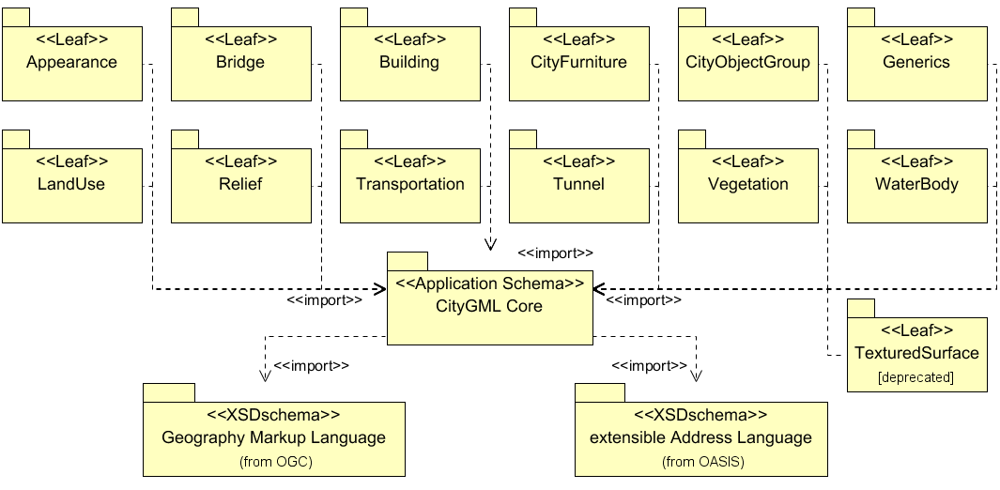

== 模块化

CityGML在其数据模型的主题和几何拓扑级别上都是一个丰富的标准。在其主题级别上，CityGML定义了城市中最相关的地形对象的类和关系，以及包含建筑结构、高程、植被、水体、城市家具等的区域模型。除了几何和外观内容之外，这些主题组件还允许在不同的应用领域(如模拟、城市数据挖掘、设施管理和主题查询)中使用虚拟3D城市模型来完成复杂的分析任务。

CityGML是一个框架，为地理空间三维数据提供了足够的空间，让其在生命周期内可以在几何、拓扑和语义方面增长。因此，城市对象的几何和语义可以被灵活地结构化，从纯粹的几何数据集到复杂的有几何拓扑和空间语义的数据。通过这种方式，CityGML定义了一个适用于3D城市建模的连续过程、具有单一的对象模型和数据交换的格式，建模过程从几何数据获取、数据分类到特定终端用户应用的数据准备，允许迭代数据丰富和无损信息交换(cf. Kolbe et al. 2009)。

基于这个框架，应用程序不需要支持所有的CityGML主题字段以符合标准，但可以使用与应用领域或过程步骤相关需求对应的构造子集。CityGML逻辑子集的使用限制了整体数据模型的复杂性，并明确允许实现有效部分。对于CityGML标准的2.0版本，CityGML模块定义并包含了数据模型的子集。CityGML模块是标准的集合，由一个符合标准的系统作为整体。CityGML由一个核心模块和若干主题扩展模块组成。

CityGML核心模块定义了CityGML数据模型的基本概念和组件。它被看作是整个CityGML数据模型的通用下限，是所有主题扩展模块的基础。因此，核心模块是唯一的，且任何符合要求的系统都必须实现。基于CityGML核心模块，每个扩展模块都包含一个逻辑上独立的CityGML数据模型主题组件。核心的扩展是通过对整个CityGML数据模型进行垂直切片而得到的。由于每个扩展模块都包含（或引用）核心模块，因此它的概念和组件对所有扩展模块都是通用的。CityGML标准2.0版引入了以下13个主题扩展模块。它们与本文档的条款相关，每个条款都涵盖了CityGML相应的主题领域：

* 外观（参见第9条），
* 桥梁（参见第10.5条），
* 建筑 (参见第10.3条），
* 城市家具（参见第10.9条），
* 城市对象组合（参见第10.11条），
* 通用（参见第10.12条），
* 土地利用（参见第10.10条），
* 地形（参见第10.2条），
* 交通（参见第10.7条），
* 隧道（参见第10.4条），
* 植被（参见第10.8条），
* 水体（参阅第10.6条），和
* 带纹理的表面[已弃用]（参见第9.8条)

CityGML数据模型的按主题模块进行分解，允许实施者支持扩展模块与核心模块的任意组合。因此，扩展模块可以根据应用或应用领域的信息需求而任意组合。一个模块的组合称为CityGML专用文件（profiles）。所有模块的联合体被定义为CityGML基本专用文件（base profile）。基本专用文件在任何时候都是唯一的，并形成了整个CityGML数据模型的上限。任何其他CityGML专用文件必须是基本专用文件的有效子集。通过遵循CityGML模块和专用文件，CityGML的部分数据模型以一种定义明确的方式实现是有效的。

至于未来的发展，每个CityGML模块都可以由专家小组和信息社区独立地进一步发展。由此产生的对模块的建议和更改可能会被引入到CityGML标准的修订中，而不会影响其它模块的有效性。此外，当前CityGML数据模型未覆盖的主题组件可以通过主题扩展模块添加到标准的未来版本中。这些扩展模块可与任何其它现有的CityGML模块建立依赖关系，但至少应依赖于CityGML核心模块。因此，随着新扩展模块的添加，CityGML基本专用文件可能也会变化。但是，如果一个特定的应用程序需要的建模和交换的信息超出了CityGML数据模型的范围，这些应用数据也可以使用CityGML的 __Application Domain Extension__ 机制（参见第10.13条）或使用通用城市对象和属性（参见第10.12章）纳入现有模块中。

引入的模块化方法支持CityGML作为数据建模框架和通用数据交换格式，以解决各种应用领域和三维城市建模的不同步骤。为了清晰起见，应用程序应该通过声明所使用的CityGML专用文件来宣布与CityGML标准的一致性水平。由于核心模块是所有专用文件的一部分，这应该通过列举已实现的主题扩展模块来实现。例如，如果一个实现除了支持核心模块外，还支持 __Building__、 __Relief__ 和 __Vegetation__ 模块，则应该通过“CityGML [Building,Relief,Vegetation]”来表示。如果支持基本专用文件，则应该用“CityGML [full]”表示。

=== CityGML核心和扩展模块

每个CityGML模块都由自己的XML模式定义文件指定，并被定义在一个单独且全局唯一的XML目标命名空间中。根据模块之间的依赖关系，每个模块还可以导入与CityGML相关模块关联的命名空间。但是，一个命名空间不能直接包含在两个模块中。因此，所有属于一个模块的元素都只与该模块的命名空间相关联。通过这种方式，保证了模块元素在CityGML实例文档中被适当地分离和区分。

与1.0之前的CityGML版本相比，前面提到的命名空间约定给数据文件带来了额外的复杂性，因为不再有单独的CityGML命名空间。相反，不同CityGML模块的组件以及不同命名空间的组件可以任意混合在同一个CityGML实例文档中。此外，一个应用程序可能必须要解析包含模块元素的实例文档，而这些模块本身并不被应用程序所采用。不过，这些解析问题可以很容易地被非“模型感知”的应用程序克服，即那些不以通用方式解析和解释GML应用模式的应用程序。来自不同命名空间的与应用程序所使用的CityGML专用文件所声明的不同的元素，可能会被跳过。在使用CityGML的应用领域扩展机制（参见第10.13条）时，必须进行类似的观察。

CityGML标准的2.0版本，没有两个互相依赖的主题扩展模块，所有的扩展模块都是真正相互独立的。然而，CityGML核心模块是任何扩展模块的依赖项，这意味着定义扩展的每个XML模式文件都要导入核心模块的XML模式文件。

图8使用UML包图说明了CityGML模块之间的依赖关系。每个模块都由一个包表示，包名与模块名对应。图中的虚线箭头表示箭头尾部的模式依赖于箭头头部的模式。对于CityGML模块，当一个模式<import>另一个模式以及相应的XML命名空间时会产生依赖关系。例如，扩展模块建筑导入CityGML核心模块的模式。表4给出了每个模块的简短描述。

[[figure-8]]
.展示CityGML独立模块及其模式依赖关系的UML包图。每个扩展模块（由叶子包表示）进一步导入GML 3.1.1模式定义，以表示其主题类的空间属性。为了便于阅读，省略了相应的依赖项。

.表4: CityGML核心和主题扩展模块概述
[width="100%",options="",caption=""]
|====================
|模块名称          | CityGML核心
|XML命名空间标识符  | http://www.opengis.net/citygml/2.0 
|XML模式文件       | cityGMLBase.xsd  
|建议的命名空间前缀 | core 
|模块说明          | _CityGML core_ 模块定义了CityGML数据模型的基本组件。主要包括抽象基类，从这些基类可以（传递）派生所有主题类。但是，在核心模块中定义了多个扩展模块常见的非抽象内容，例如基本数据类型。
核心模块导入了GML 3.1.1版本的XML模式定义文件和OASIS可扩展地址语言xAL
|====================

[width="100%",options="",caption=""]
|====================
|模块名称          | 外观
|XML命名空间标识符  | http://www.opengis.net/citygml/appearance/2.0 
|XML模式文件       | appearance.xsd  
|建议的命名空间前缀 | app 
|模块说明          | _Appearance_ 模块提供了对CityGML特征外观进行建模的方法，即特征表面的可观察属性。可以为每个城市对象存储外观数据。因此，在核心模块中定义的抽象基类 __CityObject_ ，基于CityGML的 __Application Domain Extension__  机制的附加属性进行扩充。因此， _Appearance_ 模块直接影响所有主题扩展模块。
|====================

[width="100%",options="",caption=""]
|====================
|模块名称          | 桥梁
|XML命名空间标识符  | http://www.opengis.net/citygml/bridge/2.0 
|XML模式文件       | bridge.xsd  
|建议的命名空间前缀 | brid 
|模块说明          |  _Bridge_ 模块允许对桥梁的主题和空间属性、桥梁部件、桥梁安装和内部桥梁结构的四个细节层次(LOD 1 - 4)进行表达。
|====================

[width="100%",options="",caption=""]
|====================
|模块名称          | 建筑
|XML命名空间标识符  | http://www.opengis.net/citygml/building/2.0
|XML模式文件       | building.xsd  
|建议的命名空间前缀 | bldg 
|模块说明          |  _Building_ 模块允许在五个细节层次（LOD 0-4）中表达建筑的主题和空间属性，建筑部件，建筑装置和室内建筑结构。
|====================

[width="100%",options="",caption=""]
|====================
|模块名称          | 城市家具
|XML命名空间标识符  | http://www.opengis.net/citygml/cityfurniture/2.0
|XML模式文件       | cityFurniture.xsd  
|建议的命名空间前缀 | frn 
|模块说明          |  _CityFurniture_ 模块用于表达城市中的城市家具对象。城市家具是不可移动的物体，如灯笼、交通标志、广告栏、长凳或公共汽车站，可以在交通区、居民区、广场或建筑区找到。
|====================

[width="100%",options="",caption=""]
|====================
|模块名称          | 城市对象组合
|XML命名空间标识符  | http://www.opengis.net/citygml/cityobjectgroup/2.0
|XML模式文件       | cityObjectGroup.xsd  
|建议的命名空间前缀 | grp 
|模块说明          |  _CityObjectGroup_ 模块为CityGML提供了一个分组概念。可以根据用户自定义的标准将任意城市对象聚合到组中，表达和传递城市模型的一部分。一个组可以根据特定的属性进一步分类。
|====================

[width="100%",options="",caption=""]
|====================
|模块名称          | 通用
|XML命名空间标识符  | http://www.opengis.net/citygml/generics/2.0
|XML模式文件       | generics.xsd  
|建议的命名空间前缀 | gen 
|模块说明          |  _Generics_ 模块提供了对CityGML数据模型的通用扩展，可用于建模和交换CityGML预定义的主题类没有涵盖的其他属性和特性。但是，只有当其他任何CityGML模块没有提供适当的主题类或属性时，才使用通用扩展。
为了表达通用属性， _Generics_ 模块基于CityGML的 __Application Domain Extension__  机制的附加属性扩充了核心模块中定义的城市对象抽象基类 __CityObject_ 。因此， _Generics_ 模块会对所有主题扩展模块产生影响。
|====================

[width="100%",options="",caption=""]
|====================
|模块名称          | 土地利用
|XML命名空间标识符  | http://www.opengis.net/citygml/landuse/2.0
|XML模式文件       | landUse.xsd  
|建议的命名空间前缀 | luse 
|模块说明          |  _LandUse_ 模块表达地表特定土地用途的区域。
|====================

[width="100%",options="",caption=""]
|====================
|模块名称          | 地形
|XML命名空间标识符  | http://www.opengis.net/citygml/relief/2.0
|XML模式文件       | relief.xsd  
|建议的命名空间前缀 | dem 
|模块说明          |  _Relief_ 模块在城市模型中表达地形。CityGML支持不同级别的地形表示，反映不同的精度或分辨率。地形可以是一个规则的栅格或网格，如TIN，断线，和离散多点。
|====================

[width="100%",options="",caption=""]
|====================
|模块名称          | 交通
|XML命名空间标识符  | http://www.opengis.net/citygml/transportation/2.0
|XML模式文件       | transportation.xsd  
|建议的命名空间前缀 | tran 
|模块说明          |  _Transportation_ 模块表达城市内的交通特征，如道路、轨道、铁路或广场。交通特征可以是线性网络或通过几何描述的三维表面。
|====================

[width="100%",options="",caption=""]
|====================
|模块名称          | 隧道
|XML命名空间标识符  | http://www.opengis.net/citygml/tunnel/2.0
|XML模式文件       | tunnel.xsd  
|建议的命名空间前缀 | tun 
|模块说明          |  _Tunnel_ 模块以四层细节（LOD 1-4）的形式表达隧道、隧道部件、隧道装置和内部隧道结构的主题和空间。
|====================

[width="100%",options="",caption=""]
|====================
|模块名称          | 植被
|XML命名空间标识符  | http://www.opengis.net/citygml/vegetation/2.0
|XML模式文件       | vegetation.xsd  
|建议的命名空间前缀 | veg 
|模块说明          |  _Vegetation_ 模块提供了主题类来表达植被对象。CityGML的植被模型分为单独的植被对象（如树木）和植被区域（如森林或其他植物群落）。
|====================

[width="100%",options="",caption=""]
|====================
|模块名称          | 水体
|XML命名空间标识符  | http://www.opengis.net/citygml/waterbody/2.0
|XXML模式文件       | waterbody.xsd  
|建议的命名空间前缀 | wtr 
|模块说明          |  _WaterBody_ 模块表达河流、运河、湖泊和盆地的主题和三维几何图形，但没有继承任何水文或其他动态信息。
|====================

[width="100%",options="",caption=""]
|====================
|模块名称          | 纹理表面[已弃用]
|XML命名空间标识符  | http://www.opengis.net/citygml/texturedsurface/2.0
|XML模式文件       | texturedSurface.xsd  
|建议的命名空间前缀 | tex 
|模块说明          |  _TexturedSurface_ 表面模块为3D表面提供视觉外观属性（颜色，光泽，透明度）和纹理。由于建模方法的固有限制，该模块被标记为已弃用，预计未来的CityGML版本中被删除。此模块提供的外观信息可以转换为CityGML的 _Appearance_ 模块，不会丢失信息。因此， *强烈建议* 不要使用 _TexturedSurface_ 模块。
|====================

=== CityGML专用文件（profile）

CityGML专用文件是主题扩展模块与CityGML核心模块之间的一个任意组合。每个CityGML实例文档应使用与所提供数据相适应的CityGML专用文件。一般来说，在实例文档中使用CityGML专用文件有两种方法:

. *CityGML专用文件的定义内嵌在CityGML实例文档中* +
可以使用在XML模式实例命名空间 http://www.w3.org/2001/XMLSchema-instance （通常与前缀 _xsi_ 相关联）中定义的 _schemaLocation_ 属性，将CityGML专用文件绑定到实例文档。 _xsi:schemaLocation_ 提供了一种定位实例文档中定义的命名空间的XML模式定义的方法。它的值是一个由空格分隔的统一资源标识符（URIs）列表，其中每一对包含一个命名空间，后面跟着该命名空间的XML模式定义的位置，通常是一个.xsd文件。
通过这种方式，各个CityGML模块的命名空间应在CityGML实例文档中定义。这个 _xsi:schemaLocation_ 属性提供每个模块各自的XML模式定义的位置。附件G中给出的所有示例文件都遵循第一种方法。 +
. *CityGML专用文件的定义由单独的XML模式定义文件提供* +
CityGML专用文件也可以由它自己的XML模式文件指定。这个模式文件应该通过导入相应的XML模式定义来组合适当的CityGML模块。为此，应使用XML模式命名空间中定义的 _import_ 元素 http://www.w3.org/2001/XMLSchema （通常与前缀 _xs_ 相关联）。对于 _xs:import_ 元素，须声明导入的CityGML模块的命名空间以及命名空间的XML模式定义的位置。为了将CityGML专用文件应用到实例文档，须使用 _xsi :schemaLocation_ 属性将专用文件的模式绑定到实例文档。CityGML专用文件的XML模式文件不得包含其它内容。
专用文件模式的 _targetNamespace_ 应该与导入的CityGML模块的命名空间不同。与专用文件相关联的命名空间应该由实例文档的发起者确定，并且必须以未使用的全局唯一URI的形式给出。专用文件的XML模式文件必须对解析CityGML实例文档的所有人都可用（或在互联网上可访问）。

第二种方法由以下CityGML的基本专用文件的XML模式定义的示例来说明。由于基本专用文件是所有CityGML模块的并集，相应的XML模式定义将导入每个CityGML模块。通过这种方式，CityGML数据模型的所有组件都可以通过引用基本专用文件的实例文档进行交换。基本专用文件的模式定义随CityGML模式包一起提供，可以访问： http://schemas.opengis.net/citygml/profiles/base/2.0/CityGML.xsd 。

[source,xml]
----
<xs:schema xmlns="http://www.opengis.net/citygml/profiles/base/2.0" xmlns:xs="http://www.w3.org/2001/XMLSchema" 
targetNamespace="http://www.opengis.net/citygml/profiles/base/2.0" elementFormDefault="qualified" 
attributeFormDefault="unqualified" version="2.0.0"> 
<xs:import namespace="http://www.opengis.net/citygml/appearance/2.0" 
schemaLocation="http://schemas.opengis.net/citygml/appearance/2.0/appearance.xsd"/> 
<xs:import namespace="http://www.opengis.net/citygml/bridge/2.0" 
schemaLocation="http://schemas.opengis.net/citygml/bridge/2.0/bridge.xsd"/> 
<xs:import namespace="http://www.opengis.net/citygml/building/2.0" 
schemaLocation="http://schemas.opengis.net/citygml/building/2.0/building.xsd"/> 
<xs:import namespace="http://www.opengis.net/citygml/cityfurniture/2.0" 
schemaLocation="http://schemas.opengis.net/citygml/cityfurniture/2.0/cityFurniture.xsd"/> 
<xs:import namespace="http://www.opengis.net/citygml/cityobjectgroup/2.0" 
schemaLocation="http://schemas.opengis.net/citygml/cityobjectgroup/2.0/cityObjectGroup.xsd"/> 
<xs:import namespace="http://www.opengis.net/citygml/generics/2.0" 
schemaLocation="http://schemas.opengis.net/citygml/generics/2.0/generics.xsd"/> 
<xs:import namespace="http://www.opengis.net/citygml/landuse/2.0" 
schemaLocation="http://schemas.opengis.net/citygml/landuse/2.0/landUse.xsd"/> 
<xs:import namespace="http://www.opengis.net/citygml/relief/2.0" 
schemaLocation="http://schemas.opengis.net/citygml/relief/2.0/relief.xsd"/>
<xs:import namespace="http://www.opengis.net/citygml/transportation/2.0" 
schemaLocation="http://schemas.opengis.net/citygml/transportation/2.0/transportation.xsd"/> 
<xs:import namespace="http://www.opengis.net/citygml/tunnel/2.0" 
schemaLocation="http://schemas.opengis.net/citygml/tunnel/2.0/tunnel.xsd"/> 
<xs:import namespace="http://www.opengis.net/citygml/vegetation/2.0" 
schemaLocation="http://schemas.opengis.net/citygml/vegetation/2.0/vegetation.xsd"/> 
<xs:import namespace="http://www.opengis.net/citygml/waterbody/2.0" 
schemaLocation="http://schemas.opengis.net/citygml/waterbody/2.0/waterBody.xsd"/> 
<xs:import namespace="http://www.opengis.net/citygml/texturedsurface/2.0" 
schemaLocation="http://schemas.opengis.net/citygml/texturedsurface/2.0/texturedSurface.xsd"/> 
</xs:schema>
----

下面的CityGML数据集摘录说明了如何应用基本专用文件模式 _CityGML.xsd_ 到CityGML实例文档。该数据集包含两个建筑对象和一个城市对象组合，由CityGML定义基本专用文件 _CityGML.xsd_ 是使用根元素的 _xsi:schemaLocation_ 属性引用的。因此，所有CityGML模块都由实例文档使用，不需要进一步引用CityGML模块的XML模式文档。

[source,xml]
----
<core:CityModel xmlns="http://www.opengis.net/citygml/profiles/base/2.0" 
xmlns:core="http://www.opengis.net/citygml/2.0" 
xmlns:bldg="http://www.opengis.net/citygml/building/2.0" 
xmlns:grp="http://www.opengis.net/citygml/cityobjectgroup/2.0" 
xmlns:gml="http://www.opengis.net/gml" 
xmlns:xAL="urn:oasis:names:tc:ciq:xsdschema:xAL:2.0" 
xmlns:xlink="http://www.w3.org/1999/xlink" 
xmlns:xsi="http://www.w3.org/2001/XMLSchema-instance" 
xsi:schemaLocation="http://www.opengis.net/citygml/profiles/base/2.0 
http://schemas.opengis.net/citygml/profiles/base/2.0/CityGML.xsd"> 
<core:cityObjectMember> 
<bldg:Building gml:id="Build0815"> 
<core:externalReference> 
<core:informationSystem>http://www.adv-online.de </core:informationSystem> 
<core:externalObject> 
<core:uri>urn:adv:oid:DEHE123400007001</core:uri> 
</core:externalObject> 
</core:externalReference> 
<bldg:function 
codeSpace="http://www.sig3d.org/codelists/standard/building/2.0/_AbstractBuilding_function.xml">1000</bldg:function> 
<bldg:yearOfConstruction>1985</bldg:yearOfConstruction> 
<bldg:roofType 
codeSpace="http://www.sig3d.org/codelists/standard//building/2.0/_AbstractBuilding_roofType.xml">1030</bldg:roofType> 
<bldg:measuredHeight uom="#m">8.0</bldg:measuredHeight> 
<bldg:storeysAboveGround>2</bldg:storeysAboveGround> 
<bldg:storeyHeightsAboveGround uom="#m">2.5 </bldg:storeyHeightsAboveGround> 
<bldg:lod2Solid> ... </bldg:lod2Solid> 
</bldg:Building> 
</core:cityObjectMember> 
<core:cityObjectMember> 
<bldg:Building gml:id="Build0817"> 
… 
</bldg:Building> 
</core:cityObjectMember> 
<core:cityObjectMember> 
<grp:CityObjectGroup gml:id="Complex113"> 
<gml:name>Hotel complex 'Scenic View'</gml:name> 
<grp:function>building group</grp:function> 
<grp:groupMember role="main building" xlink:href="#Build0817"/> 
<grp:groupMember xlink:href="#Build0815"/> 
</grp:CityObjectGroup> 
</core:cityObjectMember> 
</core:CityModel>
----
