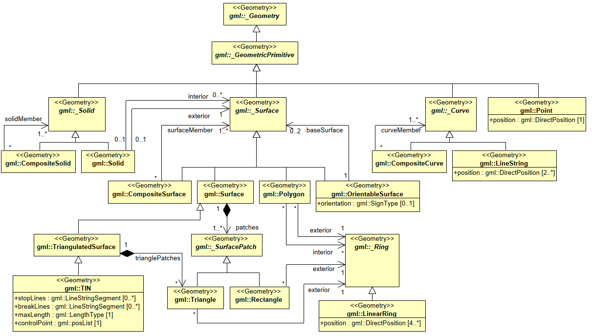
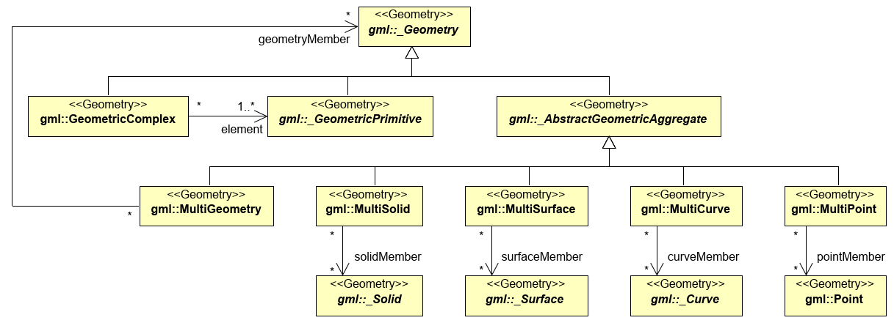
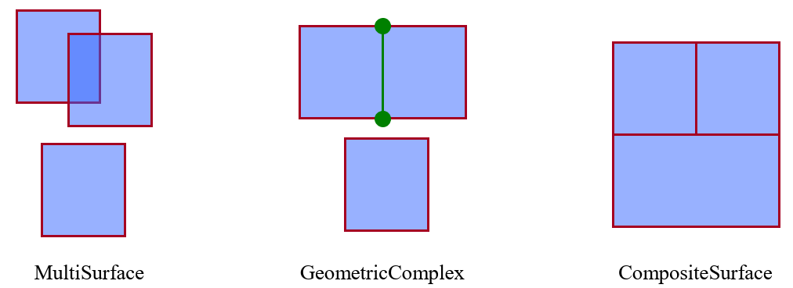
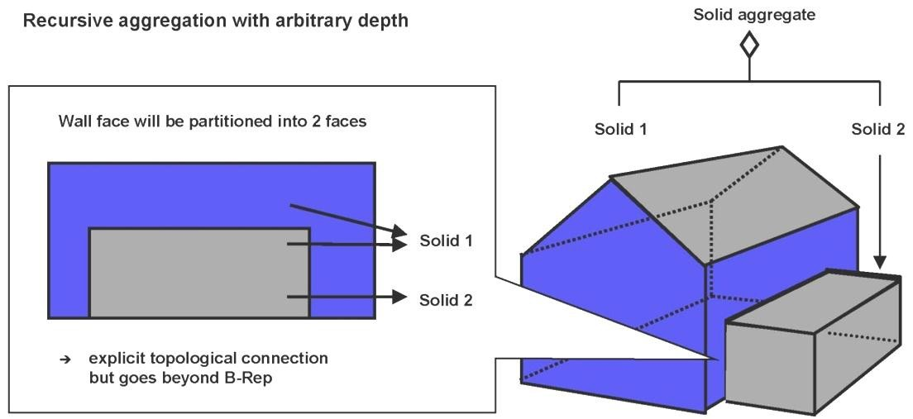
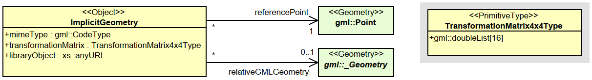

== 空间模型

CityGML要素的空间属性被用GML3几何模型中的对象来表示。该模型基于标准ISO 19107“空间模式”（ Herring 2001），根据公认的边界表示法表示3D几何体（B-Rep，cf.Foley et al.1995）。CityGML实际上只使用GML3 几何包的一个子集，定义GML3的专用文件（profile）。该子集在图9和图10中描绘。此外，GML3的显式边界表示通过场景图概念进行了扩展，该概念允许隐式表示具有相同形状的要素的几何体，从而更有效地表示空间（第8.2章）。

=== 几何拓扑模型

GML3的几何模型由图元组成，图元可以组合成复合体、复合几何或聚合体。对于每个维度，都有一个几何单元：零维对象是一个__Point__，一个一维对象是一条___Curve__，一个二维对象是一个___Surface__,一个三维对象是一个___Solid__（图9）。每个几何图形都有自己的坐标参考系统。一个实体由若干面构成，面由曲线构成。在CityGML中，一条曲线被定义为一条直线，因此只使用GML3的__LineString__类。CityGML中的表面由__Polygons__表达，它定义了一个平面几何，即边界和所有内部点都需要位于一个平面上。

[[figure-9]]
.CityGML几何模型的UML图（GML3的子集和概要）：图元和组合。

组合的几何形状可以是图元的聚合体、复合物（见图11）。对于一个聚合体，组件之间的空间关系不受限制，它们可能是不相交的、重叠的、接触的或不连接的。GML3为每个维度：__MultiPoint__、__MultiCurve__、__MultiSurface__和__MultiSolid__，提供特殊聚合（见图10）。与聚合不同，复合体具有拓扑结构：其组件须不相交，不得重叠，最多允许其边界接触或共享部分边界。复合体是GML3提供的特殊复合物，只能包含相同维度的元素。它的元素也须是不相交的，但边界在拓扑上连接。复合物可以是一个__CompositeSolid__、__CompositeSurface__或__CompositeCurve__。（参见图9）。

[[figure-10]]
.CityGML几何模型的UML图：复合体和聚合体

__OrientableSurface（定向面）__是具有明确方向，即可以区分前后两侧。这可用于将纹理指定给面的特定边，或在边界实体区分曲面的外部和内部。请注意，曲线和面在GML中有一个默认方向，该方向由定义点的顺序决定。因此，如果给定GML几何体的方向必须反转，则只需使用__OrientableSurface__。

__TriangulatedSurfaces（三角面）__是一种特殊的面，它是用来表示地形的不规则三角网。当__TriangulatedSurfaces__是由显式__Triangles__组成时，子类__TIN__通过一组控制点以隐式方式表示三角剖分，定义三角形的节点。可以使用标准三角剖分方法（Delaunay三角剖分）重建三角剖分。此外，打断线和停止线定义了地形轮廓特征。

[[figure-11]]
.组合几何图形

GML3复合模型实现了对应维度的每个单元类型的递归聚合模式。此聚合模式允许定义嵌套聚合（组件层次结构）。例如，建筑几何图形（__CompositeSolid__）可以由房屋几何图形（__CompositeSolid__）和车库几何图形（__Solid__）组成，而房屋几何图形进一步分解为屋顶几何图形（__Solid__）和房屋主体几何图形（__Solid__）。

CityGML提供了拓扑的显式建模，例如在要素或其他几何体之间共享几何体对象。空间的一部分仅由几何体对象表示一次，并由该几何体对象定义或限定的所有要素或更复杂的几何体引用，从而避免了冗余，保持了部件间的显式拓扑关系。基本上有三种情况。首先，两个要素在空间可以由相同的几何体上定义。例如，如果路径既是交通要素又是植被要素，则定义路径的面几何图形将同时由交通对象和植被对象引用。其次，几何图形可以在要素和其他几何单元之间共享。定义建筑墙的几何图元可以被引用两次：通过定义建筑几何图形的实体几何单元和墙要素。第三，两个几何对象可能在边界上引用相同的几何图形。例如，一个建筑和一个相邻的车库可以用两个实体来表达，中间的接触区可以被两个实体引用，但只能表示一次。从图12可以看出，这需要划分各自的表面。通常，边界表示可见的表面。然而，使拓扑邻接显式，并允许删除一个组合对象的一部分，而不在剩余的聚合接触元素中留下洞。
虽然允许接触，但物体的渗透并不是为了避免同一空间的多重表达。但是，在CityGML中使用拓扑是可选的。

为了实现拓扑结构，CityGML使用了GML提供的__XLinks__XML概念。由不同的几何集合或不同的主题要素共享的每个几何对象都被分配了一个唯一的标识符，该标识符可以由使用__href__属性的GML几何属性引用。CityGML不部署内置的GML3拓扑包，后者提供了伴随几何图形的单独的拓扑对象。这种拓扑结构非常复杂精细。当数据集（可能包括或忽略拓扑）应该由相同的数据模型覆盖时，它缺乏灵活性。XLink拓扑简单灵活，几乎与显式的GML3拓扑模型一样强大。然而，XLink拓扑的一个缺点是拓扑连接的对象之间的导航只能单向执行（从聚合到其组件），而不像GML的内置拓扑那样（立即）双向执行。CityGML的拓扑表示示例在附录G.4中列出的数据集中给出。

[[figure-12]]
.CityGML中对象和几何图形的递归聚合（图:IGG Uni Bonn）

下面摘录的CityGML示例文件定义了一个__gml:Polygon__，包含一个__gml:id wallSurface4711__，这是建筑的几何属性__lod2Solid__的一部分。与第一个建筑相邻的另一个建筑在其几何表示中引用了这个共享多边形。

[source,xml]
----
<bldg:Building> 
<bldg:lod2Solid> 
<gml:surfaceMember> 
<gml:Polygon gml:id="wallSurface4711"> 
<gml:exterior> 
<gml:LinearRing> 
<gml:pos srsDimension="3">32.0 31.0 2.5</gml:pos> 
... 
</gml:LinearRing> 
</gml:exterior> 
</gml:Polygon> 
</gml:surfaceMember> 
... 
</bldg:lod2Solid> 
</bldg:Building> 
... 
<bldg:Building> 
<bldg:lod2Solid> 
<gml:surfaceMember> 
<gml:OrientableSurface orientation="-"> 
<gml:baseSurface xlink:href="#wallSurface4711"/> 
</gml:OrientableSurface> 
</gml:surfaceMember> 
... 
</bldg:lod2Solid> 
</bldg:Building>
----

=== 空间参照系

当处理地理信息和虚拟三维城市模型时，精确的空间参考是至关重要的，也是将不同空间数据集集成到一个三维城市模型中的关键。CityGML继承了GML3处理坐标参考系统（CRS）的空间功能，CRS是GML 3.1.1中表示空间参考的常用方式。由于CityGML是一个真正的3D标准，几何元素与3D CRS相关联。只有少数情况CityGML允许引用二维几何元素（例如，在CityGML的__外观__模块中定义的__地理引用纹理__的__参考点__必须是二维的坐标值，参考章节9.4）。

通常，一个几何图形可以通过从抽象GML超类__GML:_Geometry__继承放入属性__srsName__指向其CRS定义。这可能是对权威组织如欧洲石油勘探集团（EPSG）提供的知名CRS定义的引用，也可能是指向在同一个CityGML实例文档中本地定义的CRS的指针。OGC文档“定义标识符URN在OGC命名空间”（cf. Whiteside 2009;OGC Doc. No.07-092r3）为CRS参考资料的URN编码提供最佳方案。其中，它描述了如何引用一个众所周知的3D CRS定义（如3D地理CRS），以及结合了两种或两种以上众所周知的CRS定义（例如，投影CRS用于平面参考，垂直CRS用于高度参考）的复合CRS。在附录G中给出了在CityGML实例文档中表示复合CRS的示例。

GML3还支持工程CRS的定义，这些CRS是在局部环境中使用的。例如，这可能是一个局部的三维笛卡尔坐标系，地球表面近似平地，因此忽略了地球曲率对要素几何的影响（参见GML 3.1.1规范文档的第12.1.4.4章）。局部工程CRS通常应用于AEC/FM领域，因此在将CAD数据或BIM模型集成到三维城市模型中时非常有用。附件 G.9 提供了一个示例，演示了在 CityGML 实例文档中定义工程 CRS 以及在要素几何中使用局部坐标值。工程CRS的定义需要一个锚点，它将本地坐标系的原点与地球表面上的一个点联系起来，以便于本地工程CRS的坐标转换。

根据GML 3.1.1，如果一个几何元素上没有给出__srsName__属性，那么CRS应被指定为这个几何元素所处的更大上下文的一部分，例如一个几何集合。为了方便构造要素和要素集合实例，__gml:Envelope__（或__gml:Box__）上的__srsName__属性的值，也就是特征的__gml:boundedBy__属性的值，应被要素或集合成员的所有属性中所有直接表达的几何元素所继承，除非被本地存在的__srsName__推翻。因此，如果一个几何体使用了与其父要素的__gml:boundedBy__属性相同的CRS，它就没有必要携带__srsName__属性。CRS的继承一直延续到各级深度的嵌套，但是如果被本地的__srsName__所替代，那么新的CRS会被它的所有子代依次继承（参见GML 3.1.1规范文档的8.3章）。

**强烈建议**任何 CityGML 实例文档都要明确指定所有包含的几何元素的 CRS。如果实例文档要在外部与第三方交换或将与其他空间数据集整合，这一点尤为重要。在同一数据集内混合使用不同的CRS是可能的，并且符合GML 3.1.1的要求，而在__CityModel__特征集合上给出的单一CRS引用（参见第10.1章）简化了软件系统对数据集的处理。至于CityGML 2.0，这个建议是非规范性的，因此没有附带一致性类。这样做的主要原因是为了保持与CityGML 1.0的向后兼容性。

=== 隐式几何、原型对象、场景图概念

隐式几何的概念是对GML3几何模型的改进。例如，它被用于CityGML的建筑、桥梁、隧道和植被模型，以及城市家具和通用对象。隐式几何模型可以应用于CityGML不同主题领域的要素，以便在特定的细节层次模型（LOD）内对要素进行几何表示。因此，每个扩展模块可以定义空间属性，为其主题类提供隐式几何图形。隐式几何图形的概念是在CityGML核心模块中定义的（参见第10.1章）。隐式几何是CityGML空间模型的一部分，因此在这里进行描述。UML图如图13。相应的XML模式定义在附件A.1中提供。

隐式几何是一个几何对象，其形状只作为原型几何体存储一次，例如一棵树或其他植被对象，一个交通灯或交通标志。这个原型几何体对象被多次重复使用或引用，无论相应的要素出现在三维城市模型中的哪里。每一次出现都由一个与原型形状几何体的链接（在局部的笛卡尔坐标系中）、一个与原型的每个三维坐标相乘的变换矩阵和一个表示对象在世界坐标参考系中的基点的固定点来表达。这个参考点也定义了变换后坐标所属的CRS。为了确定隐式几何的绝对坐标，固定点坐标必须加到矩阵乘法结果中。变换矩阵负责了原型的旋转、缩放和局部平移。它是一个4x4矩阵，用齐次坐标即（x,y,z,1），与原型坐标相乘。这样，即使是投影也可以用变换矩阵来建模。

[[figure-13]]
.隐式几何的 UML 图。前缀用于指示与模型元素相关的 XML 命名空间。没有前缀的元素名称是在CityGML核心模块中定义的。

在CityGML中使用隐式几何体概念可以提升空间效率。如：由于同种树木的形状可以被视为完全相同，因此如果要对大量树木中的每一棵树的详细几何形状进行显式建模，效率会很低。隐式几何图形的概念类似于计算机图形学领域用于表达__场景图__的__图元实例__概念（Foley等人，1995）。

__implicit geometry__，是指具有复杂形状的几何对象可以简单地用一个基点和一个变换来表示，从而在世界坐标系的某一特定位置展开对象形状。

__ImplicitGeometry__的形状可以用专有格式的外部文件来表示，例如VRML文件、DXF文件或3D Studio MAX文件。对隐式几何的引用可以通过指向本地或远程文件的URI来指定，甚至可以指向一个适当的网络服务。另外，形状可以由GML3几何对象来定义。这样做的好处是，它可以在CityGML数据集中进行在线存储或交换。通常情况下，几何形状是在本地坐标系中定义的，原点位于对象的范围内或附近。如果形状是由URI引用的，还必须指定所表示对象的MIME类型（例如，VRML模型的 "model/vrml "或X3D模型的 "model/x3d+xml"）。

与使用绝对世界坐标表达物体的显式建模相比，三维物体几何体的隐式表达具有一些优势。它更节省空间，因此系统可以存储或处理更多的场景。由于3D图形卡支持场景图的概念，因此可以加快可视化的速度。此外，由于只需交换库中的对象，因此便于使用不同形状版本的对象，例如不同季节的对象（见图65的例子）。

*XML命名空间* 

__CityGML core__模块的XML命名空间定义了隐含几何图形的概念，由统一资源标识符（URI） http://www.opengis.net/citygml/2.0 标识。在核心模块的XML Schema定义中，这个URI也被用来标识默认的命名空间。

*ImplicitGeometryType, ImplicitRepresentationPropertyType* 

[source,xml]
----
<xs:complexType name="ImplicitGeometryType"> 
<xs:complexContent> 
<xs:extension base="gml:AbstractGMLType"> 
<xs:sequence> 
<xs:element name="mimeType" type="gml:CodeType" minOccurs="0"/> 
<xs:element name="transformationMatrix" type="TransformationMatrix4x4Type" minOccurs="0"/>
<xs:element name="libraryObject" type="xs:anyURI" minOccurs="0"/> 
<xs:element name="relativeGMLGeometry" type="gml:GeometryPropertyType" minOccurs="0"/> 
<xs:element name="referencePoint" type="gml:PointPropertyType"/> 
</xs:sequence> 
</xs:extension> 
</xs:complexContent> 
</xs:complexType> 
<!-- ========================================================================================== --> 
<xs:element name="ImplicitGeometry" type="ImplicitGeometryType" substitutionGroup="gml:_GML"/> 
<!-- ========================================================================================== --> 
<xs:complexType name="ImplicitRepresentationPropertyType"> 
<xs:sequence minOccurs="0"> 
<xs:element ref="ImplicitGeometry"/> 
</xs:sequence> 
<xs:attributeGroup ref="gml:AssociationAttributeGroup"/> 
</xs:complexType>
----

==== 代码列表

__ImplicitGeometry__的__mimeType__属性被指定为__gml:CodeType__。这个属性的值可以在一个代码列表中列举出来。关于这一代码表的建议见附件C.6。

==== CityGML数据集示例

下面的城市家具对象（参见第10.9章）是一个隐式几何的例子，它由LOD2中的几何对象进行表达。

[source,xml]
----
<frn:CityFurniture> 
<!-- class “traffic”; as specified in the code list proposed by the SIG 3D (cf. annex C.4) --> 
<frn:class codeSpace="http://www.sig3d.org/codelists/standard/cityfurniture/2.0/CityFurniture_class.xml">1000</frn:class> 
<!-- function “traffic light”; as specified in the code list proposed by the SIG 3D (cf. annex C.4) --> 
<frn:function codeSpace="http://www.sig3d.org/codelists/standard/cityfurniture/2.0/CityFurniture_function.xml">1080</frn:function> 
<frn:lod2ImplicitRepresentation> 
<core:ImplicitGeometry> 
<core:mimeType>model/vrml</core:mimeType> 
<core:libraryObject> 
http://www.some-3d-library.com/3D/furnitures/TrafficLight434.wrl 
</core:libraryObject> 
<core:referencePoint> 
<gml:Point srsName="urn:ogc:def:crs,crs:EPSG:6.12:31467,crs:EPSG:6.12:5783"> 
<gml:pos srsDimension="3">5793898.77 3603845.54 44.8</gml:pos> 
</gml:Point> 
</core:referencePoint> 
</core:ImplicitGeometry> 
</frn:lod2ImplicitRepresentation> 
</frn:CityFurniture>
----

交通信号灯的几何形状（根据附件C.4中提出的代码表，等级为 "1000"、功能为 "1080 "的城市家具）由一个VRML文件定义，该文件由一个URL指定。这个库中的对象是在本地坐标系中定义的，通过添加参考点的坐标将其转换为实际位置。

下面是一个CityGML文件的片段，提供了一个更复杂的隐式几何的例子。

[source,xml]
----
<frn:CityFurniture> 
<!-- class “traffic”; as specified in the code list proposed by the SIG 3D (cf. annex C.4) --> 
<frn:class>1000</frn:class> 
<!-- function “traffic light”; as specified in the code list proposed by the SIG 3D (cf. annex C.4) --> 
<frn:function>1080</frn:function> 
<frn:lod2ImplicitRepresentation> 
<core:ImplicitGeometry> 
<core:mimeType>model/vrml</core:mimeType> 
<core:transformationMatrix> 
0.866025 -0.5 0 0.7 
0.5 0.866025 0 0.8 
0 0 1 0 
0 0 0 1 
</core:transformationMatrix> 
<core:libraryObject>
http://www.some-3d-library.com/3D/furnitures/TrafficLight434.wrl 
</core:libraryObject> 
<core:referencePoint> 
<gml:Point srsName="urn:ogc:def:crs,crs:EPSG:6.12:31467,crs:EPSG:6.12:5783"> 
<gml:pos srsDimension="3">5793898.77 3603845.54 44.8</gml:pos> 
</gml:Point> 
</core:referencePoint> 
</core:ImplicitGeometry> 
</frn:lod2ImplicitRepresentation> 
</frn:CityFurniture>
----

除第一个例子外，还指定了一个变换矩阵。它是一个齐次矩阵，以行方式进行序列化，即列表中的前四个条目表示矩阵的第一行。矩阵结合了矢量的平移（0.7,0.8,0）—本地参考系的原点不是物体的中心，绕z轴旋转30度（__cos(30)=0.866025__和__sin(30)=0.5__）。为使交通信号灯与道路保持一致，这个旋转是必要的。交通信号灯的实际位置计算如下：

. 将VRML文件中的每个点（齐次坐标）乘以变换矩阵。
. 对每一个结果点，加上参考点(5793898.77,3603845.54,44.8,1)^T^ ，得出城市家具的实际几何形状。

==== 一致性要求

*基本要求* 

. 了使用隐式几何概念对某一要素进行几何表达，该要素的相应主题类应定义一个隐式表示的空间属性__ImplicitRepresentationPropertyType__。因此，对于所有CityGML扩展模块，只能将类型__ImplicitRepresentationPropertyType__用于提供隐式几何的空间属性。
. 如果隐式几何的形状是由URI隐式几何体的__libraryObject__属性（类型：__xs:anyURI__）引用的，也必须指定被表示对象的MIME类型。

*参考文献的完整性* 

__ImplicitRepresentationPropertyType__类型可以包含一个内联的隐式几何元素，或者使用 GML 3.1.1 的 XLink 概念对远程隐式几何元素进行 XLink 引用。在 后一种情况下，__ImplicitRepresentationPropertyType__的相应属性的__xlink:href__属性只能指向远程隐式几何元素（其中远程隐式几何元素位于另一文档或同一文档的其他地方）。必须提供包含的元素或引用，但不能同时提供。
