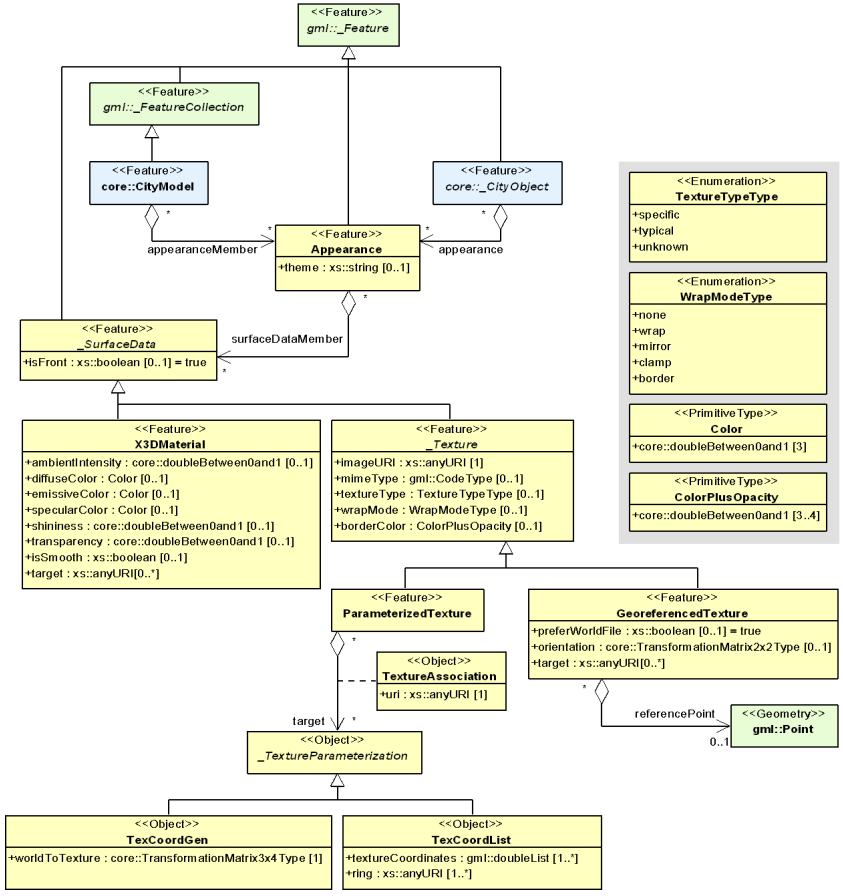
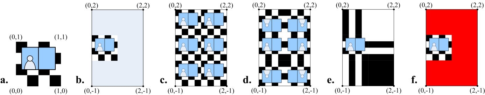
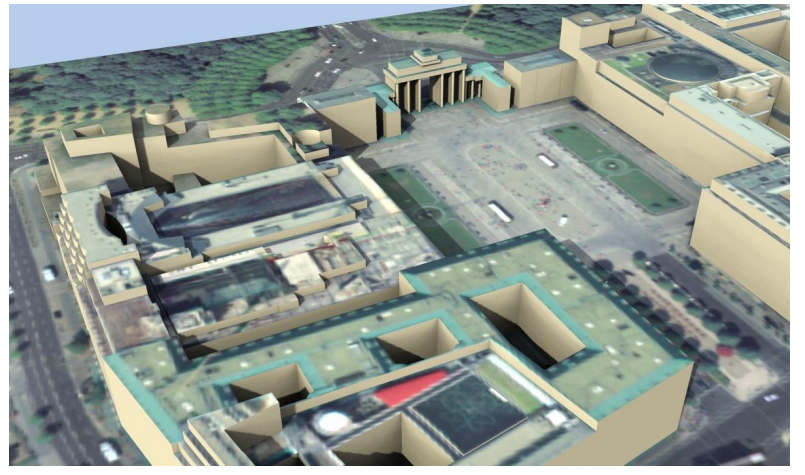
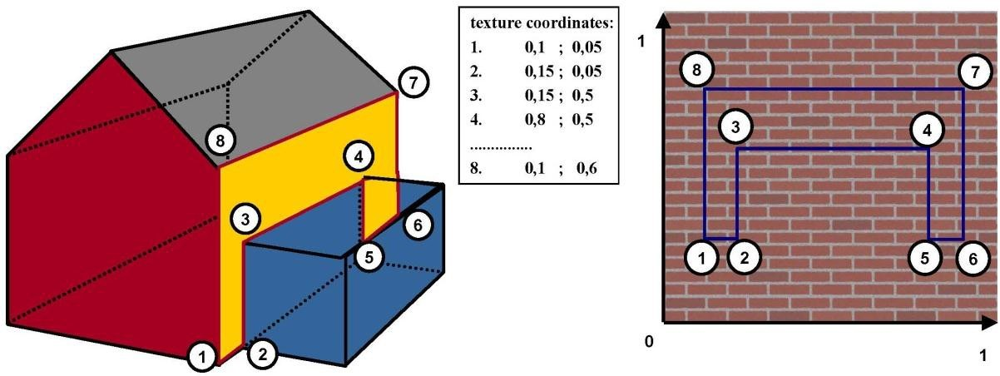
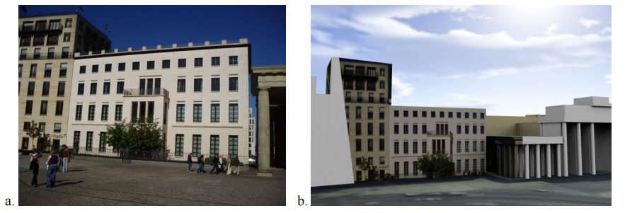
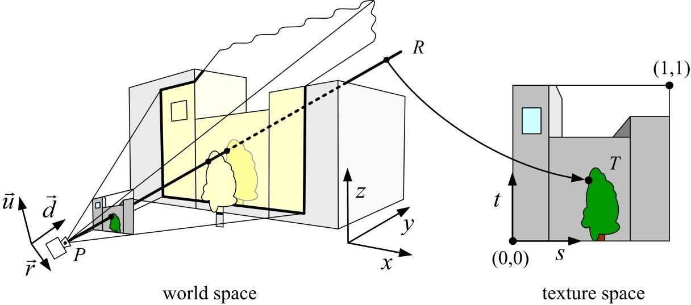
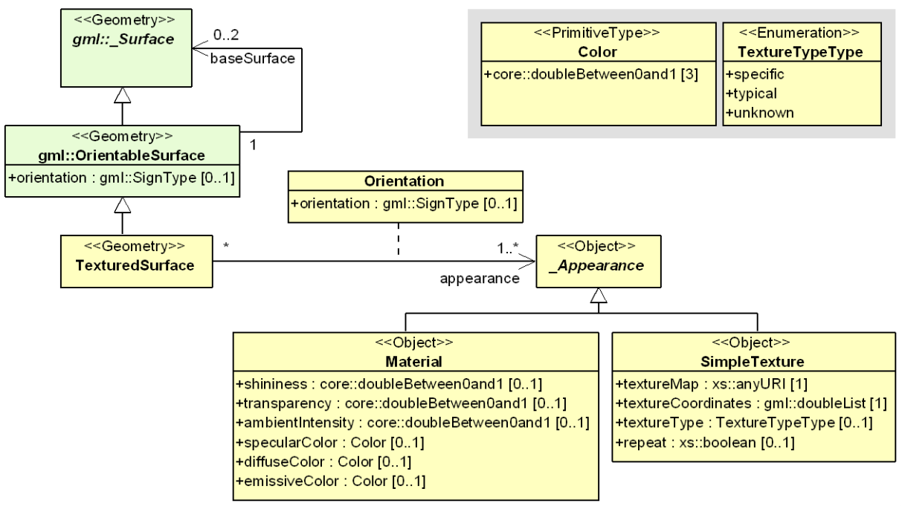

== 外观模型

除了空间属性之外，CityGML 的特征还有外观—要素表面的可观察属性。外观并不局限于视觉数据，而且可以表达被称为主题的任意类别，如红外辐射、噪声污染或地震引起的结构应力。每个LOD可以为一个特定的主题定义一个单独的表象。一个外观由每个表面几何对象的数据组成即表面数据。一个表面几何对象可以有多个主题的表面数据。同样，表面数据也可以由多个表面几何对象共享（如道路铺装）。最后，表面数据值既可以在整个表面上是恒定的，也可以随表面内的确切位置移动而变化。
CityGML 的外观模型是在扩展模块__外观__中定义的（参见第 7 章）。外观模型UML图如图14所示，XML 模式定义见附件A.2。

[[figure-14]]
.CityGML的外观模型的UML图。前缀用来表示与模型元素相关联的 XML 命名空间，没有前缀的元素名称是在 CityGML 外观模块中定义的。

在CityGML的外观模型中，主题只用一个标识符来表达。一个城市模型的外观对于一个给定的主题来说，是由一组引用这个主题的外观对象来定义的。因此，属于同一主题的外观对象组成了一个虚拟组。它们可以被包含在CityGML数据集的不同位置。此外，一个CityGML数据集可能包含多个主题。一个外观对象收集了与特定主题相关的表面数据，可以是单个要素，也可以是任何LOD中的整个城市模型。表面数据由类___SurfaceData__及其子类的对象来表达，每个对象都涵盖了表面几何对象的整个区域。表面数据和表面几何对象之间的关系由__URI__（__统一资源标识符__）链接表示，从一个___SurfaceData__ 对象到一个类型为 __gml: AbstractSurfaceType__或类型__gml: MultiSurface__。

固定的表面属性被建模为材质，随表面位置变化的表面属性被建模为纹理。每个表面几何对象可以在每个主题和侧面同时拥有一个材质和一个纹理。这允许同时提供一个恒定的近似值和一个复杂的表面属性测量值。一个应用程序负责为其任务（如分析或渲染）选择合适的属性表示。具体的混合没有定义，因为这超出了CityGML的范围。如果一个表面几何对象要接收多个纹理或材质，每个纹理或材质都需要一个单独的主题。主题的混合或其用法在 CityGML 中没有定义，由应用程序自行决定。

*XML命名空间*

CityGML外观模块的XML命名空间由统一资源标识符（URI） http://www.opengis.net/citygml/appearance/2.0 定义。在__外观__模块的XML 模式定义中，这个URI也被用来标识默认的命名空间。

=== 外观、要素和几何图形之间的关系

尽管表面数据和表面之间有密切的关系，但表面数据是单独存储在要素中的，以保留原始的GML几何模型。表面数据不是各自目标表面几何对象的属性，而是每个表面数据对象保持一组URI，指定目标面几何对象的__gml:ids__（类型为__gml: AbstractSurfaceType__或__gml: MultiSurface__）。在复合或集合目标表面的情况下，表面数据对象被分配给所有包含的表面。其他目标类型如要素、实体或__gml: AbstractSurfacePatchType__（包括__gml: Triangle__）是无效的，尽管XML模式语言不能正式表达对URI目标类型的约束。对于表面数据值到表面补丁的确切映射功能，请参考各自的表面数据类型描述。

有效的目标类型限制为__gml: AbstractSurfaceType__和__gml: MultiSurface__，不包括基于GML几何模型和在CityGML中使用的__gml: AbstractSurfacePatchType__。一般来说，GML的表面是用__gml: AbstractSurfaceType__的子类来表示。这样的表面要求是连续的。一个__gml: MultiSurface__不需要满足这个要求，因此它不是__gml: AbstractSurfaceType__（参见8.1）。由于获得的真实世界的表面往往不能保证是连续的，CityGML允许__gml: MultiSurface__在不同的地方表示一个要素的边界，作为连续表面的替代。为了类似于__gml: CompositeSurface__来处理这些表面，表面数据对象被允许链接到__gml: MultiSurface__对象。因此，一个__gml: AbstractGMLType__（它包括__gml: Triangle__和__gml: Rectangle__）不能接收一个__gml:id__，也不能被引用。

每个表面几何对象的每个主题最多可以有一个有效的正面材料、一个有效的背面材料、一个有效的正面纹理和一个有效的背面纹理。如果多个表面数据对象被分配到一个表面几何对象上，会选择一个激活。由于嵌套的表面定义而产生的多个间接分配是通过覆盖来解决的，例如，一个__gml:Polygon__的正面材质是通过覆盖其父代__gml:CompositeSurface__的正面材质而激活。多重直接分配即一个表面几何对象的__gml:id__在一个主题中，不允许被多次引用，并通过在冲突的表面数据对象中选择一个来解决实现依赖的问题。因此，需要避免在一个主题中进行多次直接分配。

每个___CityObject__要素都可以存储表面数据。因此，表面数据排列在CityGML数据集的要素层次中。然后，表面数据使用URI链接到其目标面。尽管这个链接机制允许在要素层次结构中链接到另一个要素表面，建议仍遵循局部性的原则。表面数据的存储方式应使链接的表面只属于包含的城市对象要素及其子对象。“全局性的”表面数据应该与城市模型一起存储。遵循定位原则还可以确保从WFS中检索的CityObjects包含相应的外观信息。

定位原则允许下面的算法找到所有相关的___SurfaceData__对象，在一个给定的___CityObject__中引用表面几何对象（类型为__gml: AbstractSurfaceType__或__gml: MultiSurface__）。

.清单1：找到所有相关的___SurfaceData__对象的算法，这些对象是在一个给定的___CityObject__中指定表面几何对象（类型为__gml: AbstractSurfaceType__或__gml: MultiSurface__）。
[source,c]
----
*function findSurfaceData* ::
__in__： gmlSurface, cityObject +
__out__： frontMaterial, frontTexture, backMaterial, backTexture 

1: frontMaterial := empty 
2: frontTexture := empty 
3: backMaterial := empty 
4: backTexture := empty 
5: flip := false 
6: 
7: while (gmlSurface) { // traverse the geometry hierarchy from inner to outer 
8: cObj := cityObject // start from the innermost cityobject 
9: 
10: while (cObj) { // traverse the cityobject hierarchy for the current geometry object 
11: // search all surfaceData objects in all appearance containers 
12: foreach (appearance in cObj) { 
13: foreach (surfaceData in appearance) { 
14: if (surfaceData refers to gmlSurface) { // if a surfaceData object refers to the geometry object, check its category 
15: if (flip) { // consider flipping 
16: // only pick the first surfaceData for a particular category 
17: if (surfaceData is frontside material AND backMaterial is empty) { 
18: backMaterial := surfaceData 
19: } 
20: if (surfaceData is frontside texture AND backTexture is empty) { 
21: backTexture := surfaceData 
22: } 
23: if (surfaceData is backside material AND frontMaterial is empty) { 
24: frontMaterial := surfaceData 
25: } 
26: if (surfaceData is backside texture AND frontTexture is empty) { 
27: frontTexture := surfaceData 
28: } 
29: } else { 
30: // only pick the first surfaceData for a particular category 
31: if (surfaceData is frontside material AND frontMaterial is empty) { 
32: frontMaterial := surfaceData 
33: } 
34: if (surfaceData is frontside texture AND frontTexture is empty) { 
35: frontTexture := surfaceData 
36: } 
37: if (surfaceData is backside material AND backMaterial is empty) { 
38: backMaterial := surfaceData 
39: } 
40: if (surfaceData is backside texture AND backTexture is empty) { 
41: backTexture := surfaceData 
42: } 
43: } 
44: 
45: // shortcut: could stop here if all 4 categories have been found 
46: } 
47: } 
48: } 
49: cObj := cObj.parent // this also includes the global CityModel 
50: } 
51: gmlSurface := gmlSurface.parent // this also includes a root gml:MultiSurface 
52: if (gmlSurface isA gml:OrientableSurface AND gmlSurface.orientation is negative) { 
53: negate flip 
54: } 
55: }
----

对___SurfaceData__对象的__isFront__属性的评估需要考虑到__gml: OrientableSurfaces__，因为它们可以翻转一个表面的方向。假设一个__gml: OrientableSurfaces os__，它翻转了它的基本表面__bs__。一个以__bs__为目标的正面纹理__t__将出现在__bs__的实际正面上。如果__t__的目标是__os__，它将出现在__bs__的背面。如果__t__同时以__os__和__bs__为目标，它就会出现在__bs__的两边，因为它成为了正面和背面的纹理。

XLinks影响了伪代码中的层次结构遍历。一般来说，表面数据和几何对象的分离需要重新评估表面数据的分配，因为每次出现几何对象的时候，都需要在相应的___CityObject__的背景中进行评估。在算法中逐步提高（几何体或___CityObject__）的层次结构，即为了这个算法的目的，被引用的对象在概念上被复制到所指的XLink的位置。特别是，这适用于隐式几何对象。如果一个隐式几何对象包含GML几何（在__relativeGMLGeometry__属性中），表面数据的分配就需要在每个引用的___CityObject__的背景中被重新评估。因此，一个给定的__隐式几何__对象的外观（非相对几何图形）可能会在其出现的时候有所不同。如果所有需要的表面数据对象被放置在__外观_对象中，并且后者被储存在外观对象中，则会产生一致的外观结果：

. 在包含原始__隐式几何__的___CityObject__中，用XLinks引用所有__隐式几何__中引用的___CityObject__中的相同__外观__对象，或
. 在全局的__CityModel__中。

=== 外观和表面数据

特征类__Appearance__定义了一个表面数据对象的容器。它提供了所有包含的表面数据对象都与之相关的__theme__。一个CityGML文件中所有具有相同主题的外观对象被认为是一个组。表面数据对象被存储在__surfaceDataMember__属性中。它们可以作为远程属性同时在多个主题中使用。
特征类____SurfaceData__是材质和纹理的基类。它唯一的元素是布尔标志__isFront__，它决定了一个表面数据对象适用于哪一表面。请注意，外观模型的所有类都支持CityGML的ADE机制（参见第6.12和10.13章）。应用特定扩展的钩子是由元素"___GenericApplicationPropertyOf__ ... "实现的。

*AppearanceType, Appearance, AppearancePropertyType*

[source,xml]
----
<xs:complexType name="AppearanceType"> 
<xs:complexContent> 
<xs:extension base="gml:AbstractFeatureType"> 
<xs:sequence> 
<xs:element name="theme" type="xs:string" minOccurs="0"/> 
<xs:element name="surfaceDataMember" type="SurfaceDataPropertyType" minOccurs="0" maxOccurs="unbounded"/> 
<xs:element ref="_GenericApplicationPropertyOfAppearance" minOccurs="0" maxOccurs="unbounded"/> 
</xs:sequence> 
</xs:extension> 
</xs:complexContent> 
</xs:complexType> 
<!-- ========================================================================================= --> 
<xs:element name="Appearance" type="AppearanceType" substitutionGroup="gml:_Feature"/> 
<!-- ========================================================================================= --> 
<xs:element name="_GenericApplicationPropertyOfAppearance" type="xs:anyType" abstract="true"/> 
<!-- ========================================================================================= --> 
<xs:complexType name="AppearancePropertyType"> 
<xs:sequence minOccurs="0"> 
<xs:element ref="Appearance"/> 
</xs:sequence> 
<xs:attributeGroup ref="gml:AssociationAttributeGroup"/> 
</xs:complexType>
----

*appearanceMember, appearance*

[source,xml]
----
<xs:element name="appearanceMember" type="gml:FeaturePropertyType" substitutionGroup="gml:featureMember"/> 
<!--=========================================================================================--> 
<xs:elementname="appearance"type="AppearancePropertyType"substitutionGroup="core:_GenericApplicationPropertyOfCityObject"/>
----

__appearanceMember__的定义允许在一个城市模型特征集合中任意排列___CityObject__ 特征和__Appearance__特征（参见第10.1章）。

为了在一个单一的___CityObject__特征中存储外观信息，核心模块的相应抽象类___CityObject__是由__外观__属性元素来扩展的。这个额外的__外观__属性是使用CityGML的__应用领域扩展__机制扩展到___CityObject__中的（参见第10.13章）。 通过这种方式，___CityObject__的每个主题子类都继承了这个属性。因此，__外观__模块对每个定义___CityObject__ 的主题子类的扩展模块都有影响。

*AbstractSurfaceDataType, __SurfaceData, SurfaceDataPropertyType*

[source,xml]
----
<xs:complexType name="AbstractSurfaceDataType" abstract="true"> 
<xs:complexContent> 
<xs:extension base="gml:AbstractFeatureType"> 
<xs:sequence> 
<xs:element name="isFront" type="xs:boolean" default="true" minOccurs="0"/> 
<xs:element ref="_GenericApplicationPropertyOfSurfaceData" minOccurs="0" maxOccurs="unbounded"/> 
</xs:sequence> 
</xs:extension> 
</xs:complexContent> 
</xs:complexType> 
<!-- ========================================================================================= --> 
<xs:element name="_SurfaceData" type="AbstractSurfaceDataType" abstract="true" substitutionGroup="gml:_Feature"/> 
<!-- ========================================================================================= --> 
<xs:element name="_GenericApplicationPropertyOfSurfaceData" type="xs:anyType" abstract="true"/> 
<!-- ========================================================================================= --> 
<xs:complexType name="SurfaceDataPropertyType"> 
<xs:sequence minOccurs="0"> 
<xs:element ref="_SurfaceData" minOccurs="0"/> 
</xs:sequence> 
<xs:attributeGroup ref="gml:AssociationAttributeGroup"/> 
</xs:complexType>
----

=== 材质

材质定义的光反射属性对整个面几何对象来说是不变的。__X3DMaterial__类的定义来自X3D和COLLADA规范（参考X3D、COLLADA规范）。__diffuseColor__定义了漫反射光的颜色。 __specularColor__定义了镜面反射的颜色。__emissiveColor__是表面自身的颜色。所有的颜色都使用RGB值，红、绿、蓝的取值在0和1之间。透明度是使用__transparency__元素单独定义的，其中0代表完全不透明，1代表完全透明。__ambientIntensity__定义了在不考虑光源的情况下，漫反射颜色的最小百分比。__shininess__控制镜面高光的锐度。0产生柔和的光亮，而1则产生鲜明的高光。__isSmooth__给出了法线插值的提示。如果这个布尔标志被设置为 "true"，顶点法线应该被用于着色（Gouraud着色）。否则，法线在面补丁是不变的（平面着色）。

目标表面是由目标元素指定的。每个元素包含一个目标面几何对象的URI（类型为__gml: AbstractSurfaceType__或__gml: MultiSurface__）。

*X3DMaterialType, X3DMaterial*

[source,xml]
----
<xs:complexType name="X3DMaterialType"> 
<xs:complexContent> 
<xs:extension base="AbstractSurfaceDataType"> 
<xs:sequence> 
<xs:element name="ambientIntensity" type="core:doubleBetween0and1" default="0.2" minOccurs="0"/> 
<xs:element name="diffuseColor" type="Color" default="0.8 0.8 0.8" minOccurs="0"/> 
<xs:element name="emissiveColor" type="Color" default="0.0 0.0 0.0" minOccurs="0"/> 
<xs:element name="specularColor" type="Color" default="1.0 1.0 1.0" minOccurs="0"/> 
<xs:element name="shininess" type="core:doubleBetween0and1" default="0.2" minOccurs="0"/> 
<xs:element name="transparency" type="core:doubleBetween0and1" default="0.0" minOccurs="0"/> 
<xs:element name="isSmooth" type="xs:boolean" default="false" minOccurs="0"/> 
<xs:element name="target" type="xs:anyURI" minOccurs="0" maxOccurs="unbounded"/> 
<xs:element ref="_GenericApplicationPropertyOfX3DMaterial" minOccurs="0" maxOccurs="unbounded"/> 
</xs:sequence>
</xs:extension> 
</xs:complexContent> 
</xs:complexType> 
<!-- ========================================================================================= --> 
<xs:element name="X3DMaterial" type="X3DMaterialType" substitutionGroup="_SurfaceData"/> 
<!-- ========================================================================================= --> 
<xs:element name="_GenericApplicationPropertyOfX3DMaterial" type="xs:anyType" abstract="true"/>
----

=== 纹理和纹理映射

纹理的抽象基类是___Texture__。CityGML中的纹理总是基于栅格的2D纹理。栅格图像由__imageURI__使用URI指定，可以是一个任意的图像数据资源，甚至是一个预先格式化的网络服务的请求。图像数据格式可以使用__mimeType__元素中的标准MIME类型来定义。

纹理可以由__textureType__属性来限定。__textureType__区分了特定对象的（__特定__）纹理和该对象表面的典型（__典型__）原型纹理。纹理也可以被分类为__unknown__。

纹理包装的规范是采用COLLADA标准。当访问底层图像栅格外部的纹理时，需要进行纹理包装。 __wrapMode__可取以下五个值之一（图15说明了这些包装模式的效果）。

. __none__ - 产生的颜色是完全透明的
. __wrap__ - 纹理被重复
. __mirror__ - 纹理被重复并镜像化
. __clamp__ - 纹理被夹在其边缘上
. __border__ - 产生的颜色由__borderColor__元素指定（RGBA）

在包装模式的__mirror__中，纹理图像在水平和垂直方向上都是重复的，类似于包装模式的__wrap__填补纹理空间。与__wrap__不同的是，每次重复的结果都是沿着重复的方向翻转前一个纹理部分。这种做法消除了包装纹理的边缘的约束，并形成一个无缝的纹理。

[[figure-15]]
.一个纹理（a）使用不同的包装模式应用于一个外墙。（b）无，（c）包装，（d）镜像，（e）管夹和（f）边界。边界颜色为红色。数字表示纹理坐标（图片：Hasso-Plattner-Institut）。

*AbstractTextureType, __Texture, WrapModeType, TextureTypeType*

[source,xml]
----
<xs:complexType name="AbstractTextureType" abstract="true"> 
<xs:complexContent> 
<xs:extension base="AbstractSurfaceDataType"> 
<xs:sequence> 
<xs:element name="imageURI" type="xs:anyURI"/> 
<xs:element name="mimeType" type="gml:CodeType" minOccurs="0"/> 
<xs:element name="textureType" type="TextureTypeType" minOccurs="0"/> 
<xs:element name="wrapMode" type="WrapModeType" minOccurs="0"/> 
<xs:element name="borderColor" type="ColorPlusOpacity" minOccurs="0"/> 
<xs:element ref="_GenericApplicationPropertyOfTexture" minOccurs="0" maxOccurs="unbounded"/> 
</xs:sequence> 
</xs:extension> 
</xs:complexContent> 
</xs:complexType> 
<!-- ========================================================================================= --> 
<xs:element name="_Texture" type="AbstractTextureType" abstract="true" substitutionGroup="_SurfaceData"/> 
<!-- ========================================================================================= -->
<xs:element name="_GenericApplicationPropertyOfTexture" type="xs:anyType" abstract="true"/> 
<!-- ========================================================================================= --> 
<xs:simpleType name="WrapModeType"> 
<xs:restriction base="xs:string"> 
<xs:enumeration value="none"/> 
<xs:enumeration value="wrap"/> 
<xs:enumeration value="mirror"/> 
<xs:enumeration value="clamp"/> 
<xs:enumeration value="border"/> 
</xs:restriction> 
</xs:simpleType> 
<!-- ========================================================================================= --> 
<xs:simpleType name="TextureTypeType"> 
<xs:restriction base="xs:string"> 
<xs:enumeration value="specific"/> 
<xs:enumeration value="typical"/> 
<xs:enumeration value="unknown"/> 
</xs:restriction> 
</xs:simpleType>
----

根据纹理参数化，即从表面上的一个位置到纹理图像中的一个位置的映射函数，___Texture__被进一步专门化。CityGML使用纹理空间的概念，纹理图像总是占据[0,1] ^2^ 区域，而不考虑实际的图像大小或长宽比。图像的左下角位于原点（有些图形API可能使用其他约定，需要进行纹理坐标转换）。必须知道每个面几何对象的映射函数，才能接受纹理。

[[figure-16]]
.应用于地面和屋顶的地理参考纹理（来源：柏林参议院，Hasso-Plattner-Institut）。

__GeoreferencedTexture__类描述了一个使用平面投影的纹理。因此，使用__GeoreferencedTexture__对垂直表面设置纹理是没有意义的。这样的纹理具有独特的映射功能，通常与图像文件一起提供（如地理参考的TIFF）或作为单独的ESRI世界文件。外部地理参考的搜索顺序是由布尔标志__preferWorldFile__决定的。如果这个标志被设置为 "true"（其默认值），首先会寻找世界文件，只有在没有找到的情况下才会使用图像数据的地理参考。如果__preferWorldFile__为“false”，那么只有在没有图像数据的地理参考的情况下才会使用世界文件。

另外，CityGML允许内部指定一个类似于世界文件的地理参考。这个内部地理参考规范总是优先于任何外部地理参考。 __referencePoint__定义了世界空间中左上角图像像素的中心位置，对应于ESRI世界文件中的值5和6。由于__GeoreferencedTexture__使用的是平面投影，所以__referencePoint__是二维的。 __orientation__以2x2矩阵的形式定义了图像的旋转和缩放（4个双精度数字的列表，以行为主的顺序，对应于ESRI世界文件中的值1、3、2和4）。这种转换的CRS与__referencePoint__的CRS相同。该CRS中的一个平面点(__x__,__y__)__^T^__通过以下公式被转换为纹理空间中的一个点(__s__,__t__)__^T^__：

stem:[\left(\begin{array}{l}
s \\
t
\end{array}\right)=\left(\begin{array}{cc}
1 / w & 0 \\
0 & -1 / h
\end{array}\right) \cdot M^{-1} \cdot\left(\left(\begin{array}{l}
x \\
y
\end{array}\right)-P_{R}\right)+\left(\begin{array}{l}
0 \\
1
\end{array}\right)]

__M__表示__orientation__，__P~R~__表示__referencePoint__，__w__表示图像的宽度（像素），__h__表示图像的高度（像素）。这种变换补偿了ESRI世界文件中使用的图像坐标系统（原点在左上角，X轴向右，Y轴向下）和CityGML中的纹理空间（原点在左下角，X轴向右，Y轴向上）之间的差异。

如果既没有给出内部地理参考，也没有给出外部地理参考，那么__GeoreferencedTexture__是无效的。每个目标表面几何对象是由一个__target__元素中的URI指定的。所有目标表面几何对象都共享地理参考所定义的映射功能。不允许有其他映射功能。请注意，从__gml: AbstractFeatureType__ 继承的__gml: boundedBy__属性可以被设置为有效图像数据的边界框，以进行空间查询。图16显示了应用于地面和所有屋顶表面的地理参考纹理。

*GeoreferencedTextureType, GeoreferencedTexture*

[source,xml]
----
<xs:complexType name="GeoreferencedTextureType"> 
<xs:complexContent> 
<xs:extension base="AbstractTextureType"> 
<xs:sequence> 
<xs:element name="preferWorldFile" type="xs:boolean" default="true" minOccurs="0"/> 
<xs:element name="referencePoint" type="gml:PointPropertyType" minOccurs="0"/> 
<xs:element name="orientation" type="core:TransformationMatrix2x2Type" minOccurs="0"/> 
<xs:element name="target" type="xs:anyURI" minOccurs="0" maxOccurs="unbounded"/> 
<xs:element ref="_GenericApplicationPropertyOfGeoreferencedTexture" minOccurs="0" maxOccurs="unbounded"/> 
</xs:sequence> 
</xs:extension> 
</xs:complexContent> 
</xs:complexType> 
<!-- ========================================================================================= --> 
<xs:element name="GeoreferencedTexture" type="GeoreferencedTextureType" substitutionGroup="_Texture"/> 
<!-- ========================================================================================= --> 
<xs:element name="_GenericApplicationPropertyOfGeoreferencedTexture" type="xs:anyType" abstract="true"/>
----

__ParameterizedTexture__类描述了一个具有目标依赖映射功能的纹理。映射是由___TextureParameterization__类的子类定义的，作为链接到目标面几何对象的一个属性。每个目标面几何对象都在一个单独的__target__元素的__uri__属性中被指定为URI。因为__target__实现了__gml: AssociationAttributeGroup__，它允许引用一个远程的___TextureParameterization__对象（使用__xlink:href__属性），比如用于在不同主题的目标或纹理之间共享一个映射功能。映射函数既可以使用纹理坐标的概念（通过__TexCoordList__类），也可以使用从世界空间到纹理空间的变换矩阵（通过__TexCoordGen__类）。

[[figure-17]]
.使用纹理坐标对纹理进行定位（图片：IGG Uni Bonn）。

纹理坐标只适用于多边形表面，其边界由__gml: LinearRing__描述（例如，__gml:Triangle__，__gml:Polygon__，或由__gml:Polygons__组成的__gml:MultiSurface__）。它们定义了表面顶点与纹理空间中的点的明确映射，即每个顶点包括内环顶点都必须在纹理空间中得到一个相应的坐标对（关于坐标的概念，参考ISO 19111）。这些坐标不限于[0,1]区间。内部面点的纹理坐标是由顶点的纹理坐标平面插值而来。图16显示了一个例子。

目标表面几何对象的纹理坐标是使用__TexCoordList__作为__target__属性中的纹理参数化对象来指定的。每个外部和内部的__gml:LinearRing__构成了目标表面几何对象的边界（它也可能是一个__gml: CompositeSurface__，__gml:MultiSurface__，或__gml:TriangulatedSurface__）需要的纹理坐标集。使用__TexCoordList__的__textureCoordinates__元素来指定一组纹理坐标。因此，__TexCoordList__包含的__textureCoordinate__元素数量与目标面几何对象包含的__gml: LinearRings__一样多。__textureCoordinate__的强制性属性__ring__提供了各自环的__gml:id__。内容是一个有序的双值列表，每两个值定义一个纹理坐标对(__s__,__t__)__^T^__，__s__表示水平纹理轴，__t__表示垂直纹理轴。列表中每个环点包含一个坐标对，坐标对的顺序与CityGML文件中环点的顺序相对应（不考虑可能翻转的面方向）。如果目标表面几何对象的存在环点没有被分配纹理坐标，映射就不完整，相应的表面就不能被纹理化。如果是聚合的目标几何对象，映射的完整性只决定于叶几何对象。

[[figure-18]]
.使用worldToTexture变换将一张照片（a）投射到多个外墙（b）。照片并没有完全覆盖左边的外墙。因此，纹理似乎被剪切了。纹理包装被设置为 "none"（来源：柏林参议院，Hasso-PlattnerInstitute）。
 

另外，映射函数可以包括一个由__TexCoordGen__类指定的3x4转换矩阵。由__worldToTexture__元素指定的转换矩阵，定义了从齐次坐标的空间位置到纹理空间的线性转换。齐次坐标的使用有利于透视投影的转换，例如将一张照片投影到一个城市模型中（参见图18）。纹理坐标(__s__,__t__)__^T^__从空间位置(__x__,__y__,__z__)__^T^__计算为(__s__,__t__)__^T^__=(__s’/q’__,__t’/q’__)__^T^__与(__s’__,__t’__,__q’__)__^T^__=__M__(__x__,__y__,__z__,1)__^T^__。__M__表示3x4变换矩阵。与一般的4x4变换相比，产生的__Z__分量被忽略了。因此，相应的矩阵行被省略了。此外，__worldToTexture__元素使用__gml:SRSReferenceGroup__属性来定义其CRS。世界空间中的位置必须首先转换为这个CRS，然后才能应用变换矩阵。

下面的结构会产生一个__worldToTexture__变换，通过将世界空间（城市模型）中的一个位置投影到纹理空间中的一个位置，来模仿拍摄照片的过程。

stem:[M=\underbrace{\left(\begin{array}{ccc}
0.5 & 0 & 0.5 \\
0 & 0.5 & 0.5 \\
0 & 0 & 1
\end{array}\right)}_{\text {Adjustment to texture space }} \cdot \underbrace{\left(\begin{array}{cccc}
2 f / w & 0 & 0 & 0 \\
0 & 2 f / h & 0 & 0 \\
0 & 0 & 1 & 0
\end{array}\right)}_{\text {Perspective projection }} \cdot \underbrace{\left(\begin{array}{cccc}
r_{x} & r_{y} & r_{z} & 0 \\
u_{x} & u_{y} & u_{z} & 0 \\
d_{x} & d_{y} & d_{z} & 0 \\
0 & 0 & 0 & 1
\end{array}\right)}_{\text {Camera orientation }} \cdot \underbrace{\left(\begin{array}{cccc}
1 & 0 & 0 & -P_{x} \\
0 & 1 & 0 & -P_{y} \\
0 & 0 & 1 & -P_{z} \\
0 & 0 & 0 & 1
\end{array}\right)}_{\text {Camera location }}]

在这个公式中，__f__表示焦距；__w__和__h__表示图像传感器的物理尺寸；stem:[\vec{r}]、stem:[\vec{u}]和stem:[\vec{d}]定义了相机的参照系，即用世界坐标表示的右、上和方向单位向量；__P__代表相机在世界空间的位置。图19描述了这种设置。

[[figure-19]]
.投影式纹理映射。从投影中心P发出的射线R上的所有点都被映射到纹理空间中的同一个点T上（图片：Hasso-Plattner-Institute, IGG TU Berlin)。

另外，如果3x4相机矩阵__M~P~__是已知的（例如通过校准和注册过程），它可以很容易地被用于__worldToTexture__。__M~P~__是由内在和外在的相机参数定义的 （内部和外部方向），并将世界空间中的一个位置转换为图像中的一个像素位置。假设图像左上角的像素坐标为（0,0），那么到纹理空间坐标的完整转换可以写成（__width~image~__和__height~image~__表示图像尺寸的像素）：

stem:[M=\left(\begin{array}{ccc}
1 / \text { width }_{\text {image }} & 0 & 0 \\
0 & -1 / \text { height }_{\text {image }} & 0 \\
0 & 0 & 1
\end{array}\right) \cdot M_{P}]

请注意，__worldToTexture__不能补偿由真实相机镜头引入的径向或其他非线性失真。
__worldToTexture__的另一个用途是为一个具有复杂几何形状的外墙贴图，而不需要为每个__gml:LinearRing__指定贴图坐标。相反，只有使用__TexCoordGen__作为参数化，外墙的聚合面成为纹理目标。然后，__worldToTexture__有效地编码了世界空间到纹理空间的正射投影。对于垂直外墙的特殊情况，转换公式如下：

stem:[M=\underbrace{\left(\begin{array}{cccc}
1 / \text { width }_{f} & 0 & 0 & 0 \\
0 & 1 / \text { height }_{f} & 0 & 0 \\
0 & 0 & 0 & 1
\end{array}\right)}_{\text {Scaling to texture space }} \cdot \underbrace{\left(\begin{array}{cccc}
-n_{y} & n_{x} & 0 & 0 \\
0 & 0 & 1 & 0 \\
n_{x} & n_{y} & 0 & 0
\end{array}\right)}_{\text {Facade orientation }} \cdot \underbrace{\left(\begin{array}{cccc}
1 & 0 & 0 & -F_{x} \\
0 & 1 & 0 & -F_{y} \\
0 & 0 & 1 & -F_{z} \\
0 & 0 & 0 & 1
\end{array}\right)}_{\text {Facade location }}]

这个方程假设表示外墙stem:[\vec{n}]的整体法向量（归一化，指向外侧，与地面平行），__F__表示外墙的左下角，__width~f~__和__height~f~__指定外墙的世界单位尺寸。对于任意法向量，外墙方向矩阵的形式与摄像机方向矩阵相似。

stem:[M=\left(\begin{array}{cccc}
1 / \text { width }_{f} & 0 & 0 & 0 \\
0 & 1 / \text { height }_{f} & 0 & 0 \\
0 & 0 & 0 & 1
\end{array}\right) \cdot\left(\begin{array}{cccc}
r_{x} & r_{y} & r_{z} & 0 \\
u_{x} & u_{y} & u_{z} & 0 \\
n_{x} & n_{y} & n_{z} & 0 \\
0 & 0 & 0 & 1
\end{array}\right) \cdot\left(\begin{array}{cccc}
1 & 0 & 0 & -F_{x} \\
0 & 1 & 0 & -F_{y} \\
0 & 0 & 1 & -F_{z} \\
0 & 0 & 0 & 1
\end{array}\right) \text { with }\left\{\begin{array}{l}
\vec{r}=\frac{(0,0,1)^{T} \times \vec{n}}{\left\|(0,0,1)^{T} \times \vec{n}\right\|} \\
\vec{u}=\vec{n} \times \vec{r}
\end{array}\right.]

*ParameterizedTextureType, ParameterizedTexture, TextureAssociationType*

[source,xml]
----
<xs:complexType name="ParameterizedTextureType"> 
<xs:complexContent> 
<xs:extension base="AbstractTextureType"> 
<xs:sequence> 
<xs:element name="target" type="TextureAssociationType" minOccurs="0" maxOccurs="unbounded"/> 
<xs:element ref="_GenericApplicationPropertyOfParameterizedTexture" minOccurs="0" maxOccurs="unbounded"/> 
</xs:sequence> 
</xs:extension> 
</xs:complexContent> 
</xs:complexType> 
<!-- ========================================================================================= --> 
<xs:element name="ParameterizedTexture" type="ParameterizedTextureType" substitutionGroup="_Texture"/> 
<!-- ========================================================================================= --> 
<xs:element name="_GenericApplicationPropertyOfParameterizedTexture" type="xs:anyType" abstract="true"/> 
<!-- ========================================================================================= --> 
<xs:complexType name="TextureAssociationType"> 
<xs:sequence minOccurs="0"> 
<xs:element ref="_TextureParameterization"/> 
</xs:sequence> 
<xs:attribute name="uri" type="xs:anyURI" use="required"/> 
<xs:attributeGroup ref="gml:AssociationAttributeGroup"/> 
</xs:complexType>
----

*AbstractTextureParameterizationType, TexCoordListType, TexCoordGenType*

[source,xml]
----
<xs:complexType name="AbstractTextureParameterizationType" abstract="true"> 
<xs:complexContent> 
<xs:extension base="gml:AbstractGMLType"> 
<xs:sequence> 
<xs:element ref="_GenericApplicationPropertyOfTextureParameterization" minOccurs="0" maxOccurs="unbounded"/> 
</xs:sequence> 
</xs:extension> 
</xs:complexContent> 
</xs:complexType> 
<!-- ========================================================================================= --> 
<xs:element name="_TextureParameterization" type="AbstractTextureParameterizationType" abstract="true" 
substitutionGroup="gml:_GML"/> 
<!-- ========================================================================================= --> 
<xs:element name="_GenericApplicationPropertyOfTextureParameterization" type="xs:anyType" abstract="true"/> 
<!-- ========================================================================================= --> 
<xs:complexType name="TexCoordListType"> 
<xs:complexContent> 
<xs:extension base="AbstractTextureParameterizationType"> 
<xs:sequence> 
<xs:element name="textureCoordinates" maxOccurs="unbounded"> 
<xs:complexType> 
<xs:simpleContent> 
<xs:extension base="gml:doubleList"> 
<xs:attribute name="ring" type="xs:anyURI" use="required"/> 
</xs:extension> 
</xs:simpleContent> 
</xs:complexType> 
</xs:element> 
<xs:element ref="_GenericApplicationPropertyOfTexCoordList" minOccurs="0" maxOccurs="unbounded"/> 
</xs:sequence> 
</xs:extension> 
</xs:complexContent> 
</xs:complexType> 
<!-- ========================================================================================= --> 
<xs:element name="TexCoordList" type="TexCoordListType" substitutionGroup="_TextureParameterization"/> 
<!-- ========================================================================================= --> 
<xs:element name="_GenericApplicationPropertyOfTexCoordList" type="xs:anyType" abstract="true"/> 
<!-- ========================================================================================= --> 
<xs:complexType name="TexCoordGenType"> 
<xs:complexContent> 
<xs:extension base="AbstractTextureParameterizationType"> 
<xs:sequence> 
<xs:element name="worldToTexture"> 
<xs:complexType> 
<xs:simpleContent> 
<xs:extension base="core:TransformationMatrix3x4Type">
<xs:attributeGroup ref="gml:SRSReferenceGroup"/> 
</xs:extension> 
</xs:simpleContent> 
</xs:complexType> 
</xs:element> 
<xs:element ref="_GenericApplicationPropertyOfTexCoordGen" minOccurs="0" maxOccurs="unbounded"/> 
</xs:sequence> 
</xs:extension> 
</xs:complexContent> 
</xs:complexType> 
<!-- ========================================================================================= --> 
<xs:element name="TexCoordGen" type="TexCoordGenType" substitutionGroup="_TextureParameterization"/> 
<!-- ========================================================================================= --> 
<xs:element name="_GenericApplicationPropertyOfTexCoordGen" type="xs:anyType" abstract="true"/>
----

=== 相关概念

外观的概念与通用覆盖方法有关（参见ISO 19123和OGC摘要规范，主题6）。表面数据可以被描述为具有特定的映射函数的二维域在面上的离散或连续覆盖。需要通过适当的映射函数和专业化的有效域和范围集扩展GML的覆盖范围（截至3.1版）。出于实施和使用上的简单性和易理解性的考虑，CityGML没有采用这种方法，而是基于纹理和材质描述计算机图形领域中的面属性（参见X3D、COLLADA规范、Foley等）。纹理和材质使用适当的映射将数据存储为颜色。如果这样的映射不切实际，可以用ADE来定制数据存储。在CityGML 2.0.0版本之后，将考虑对外观建模的覆盖范围进行审查。

外观也与描绘有关。描绘表达了数字模型图像的构成和符号化，即表现形式；而外观则编码了对真实物体表面的观测，即数据。即使是基于纹理和材质等图形术语，面数据也不只作为描绘的输入，同样也可以作为要素面分析的输入或输出。因此，CityGML并没有为描绘的目的定义主题的组合。描绘是留给查看器应用程序或样式规范语言，如OGC图层样式注记（SLD）或OGC符号学编码（SE）。

=== 代码列表

特征___Texture__的__mimeType__属性被指定为__gml:CodeType__。这个属性的值可以在一个代码列表中列举出来。代码表的建议可以在附件C.6中找到。

=== 一致性要求

*基本要求*

. 一个面几何对象在每个主题下最多可以成为两个纹理和两个材料（分别用于正面和背面）的目标。
. __GeoreferencedTexture__元素的__referencePoint__属性（类型：__gml:PointPropertyType__）只能包含或引用一个具有2D坐标值的点几何对象。
. __TexCoordList__元素的__textureCoordinates__属性定义了表面的边界点到纹理空间中的明确映射。表面的每个边界点都必须在纹理空间中有一个相应的坐标对。纹理空间中的坐标对应以每个边界点的两个双精度数字形式给出。坐标对的顺序必须遵循CityGML文件中边界点的顺序（不管表面方向是否可能翻转）。每个组成目标表面几何对象边界的__gml:LinearRing__需要它自己的纹理坐标集。
. 一个__GeoreferencedTexture__元素必须提供内部或外部的地理参考，否则它是无效的。内部地理参考应通过__GeoreferencedTexture__元素的__referencePoint__属性（类型：__gml:PointPropertyType__）和orientation属性（类型：__core:TransformationMatrix2x2Type__）来声明。外部地理参考可以由纹理图像文件本身（例如GeoTIFF）或随附的世界文件提供。  

*参考完整性* 

. __appearanceMember__元素（类型：__AppearancePropertyType__）可以包含一个内联的__Appearance__元素，或者使用GML 3.1.1的XLink概念引用一个远程__Appearance__元素。在后一种情况下，__appearanceMember__元素的__xlink:href__属性只能指向一个远程__Appearance__元素（其中远程__Appearance__元素位于另一个文档或同一文档的其他地方）。必须给出所包含的元素或引用，但既不能同时包含元素或引用，也不能完全不包含元素或引用。
. __core:_CityObject__元素的__appearance__属性（类型：__AppearancePropertyType__）可以包含一个内联的__Appearance__元素，或者使用GML3.1.1的XLink概念引用一个远程__外观__元素。在后一种情况下，__外观__属性的__xlink:href__属性只能指向一个远程的__appearance__元素（其中远程的__Appearance__元素位于另一个文档中或同一文档的其他地方）。所包含的元素或引用必须给出，但既不能同时包含元素或引用，也不能完全不包含元素或引用。
. __Appearance__元素的__surfaceDataMember__属性（类型：__SurfaceDataPropertyType__）可以包含一个内联的___SurfaceData__元素，或者使用GML3.1.1的XLink概念引用一个远程的___SurfaceData__元素。在后一种情况下，表面数据成员的__xlink:href__属性只能指向一个远程的___SurfaceData__元素（其中远程的___SurfaceData__元素位于另一个文档中或同一文档的其他地方）。无论是包含的元素还是引用都必须给出，但既不能同时包含元素或引用，也不能完全不包含元素或引用。
. __ParameterizedTexture__元素的__target__属性（类型：__TextureAssociationType__）可以包含一个内联的___TextureParameterization__ 元素，或者使用GML 3.1.1的XLink概念引用一个对远程___TextureParameterization__元素。在后一种情况下，__target__属性的__xlink:href__属性只能指向一个远程___TextureParameterization__元素（其中远程___TextureParameterization__元素位于另一个文档中或同一文档的其他地方）。必须给出所包含的元素或引用，但既不能同时包含元素或引用，也不能完全不包含元素或引用。
. __GeoreferencedTexture__元素的__target__属性（类型为__xs:anyURI__）应指定目标面几何对象的__gml:id__，它只能是__gml:AbstractSurfaceType__或__gml:MultiSurface__类型。
. 复合类型__TextureAssociationType__的__uri__属性应指定目标表面几何对象的__gml:id__，它只能是__gml:AbstractSurfaceType__或__gml:MultiSurface__类型。
. __TexCoordList__元素的__textureCoordinates__属性的__ring__属性应指定目标表面几何对象的__gml:id__，它只能是__gml:LinearRing__类型。
. __X3DMaterial__元素的__target__属性（类型为__xs:anyURI__）应指定目标表面几何对象的__gml:id__，它只能是__gml:AbstractSurfaceType__或__gml:MultiSurface__类型。

=== CityGML先前版本的材质模型[已弃用]

由于GML3没有内置的表面材质表示概念，CityGML以前的版本通过__TexturedSurface__类来扩展GML3的几何模型，它允许为三维面分配外观属性（颜色、亮度、透明度）和纹理。外观属性的定义是从X3D规范中采用的。由于固有的局限性，这种外观建模的方法已经被弃用了。然而，为了给现有的CityGML实现一定的向后兼容性，该方法已被纳入CityGML 1.0版本和2.0版本，成为一个单独的扩展模块__TexturedSurface__。通过这种方式，可以采用旧的材质模型支持这个模块。请注意，根据__TexturedSurface__模块建模的外观信息可以在没有信息损失的情况下转换为CityGML的__Appearance__模块概念，本章前面的条款已经介绍过。因此，**强烈不建议**使用__TexturedSurface__模块，应该坚持使用__Appearance__模块。此外，__TexturedSurface__模块预计将在CityGML的未来版本中被移除。

对于__TexturedSurface__模块，每个表面或复合面都可以被专门化为一个__TexturedSurface__，它可以被赋予__Materials__（__颜色__、__亮度__、__透明度__）或__SimpleTextures__。图20描述了UML图，关于XML模式的定义见附件A.14。

[[figure-20]]
.CityGML的材质模型的UML图。请注意，这种外观建模的方法已经被弃用，预计将在未来的CityGML版本中被删除。前缀用于指示与模型元素相关的 XML 命名空间。没有前缀的元素名称是在CityGML 的TexturedSurface模块中定义的。

在面上定位纹理的概念符合三维计算机图形标准X3D（web 3D 2004），是VRML97的后继者。CityGML在GML3的几何模型中加入了__TexturedSurface__类，因为在ISO 19107和GML3中没有合适的纹理概念。

纹理被指定为由__URI__（统一资源标识符）引用的栅格图像，可以是一个任意的资源，包括在互联网上。纹理是通过采用__texture coordinates__的概念来定位的，即每个纹理坐标与__TexturedSurface__的一个三维坐标完全匹配（图17）。纹理坐标的使用允许在面几何形状上准确定位和调整纹理。

一个表面的颜色是由RGB值定义的。他们必须在0到1之间取值。__frontOpacity__和__backOpacity__分别定义每个面的__transparency__程度。它们的值也必须在0到1的范围内，其中1表示完全不透明，0表示完全透明。颜色可以区分为__diffuseColor__漫射色（被光源照射时的颜色）、__emissiveColor__自发光色（材质自身的颜色）和__specularColor/shininess__镜面色/亮度（表面的亮度）。

纹理可以由__textureType__属性来限定。__textureType__区分了特定对象的纹理（__specific__）和典型对象的纹理（__typical__）。纹理也可以被分类为__unknown__。

___Appearance__是从__gml:AbstractGMLType__派生出来的，可以在一个__appearance__属性中被引用。属性__gml:id__是继承的，它的值可以被一个XLink引用。___Appearance__ 是材质__Material__和__SimpleTexture__的父类。

*Xml命名空间*

CityGML __TexturedSurface__模块的XML命名空间是由统一资源标识符（URI） http://www.opengis.net/citygml/texturedsurface/2.0 定义。在__TexturedSurface__模块的XML 模式定义中，这个URI也被用来标识默认命名空间。

==== 纹理表面

*TexturedSurfaceType, TexturedSurface, AppearancePropertyType*

[source,xml]
----
<xs:complexType name="TexturedSurfaceType"> 
<xs:complexContent> 
<xs:extension base="gml:OrientableSurfaceType"> 
<xs:sequence> 
<xs:element ref="appearance" maxOccurs="unbounded"/> 
</xs:sequence> 
</xs:extension> 
</xs:complexContent> 
</xs:complexType> 
<!-- ========================================================================================= --> 
<xs:element name="TexturedSurface" type="TexturedSurfaceType" substitutionGroup="gml:OrientableSurface"/> 
<!-- ========================================================================================= --> 
<xs:element name="appearance" type="AppearancePropertyType"/> 
<!-- ========================================================================================= --> 
<xs:complexType name="AppearancePropertyType"> 
<xs:sequence minOccurs="0"> 
<xs:element ref="_Appearance"/> 
</xs:sequence> 
<xs:attribute name="orientation" type="gml:SignType" default="+"/> 
<xs:attributeGroup ref="gml:AssociationAttributeGroup"/> 
</xs:complexType>
----

__TexturedSurface__可以有一个或多个外观属性，它可以是一个材质__Material__（颜色，...）或一个__SimpleTexture__。___Appearance__元素既可以作为这种类型的元素内联表示，也可以通过XLink引用一个远程的___Appearance__元素。必须给出引用或包含的元素，但既不能同时包含元素或引用，也不能完全不包含元素或引用。___Appearance__所指的面是由外观属性元素的__orientation__属性（类型__gml:SignType__）给出的，它对应__orientation__属性。+表示正方向的一面，-表示负方向的一面。

*AbstractAppearanceType,__Appearance*

[source,xml]
----
<xs:complexType name="AbstractAppearanceType" abstract="true"> 
<xs:complexContent> 
<xs:extension base="gml:AbstractGMLType"/> 
</xs:complexContent> 
</xs:complexType> 
<!-- ========================================================================================= --> 
<xs:element name="_Appearance" type="AbstractAppearanceType" abstract="true" substitutionGroup="gml:_GML"/>
----

*MaterialType, Material*

[source,xml]
----
<xs:complexType name="MaterialType"> 
<xs:complexContent> 
<xs:extension base="AbstractAppearanceType"> 
<xs:sequence> 
<xs:element name="shininess" type="core:doubleBetween0and1" minOccurs="0"/> 
<xs:element name="transparency" type="core:doubleBetween0and1" minOccurs="0"/>
<xs:element name="ambientIntensity" type="core:doubleBetween0and1" minOccurs="0"/> 
<xs:element name="specularColor" type="Color" minOccurs="0"/> 
<xs:element name="diffuseColor" type="Color" minOccurs="0"/> 
<xs:element name="emissiveColor" type="Color" minOccurs="0"/> 
</xs:sequence> 
</xs:extension> 
</xs:complexContent> 
</xs:complexType> 
<!-- ========================================================================================= --> 
<xs:element name="Material" type="MaterialType" substitutionGroup="_Appearance"/>
----

*SimpleTextureType, SimpleTexture, TextureTypeType*

[source,xml]
----
<xs:complexType name="SimpleTextureType"> 
<xs:complexContent> 
<xs:extension base="AbstractAppearanceType"> 
<xs:sequence> 
<xs:element name="textureMap" type="xs:anyURI"/> 
<xs:element name="textureCoordinates" type="gml:doubleList"/> 
<xs:element name="textureType" type="TextureTypeType" minOccurs="0"/> 
<xs:element name="repeat" type="xs:boolean" minOccurs="0"/> 
</xs:sequence> 
</xs:extension> 
</xs:complexContent> 
</xs:complexType> 
<!-- ========================================================================================= --> 
<xs:element name="SimpleTexture" type="SimpleTextureType" substitutionGroup="_Appearance"/> 
<!-- ========================================================================================= --> 
<xs:simpleType name="TextureTypeType"> 
<xs:restriction base="xs:string"> 
<xs:enumeration value="specific"/> 
<xs:enumeration value="typical"/> 
<xs:enumeration value="unknown"/> 
</xs:restriction> 
</xs:simpleType>
----

==== 一致性要求

*参照完整性*

* __TexturedSurface__元素的__appearance__属性（类型:__AppearancePropertyType__）可能包含一个内联的___Appearance__元素，或者一个使用GML 3.1.1的XLink概念的远程___Appearance__元素。在后一种情况下，__外观__属性的__xlink:href__属性只能指向一个远程的___Appearance__元素（其中远程的___Appearance__元素位于另一个文档中或同一文档的其他地方）。必须给出所包含的元素或引用，但既不能同时包含元素或引用，也不能完全不包含元素或引用。
